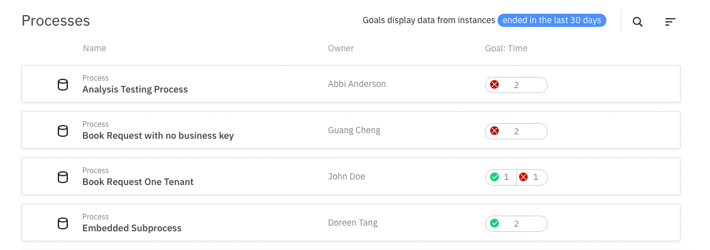
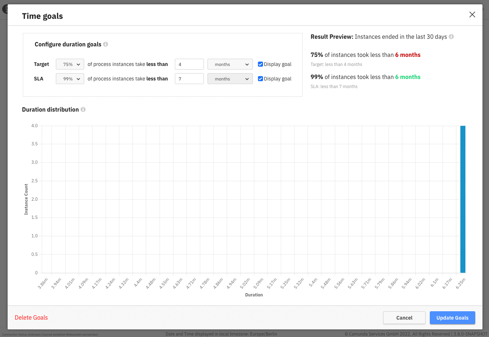

## Overview

The processes section gives you an overview of all the processes and their status on a single page.
It allows you to set a process owner to take responsibility of the process and time goals to track its performance.

## Setting an owner: 
Assign the owner for process health to make transparent who is the responsible individual for it. Once you open up the set owner modal, you can select one of the users in your organization to be the main person responsible for the process.

Once an owner is set on a process, You can sort the processes page by owner to quickly see which processes have a common owner.

## Set and track time-based goals:
Setting duration goals on a process makes it easier to quickly see its health over time. It is also useful to track the result of any improvements done on the process.

Once you open up the modal, you’ll be met by two goals: a target goal and an SLA goal for process instance duration. The target goal assumes that 75% of your process instances follow your happy path or can automatically be resolved entirely. In contrast, the SLA goal is to ensure that you can still guarantee your customers how long a process should take while excluding outliers, even if human intervention is required.

Once you set the goals, you can see their status saved to the Processes page. First, sort by goal status to identify the processes that need the most attention, then hover over the goal status to gain a quick insight into their performance.
