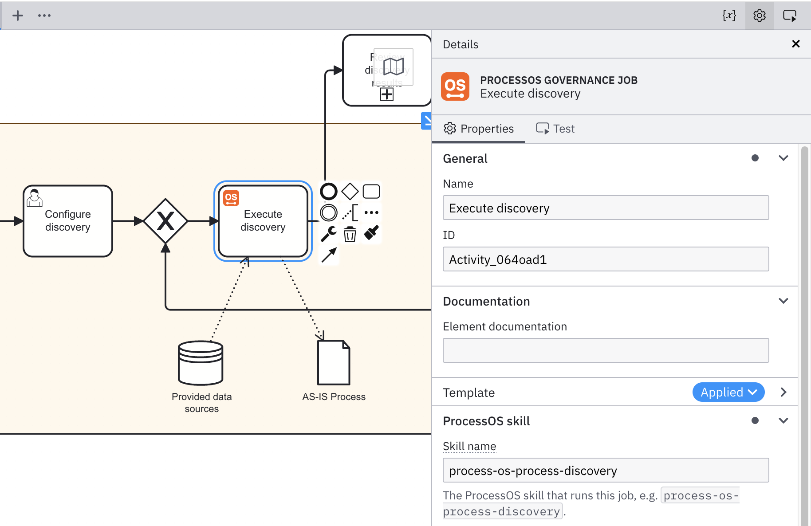

A builder task is a unit of work that is executed in the AI Coding Agent. Each task runs as a (Camunda) job, with a skill doing the main work and the builder overseeing, judging, and revising it. This shape gives every task three properties at once: guidance from the governance process for what to do, auditability through Camunda and Git, and full flexibility for the builder to do whatever else the job needs.

## The five steps

1. **Activate the job.** The agent pulls the next pending job from the governance process running on Camunda, along with its skill name, skill mode, and run configuration.
1. **Execute the skill.** The agent runs the ProcessOS Harness skill named in the job, producing or updating files in your project.
1. **Take your builder action.** You review what the skill produced, correct it, rerun it, or do whatever else the situation needs. This is the open part of the task.
1. **Commit to version control.** The result is committed to Git, which makes the change part of the permanent project record.
1. **Complete the job.** The agent pushes the outcome back to the governance process, which then decides the next step.

Steps 1 and 5 are handled by the agent against Camunda. You handle step 3.
