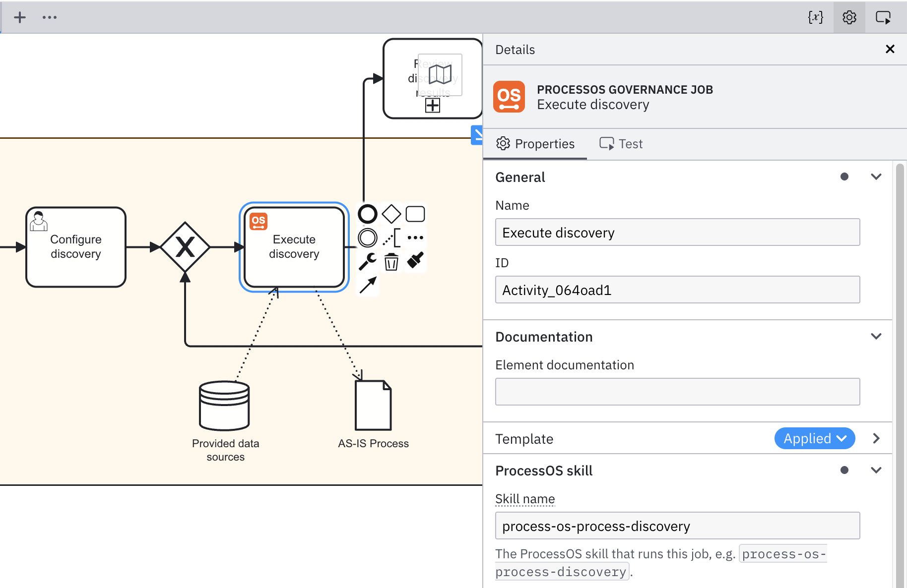

import PageDescription from '@site/src/components/PageDescription';

<PageDescription />

## About

A builder task is a unit of work that is executed in the AI coding agent. Each builder task runs as a job, with a skill doing the main work and the builder overseeing, judging, and revising it.

This shape gives every task three properties at once:

- **Guidance:** The governance process tells you what to do.
- **Auditability:** Camunda and Git record what happened.
- **Flexibility:** You can do whatever else the job needs.

Builder tasks are service tasks in the governance process, so Camunda handles them as jobs like any other service task. ProcessOS Harness contains skills to manage these jobs.

## How a builder task works

When the governance process reaches a builder task, the following steps are executed:

1. **Activate the job.** The agent pulls the next pending job from the governance process running on Camunda, along with its skill name, skill mode, and run configuration.
1. **Execute the skill.** The agent runs the ProcessOS Harness skill named in the job, producing or updating files in your project.
1. **Take your builder action.** You review what the skill produced, correct it, rerun it, or do whatever else the situation needs. This is the open part of the task.
1. **Commit to version control.** The result is committed to Git, which makes the change part of the permanent project record.
1. **Complete the job.** The agent pushes the outcome back to the governance process, which then decides the next step.

Steps 1 and 5 are handled by the agent against Camunda. You handle step 3.

## Work on a builder task

1. Clear the agent context. Run each builder task in a new coding session.
1. Execute the next step. Ask the AI coding agent `next` to trigger builder work.
