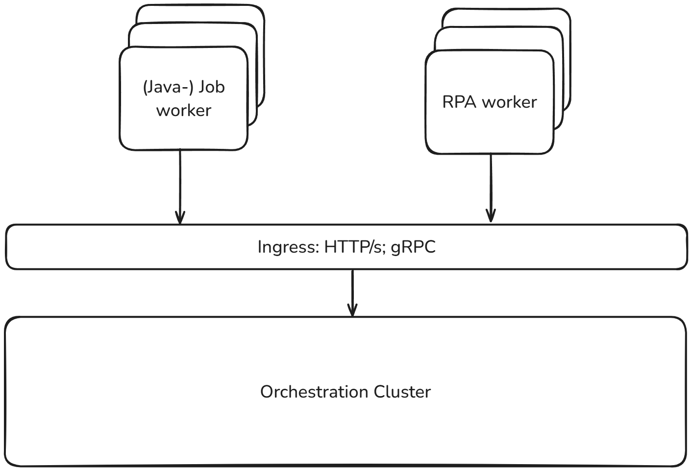

This article covers the specific configuration of your RPA runner. For the basics on getting started, visit the
[getting started guide](./getting-started.md).

## Configuration options

### Transitioning from a development setup

To transition from a development setup to a production setup, there are a few things to consider:

- **Disable the local sandbox**: If your worker should only accept scripts from Zeebe and is not used for testing scripts from Modeler, disable the local execution by setting `camunda.rpa.sandbox.enabled` to `false`
- **If your scripts require third-party tools**: Install them along with the RPA worker so they are accessible from the scripts.
- **Add tags to your worker and scripts**: Depending on your use case, it might be useful to tag your workers with their capabilities. Common ways for tagging include operation systems and available applications. [Read more on tags and labels](#labels).

### Using secrets

When running an RPA worker with Camunda SaaS, you can add access to [Connector secrets](/components/connectors/use-connectors/index.md#using-secrets).

To do this, [create client credentials](/guides/setup-client-connection-credentials.md) with both the `Zeebe` and `Secrets` scope and use them in the worker config.
In your `rpa-worker.properties` file, add the secrets endpoint `camunda.rpa.zeebe.secrets.secrets-endpoint=https://cluster-api.cloud.camunda.io` to enable secret fetching.

In the RPA script, your secrets are stored in the `${secrets}` variable. You can reference a secret like `MY_API_KEY` with `${secrets.MY_API_KEY}`.

### Labels

If you manage multiple RPA worker machines and scripts, you might need specialized environments to run certain tasks.
To differentiate different capabilities of runners, you can use tags and labels.

Labels are set both on the RPA task in the diagram and on your worker. To ensure your script is only executed by machines with the correct capabilities for this script, we recommend adding labels to your worker.

In the `rpa-worker.properties`, add `camunda.rpa.zeebe.worker-tags=accounting-system`. This worker will now only take up jobs
which are labeled `accounting-system`. If you also want the worker to work on unlabeled tasks, use `camunda.rpa.zeebe.worker-tags=default,accounting-system` instead.
Each worker can have multiple labels and will pick up waiting jobs from all scripts.

You can add labels to your script when configuring the RPA task in your diagram. Note that a script can only have a single label.

Labels describe capabilities. If you want your worker to only pick up a specific script, you will need to use a unique label on both the worker and the RPA task. A worker can have multiple labels and will pick up any script that matches one of the given tags. For example, your worker might have access to the SAP application, but if you also want it to pick up browser automation tasks, add `SAP,BROWSER_AUTOMATION` to your worker tags. This will pick up tasks tagged as `SAP` and tasks tagged as `BROWSER_AUTOMATION`.

If no label is defined, both the task and worker will use the label `default`.

### Pre- and post-run scripts

Some of your scripts might require a specific environment to be prepared before the main script starts, for example, downloading certain documents
or setting up connections to internal systems.
You can create and deploy separate RPA scripts and reference them from the properties panel.

The same works for a post-run script, which can be used for environment cleanup or archiving results. Working directories of the worker's job will be removed once the job is completed.

### Timeouts

Runtime can vary greatly from script to script. It is important to set the right timeout for your job to ensure the jobs do not get canceled prematurely. There are two options to set timeouts:

- **On the RPA task (recommended)**: When configuring the RPA task in your diagram, set the timeout for this script execution. This is recommended as it allows you a per-script configuration.

- **Default timeout in a worker**: You can configure a default timeout in the `rpa-worker.properties` that is used for every task that does not have a timeout configured on the task. This should be used as a fallback.

### Concurrent jobs

By default, each worker only executes one job at the same time. This ensures scripts don't cause side effects while interacting with applications.

Some use cases, like browser automation, can be side effect free and execution can be parallelized. The `camunda.rpa.zeebe.max-concurrent-jobs` defines how many jobs the RPA worker will pick up.

### Additional libraries

The RPA worker comes with a set of [default libraries](https://camunda.github.io/rpa-python-libraries/). Additional dependencies can be installed by providing a supplementary `requirements.txt` file in the `camunda.rpa.python.extra-requirements` property.

These requirements will be installed with the next restart of the RPA worker. Additional libraries are only available on workers configured accordingly. Therefore, it is recommended to use [labels](#labels) to ensure the worker and script are compatible.

For example, the RPA worker allows browser automation with Selenium out of the box. To use Playwright instead, install the dependencies as follows:

```
## requirements.txt
robotframework-browser
```

```
## application.properties
camunda.rpa.python.extra-requirements=extra-requirements.txt
camunda.rpa.zeebe.worker-tags=default,playwright
```

## Installation and Setup guide

An RPA worker acts as a specialized Job worker designed to run outside the main Camunda Orchestration Cluster. RPA workers leverage the [Job worker pattern](/components/best-practices/development/dealing-with-problems-and-exceptions.md#understanding-workers) to retrieve work from Zeebe.



### Prerequisites

The RPA worker is available on all major platforms, including Windows, Linux and macOS. For [headless applications](https://en.wikipedia.org/wiki/Headless_software), such as browser automation, a docker image is available as well.

#### Hardware requirements

The RPA worker does not have strict requirements for the provided hardware. You can run the RPA worker on bare metal, virtualized or in containers.

Use the setup that works best with the applications you want to automate with RPA.

#### Software requirements

The RPA worker is a standalone executable that does not require external dependencies to run [out of the box libraries](https://camunda.github.io/rpa-python-libraries/).

If your scripts require [additional libraries](#additional-libraries), they will be installed via python. You need to provide a python environment for this to work properly.

| Operating System | Required Software | Optional Software |
| ---------------- | ----------------- | ----------------- |
| Windows          | RPA worker        | -                 |
| Linux + macOS    | RPA worker        | Python 3.12 + pip |

#### Network Configurations

Ensure your machine hosting the RPA worker can connect to your Camunda Cluster. Optionally, internet access might be required to download [additional libraries](#additional-libraries) from public registries.

### Installation and Configuration

This section will focus on setup and configuration of the RPA host machine. For installation and configuration of the RPA worker itself, please follow our [getting started guide](./getting-started.md) for initial setup and our [configuration guide](#configuration-options) for more advanced use cases.

#### Scaling and Operation

Each machine can only host a single RPA worker. This section will walk you through setting up VMs that allow you to spin up new worker machines quickly. For workloads that can be safely parallelized, you can use the [max-concurrent-jobs](https://github.com/camunda/rpa-worker/?tab=readme-ov-file#configuration-reference) configuration option.

While we will focus on setting up and scaling scripts for a windows desktop environment, this might not result in the optimal architecture for your use-case. Use this guide as a template and adapt it to your requirements.

#### Setting up a VM

We recommend using virtualization for RPA workers. This allows easy scaling and ensures all machines will have the same configuration.

##### Create a template VM

The template VM will act as a clean starting point for a specialized RPA worker. If you require different environments depending on the script, repeat this step for each environment and use [labels](#labels) in the configuration. You want one template for each RPA specialized environment you want to support.

- **Start with a clean windows VM**
- **Install and configure the RPA worker**, following our Installation and Configuration guide
- **Install any additional applications your scripts interact with**
- **Test connectivity and execution** by running a process on Camunda
- Add the RPA worker to run [**automatically on startup**](https://support.microsoft.com/en-us/windows/configure-startup-applications-in-windows-115a420a-0bff-4a6f-90e0-1934c844e473)
- [**Configure Windows autologon**](https://learn.microsoft.com/en-us/troubleshoot/windows-server/user-profiles-and-logon/turn-on-automatic-logon)
- **Disable screen-saver** as well as sleep and lock
- **Set the VM’s time-zone to match the business process**. This prevents stalled runs and keeps timestamps consistent
- **Save the current VM as a template**
- **Keep a separate local admin/password in escrow for emergency access**; audit all RDP / console logons.

##### Monitoring and Scaling

With the VM Template from the previous step, you can easily provision new machines for RPA automation. Use Operate and Optimize to monitor wait times and incidents of RPA tasks.

If the job waits a long time to be picked up, this might indicate that all workers are busy and you should provision more RPA VMs. Simply create a new VM from the template and start it. It will automatically connect to Zeebe and pick up queued tasks.

1. **Script handling and versioning**: Scripts are versioned on Zeebe. The RPA worker will pick up the latest Scripts associated with the active Job automatically.
2. **Labels**: Utilize [labels](#labels) to differentiate capabilities of RPA workers.
3. **Maintenance and monitoring**: Enable OS updates in a maintenance window, take periodic snapshots, and monitor VM health, disk, and RPA service status. Ensure that alerts are surfaced to your central monitoring tool.

## FAQ

**My RPA Task is never picked up.**
Ensure your RPA worker is connected to the correct Zeebe instance and has the correct [label](#labels) configured for the Task in question.

**My first script run succeeds, but any subsequent runs fail. I always need to restart the machine.**
Your script might not close or clean up the environment after completion. Use [Teardown scripts](./getting-started.md#incidents) to ensure all applications are closed properly.

**How do I handle errors and exceptions within RPA scripts?**
Use setup and teardown steps in the Robot Framework. Optionally, use keywords like `Throw BPMN Error` for BPMN-specific error handling.
