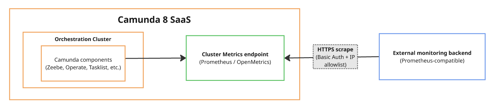

The Cluster Metrics endpoint lets you expose metrics from a Camunda 8 SaaS Orchestration cluster and consume them in your own monitoring system.

## About

Use this endpoint to monitor cluster performance, set alerts, and correlate Camunda metrics with the rest of your infrastructure using your existing observability tools.

This endpoint is a dedicated, customer-facing metrics service that exposes aggregated component-level metrics. The endpoint is separate from Camunda’s internal monitoring and operational systems and provides access only to metrics intended for customer consumption.

## Before you begin

Before using the Cluster Metrics endpoint, ensure that:

- You have an external monitoring system capable of collecting prometheus metrics.
- You understand your organization’s network access and IP allowlisting requirements.

## Supported environments

- The Cluster Metrics endpoint is available for all Camunda 8 SaaS Orchestration clusters.
- The endpoint is configured per Orchestration cluster and can be enabled without requiring an upgrade or downtime.

## Metrics exposure model

The Cluster Metrics endpoint exposes metrics using a pull-based model and Prometheus-compatible format ([Prometheus](https://github.com/prometheus/docs/blob/main/docs/instrumenting/exposition_formats.md#text-based-format) and [OpenMetrics](https://github.com/prometheus/docs/blob/main/docs/instrumenting/exposition_formats.md#openmetrics-text-format) text exposition formats).

When the Cluster Metrics endpoint is enabled for a cluster:

- Camunda exposes a cluster-scoped metrics endpoint that aggregates metrics from all Orchestration cluster components.
- Metrics are exposed in Prometheus-compatible format.
- Your monitoring system initiates metric collection by scraping the endpoint.

The Cluster Metrics endpoint does not push metrics to customer systems.

## Monitoring endpoint constraints

The Cluster Metrics endpoint exposes the application-level metrics produced by the Camunda version running in your cluster.

The following constraints apply:

- The Cluster Metrics endpoint uses Basic Authentication only.
- Metric names and labels depend on the Camunda version running in your cluster.
- Metric and dashboard compatibility between Camunda versions is not guaranteed.

If your monitoring system does not support Prometheus scraping, you can adapt the metrics using a self-managed OpenTelemetry Collector. For more information, see [Integrate non-Prometheus monitoring systems](/components/saas/monitoring/cluster-metrics-endpoint/configure-monitoring-systems-to-scrape-metrics.md#integrate-non-prometheus-monitoring-systems).

## Next steps

- To enable the Cluster Metrics endpoint and obtain connection details, see [Set up the Cluster Metrics endpoint](/components/saas/monitoring/cluster-metrics-endpoint/set-up-cluster-metrics-endpoint.md).
- To configure Prometheus to scrape metrics, see [Configure monitoring systems to scrape metrics](/components/saas/monitoring/cluster-metrics-endpoint/configure-monitoring-systems-to-scrape-metrics.md).
- If your monitoring system does not support Prometheus scraping, see [Integrate non-Prometheus monitoring systems](/components/saas/monitoring/cluster-metrics-endpoint/configure-monitoring-systems-to-scrape-metrics.md#integrate-non-prometheus-monitoring-systems).
