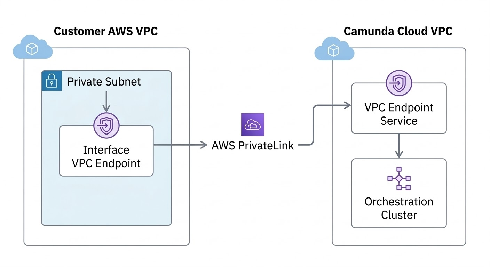

Secure connectivity allows you to connect to Camunda 8 SaaS Orchestration Clusters from your AWS Virtual Private Cloud (VPC) using AWS PrivateLink.

When enabled, traffic from your AWS VPC to an Orchestration Cluster is routed over private AWS networking rather than the public internet.

Secure connectivity:

- Applies per cluster.
- Is available only for AWS-hosted Orchestration Clusters.
- Supports inbound connectivity only — it enables private access from your AWS VPC to Camunda, but does not provide outbound private connectivity from Camunda to your services.
- Adds a private connectivity path. Public endpoints remain enabled.
- Is available to Enterprise customers.

## How it works

Secure connectivity uses AWS PrivateLink to establish a private network path between your AWS VPC and the Camunda-managed cluster infrastructure.

When you enable secure connectivity for a cluster:

- Camunda provisions a VPC endpoint service for that cluster in the cluster’s AWS region.
- You create one or more VPC interface endpoints in your AWS account that connect to the endpoint service.
- Traffic from resources in your VPC (for example, job workers or inbound connectors) is routed privately to the cluster.

Each cluster has its own VPC endpoint service and dedicated networking components. Access to the Orchestration Cluster is handled through dedicated load balancing and API gateway components.

Secure connectivity relies on standard AWS PrivateLink functionality. For an overview of AWS PrivateLink concepts and terminology, see [the AWS documentation](https://docs.aws.amazon.com/vpc/latest/privatelink/what-is-privatelink.html).

## Connect from your AWS VPC via PrivateLink

At a high level:

1. Enable secure connectivity for a cluster in Console.
2. Review the VPC endpoint service details provided by Camunda (for example, service name, service type, region, and private DNS name).
3. Create one or more VPC interface endpoints in your AWS account and configure the required security groups.
4. Optionally configure private DNS for the endpoint connection in AWS. Enabling private DNS provides a seamless HTTPS experience.
5. Test connectivity from resources inside your VPC.

Camunda owns and operates the VPC endpoint service and the associated cluster-side infrastructure.

You own and manage resources in your AWS VPC, including:

- VPC interface endpoints.
- Security groups.
- Routing and DNS configuration.
- AWS permissions and quotas.

For step-by-step Camunda Hub instructions, see [Enable secure connectivity for a cluster](./console-setup.md).

## Security and isolation

Secure connectivity restricts private access to your cluster using AWS PrivateLink and an allowlist of AWS principals.

When enabling secure connectivity, you define one or more allowed AWS principals (AWS account IDs or ARNs). Only those principals can create VPC endpoints that connect to your cluster’s endpoint service.

Requests from AWS accounts that are not explicitly allowed cannot establish a PrivateLink connection.

For each cluster:

- A separate VPC endpoint service is provisioned.
- Cluster-specific networking components are provisioned. Private connectivity does not share entry components across clusters.
- Access to the Orchestration Cluster is handled through the cluster's API gateway layer.

Traffic between your VPC and the cluster’s API gateway layer is encrypted in transit using TLS. TLS terminates at the cluster’s API gateway layer.

Traffic within the cluster follows the same model as public connectivity.

## Limits

The following limits apply:

- Up to 10 VPC endpoint connections per organization (adjustable on request).
- Up to 10 VPC endpoint connections per cluster.

Contact Camunda support if you require higher limits.

## Supported connectivity modes

The following combinations are supported:

| Private connectivity | Public connectivity | Supported |
| -------------------- | ------------------- | --------- |
| Disabled             | Enabled             | Yes       |
| Enabled              | Enabled             | Yes       |
| Enabled              | Disabled            | No        |

Private-only connectivity is not currently supported.
Public connectivity remains enabled even when secure connectivity is configured.

## Public and private connectivity

When secure connectivity is enabled, public connectivity remains available.

- Orchestration Cluster components like Operate, Tasklist, and Admin can still be accessed using their public URLs.
- When creating client credentials for a cluster, you can choose which connectivity type to use:
  - Public connectivity, which uses the public hostnames shown for the credentials.
  - Private connectivity, which uses the private DNS hostname of your VPC interface endpoint instead of the public cluster hostname.

### Private DNS hostname

When you create a VPC interface endpoint in AWS, the endpoint is assigned a private DNS hostname.

This hostname resolves to the private network address of the endpoint within your VPC and is used to route traffic through AWS PrivateLink.

When connecting to your Camunda cluster using secure connectivity, replace the `{PRIVATE_DNS}` placeholder in the cluster endpoint URL with the private DNS hostname of your VPC endpoint.

You can find this hostname in the details of your VPC interface endpoint in AWS. For more information, see the AWS documentation on VPC interface endpoints.

## What secure connectivity does not change

Secure connectivity:

- Does not change data location or backup regions.
- Does not affect encryption at rest or key management.
- Does not provide outbound private connectivity from Camunda to your services.
- Does not replace IP allowlists or other access control features. If an IP allowlist is configured, it continues to apply to connections made through private connectivity. For more information, see [Manage IP allowlists](../../console/manage-clusters/manage-ip-allowlists).

Secure connectivity changes only the network path used for inbound connections from your AWS VPC to the Orchestration Cluster.
