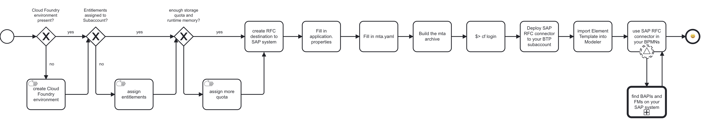

The SAP RFC [Connector](/components/connectors/introduction.md) is a [protocol and outbound Connector](/components/connectors/connector-types.md). This Connector is a Java Spring Boot application that runs on SAP Business Technology Platform (BTP).

It connects to Camunda 8 SaaS, and utilizes SAP BTP's [Destination](https://learning.sap.com/learning-journeys/administrating-sap-business-technology-platform/using-destinations) and [Connectivity](https://help.sap.com/docs/connectivity/sap-btp-connectivity-cf/what-is-sap-btp-connectivity) concepts to query a SAP system via the RFC protocol to interact with remote-enabled Function Modules and BAPIs.

:::note Important!
This Connector is an alpha feature available upon request. Visit [https://camunda.com/contact](https://camunda.com/contact) to contact us.
:::

## Overview

For a standard overview of the steps involved in the SAP RFC Connector, examine the diagram below:



## Prerequisites

To run the SAP RFC Connector Docker image, the following SAP infrastructure setup is required:

- [Cloud Foundry CLI](https://github.com/cloudfoundry/cli) with the [multiapps plugin](https://github.com/cloudfoundry/multiapps-cli-plugin) installed on the machine executing the deployment.
- SAP BTP subaccount with a [Cloud Foundry environment](https://discovery-center.cloud.sap/serviceCatalog/cloud-foundry-runtime?region=all) enabled and a [created space](https://help.sap.com/docs/btp/sap-business-technology-platform/create-spaces).
- A minimum of [1 GB storage quota and 2 GB runtime memory](https://help.sap.com/docs/btp/sap-business-technology-platform/managing-space-quota-plans).
- [Entitlements](https://help.sap.com/docs/btp/sap-business-technology-platform/managing-entitlements-and-quotas-using-cockpit) for:
  - [Connectivity Service](https://discovery-center.cloud.sap/serviceCatalog/connectivity-service?region=all), `lite` plan (to connect to the SAP is on-premises).
  - [Destination Service](https://discovery-center.cloud.sap/serviceCatalog/destination?service_plan=lite&region=all&commercialModel=btpea), `lite` plan.
  - [Authorization and Trust Management Service](https://discovery-center.cloud.sap/serviceCatalog/authorization-and-trust-management-service?region=all), `application` plan.
- One or more instance- or subaccount-level Destinations, pointing to the SAP systems to communicate with.
  
- Ensure `Additional Properties` set on the Destination are aligned with those of your Connector or remote SAP system.

## Deployment to BTP

Unlike other Camunda Connectors, the SAP RFC Connector must be deployed as a Java application. This is because it uses SAP's [JCo Java library](https://support.sap.com/en/product/connectors/jco.html) to connect via RFC to the configured SAP system. The JCo library's license prohibits redistribution, so we can't prebuild it for you, and you will need to build the application yourself.

### Building the Java application

1. In the application folder, navigate to `src/main/resources/application.properties` and insert the credentials for the cluster the SAP RFC Connector should connect to:

```properties
zeebe.client.cloud.region=xxx
zeebe.client.cloud.clusterId=guid
zeebe.client.cloud.clientId=yyy
zeebe.client.cloud.clientSecret=zzz
camunda.connector.polling.enabled=false
```

2. Copy the deployment descriptor `mta.yaml.example` to `mta.yaml` and fill in the same credentials in the `modules.properties` scope:

```yaml
_schema-version: 3.3.0
ID: sap-rfc-connector
# ...
modules:
  - name: sap-rfc-connector
  # ...
  	properties:
			ZEEBE_CLIENT_CLOUD_CLUSTERID: 'guid'
      ZEEBE_CLIENT_CLOUD_CLIENTID: 'xxx'
      ZEEBE_CLIENT_CLOUD_CLIENT_SECRET: 'yyy'
      ZEEBE_CLIENT_CLOUD_REGION: 'zzz'
```

3. Adjust any property describing an infrastructure setting to your requirements. For example, if a pre-existing destination instance is to be used, adjust the respective resource name. Otherwise, the deployment will create any of the services listed in `resources` for you.
4. Build the deployable archive via `$> mbt build`.

### Deploying the Java application

1. Log in to the desired SAP BTP subaccount via the [Cloud Foundry `cli`](https://github.com/cloudfoundry/cli) (cf-cli):

```shell
$> cf login
API endpoint: https://api.cf. ...
...
```

2. Deploy the SAP RFC Connector via the `cf-cli`. Note that this requires [the "multiapps" plugin of Cloud Foundry](https://github.com/cloudfoundry/multiapps-cli-plugin) to be installed on the machine the deployment runs on.

```shell
$> cf deploy mta_archives/*.mtar # append the -f flag to shortcircuit ongoing deployments
Deploying multi-target app archive <path/to/>.mtar in org <your-org> / space <your-space> as you@example.org ..
...
Application "sap-rfc-connector" started and available at "some.url.hana.ondemand.com"
```

### Deployment in Camunda 8 SaaS

- If using Web Modeler, [import the SAP RFC Connector's element template](/components/connectors/manage-connector-templates.md#importing-existing-connector-templates) contained in the repository in `element-templates/sap-rfc-connector.json` for design use.


- If using Desktop Modeler, [follow the standard importing procedure](/components/modeler/desktop-modeler/element-templates/configuring-templates.md).

## Working with the SAP RFC Connector in Camunda Modeler

### Modeling options

To use the **SAP RFC Connector** in your process, either change the type of existing task by clicking on it and using the **wrench-shaped** change type context menu icon, or create a new Connector task by using the **Append Connector** context menu. Follow our [guide to using Connectors](/components/connectors/use-connectors/index.md) to learn more.


First, choose whether to call a `BAPI` or a Function Module (`FM`).

Then, provide the `exporting`-, `importing-`, and `tables` parameters as lists of objects.

All object entries in the list look similar to `[{name:"param", type:"type"}]`, pointing to the parameter name of the BAPI/FM and its type. For example, `[{name:"PERSON_IN_CHARGE_FROM", type:"BAPI0012_GEN-PERS_IN_CHRG"}]`.

For those with experience in `ABAP`, the configuration options are similar.

### Sending variables to the RFC target

The `exporting parameter` is sent to the RFC target. The object structure generally looks like `[{name: "param", type: "type", value: <value> }]`.

Example:

```json
[
  {
    "name": "CONTROLLINGAREA",
    "type": "BAPI0012_GEN-CO_AREA",
    "value": "1000"
  }
]
```

This corresponds with the BAPI's/FM's `importing` definition, meaning it imports these variables from the RFC call:

```ABAP
*"  IMPORTING <-- this is the BAPI/FM - don't be confused! In Camunda, this is "exporting" :)
*"     VALUE(CONTROLLINGAREA) LIKE  BAPI0012_GEN-CO_AREA
```

### Receiving variables from the RFC target

`Importing parameter` is what is expected back from the RFC target. They are configured in the same "list of objects" style pattern in the element template as the other parameters and generally look like `[{name: "param", type: "type"}]`.

Example:

```json
[
  {
    "name": "DETAIL_DATA",
    "type": " BAPI1079_DETAIL"
  }
]
```

This corresponds with the BAPI's/FM's `exporting` definition, meaning it exports these variables to the caller:

```ABAP
*"       EXPORTING
*"             VALUE(DETAIL_DATA) LIKE  BAPI1079_DETAIL
```

### Special cases: sending and/or receiving a "table" and a "changing" structure

#### tables

The `tables parameter` can be both "exporting" and "importing".

:::warning
Sending tables as tabular data to an RFC target is not yet supported.
:::

```json
{
  "name": "COSTCENTERLIST",
  "type": "BAPI0012_CCLIST"
}
```

The above example is an object parameter in the `tables parameter` section that describes a result table to be received back from the RFC call. In conforms with the BAPI `BAPI_COSTCENTER_GETLIST1` parameter definition on the SAP system:

```ABAP
*"  TABLES
*"      COSTCENTERLIST STRUCTURE  BAPI0012_CCLIST
```

The same is applicable for the return structure `BAPIRET2` that denotes the result status of the RFC call:

```json
{
  "name": "BAPIRET2",
  "isReturn": true
}
```

This aligns with the BAPI definition:

```ABAP
*"  TABLES
*"      ....
*"      RETURN STRUCTURE  BAPIRET2
```

#### changing

A `changing parameter` is a variable received by an RFC target that is processed, changed, and returned. It is only available for `FM`-type RFC targets in the SAP RFC Connector. The overall structure is `[{name: "param", type: "type", value: <value> }]`.

Example:

```json
[
  {
    "name": "CV_RESULT",
    "type": "I",
    "value": "100"
  }
]
```

The value `100` is sent to the Fuction Module and sent back as `CV_RESULT`.

## Query result structure

### BAPI

The result of a call to a BAPI holds the following JSON structure:

```json
{
  tables: [
  	{ ... }
	],
  importing: {
    { ... }
  }
]
```

`tables` holds a representation of the result tables configured.

`importing` is the result of what was sent to the BAPI in the `exporting` section above.

### Function Module

The result of a call to a Function Module holds the following JSON structure:

```json
{
  tables: [
  	{ ... }
	],
  importing: [
    { ... }
  ],
  changing: [
    { ... }
  ]
]
```

- `tables` holds a representation of the result tables configured.
- `importing` is the result of what was sent to the Function Module in the `exporting` section above.
- `changing` is the result of what was sent to the Function Module in the `changing` section above.

## Error handling

The SAP RFC Connector allows handling of query errors directly in the model. This means an RFC error is relayed to the process instance in the reserved variables `bpmnError` and `error` and can be processed accordingly:

```
DESTINATION_ERROR,
REQUEST_EXECUTION_ERROR,
REQUEST_SERIALIZATION_ERROR,
JCO_RUNTIME_ERROR,
GENERIC_ERROR
```
