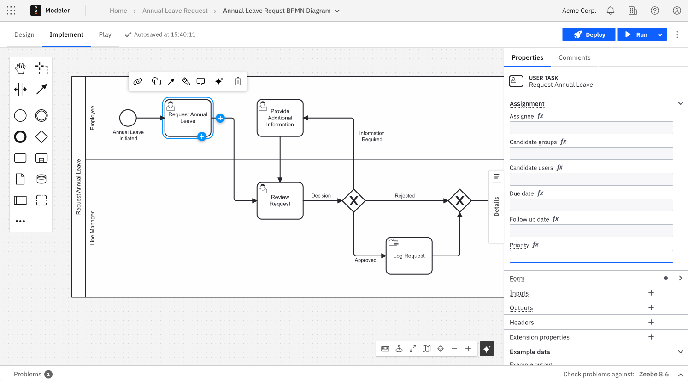
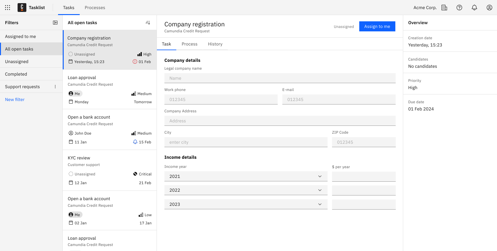
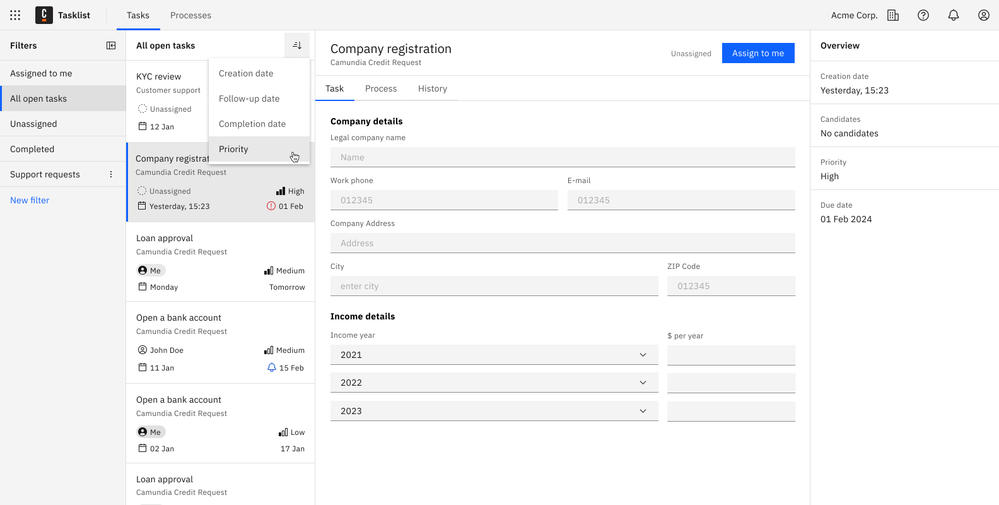

import styles from "./styles.module.css";

A [User Task event](/components/modeler/bpmn/user-tasks/user-tasks.md) supports specifying a priority as an integer value. It determines the task's importance in relation to other tasks within processes.

The supported priority values range from 0 to 100, with a default value of 50. A higher priority value indicates higher importance.

When displayed in Tasklist, priority values are mapped to the following default labels:

- 0-25: **Low**
- 26-50: **Medium**
- 51-75: **High**
- 76-100: **Critical**

These labels give Tasklist users a clear view of tasks, making it easier to assess a task's urgency. They also make sorting and filtering simple, helping users prioritize the most important tasks.

## Step-by-step guide

Below are the instructions on how to define task priorities for Tasklist users.

### 1. Model a BPMN Process

Begin by modeling your BPMN process in the Modeler. Ensure that necessary user tasks are defined within the process.

### 2. Set a Priority for User Tasks

While configuring a user task, you can assign a priority value. It can be defined via an expression.
The priority value determines the task's importance relative to others.

### 3. Deploy and Start the Process

Once the process is fully defined and all configurations are complete, it can be deployed and started. The priority values are now associated with each user task within the process.

### 4. Task Priority in Tasklist

Tasklist users can view the tasks assigned to them within their task list. Each task card displays the assigned priority label, ensuring users have a clear understanding of the task's importance.

### 5. Sort Tasks by Priority

Task users can sort tasks by priority. This functionality helps them organize their workload by focusing on urgent items first.

