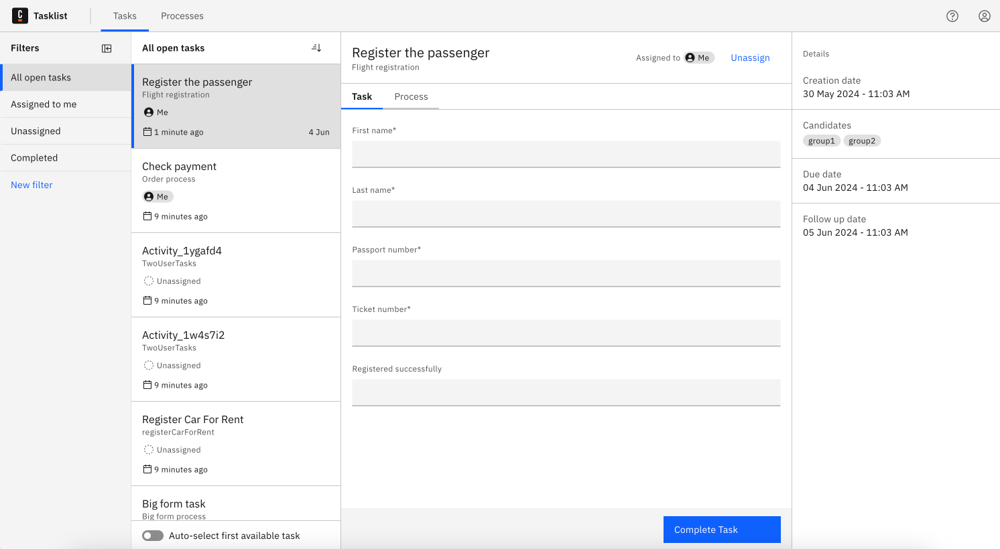
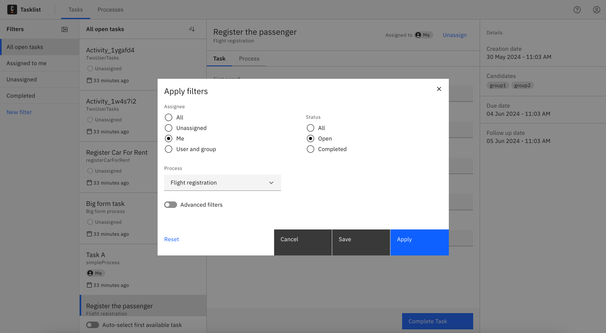

When you open the Tasks page, you will see the list of all tasks. This is a starting point for managing your workload.

## Apply a filter

As you browse through the list, you might find it difficult to locate specific tasks, especially if the list is extensive. This is when filters become useful.

### Select a filter

To narrow down your task list, you can use a filter.
You can select one of the default filter options or [create a new filter](#create-new-filter).

The default filters are:

- All open tasks
- Assigned to me
- Unassigned
- Completed tasks

## Create new filter

Start by clicking on the option to apply a new filter. This action will open a filter dialog.
In the dialog, you can define various rules based on task attributes. The supported attributes are:

- Assignees and candidate groups
- Status
- Processes tasks belong to
- Dates (due date and follow up date)
- Task ID
- Task variables

Once you have defined the rules, apply the filter. The system will then filter the tasks according to your criteria, displaying only the relevant tasks.

## Save filter for future use

If you find the filter useful and need it again, you can save it:

1. Click on the option to save the filter.
2. You will be prompted to enter a name for the filter. Choose a descriptive name that will help you recognize it later.
3. Confirm to save and apply the filter.

The next time you need this filter, you can simply select it from your saved filters.

:::note
Filters you create are saved on the local storage of your device. This means that while you can easily access and reuse them on the same device, these filters will not be available if you switch to a different device.
:::

## Update saved filter

You might need to change the criteria of an existing filter. To update a filter:

1. Choose the filter you want to update from your list of saved filters.
2. Click on the edit option. This action will open the filter dialog with the current settings of the filter.
3. Update the filter criteria as needed.
4. Confirm the changes to apply the updated filter.

## Delete a filter

If a filter is no longer needed:

1. Choose the filter you want to delete from your saved filters.
2. Click on the delete option.
3. Confirm filter deletion.

After deletion, the default filter will be applied, showing the full list of tasks again.

---

## Summary

Filters are great tools to help you manage your work. Use them to keep your task list clear and focused.
