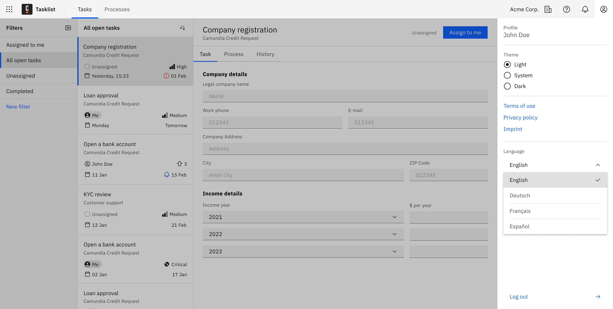

When creating processes for audiences in non-English speaking regions, you can localize the Tasklist interface to the appropriate language.

To do this, design [user task forms](/guides/utilizing-forms.md) in the local language, and set the Tasklist interface to use the same language.

Tasklist supports the following four languages by default:

- English
- French
- German
- Spanish

The interface language is automatically determined by the device language settings of the user. If the device's language is not supported, the interface will default to English.

## Change Tasklist language settings

The language used in Tasklist can be changed through the following steps:

1. Open your user profile, and navigate to **Language**.
2. Select your preferred language from the list.
3. Once selected, the Tasklist interface will update to your chosen language.
