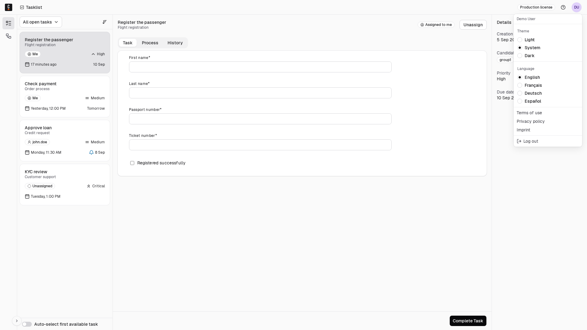

When creating processes for audiences in non-English speaking regions, you can localize the Tasklist interface to the appropriate language.

To do this, design [user task forms](/components/hub/workspace/modeler/modeling/utilize-forms.md) in the local language, and set the Tasklist interface to use the same language.

Tasklist supports the following four languages by default:

- English
- French
- German
- Spanish

The interface language is automatically determined by the device language settings of the user. If the device's language is not supported, the interface will default to English.

## Change Tasklist language settings

To change the language used in Tasklist:

1. Click your user avatar in the top-right corner of the header to open the user menu.
2. Under **Language**, select your preferred language.
3. The Tasklist interface updates to the selected language.
