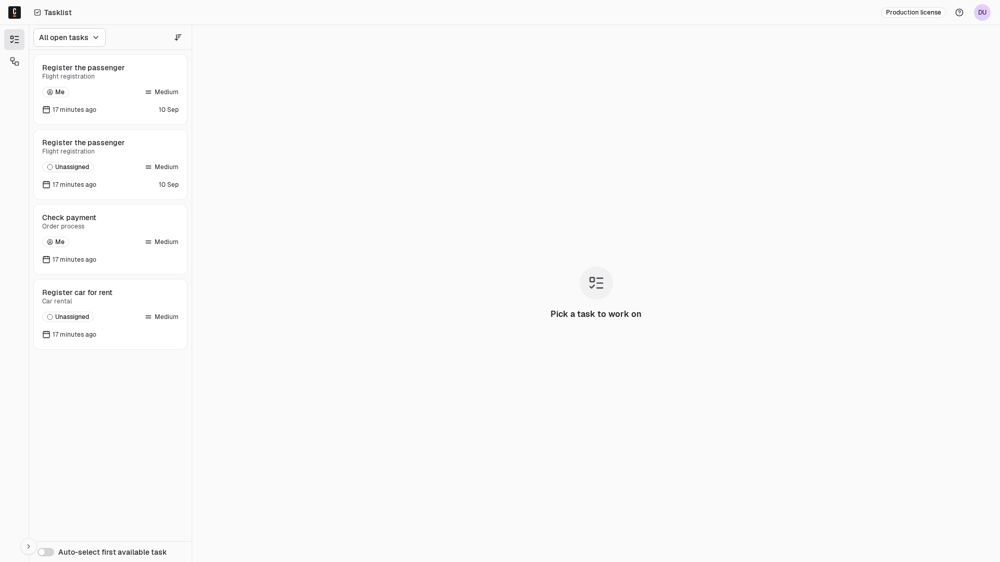
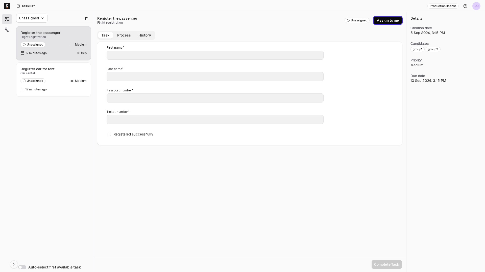
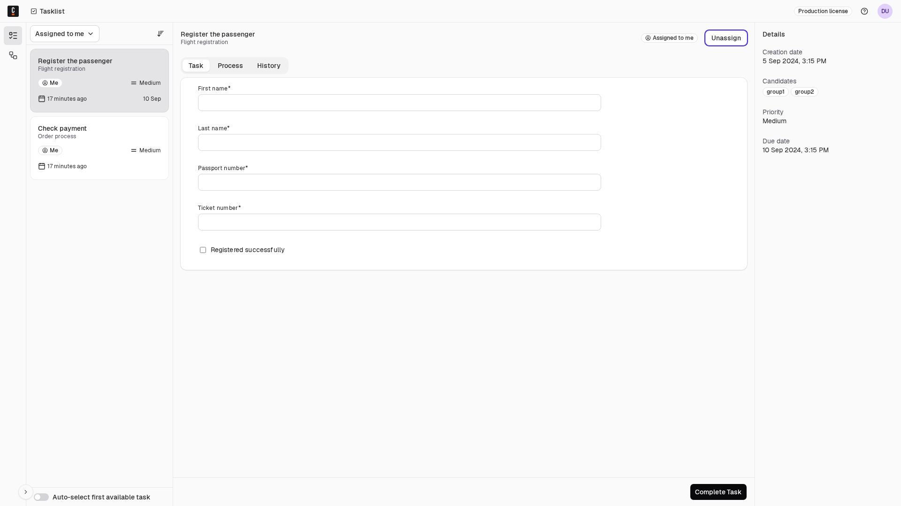
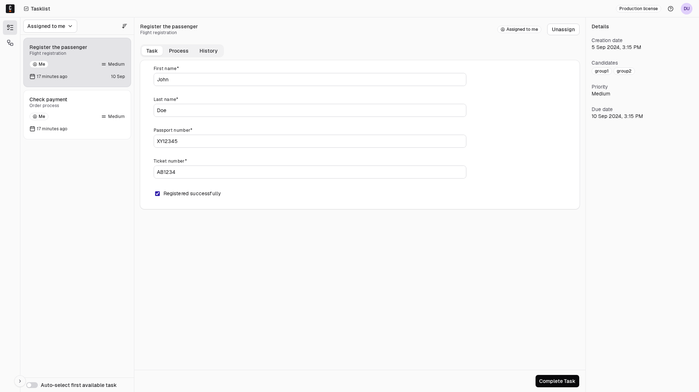
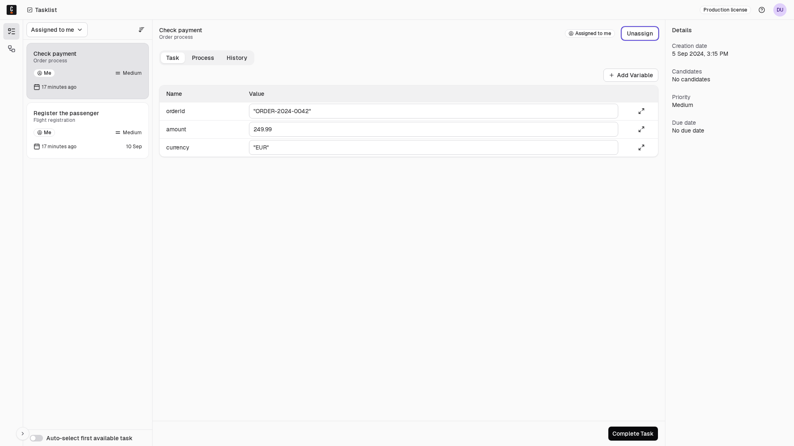
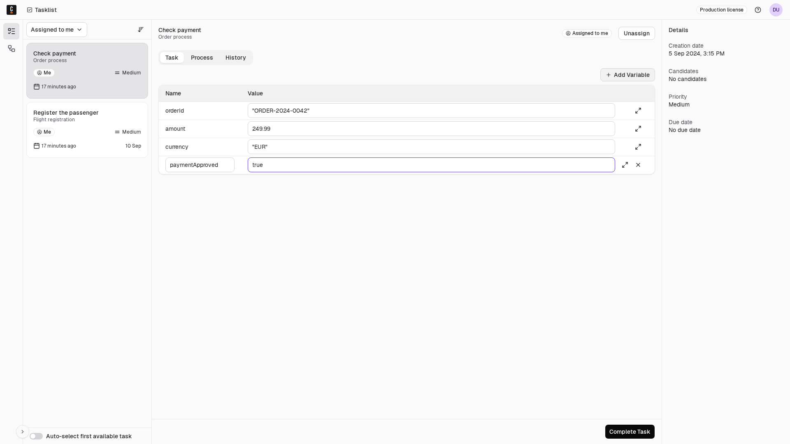
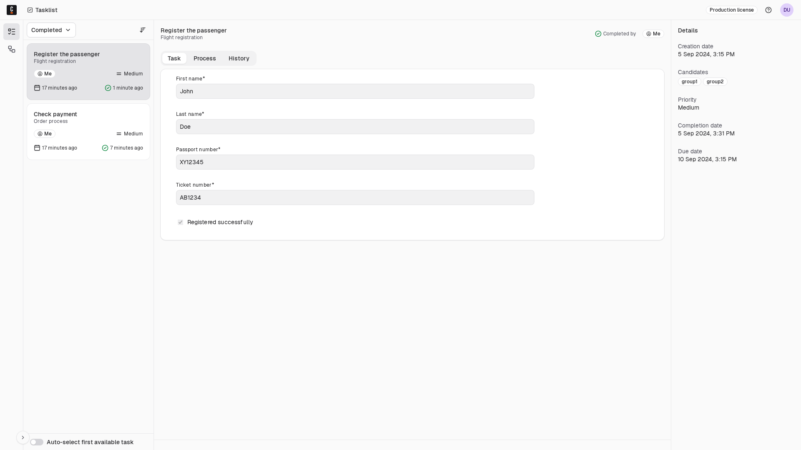

When you've successfully logged in, you'll see the **Tasks** page:

## Assign tasks

To find relevant tasks you can use [filters](./using-filters.md).

Select the **Unassigned** filter list and assign a task to yourself using the **Assign to me** button on the top panel:

## Work on assigned tasks

Select the **Assigned to me** filter list to see the tasks that are assigned to you. Select a task to work on it.

## Complete a task

When a task is assigned to you, you can complete the task by filling out the given form, and clicking on the **Complete Task** button.

There are also cases where no form is available. In these cases, you have to add and/or update variables directly.

Always choose a list of tasks with a specified status. Then, select the task you want to work on.

Change variables as needed and begin completion with the **Complete Task** button.

Completed tasks will be shown in the [**Completed** task list](#view-completed-tasks).

### Add and update variables

Update variables in the **Variables** section by adjusting their text field.

To add a new variable, click **Add Variable**.

## View completed tasks

You will now see the completed task by selecting the **Completed** task list:

## Options

### Auto-select first available task

If this is enabled, whenever you open tasks, change filter options, or complete a task, Tasklist will automatically select the first task in the list.
