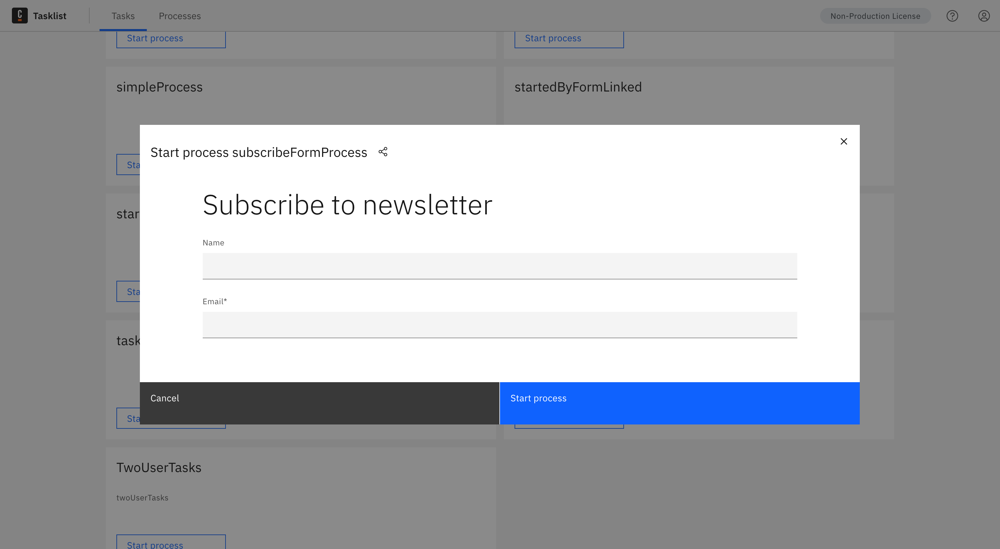

It is possible to start processes by demand using Tasklist. To do this, click **Processes** in the top menu. All the processes you have access to start will be listed on the **Processes** page.

In the **Search** box, it's possible to filter the processes. Start typing the process name and the list will update.

To start a process, click **Start process** on the process you want to start.

If the start event of this process contains an [embedded form](/docs/components/modeler/web-modeler/advanced-modeling/publish-public-processes.md/#embed-form-in-start-event), a modal window containing that form will automatically open.

Tasklist will then wait for the process to be executed. If the process generates a task, you will be redirected to the generated task.

### Not seeing a process

There could be multiple reasons why you are not seeing any process in the **Processes** tab:

- There is no process deployed to your environment.

- Permissions to start a process are managed in [Identity](/docs/self-managed/identity/user-guide/authorizations/managing-resource-authorizations.md) for Self-Managed, and in [Console](/docs/components/console/manage-organization/manage-users.md) for SaaS. It is likely your user does not yet have privileges to start processes on Tasklist.

For all the above scenarios, contact your administrator to understand why no processes are displayed.

## Start public processes via form

Camunda 8 SaaS only

Tasklist offers a convenient method to start processes with a form using a public URL. This functionality relies on process configuration performed in [Web Modeler](/docs/components/modeler/web-modeler/advanced-modeling/publish-public-processes.md), enabling users to create and manage processes.

In scenarios where processes can be triggered through a form, Tasklist hosts the form on a URL that is accessible to all users, eliminating the need for authentication. By submitting the form, the associated process is launched. This feature proves advantageous when you want to expose processes to users outside your organization, as it allows anyone to start a process.

### Usage

#### Process configuration and deployment

To enable the public exposure of a process, the first step involves configuring it to be initiated via a form. This configuration is performed during the process design phase using [Web Modeler](/docs/components/modeler/web-modeler/advanced-modeling/publish-public-processes.md).

#### Accessing and submitting the form

Once the process has been published, a URL will be generated in Tasklist. This URL can be accessed by any user without authentication requirements. Through this endpoint a form is presented and upon submission the associated process is started with the form values being provided as inputs to the process.
