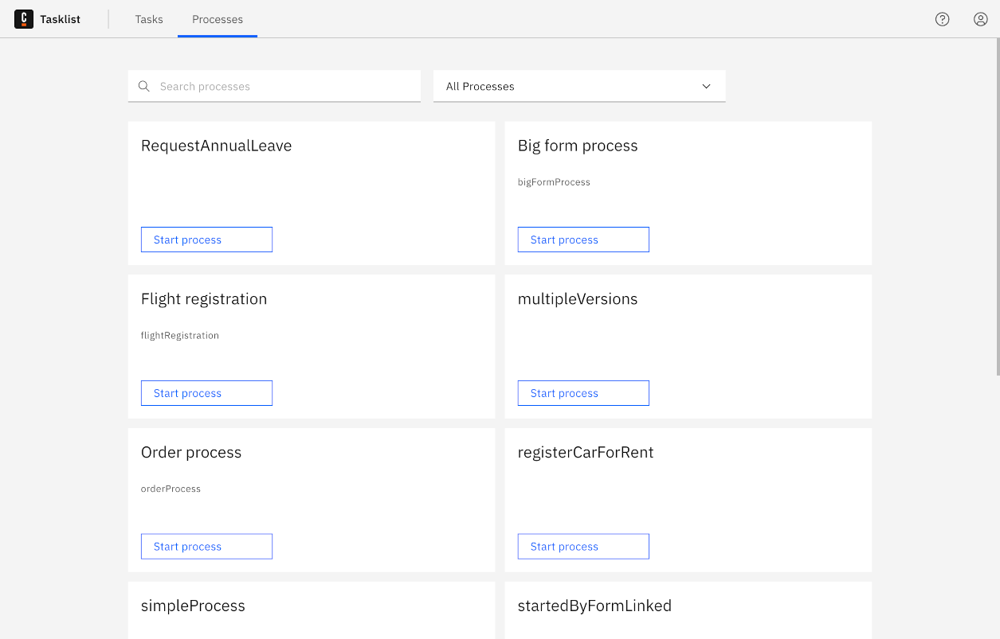
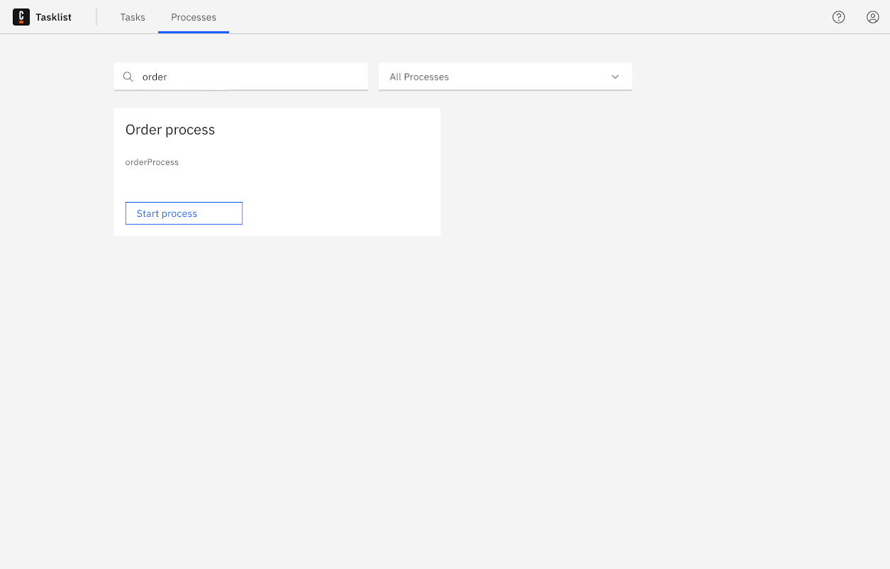
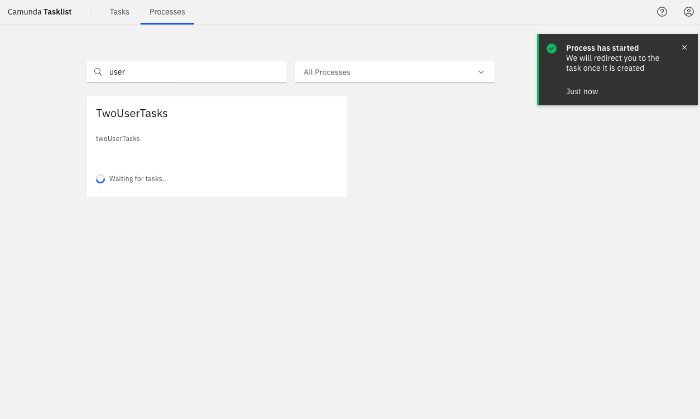

## Processes Tab

It is possible to start processes by demand using Tasklist. To do this, click **Processes** in the top menu. All the processes you have access to start will be listed in the **Processes** page.

On the **Search** checkbox, it's possible to filter the processes. Start typing the process name and the list will be updated.

To start a process, click **Start Process** on the process you want to start.

Tasklist will then wait for the process to be executed. If the process generates a task, you will be redirected to the generated task.

### I'm not seeing a process

There could be multiple reasons why you are not seeing any process in the **Processes** tab:

- There is no process deployed to your environment.
- For Self-Managed environments, permissions to start a process are managed in [Identity](docs/self-managed/identity/user-guide/authorizations/managing-resource-authorizations.md). It is likely your user doesn't yet have privileges to start processes on Tasklist.

For all the above scenarios, contact your administrator to understand why no processes are displayed.

## Start Public Processes via Form

:::note
This feature is exclusively available on the SaaS platform.
:::

Tasklist offers a convenient method to initiate processes by presenting a form within an endpoint. This functionality relies on process configuration performed in the [Web-Modeler](docs/components/modeler/web-modeler/start-public-process.md), enabling users to create and manage processes effortlessly.

In scenarios where processes can be triggered through a form, Tasklist hosts the form on an endpoint that is accessible to all users, eliminating the need for authentication. By submitting the form, the associated process is launched. This feature proves advantageous when you want to expose processes to users outside your organization, as it allows anyone to initiate the process.

### Usage

#### Process Configuration and Deployment

To enable the public exposure of a process, the first step involves configuring it to be initiated via a form. This configuration is performed during the process design phase using the [Web-Modeler](docs/components/modeler/web-modeler/start-public-process.md).

#### Accessing and Submitting the Form

Once the process has been published according to step 1, an endpoint will be generated in Tasklist. This endpoint can be accessed by any user without authentication requirements. Through this endpoint a form is presented and upon submission the associated process is started with the form values being provided as inputs to the process.
