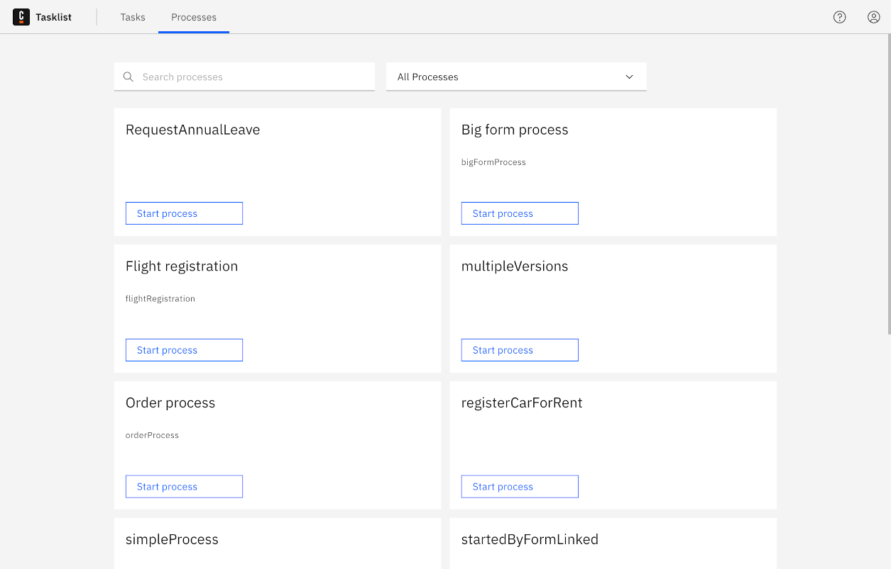
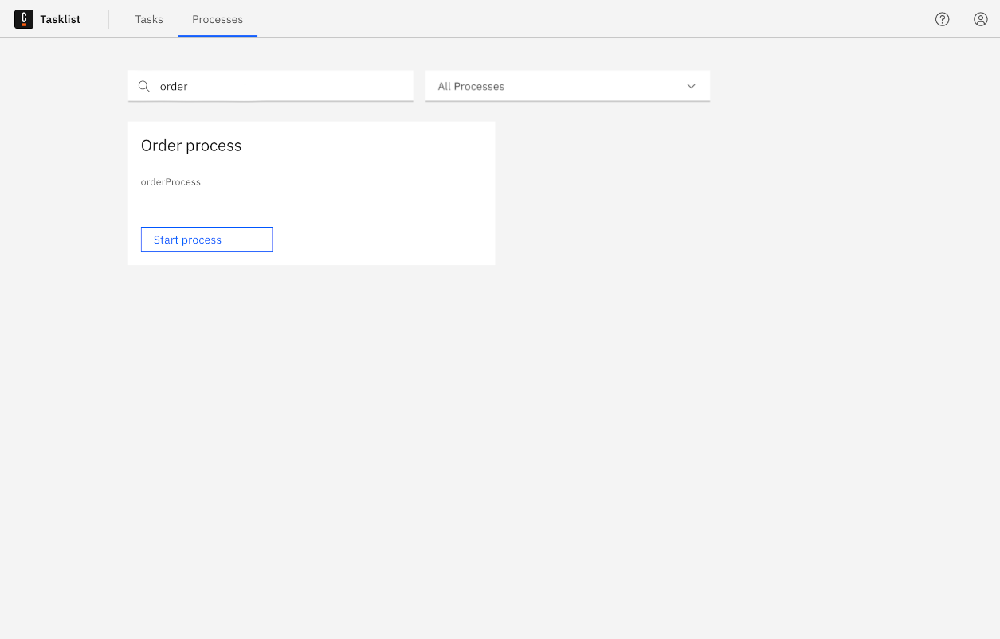
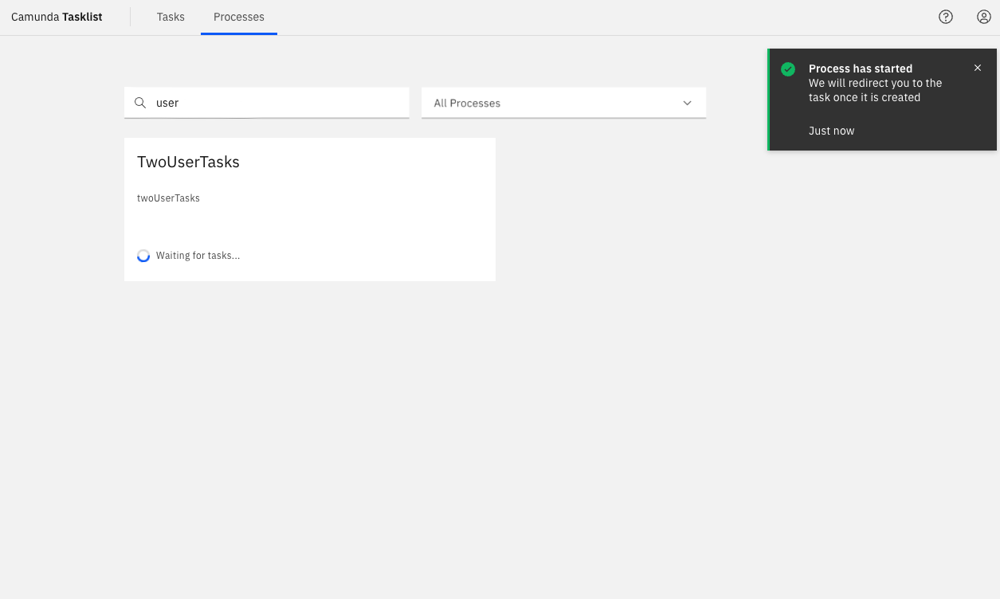
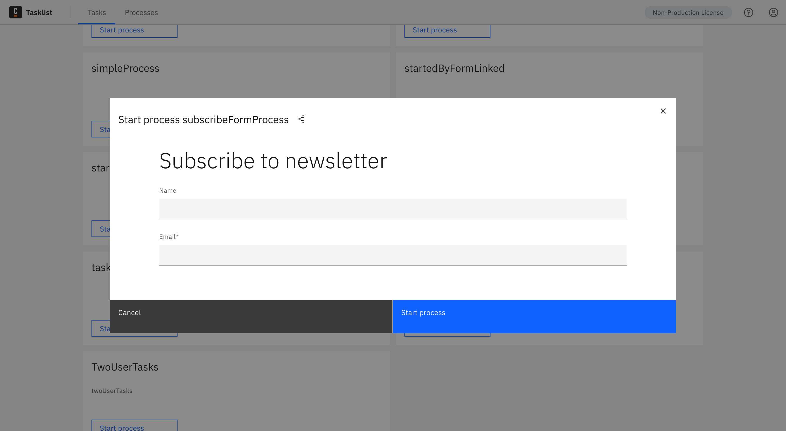

You can start processes on demand using Tasklist. To do this, click **Processes** in the navigation menu. All the processes you have access to start are listed on the **Processes** page.

In the **Search** box, search for the process definition ID of the process you want to start.

Tasklist no longer supports the legacy V1 process filters that were available during the migration period before 8.10.

To start a process, click **Start process** on the process you want to start.

If the start event of this process contains a [linked or embedded Camunda Form](/components/hub/workspace/modeler/modeling/advanced-modeling/form-linking.md), a modal window containing that form will automatically open.

Tasklist will then wait for the process to be executed. If the process generates a task, you will be redirected to the generated task.

:::info

To share a process with users inside your organization, but not with external users, you can click on the share icon  to copy a link to the process. This link will only be accessible to users that already have access to Tasklist.

:::

## Not seeing a process

There could be multiple reasons why you are not seeing any process in the **Processes** tab:

- There is no process deployed to your environment.

- Permissions to start a process are managed via [Authorizations](/components/concepts/access-control/authorizations.md). It is likely your user does not yet have privileges to create process instances.

For all the above scenarios, contact your administrator to understand why no processes are displayed.

## Public start forms

Public start forms were removed in Camunda 8.10 together with Tasklist V1.

To start processes with forms in the current version, use authenticated Tasklist starts, or build your own public-facing application with [Camunda Forms](/components/modeler/forms/utilizing-forms.md) and the [Orchestration Cluster REST API](/apis-tools/orchestration-cluster-api-rest/orchestration-cluster-api-rest-overview.md).
