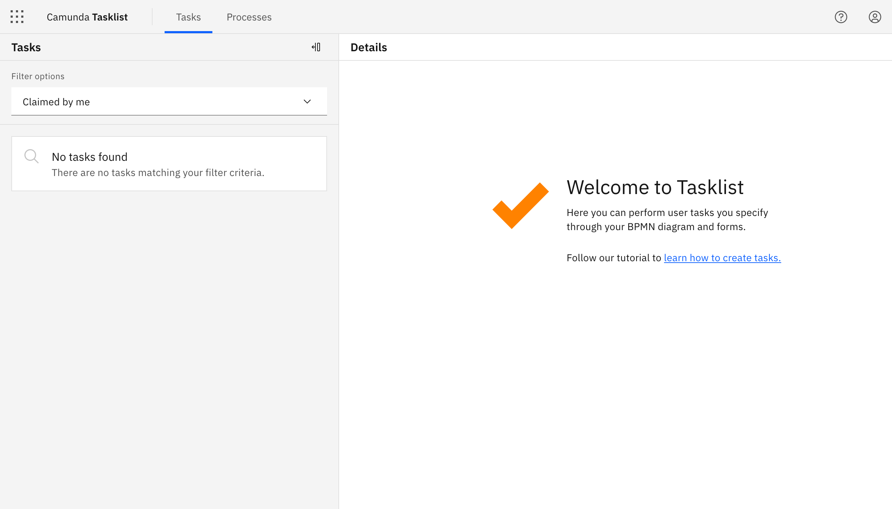
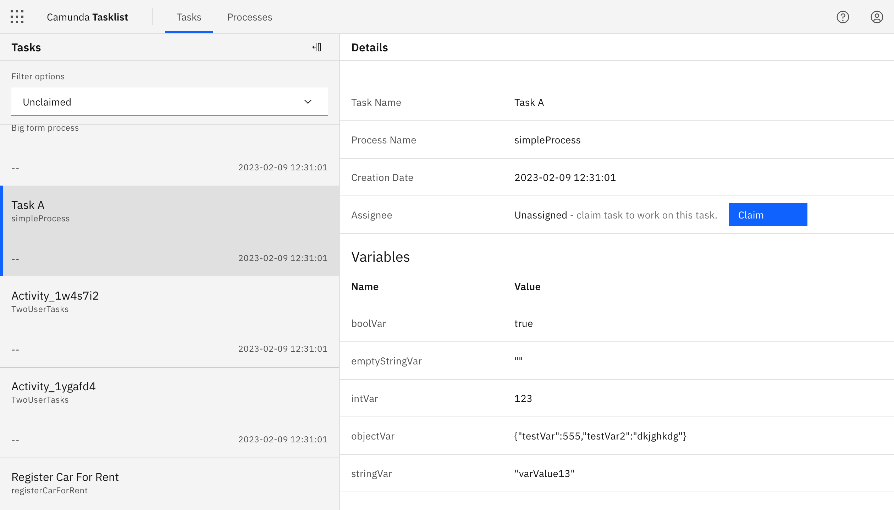
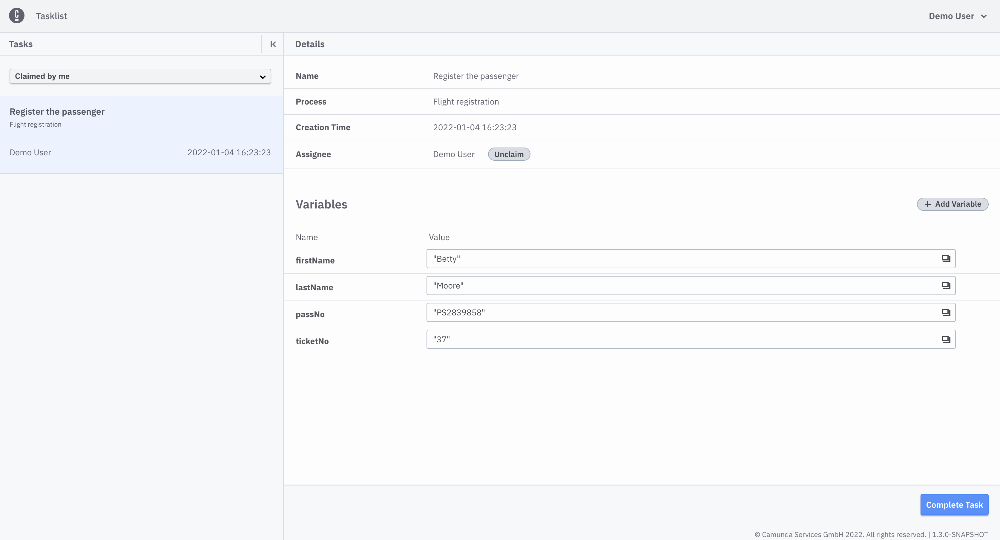
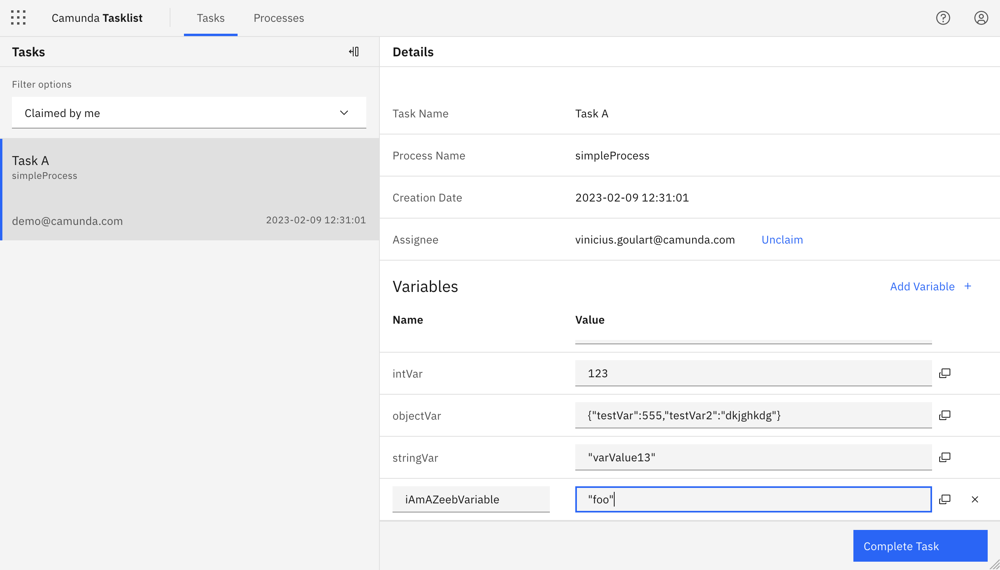
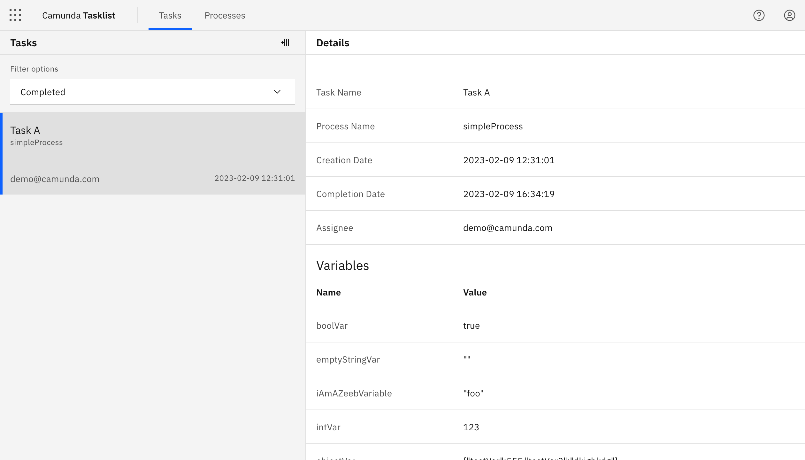

## What can I do with Tasklist?

Tasklist shows you all user tasks that appeared in processes; those processes are running in Zeebe.

User tasks need an interaction from the user. This can be updating, adding variables, filling out a [Camunda Form](../../../guides/utilizing-forms.md), or simply completion of the task. The user must first claim a task or unclaim an already claimed task.

If the user claimed a task, the task can be completed. Different task status filters help the user choose the desired task.

:::note
When a user is granted Tasklist access, the user has full access to the respective process instance data.
:::

## Example use case

If you've successfully logged in, you'll see a screen similar to the following:

On the left side of the screen, you can see tasks. On the right side of the screen, you can see details of the current selected task.

Change the list of tasks by applying filters. You can also collapse and expand the task list.

You can choose which tasks you want to see:

- All open
- Assigned to me
- Unassigned
- Completed

You can also order the tasks on the left menu, clicking on the icon :

### Assign a tasks

Initially, we have no **Assigned to me** tasks.

Select the **Unassigned** list and assign a task using the **Assign to me** button on the top panel:

### Assigned to me tasks

Select the **Assigned to me** list to see if you assigned the task:

### Complete a task

Once you have assigned a task, you can complete the task by adding and updating variables, and using the **Complete Task** button:

Always choose a list of tasks with a specified status. Then, select the task you want to work on.

Complete the task and check if it is shown in the **Completed** list.

Change variables as needed and begin completion with the **Complete Task** button.

#### Add and update variables

Update variables in the **Variables** section by adjusting their text field.

To add a new variable, click **Add Variable**.

### Completed tasks

You will now see the completed task by selecting the **Completed** task list:

