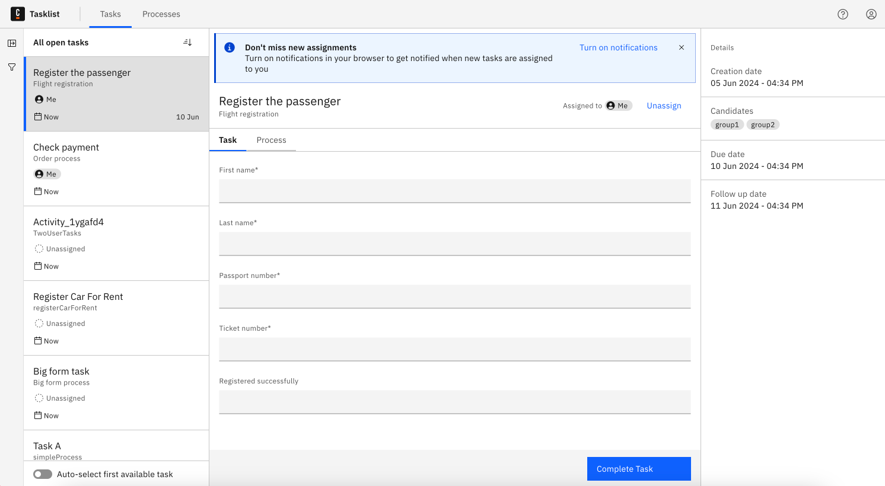

## What can I do with Tasklist?

Tasklist provides a user-friendly interface for managing and completing tasks that require manual interaction.
It shows you all user tasks that appear in processes. Those processes are running in [Zeebe](/docs/components/zeebe/zeebe-overview.md).

The user interaction with a task may involve making updates, adding variables, filling out a [Camunda Form](../../../guides/utilizing-forms.md), or simply reviewing and completing the task.

User tasks can be automatically assigned to users in the BPMN process or they must be self-assigned from Tasklist. Once assigned, the task can be completed.
The user can unassign the task if they do not intend to work on it.

Different task statuses and filters help the user choose the desired task.

:::note
When a user is granted Tasklist access, the user has full access to the respective process instance data.
:::

## Example use case

When you've successfully logged in, you'll see a screen similar to the following:

On the left side of the screen, you can see the list of tasks. On the right side of the screen, you can see details of the currently selected task.

### Tasks filtering

To group tasks and quickly find relevant assignments you can use task filters.
Read more about it [here](./find-relevant-tasks.md).

### Tasks ordering

Click the order icon  to order the tasks. You can arrange them by the date of creation, the due date, or the follow-up date.

The follow-up date defines the latest time you should start working on a task, helping you to prioritize work.
The due date provides a deadline for when the task should be finished:

### Assign tasks

When no tasks are assigned to you, the list appears empty.

Select the **Unassigned** list and assign a task to yourself using the **Assign to me** button on the top panel:

### Work on assigned tasks

Select the **Assigned to me** list to see the tasks that are assigned to you. Select a task to work on it.

### Get notified about new assignments

Tasklist users can receive a browser notification when new tasks are assigned to them:

The **Don't miss new assignments** banner at the top of the page appears when the user either assigns a new task to themselves, or opens a task that is already assigned to them. To turn on browser notifications, click **Turn on notifications**.

To turn off notifications, disable notifications for this site in your browser settings.

:::note
This requires Tasklist to run in the background, so if Tasklist is closed, users will not receive notifications. We recommend keeping Tasklist open in your browser for consistent use.
:::

### Complete a task

When a task is assigned to you, you can complete the task by filling out the given form, and clicking on the **Complete Task** button.

There are also cases where no form is available. In these cases, you have to add and/or update variables directly.

Always choose a list of tasks with a specified status. Then, select the task you want to work on.

Change variables as needed and begin completion with the **Complete Task** button.

Completed tasks will be shown in the [**Completed** task list](#completed-tasks).

#### Add and update variables

Update variables in the **Variables** section by adjusting their text field.

To add a new variable, click **Add Variable**.

### Completed tasks

You will now see the completed task by selecting the **Completed** task list:

## Options

### Auto-select first available task

If this is enabled, whenever you open tasks, change filter options, or complete a task, Tasklist will automatically select the first task in the list.
