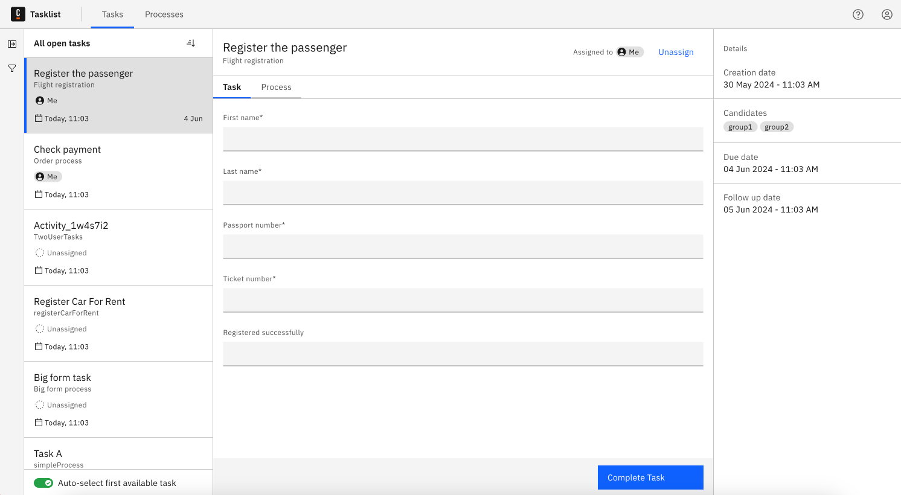
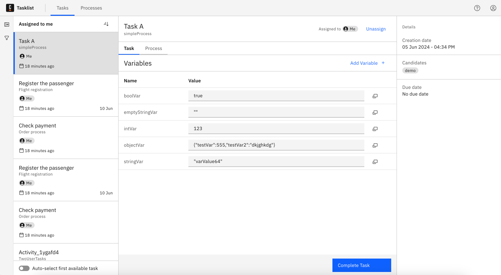
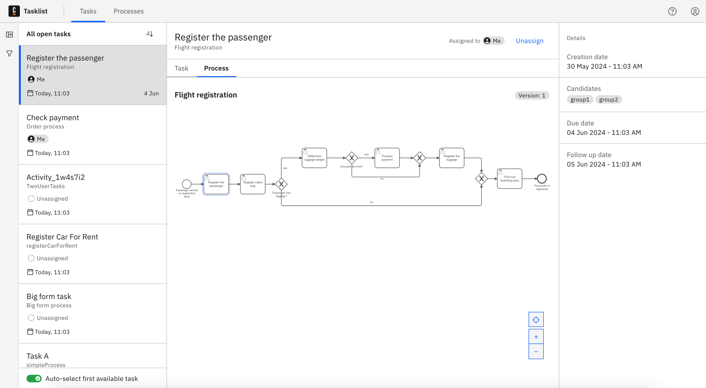

import TasklistTasksPageSpecifications from '../img/tasklist-page-specifications.png';
import TaskTileSpecification from '../img/task-tile-specification.png';
import styles from "./styles.module.css";

Tasklist provides a user-friendly interface for managing and completing tasks that require manual interaction. It shows you all user tasks that appear in processes running in [Zeebe](/components/zeebe/zeebe-overview.md).

:::info
When a user is granted Tasklist access, the user has full access to the respective process instance data.
:::

The user interaction with a task may involve making updates, adding variables, filling out a [Camunda Form](../../../guides/utilizing-forms.md), or simply reviewing and completing the task.

User tasks can be automatically assigned to users and groups in the BPMN process, or they must be self-assigned from Tasklist.
Once assigned to a user, the task can be completed. The user can unassign the task if they do not intend to work on it.

Tasklist has two main pages:

- [Tasks page](#tasks-overview) to manage tasks.
- [Processes page](./starting-processes.md) to start processes.

## Tasks overview

The **Tasks** page lists all tasks available to a user or user group and allows users to assign themselves a task from the list to work on.

On the left side of the page you can see task filters and the queue of tasks.
On the right side, details of the selected task are displayed.

See an overview of the page structure below:

The queue shows the preview of available tasks with the following information:

- Task name
- Name of the process the task belongs to
- Task context description ([it can be optionally configured](/components/concepts/variables.md#context-variable))
- Assignee
- Priority
- Creation date
- Due date
- Follow up date

## Task details

Select a task from the list to view its details.

The task includes a form that has to be filled out and submitted to complete a task.

If the task doesn’t have a form, it will display task variables.

### View process diagram

From the task detail page you can switch to the **Process** tab. This provides a visual representation of the BPMN diagram the task is part of, and may help you understand how an individual task fits into the larger workflow, what activities happened earlier, and what’s coming next.

:::note
The diagram indicates the version of the process instance in which the task was initiated.

This feature is available for diagrams deployed on version 8.6 or higher.
:::

#### Resource-based access (RBA)

If your organization has RBA enabled, the process diagram will be displayed only to users that have permission to view process and decision definitions.

## Filtering

To group tasks and quickly find relevant assignments, use [task filters](./using-filters.md).

## Ordering

Click the order icon  to order the tasks. You can arrange them by the date of creation, due date, follow-up date, or priority.

The follow-up date defines the latest time you should start working on a task. The due date provides a deadline for when the task should be finished.

The priority defines urgency of a task in relation to others.

## Document handling

Tasklist users may view and download files displayed in the task's form.

:::note
If you change the **Document URL** under **Download settings**, this feature will not work for public start forms because there is no valid session.
:::

See additional details and limitations in [document handling](/components/concepts/document-handling.md).
