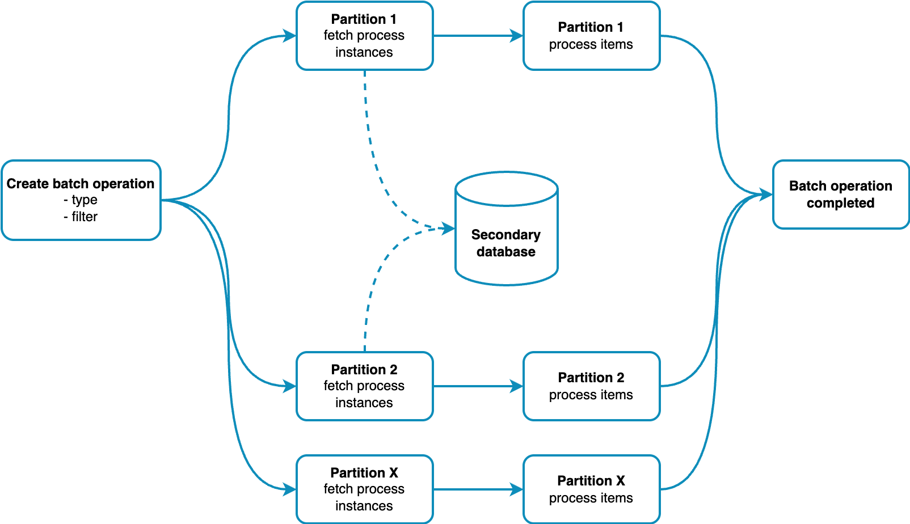

Zeebe supports executing certain operations in a batch operation:

- Resolve incidents
- Migrate process instances
- Modify process instances
- Cancel process instances

## How do they work?

A Zeebe batch operation always consists of two parts:

- **The command**: The type of the batch operation determines the action performed on the process instances. For
  example, the type `MIGRATE_PROCESS_INSTANCE` indicates that the process instances are migrated to a new process
  definition version. Some types of batch operations require a more detailed description like a migration plan for the
  process instance migration.
- **The batch operation items**: The batch operation items to be processed are not defined directly when the batch
  operation is created. Instead, they are described by a filter. This filter is applied the configured secondary
  database (e.g. ElasticSearch) to identify the process instances that match the filter criteria.

### Distribution and eventual consistency

A Zeebe cluster is a distributed system consisting of multiple brokers and multiple partitions. Each partition is
responsible for only a subset of process instances. When a batch operation is started, the following happens:

1. The batch operation (the command and the filter) is created and distributed to all partitions of the cluster.
2. Each partition processes the batch operation independently.
   1. The filter is used to identify process instances in the secondary database that match the criteria and are relevant to this local partition.
   2. The partition then applies the batch command to each of these process instances.
3. Once all partitions have processed the batch operation, the final statuses are collected and the batch operation is
   marked as `COMPLETED` by the cluster.

This distributed, asynchronous behaviour enables Zeebe to process large numbers of processes in parallel.
instances in parallel. However, this also has some implications:

- When a batch operation is started from the Operate UI, the filtered process instances displayed in the UI may differ
  from those actually executed in the Zeebe engine. This is because the batch operation only defines filter criteria,
  not an exact set of process instances. By the time the engine resolves the matching process instances, the search
  results may have changed. Discovery of the process instances occurs directly at the start of the batch operation.
  Therefore, when processing begins, the number of instances to be processed is fixed and will not change over the
  lifetime of the batch operation.
- Each partition processes the batch operation and resolves the matching process instances independently. This means
  that, especially at the start of very large batch operations, the total number of items in the batch operation known
  to the secondary database may vary until all partitions have finished fetching the relevant process instances.

### Why query the secondary database?

In general, all information relating to running process instances and incidents is stored in the Zeebe broker's internal
RocksDB store. So why do we query the external database instead of using the internal state of the engine to find the
relevant process instances?

- The RocksDB store is a key-value store. It is not intended for use with complex queries.
- The secondary database (e.g. ElasticSearch) is much more efficient at searching for process instances and incidents
  using complex filter criteria.
- The user flow is designed to enable users to define filter criteria in the Operate UI and apply them to the batch
  operation. This is not possible with the RocksDB store, as it does not support complex queries.

## How do I start and monitor a batch operation?

There are currently two ways to create a Zeebe batch operation:

- The [Orchestration Cluster API](/apis-tools/orchestration-cluster-api-rest/orchestration-cluster-api-rest-overview.md)
  provides a REST API to create, manage and monitor batch operations.
- The [Camunda client](/apis-tools/java-client-examples/process-instance-create.md) provides an API to create, manage
  and query for batch operations.

These APIs also allow batch operations to be suspended, resumed or cancelled.

## Authorization

In order to execute a batch operation, the user must have two different sets of permissions.

- The user must have permission to create the batch operation itself.
- They must have permission to read the process instances and execute the operation on them.

## Performance impact

The batch operation is executed using the same Zeebe cluster resources on which the regular process instances run and
are processed. This means that the flow of regular process instances and the executed batch operation share the same
resources and can affect each other's performance. The running batch operation creates Zeebe commands, which are
executed with the same priority as user-generated process instance commands.

Creating a batch operation involving a large number of process instances can have an immediate short-term impact on the
performance of the Zeebe cluster, as it takes time for the operation to be created in the RocksDB.

During initialisation, each partition reads process instances from the secondary database individually and in parallel.
This can have a significant impact on the performance of the secondary database, especially if the batch operation is
large and the filter criteria match a high number of process instances.
