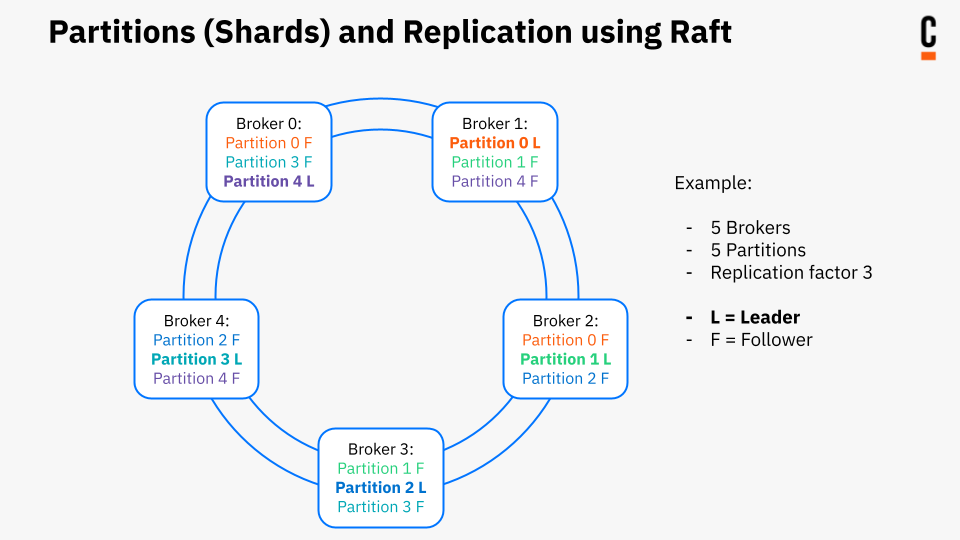

Zeebe can operate as a cluster of brokers, forming a peer-to-peer network.

In this network, all brokers have the same responsibilities and there is no single point of failure.


## Gossip membership protocol

Zeebe implements the [Gossip protocol](https://en.wikipedia.org/wiki/Gossip_protocol) to know which brokers are currently part of the cluster.

The cluster is bootstrapped using a set of well-known bootstrap brokers, to which the other ones can connect. To achieve this, each broker must have at least one bootstrap broker as its initial contact point in their configuration:

```yaml
---
cluster:
  initialContactPoints: [node1.mycluster.loc:26502]
```

When a broker is connected to the cluster for the first time, it fetches the topology from the initial contact points and then starts gossiping with the other brokers. Brokers keep cluster topology locally across restarts.

## Raft consensus and replication protocol

To ensure fault tolerance, Zeebe replicates data across machines using the [Raft protocol](<https://en.wikipedia.org/wiki/Raft_(computer_science)>).

Data is divided into partitions (shards). Each partition has a number of replicas. Among the replica set, a _leader_ is determined by the raft protocol which takes in requests and performs all of the processing. All other brokers are passive _followers_. When the leader becomes unavailable, the followers transparently select a new leader.

Each broker in the cluster may be both leader and follower at the same time for different partitions. In an ideal world, this leads to client traffic distributed evenly across all brokers.



Note, however, that there is no active load balancing across partitions. Each leader election for any partition is completely autonomous and independent of leader elections for other partitions. This may lead, in the worst case, to one node becoming the leader for all partitions. This is not a problem for fault tolerance as the guarantees of replication still hold. However, it may negatively impact throughput as all traffic hits one node.

## Commit

Before a new record on a partition can be processed, it must be replicated to a quorum (typically majority) of followers. This procedure is called _commit_. Committing ensures that a record is durable even in case of complete data loss on an individual broker. The exact semantics of committing are defined by the raft protocol.


