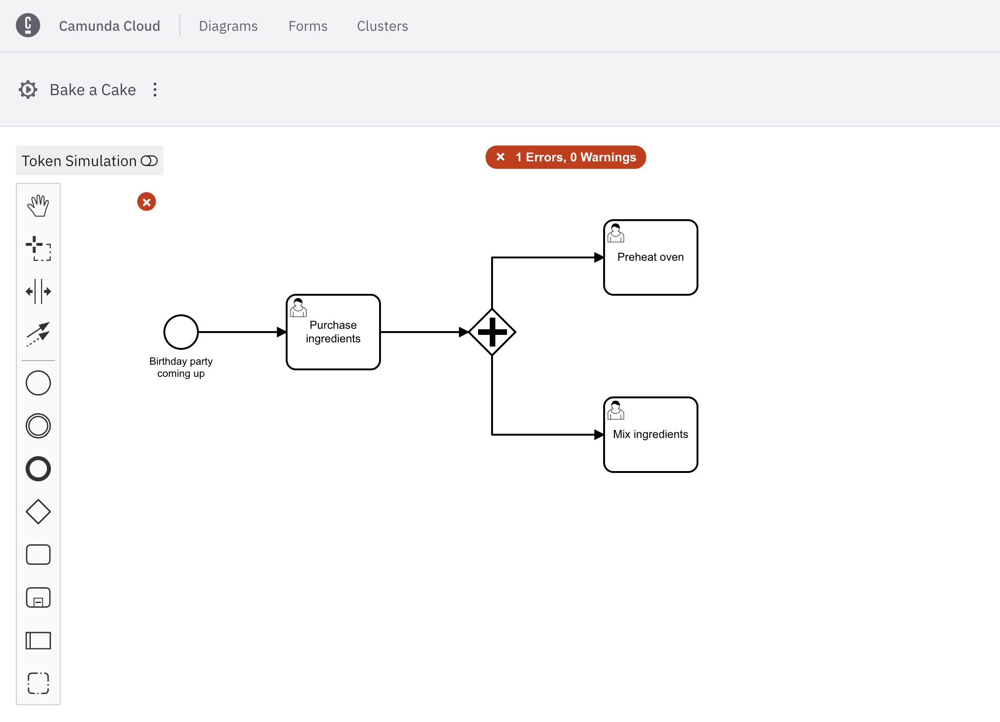
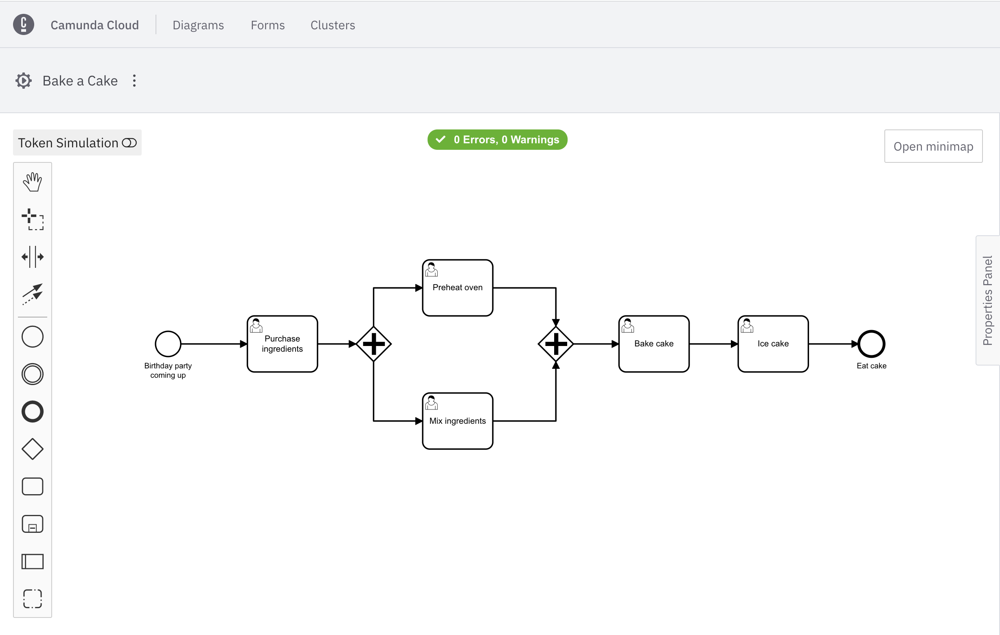
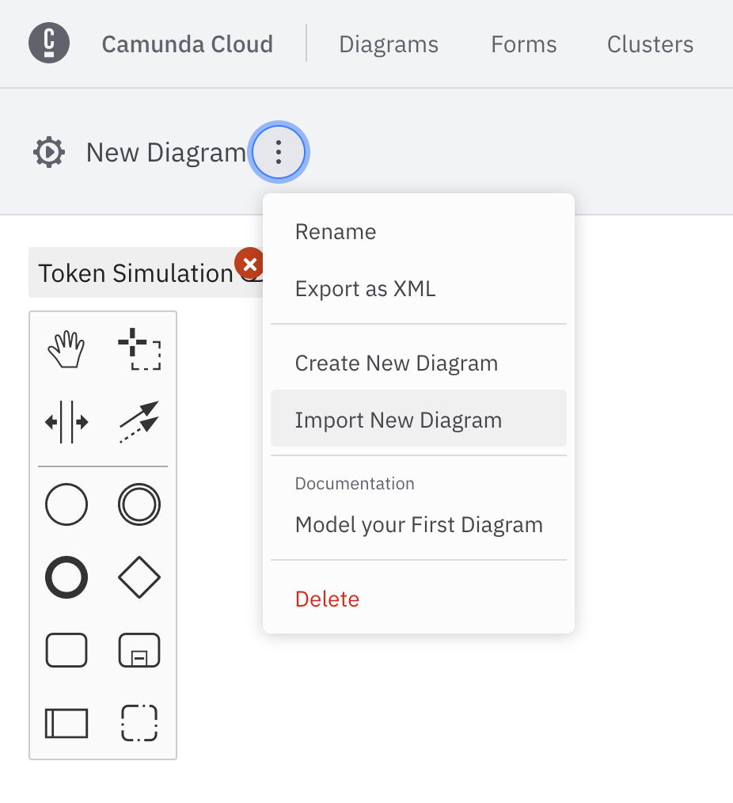

Beginner
Time estimate: 20 minutes

## What is BPMN?

Business Process Model and Notation (BPMN) is the global standard for process modeling. With BPMN, automate your most complex business processes using an easy-to-adopt visual modeling language.

Processes are the algorithms that determine how an organization runs based on independent tasks. Successful businesses grow from proven, effective processes. Therefore, Camunda’s workflow engine executes processes defined in BPMN.

Take the following example where we've outlined a diagram to send an email. Don't worry too much about the symbols as we'll get to that shortly. For now, recognize the start and end of the process, comprised of entering a message, and sending the email.

Implement control and visibility over your critical business processes, as the workflow engine orchestrates processes that span APIs, microservices, business decisions and rules, human work, IoT devices, RPA bots, and more.

## Set up

At Camunda, we utilize [Modeler](./components/modeler/overview.md) to build out BPMN diagrams.

You can begin building out your processes within Camunda Cloud using Cloud Modeler. Therefore, ensure you’ve [created a Camunda Cloud account](./getting-started/create-camunda-cloud-account.md) to get started.

## Getting started with BPMN

Once logged in to your Camunda Cloud account, take the following steps:

1. Click the **Diagrams** tab in the top navigation bar.
2. Click **Create New Diagram**.
3. Select the three vertical dots next to **New Diagram** on the top left corner of the page to rename your diagram. In this case, we'll name ours "Bake a Cake."

### BPMN elements

Before we build out the diagram to bake our cake, we need to understand what the components on the left side of the screen signify.

We can build out our process using several elements, including the following:

- Events: The things that happen. For example, start and end events which begin and terminate our process.
- Tasks: For example, user tasks for a particular user to complete, or service tasks to invoke various webservices.
- Gateways: For example, parallel gateways that move the process along between two tasks at the same time.
- Subprocesses: For example, a transaction subprocess which can be used to group multiple activities to a transaction.

For a complete list of BPMN elements, visit our [BPMN reference material](https://docs.camunda.org/manual/7.16/reference/bpmn20/).

If you're new to BPMN elements and their capabilities, also visit our [BPMN symbol documentation](https://camunda.com/bpmn/reference/).

### BPMN in action

Using these elements, we can build out our process in baking a cake.

Take the following steps:

1. On our diagram, we've already been given an element as a start event in the shape of a circle. We can click on the circle, and then the wrench icon to adjust this element. For now, we'll keep it as a start event. Double click on the circle to add text.
2. Drag and drop an arrow to the first task (the rectangle shape), or click the start event, and then click the task element to automatically attach it.
3. Click on the task, then click on the wrench icon to declare it a user task, which will be named "Purchase Ingredients." Note that each element we add has adjustable attributes. Use the properties panel on the right side of the page to adjust these attributes.
4. Click on the user task to connect a gateway to it. By clicking the wrench icon on the gateway and declaring it a parallel gateway, we can connect it to two tasks that can happen at the same time: mixing the ingredients, and preheating the oven.

5. Attach the next gateway once these two tasks have completed to move forward.
6. Add a user task to bake the cake, and finally a user task to ice the cake.
7. Add an end event, represented by a bold circle, and enjoy your cake!

:::note
You can also import a BPMN diagram with Cloud Modeler. Click **Import New Diagram** in the context menu.
:::

## Execute your process diagram

:::note
If a diagram is only saved, it has no effect on your cluster(s). It can be used by all members of your organization.

When you deploy the diagram, it becomes available on the selected cluster and new instances can start.
:::

To execute your completed process diagram, click **Save**. Then, click **Execute > Save and Deploy**.

You can now start a new process instance to initiate your process. Click the **Execute** dropdown, and then **Start Instance**.

You can now monitor your instances in [Operate](./components/operate/index.md). From your diagram, click the **Execute** dropdown, and **View Process Instances**. This will automatically take you to Camunda Operate to monitor your running instances.

You can also visit an ongoing list of user tasks required in your BPMN diagram. Click the **Execute** dropdown, and **View User Tasks** to automatically be taken to [Tasklist](./components/tasklist/introduction.md).

## Additional resources and next steps

- [Camunda BPMN Tutorial](https://camunda.com/bpmn/)
- [BPMN Implementation Reference](https://docs.camunda.org/manual/7.16/reference/bpmn20/)
- [BPMN Engine](https://camunda.com/products/camunda-platform/bpmn-engine/)
- [Model Your First Process](./getting-started/model-your-first-process.md)
- [BPMN Reference](https://camunda.com/bpmn/reference/)
- [Operate](./components/operate/index.md)
- [Tasklist](./components/tasklist/introduction.md)