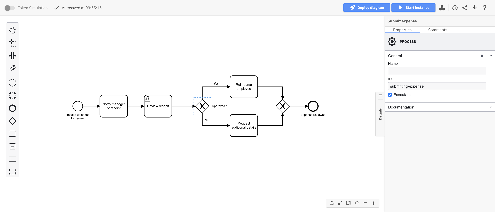
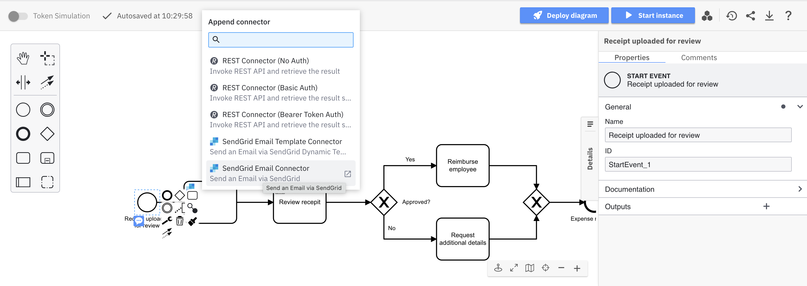
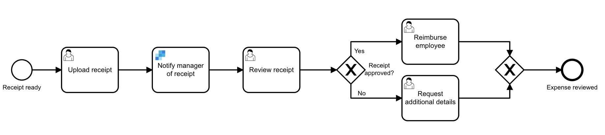
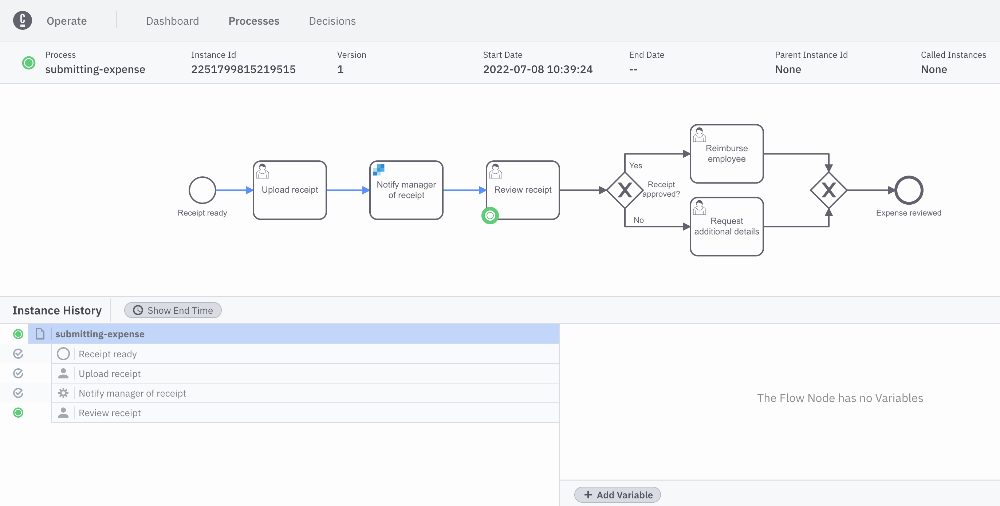

Beginner
Time estimate: 20 minutes

The launch of [Camunda 8](../components/concepts/what-is-camunda-8.md) also introduced an integration framework with a key goal: integrate faster to reduce the time it takes to automate and orchestrate business processes across systems.

:::note
New to Connectors? Review our [introduction to Connectors](/components/connectors/introduction.md) to get familiar with their capabilities.
:::

[Connectors](../components/connectors/introduction.md) achieve this goal. Ready to use out of the box, Connectors help automate complex [business processes](../components/concepts/processes.md) by inserting them into [BPMN diagrams](./automating-a-process-using-bpmn.md) within [Web Modeler](../components/modeler/about-modeler.md), and configuring them via the properties panel on the right side of the screen.

You can also orchestrate APIs, for example by working with a [REST Connector](/guides/getting-started-orchestrate-apis.md). Learn more about [types of Connectors](/components/connectors/connector-types.md).

Connectors technically consist of two parts: the business logic is implemented as a [job worker](../components/concepts/job-workers.md), and the user interface during modeling is provided using an element template. In this guide, we'll walk step-by-step through the implementation of a sample Connector.

## Set up

We'll implement our Connector with [Modeler](../components/modeler/about-modeler.md). To get started, ensure you’ve [created a Camunda 8 account](/guides/create-account.md).

You'll also need to [create a SendGrid account](https://signup.sendgrid.com/) if you don't have one already, as we'll use SendGrid in our example Connector. Once you've created your account, you will immediately be prompted to create a [sender](https://docs.sendgrid.com/ui/sending-email/senders).

### Create a cluster

import CreateCluster from '../components/react-components/create-cluster.md'

<CreateCluster/>

## Getting started

Once logged in to your Camunda 8 account, take the following steps:

1. From Modeler, click **New project > Create new > BPMN diagram**.
2. Name your project by replacing the **New Project** text at the top of the page. In this example, we'll name ours `Expense process`.
3. Select **Create new > BPMN diagram**.
4. Give your model a descriptive name by replacing the **New BPMN Diagram** text at the top of the page. Then, give your model a descriptive ID within the **General** tab inside the properties panel on the right side of the screen. In this case, we've named our model `Submit expense` with an ID of `submitting-expense`.

## Build a BPMN diagram

Use Web Modeler to design a BPMN flow with the appropriate tasks. To get started, create a task by dragging the rectangular task icon from the palette, or click the existing start event and the displayed task icon.

In this example, we've designed the following BPMN diagram:

:::note
To learn more about building your own BPMN diagram from scratch, visit our guide on [automating a process using BPMN](./automating-a-process-using-bpmn.md).
:::

## Add a Connector

Here, a receipt is initially uploaded for review. The first task we need to complete is notifying the manager of the uploaded receipt. If we want to leverage our email service to notify the manager, we can utilize a productivity applications Connector to replace this task.

:::note
Camunda offers a variety of available Connectors. For example, utilize cloud Connectors to communicate with cloud-native applications and conform to REST, GraphQL, or SOAP protocols. Or, employ service Connectors to integrate with technology enablers like RPA, AI or IOT services. Learn more about our [available Connectors](../components/connectors/out-of-the-box-connectors/available-connectors-overview.md) to find out which may best suit your business needs.
:::

To add our productivity applications Connector, take the following steps:

1. Click the start event. A context pad to the right of the start event will appear.
2. Click the **Append Connector** item in the panel.
3. To send an email via SendGrid, for example, select the **SendGrid Email Connector** option. Name this newly-created task `Notify manger of receipt`. This now replaces our original task.
   
4. You need to fill out the required information in the properties panel of this task on the right side of the screen. Here, we'll add an example API key obtained from our [SendGrid account](https://app.sendgrid.com/settings/api_keys), a sender and receiver name and email address, and the email message content.

Our Connector is now attached and ready to use. Your completed diagram should look like the following:

## Execute your process diagram

:::note
If you change a diagram and it is auto-saved, this has no effect on your cluster(s).

When you deploy the diagram, it becomes available on the selected cluster and new instances can start.
:::

To execute your completed process diagram, click **Deploy**.

You can now start a new process instance to initiate your process diagram. Click **Run**.

You can now monitor your instances in [Operate](components/operate/operate-introduction.md).

:::note
Variables are part of a process instance and represent the data of the instance. To learn more about these values, variable scope, and input/output mappings, visit our documentation on [variables](../components/concepts/variables.md).
:::

## Observe your running process

After the [user task](./getting-started-orchestrate-human-tasks.md) **Upload receipt** is completed in [Tasklist](../components/tasklist/introduction-to-tasklist.md), an email is automatically sent to the address as specified in the Connectors properties panel we configured earlier.

In [Operate](../components/operate/operate-introduction.md), you will now see the process move forward to **Review receipt**.

## Additional resources and next steps

- [Use Connectors in your BPMN process](/components/connectors/use-connectors/index.md)
- [Available Connectors](../components/connectors/out-of-the-box-connectors/available-connectors-overview.md)
- [Connectors & Integration Framework](https://camunda.com/platform/modeler/connectors/)
- [Camunda BPMN Tutorial](https://camunda.com/bpmn/)
- [Automate processes using BPMN](./automating-a-process-using-bpmn.md)
