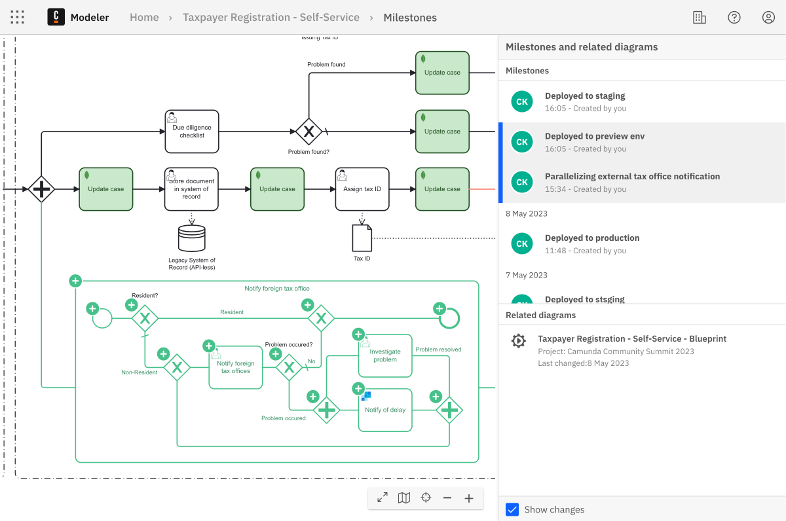

import Tabs from "@theme/Tabs";
import TabItem from "@theme/TabItem";

import VisualDiffImg from './img/visual-diff.png';

<p>
  <span class="badge badge--intermediate">Intermediate</span>
  <span class="badge badge--medium">Estimated Time: 1 hour</span>
</p>

Web Modeler serves as a robust tool for the development and deployment of processes and process applications. While Web Modeler simplifies one-click deployment for development, professional teams often rely on continuous integration and continuous deployment (CI/CD) pipelines for automated production deployments. The [Web Modeler API](/apis-tool/web-modeler-api) facilitates seamless integration of Web Modeler into these pipelines, aligning with team practices and organizational process governance.

Continuous integration and deployment are pivotal for rapid and reliable software development, testing, and delivery. These practices automate the building, testing, and deployment processes, leading to shorter development cycles, enhanced collaboration, and higher-quality releases.

Integrating Web Modeler into your CI/CD pipelines can significantly enhance process application development and deployment workflows. By automating process application deployment, changes can be promptly and accurately reflected in the production environment. This agility empowers teams to swiftly respond to evolving business needs, fostering a flexible and adaptable process orchestration approach.

## Prerequisites

Each pipeline is unique. The Web Modeler API offers flexibility to tailor integrations according to your pipelines. To get started, there are a few prerequisites based on your setup:

* A version control system (VCS) such as GitHub or GitLab.
* An existing pipeline or a plan to set one up using tools like [CircleCI](https://circleci.com/) or [Jenkins](https://www.jenkins.io/), cloud platforms such as [Azure DevOps Pipelines](https://azure.microsoft.com/de-de/products/devops), or built-in VCS platforms like [GitHub Actions](https://github.com/features/actions) or [GitLab's DevSecOps Lifecycle](https://about.gitlab.com/stages-devops-lifecycle/).
* Familiarity with the [Web Modeler API](/apis-tool/web-modeler-api) through the OpenAPI documentation.
* Understanding of [clusters](http://localhost:3000/docs/next/components/concepts/clusters/) in Camunda Platform 8.
* Creation of a Camunda Platform 8 account using the [guide](/guides/create-account.md), or installation of [Camunda Platform 8 Self-Managed](/self-managed).

## Setup

While a pipeline for process application integration and deployment resembles general software CI/CD pipelines, key distinctions exist. Consider the following:

* Web Modeler employs [milestones](/components/modeler/web-modeler/milestones.md) to indicate specific process states, such as readiness for developer handover, review, or deployment.
* A process application comprises main processes and diverse resources, such as sub-processes, forms, DMN models, connectors, job workers, and orchestrated services. Some applications bundle these resources, while others focus on a single process for deployment.
* Process reviews differ from code reviews, occurring on visual diagrams rather than XML.


### Obtaining API Clients and Tokens

Before commencing, obtain API clients and tokens for integrating Web Modeler and accessing the process engine via API.
* [Obtain an API token for Web Modeler](http://localhost:3000/docs/next/apis-tools/web-modeler-api/#authentication)
* [Obtain an API client for Zeebe](http://localhost:3000/docs/next/guides/setup-client-connection-credentials/)

### Disabling Manual Deployments from Web Modeler

To enforce pipeline-driven deployments and limit manual ones, consider disabling manual deployments. For self-managed deployments, configure environment variables `ZEEBE_BPMN_DEPLOYMENT_ENABLED` and `ZEEBE_DMN_DEPLOYMENT_ENABLED` as outlined [here](/self-managed/modeler/web-modeler/configuration/configuration.md/#general).

<Tabs groupId="disableDeployments" defaultValue="sm" values={[{label: 'Self-Managed', value: 'sm', }, {label: 'SaaS', value: 'saas', },]} >
<TabItem value="sm">

You can completely disable manual deployments by configuring environment variables `ZEEBE_BPMN_DEPLOYMENT_ENABLED` and `ZEEBE_DMN_DEPLOYMENT_ENABLED` as documented [here](/self-managed/modeler/web-modeler/configuration/configuration.md/#general).

</TabItem>
<TabItem value="saas">

Currently, manual deployments are unrestricted on SaaS. Efforts are underway to introduce permissions for restricting deployments.

</TabItem>
</Tabs>

### Triggering CI/CD

You need triggers to initiate the pipeline for files or projects. Choose between manual pipeline initiation or automatic background initiation based on events. Common approaches include:

* Initiating the pipeline manually from your CI/CD tool/platform by uploading the file intended for deployment.
* Starting the CI pipeline by generating a pull/merge request in the version control system.
* Triggering pipelines via milestones possessing specific characteristics.

#### Synchronizing Files with Version Control

Effortlessly synchronize files between Web Modeler and version control and vice versa. Employ the complete set of CRUD (create, read, update, delete) operations provided by the Web Modeler API to manage files and projects. Implementing synchronization streamlines data management, ensuring file ownership and negating duplicate data upkeep.

For automatic file synchronization, consider maintaining a secondary system of record for mapping Web Modeler projects to VCS repositories. This system also monitors the project-to-repository mapping and update timestamps.

<!-- To be added once GA released:

To monitor Web Modeler changes, a polling strategy comparing update dates with last sync dates is necessary. Utilize the `POST /api/beta/files/search` [endpoint](https://modeler.cloud.camunda.io/swagger-ui/index.html#/Files/searchFiles) with this payload to identify recently updated files:

```json title="POST /api/beta/files/search"
{
  "filter": {
    "projectId": "<PROJECT TO SYNC>",
    "updated": "<LAST SYNC DATE>",
  ],
  "page": 0,
  "size": 50
}

-->

For real-time synchronization, a polling approach comparing update dates with last sync dates is employed. Utilize the `POST /api/beta/files/search` [endpoint](https://modeler.cloud.camunda.io/swagger-ui/index.html#/Files/searchFiles) to discover recently updated files. Compare the `updated` date with your last sync date:

```json title="POST /api/beta/files/search"
{
  "filter": {
    "projectId": "<PROJECT TO SYNC>"
  ],
  "page": 0,
  "size": 50
}
```

:::info
Note that the default pagination is enforced for all listed `search` endpoints. Ensure you obtain all relevant pages.
:::


An alternate approach involves manually triggering synchronization or delegating synchronization triggers to other sources, such as the pipeline itself, creation of new branches, or pull/merge requests.

Real-time synchronization isn't always essential. Consider Web Modeler as a local repository, and update your remote repository only after files are committed and pushed. This aligns with the concept of [milestones](/components/modeler/web-modeler/milestones.md).

#### Listening to Milestone Creation

Listening for newly created milestones involves polling for updates using the `POST /api/beta/milestones/search` endpoint of the Web Modeler API. Compare `created` dates of milestones with your last sync date to identify recent additions.

<!-- To be added once GA released:

Currently, you need to poll for milestone creations using the `POST /api/beta/milestones/search` endpoint of the Web Modeler API. Compare `created` dates of milestones with your last sync date to identify recent additions.

Use the following payload to find recently created milestones:

```json title="POST /api/beta/milestones/search"
{
  "filter": {
    "created": "<LAST SYNC DATE>",
  ],
  "page": 0,
  "size": 50
}
```

A sample response containing the `fileId` signifies the file associated with the newly created milestone:

```json
[
    {
    "metadata": {
        "id": "string",
        "name": "string",
        "fileId": "string",
        ...
    }
    },
    ...
]
```
-->

Similar to above, poll for milestone creations using the `POST /api/beta/milestones/search` endpoint of the Web Modeler API. Compare `created` dates of milestones with your last sync date to identify recent additions.

Use the following payload to retrieve recently created milestones:

```json title="POST /api/beta/milestones/search"
{
  "filter": {
    "fileId": "<INTERESTED FILE>",
  ],
  "page": 0,
  "size": 50
}
```

For specific milestone content, employ the `GET api/beta/milestones/:id` endpoint. To obtain the latest file edit state, use the `GET api/beta/files/:id` endpoint. This endpoint also offers the `projectId` necessary for the `SEARCH api/beta/projects/search` endpoint, facilitating the transfer of the entire project via the pipeline.

Progress is underway to introduce webhook registration or event subscription for milestone creation monitoring. This approach complements manual sync or external triggers like the pipeline, new branch creation, or pull/merge requests.

Combining these approaches allows milestones to synchronize files with your version control system. It also facilitates pull/merge request creation and pipeline triggering.

## Pipeline Stages

The following examples illustrate setting up **build**, **test**, **review**, and **publish** stages within a pipeline.

### Build Stage

While there is no distinct concept for a build package, artifact structuring depends on your overall software architecture. The build stage should primarily focus on acquiring dependencies and deploying them to a preview environment.

#### Establishing a Preview Environment

Offering an automatically testable and review-ready process preview mandates a dedicated preview cluster. Numerous options exist, varying with software development lifecycle design, preferences, and Camunda Platform 8 deployment type (SaaS, self-managed, or hybrid). This guide proposes a setup featuring localized self-managed preview clusters (or embedded engines) and more extensive staging and production clusters (self-managed or SaaS).

For local preview environments, consider deploying a comprehensive [Zeebe](https://github.com/camunda/zeebe) cluster including Operate and Tasklist. Options include using docker-compose or Kubernetes via Helm. All necessary endpoints and UIs are available for thorough process/application testing. Opt for a cluster version aligned with your production cluster to ensure process compatibility.

For lightweight scenarios or embedded Zeebe engine usage, employ the community-maintained [embedded Zeebe engine](https://github.com/camunda-community-hub/eze). Coupled with the [Zeebe Hazelcast exporter](https://github.com/camunda-community-hub/zeebe-hazelcast-exporter), data consumption is enabled for reporting or testing.

In the build stage, deploy your process or project to a cluster or embedded engine. Post-pipeline completion, such as deployment to staging or production, preview environments can be discarded.

:::tip
For GitLab users, consider using [GitLab Review Apps](https://docs.gitlab.com/ee/ci/review_apps/) to facilitate preview environments.
:::

Deploy resources using the `zbctl` CLI in this pipeline step, compatible with both SaaS and self-managed clusters. Alternately, utilize Java or Go client libraries or any community-built alternatives.

:::info
Feature branches and Web Modeler installations: To maintain a single source of truth, avoid multiple Web Modeler instances for different feature branches. Instead, maintain a single Web Modeler installation for all environments, utilizing milestones to signify versioning and pipeline stages. Feature branches can be managed by cloning and merging files or projects, ensuring synchronization using VCS.
:::

#### Automated Deployment of Linked Resources/Dependencies

Pipeline-driven deployment can be executed for a single file or an entire project. A separate system of record, maintained outside Web Modeler, can handle finer-grained dependency management. Fetch the full project for a file using the `GET api/beta/files/:id` endpoint to acquire the project's `projectId`. Subsequently, use the `POST api/beta/files/search` endpoint with the following payload to retrieve all project files:

```json title="POST /api/beta/files/search"
{
  "filter": {
    "projectId": "<PROJECT ID>",
  ],
  "page": 0,
  "size": 50
}
```

:::info


For all `search` endpoints mentioned, pagination is enabled by default. Ensure you retrieve all relevant pages.
:::

Retrieve the actual `content` of files by iterating through the response and using `GET api/beta/files/:id`. Parse the XML diagram to extract `zeebe:taskDefinition` tags for job worker types. Utilizing a job worker registry mapping, deploy these workers along with the process if required.

When Connectors are employed, deploy the runtimes as well. Parse the process XML for `zeebe:taskDefinition` bindings to identify the necessary runtimes (in addition to job workers). For self-managed deployment details, refer to [this link](https://docs.camunda.io/docs/next/self-managed/connectors-deployment/install-and-start/). SaaS deployment specifics are available [here](https://docs.camunda.io/docs/next/components/connectors/custom-built-connectors/connector-sdk/#runtime-environments).

Deploy resources in this pipeline step using the `zbctl` CLI, compatible with both SaaS and self-managed clusters. Alternatively, utilize Java or Go client libraries or any community-built alternatives.

#### Environment Variables through Secrets

If Connectors are in use, preview environments require environment variables for elements like service endpoints and API keys. Manage these variables using secrets, an option available in both Camunda Platform 8 SaaS and self-managed setups. Consult the Connectors configuration documentation for further guidance.

### Test Stage

Automated testing and reporting uphold strict process quality standards.

#### Linting Process Diagrams

Automated process verification can be integrated into your pipeline's test stage, leveraging the `bpmnlint` and `dmnlint` libraries. Maintained by the bpmn-io team at Camunda, these open-source libraries provide a default set of verification rules, as well as the option to add custom rules. Their reporting capabilities identify and highlight issues during the build stage, enabling resolution.

#### Unit and Integration Testing

For unit tests, select a test framework suitable for your environment. If working with Java, the [zeebe-process-test](/apis-tools/java-client/zeebe-process-test.md) library is an excellent option. Alternatively, employ the [Java Client](/apis-tools/java-client/) with JUnit for testing your BPMN and [DMN diagrams](/apis-tools/java-client-examples/decision-evaluate.md) in dev or preview environments. Similar testing can be performed using community-built clients in NodeJS, Python, or Go.

### Review Stage

During the review stage, stakeholders and team members access the built and tested environment for review purposes. Both the deployed process/application and a visual diagram diff are available for examination.

#### Generating Visual Diff Links for Reviews

Successful review stages can lead to new milestones in Web Modeler. Using the `POST api/beta/milestones` endpoint, new milestones can be created with ease. The `name` property describes the milestone state, while the milestone captures the current file content.

While XML-based diffs are possible through VCS comparison, they are often cumbersome and lack insight into process flow changes. This approach is also less effective when involving business stakeholders in the review.

Web Modeler API addresses this by providing an endpoint to generate visual diff links for milestones. Utilize the `GET /api/beta/milestones/compare/{milestone1Id}...{milestone2Id}` [endpoint](https://modeler.cloud.camunda.io/swagger-ui/index.html#/Milestones/compareMilestones) to compare two milestones. Obtain IDs for the latest milestones by employing the `POST api/beta/milestones/search` [endpoint](https://modeler.cloud.camunda.io/swagger-ui/index.html#/Milestones/searchMilestones), utilizing the `fileId` filter to identify the file to review. The resulting URL leads to a visual diff page similar to this:



##### Example Review Flow

The following process diagram demonstrates an example preview flow utilizing milestones and GitHub's visual diff link:

<iframe src="https://modeler.cloud.ultrawombat.com/embed/35868bd2-a690-48de-a069-aa8ae6b3a846" style={{width: "100%", height: "500px", border: "1px solid #ccc"}} allowfullscreen></iframe>

#### Reviewing a Running Process Application

If deployed in a review environment, processes/applications can be shared with peers for interactive review. For comprehensive review, full clusters inclusive of Operate and Tasklist can be used for process execution. This closely simulates the final experience. To integrate the preview environment with custom applications, leverage the Operate and Tasklist APIs and deploy them within the review environment.

Alternatively, opt for the lightweight Zeebe SimpleMonitor, a community-maintained web app akin to Web Modeler's Play mode. Zeebe SimpleMonitor offers a simplified yet comprehensive review experience, with easy setup and in-depth process testing capabilities.

### Publish Stage

Approved changes are pushed to staging or production through deployment to the respective clusters. Leverage the `zbctl` CLI for pipeline-based deployment, suitable for both SaaS and self-managed clusters. Approach deployment with some variation based on the deployment type.

#### Resource Authorizations Definition

For clusters supporting [resource authorizations](/self-managed/concepts/access-control/resource-authorizations.md), use the Identity API to assign the necessary authorizations through the pipeline. This step ensures appropriate accessibility for process/application stakeholders or updating existing authorizations.

#### Monitoring and Error Handling

Implement robust monitoring and error handling mechanisms in your CI/CD pipeline. This includes:

- Monitoring the pipeline for errors and failures.
- Employing Operate to detect incidents and send alerts to the pipeline during testing.
- Notifying pipeline-related issues during the build and publish stages.
- Developing fallback processes for faulty BPMN diagrams.

## Frequently Asked Questions (FAQ)

#### Can Blue-Green Deployments Be Implemented on Camunda Platform 8?

Blue-green deployments are possible but come with limitations. While switching clusters is swift for new process instances, existing instances and audit logs remain tied to the previous cluster. To preserve running process instances, export audit logs from ElasticSearch or OpenSearch to individual streams. Coexistence of new instances on the new cluster and existing instances on the old cluster is another feasible approach.

#### Can Blue-Green Deployments be Implemented on Camunda Platform 8 SaaS?

Camunda Platform 8 SaaS offers avenues for implementing deployment strategies similar to blue-green deployments. However, differences and limitations between clusters necessitate thorough planning of the deployment approach.

#### How Can Manual Deployments from Web Modeler be Prevented?

To enforce CI/CD pipelines and curb manual deployments, manual deployments can be disabled. For self-managed deployments, utilize the `ZEEBE_BPMN_DEPLOYMENT_ENABLED` and `ZEEBE_DMN_DEPLOYMENT_ENABLED` environment variables. At present, manual deployments on SaaS cannot be restricted; however, work is ongoing to incorporate permissions for restricting deployments.

#### How Can File Synchronization Between Web Modeler and Version Control be Achieved?

File synchronization between Web Modeler and version control is facilitated through the Web Modeler API's CRUD operations. Maintain a secondary system of record outside Web Modeler to map project associations to VCS repositories and monitor sync/update dates.

#### How Can I Listen to Milestone Creation in Web Modeler?

Listening for newly created milestones involves polling for updates using the `POST

 /api/beta/milestones/search` endpoint. Compare `created` dates of milestones with your last sync date to identify recent additions.

#### How Can Visual Diff Links be Generated for Process Review?

Visual diff links for process review can be generated through the `GET /api/beta/milestones/compare/{milestone1Id}...{milestone2Id}` endpoint of the Web Modeler API. The resulting URL leads to a visual diff page for reviewing changes.

## Conclusion

Integrating Camunda Platform 8's Web Modeler into CI/CD pipelines empowers teams to leverage automated, efficient, and reliable process application development and deployment workflows. By following the steps outlined in this guide, you can seamlessly incorporate Web Modeler into your DevOps processes, enhancing collaboration, quality, and speed in process orchestration.
