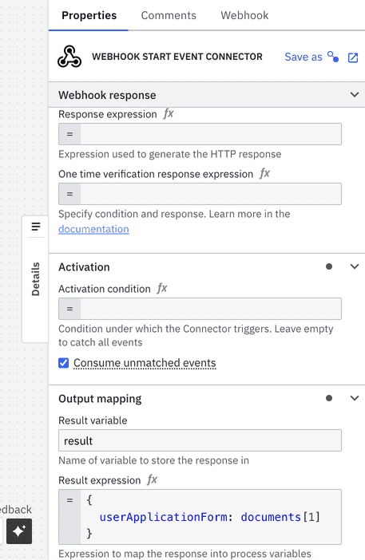
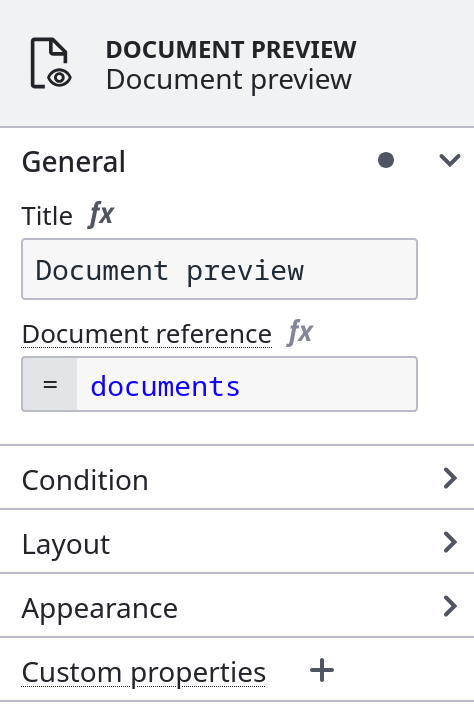
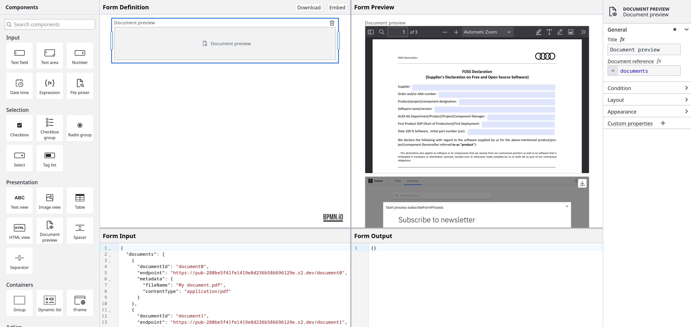

import Tabs from "@theme/Tabs";
import TabItem from "@theme/TabItem";

Offering more robust document handling capabilities within Camunda SaaS, users can efficiently manage large volumes of binary data such as PDFs and images across both development and production environments.

<Tabs groupId="storage" defaultValue="saas" queryString values={
[
{label: 'SaaS', value: 'saas' },
{label: 'Self-Managed', value: 'selfmanaged' },
]}>

<TabItem value='saas'>

A [**Google Cloud Platform**](https://cloud.google.com/storage) bucket storage integration is already configured for SaaS and handled by Camunda.

## Upload a document via inbound webhook Connector

[Access created documents](/components/connectors/protocol/http-webhook.md) in both the response expression and the result expression, where the `documents` object contains the references for created documents. Below, review an example of a webhook configuration:



The document reference received as an output of one Connector should be stored in process variables by using the result expression or result variable.

To call the webhook sending a file, for example:

```curl
curl --location 'https://lpp-1.connectors.dev.ultrawombat.com/e424e404-39d2-4dcf-9937-a1ebde177d7c/inbound/uploadDocument' \
--form 'file=@"/path-to-file/file.pdf"'
```

The result variable will have the following structure:

```
{
 "request": {
   "body": {},
   "headers": {
     "host": "lpp-1.connectors.camunda.io",
     "x-request-id": "335843238a709273200e2055f89147ad",
     "x-real-ip": "109.78.172.42",
     "x-forwarded-host": "lpp-1.connectors.camunda.io",
     "x-forwarded-port": "443",
     "x-forwarded-proto": "https",
     "x-forwarded-scheme": "https",
     "x-scheme": "https",
     "content-length": "70484",
     "user-agent": "PostmanRuntime/7.43.0",
     "accept": "*/*",
     "cache-control": "no-cache",
     "postman-token": "b9d78973-b33f-43a4-8d55-c5ac8b2de656",
     "accept-encoding": "gzip, deflate, br",
     "content-type": "multipart/form-data; boundary=--------------------------300742796701946745140414"
   },
   "params": {}
 },
 "connectorData": {},
 "documents": [
   {
     "storeId": "gcp",
     "documentId": "130ad52a-f90a-4e07-9cfa-0d9abb0b6a68",
     "contentHash": "e3b0c44298fc1c149afbf4c8996fb92427ae41e4649b934ca495991b7852b855",
     "metadata": {
       "contentType": "application/pdf",
       "size": 70266,
       "fileName": "file.pdf"
     },
     "camunda.document.type": "camunda"
   }
 ]
}
```

Here, we use the configuration of the image on the initial steps and assign the portion containing the documents to `userApplicationForms`. This can be later used by the process to retrieve documents. For example, we could use the variable `userApplicationForms` to display the uploaded document in a user task using the document preview component.

Another Connector can also use this variable as an input. The format of inputs will depend on the Connector, as each Connector has a different input structure. Review the list of [outbound Connectors](#outbound-connectors) below which currently support retrieving the document content to store in a third-party system.

## Upload a document via form

A [form](/components/modeler/forms/camunda-forms-reference.md) can display documents with the [document preview component](/components/modeler/forms/form-element-library/forms-element-library-document-preview.md):



With the [filepicker form element](/components/modeler/forms/form-element-library/forms-element-library-filepicker.md), you may also [upload multiple files at once](/components/modeler/forms/form-element-library/forms-element-library-filepicker.md#configurable-properties). This can be dynamically set using an [expression](/components/modeler/feel/language-guide/feel-expressions-introduction.md):



For additional guidance on supported file formats, refer to the [MDN Web Docs](https://developer.mozilla.org/en-US/docs/Web/HTML/Element/input/file#unique_file_type_specifiers).

With Tasklist, users may then view and download files displayed in the task's form.

:::note
This feature will not work for public processes started by forms.
:::


:::note
Document handling can also be used with intelligent document processing (IDP). For example, a published document extraction template can be used to extract data from a document uploaded via Tasklist. Learn more in the [IDP documentation](/components/modeler/web-modeler/idp/idp-example.md).
:::

### Start forms

Insert text.

### User task forms

Insert text.

## Reference a document in an outbound connector

The [Connector SDK](/components/connectors/custom-built-connectors/connector-sdk.md) is enhanced to provide document support in property/variable bindings.

In most cases for the following outbound Connectors, you can include a **Request body** under **Payload** in the properties panel to send with your request:


See [a complete list of supported outbound Connectors for document handling](/components/concepts/document-handling.md#supported-outbound-connectors).

## Display a document in a user task

Insert text.

</TabItem>

<TabItem value='selfmanaged'>

<!--- Link to SM config --->

<!--- Insert SM guide --->

</TabItem>

</Tabs>
