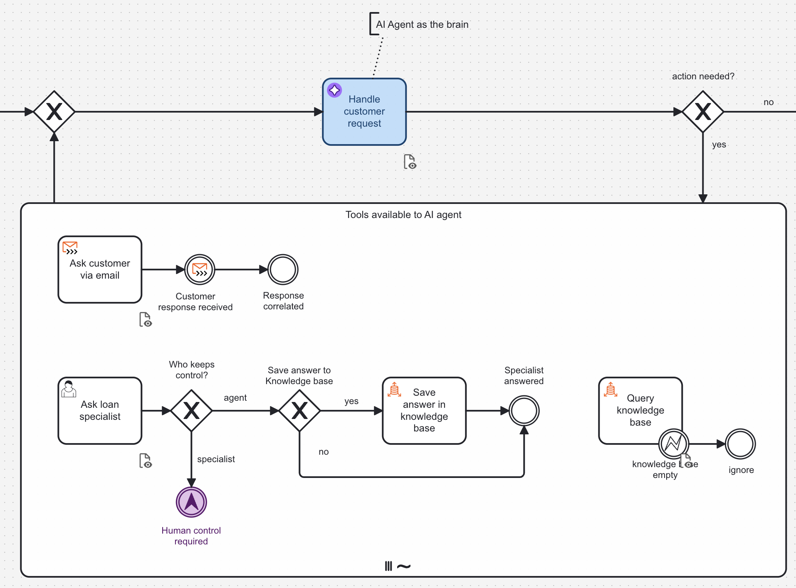

import Tabs from "@theme/Tabs";
import TabItem from "@theme/TabItem";

Beginner
1 hour

Get started with agentic orchestration by running your first AI agent.

## About this guide

This guide shows you how to get started with [agentic orchestration](/components/agentic-orchestration/agentic-orchestration.md) by building and running your first Camunda 8 AI agent.

This guide covers:

- Using Camunda 8

## What to expect

You will:

- Use Camunda 8 either
  - in a local development environment using **Camunda 8 Run** or
  - use the **SaaS** version where you can model and deploy your processes in the cloud.
- Use the **Camunda Modeler** to deploy and start a business process.
- Use the **AI Agent** connector, as the brain for the agent
- Use an ad-hoc subprocess, as the building block for the agent's behavior, providing a set of tools for the agent to run

## Prerequisites

- To run an agent with Camunda 8, you need a running environment.
  - Have a Camunda 8 environment up and running, described in [Run your first local project](../getting-started-example)
  - Or [sign up for a free SaaS Trial Account](https://accounts.cloud.camunda.io/signup)
- AWS IAM user with permissions: `bedrock:InvokeModel` (Claude 3 Sonnet/Haiku) and `aoss:*` for your OpenSearch index
- Email account (SMTP/IMAP) & credentials (App Password for Gmail, or provider-specific credentials)
- Outbound internet access for connectors to reach email server, Bedrock, and OpenSearch endpoints

## Concept

### Deterministic and dynamic workflows

Traditionally, business processes are modeled as a deterministic sequence of steps, where the flow logic is predefined and follows a strict order. This approach works well for situations where the flow logic can be defined it advance but struggles to adapt to more complex, open-ended scenarios.

Agentic orchestration introduces the concept of dynamic workflows, where the process can adapt and change at runtime, based on real-time information and AI-driven insights. An agent is given a goal to complete and, in a loop selects from a set of available tools (possible actions) until the goal is achieved.

In Camunda, Agentic Orchestration brings both patterns together in a single process model which can have both deterministic flow logic and dynamic, AI-driven tool execution. This combination is extremely powerful and allows you to apply deterministic control where needed and provide flexibility where it makes sense.

The deterministic flow logic acts as a guardrail on dynamic execution defining boundaries and constraints within which the AI agent operates, ensuring it stays aligned with business goals and compliance requirements so that you can build powerful agents that you can trust.

### AI Agent and the ad-hoc subprocess

The Ad-hoc subprocesses is a key building block for agentic orchestration. It allows the AI agent to dynamically run tools (available actions), based on the current context and requirements. It can perform tasks in parallel, handle exceptions, and make decisions on the fly.

In the following example you can see an AI agent

## Build your agent

### Start from an example (blueprint)

The fastest way to get started is to use our blueprint process model. This model includes all the necessary elements to run a simple AI agent.
Visit [its marketplace page](https://marketplace.camunda.com/en-US/apps/522492/ai-email-support-agent) and choose the option you prefer. We recommend using the SaaS version as it needs the least amount of setup.

**SaaS**

- If you have a SaaS account, choose [For SAAS](<https://modeler.cloud.camunda.io/import/processes?source=https://raw.githubusercontent.com/bastiankoerber/Camunda_Agent_Blueprint/refs/heads/main/Agent%20Blueprint%20(Long%20Term%20Memory).bpmn,https://raw.githubusercontent.com/bastiankoerber/Camunda_Agent_Blueprint/refs/heads/main/Escalate%20to%20human%20form.form,https://raw.githubusercontent.com/bastiankoerber/Camunda_Agent_Blueprint/refs/heads/main/Review%20case%20resolution.form>)
- If you haven't signed up or is not logged in, first you need to take care of that
- After that you need to select which project you want the blueprint to be saved in, or create a new project
- The modeler will open with the blueprint and you immediately have a working AI agent modeled

**Self managed**

- If you don't have a SaaS account, choose [For SM](https://github.com/bastiankoerber/Camunda_Agent_Blueprint/tree/main)
- Download the blueprint files from the repository
- Import the .bpmn and .form files into your Camunda Modeler

## Set up necessary configurations

Create the following secrets in your Camunda cluster or set them up locally with the `connector-secrets.txt` file and restart `c8run`. Use the set secrets with the `{{secrets.SECRET_NAME}}` syntax.

- `CAMUNDA_SAMPLE_AGENT_EMAIL_PASSWORD`: Email account password (App Password or SMTP token)
- `CAMUNDA_SAMPLE_AGENT_EMAIL_USERNAME`: Email account username (e.g. your-address@example.com)
- `CAMUNDAAGENT_AWS_ACCESS_KEY`: AWS Access Key ID
- `CAMUNDAAGENT_AWS_SECRET_KEY`: AWS Secret Access Key

Configure the connectors:

1. **Email connectors (Inbound & Send):**
   - Username: your email address
   - IMAP/SMTP host & port: according to your provider (Gmail, Outlook, etc.)
2. **Vector Database connectors (Retrieve & Write):**
   - Region: your AWS region (e.g. `eu-central-1`)
   - Endpoint: `https://<your-opensearch-domain>`
3. **Agent connector:**
   - Model ID: default is `anthropic.claude-3.7-sonnet-20240229-v1:0` (change as needed)

## Run your agent

Deploy your process and send an email to the email address you set. Open **Operate** to see the process running. You have deployed your first AI agent.

## Next steps

Read more on the [documentation page for Agentic Orchestration](../../components/agentic-orchestration/) can do for you and get to know about its advanced features.
