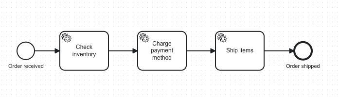
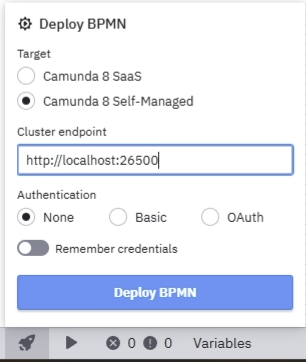
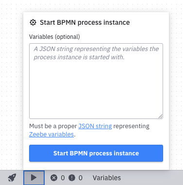
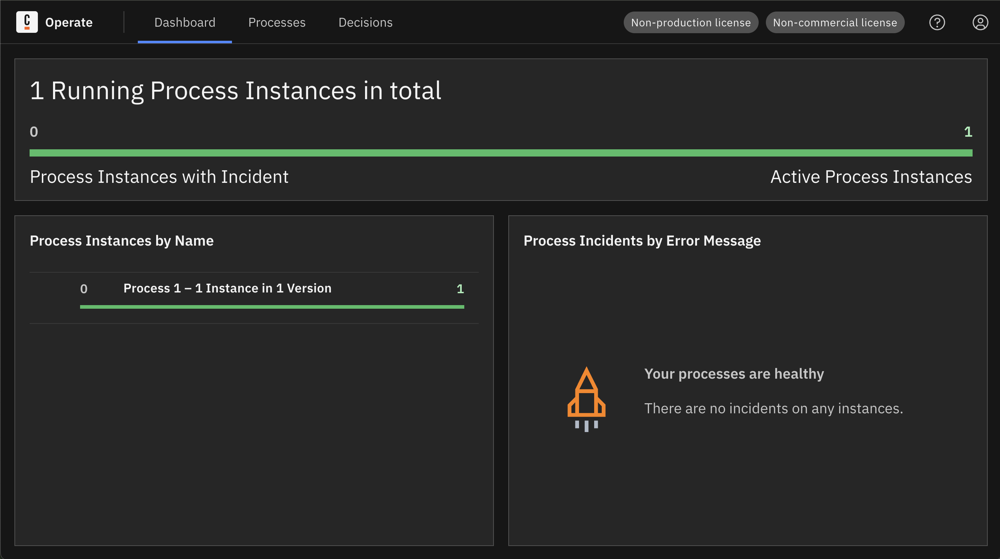
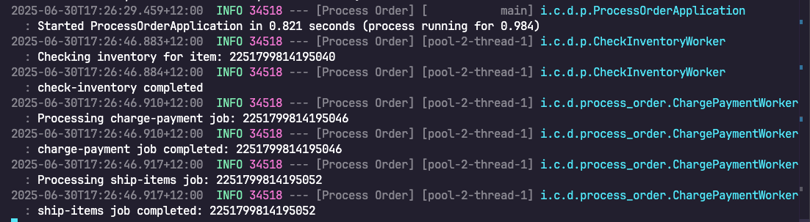
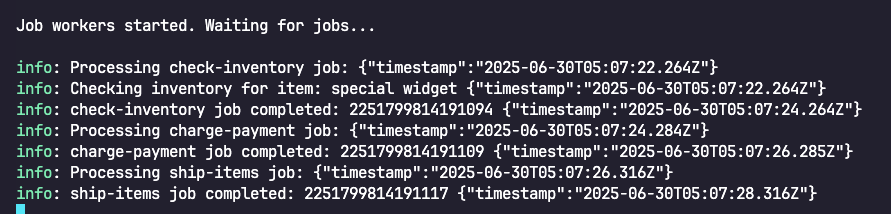

import Tabs from "@theme/Tabs";
import TabItem from "@theme/TabItem";

## Getting started with an example project

Follow this guide to download and run an example project with a local instance of Camunda 8.

You will:

- Run Camunda 8 in a local development environment using **Camunda 8 Run**.
- Use the **Camunda Modeler** to deploy and start a business process.
- Run workers written in either:
  - The **Spring (Java) SDK**, or
  - The **Node.js (JavaScript) SDK**  
    to handle tasks in the process.

## Prerequisites

<Tabs groupId="language" defaultValue="javaspring" values={
[
{ label: 'Java + Spring', value: 'javaspring', },
{ label: 'Node.js', value: 'nodejs', },
] }>
<TabItem value="javaspring">

<ul>
    <li>[OpenJDK 21-23](https://openjdk.org/install/)</li>
    <li>[Maven 3](https://maven.apache.org/index.html)</li>
    </ul>
  </TabItem>
  <TabItem value="nodejs">
<ul>
    <li>[OpenJDK 21-23](https://openjdk.org/install/)</li>
    <li>[Node.js](https://nodejs.org/en)</li>
</ul>
  </TabItem>
  </Tabs>

## Download the Camunda 8 developer bundle

Download the Camunda 8 developer bundle from the following website:  
[https://developers.camunda.com/install-camunda-8/](https://developers.camunda.com/install-camunda-8/)

The developer bundle includes the following components:

- [Camunda 8 Run](/self-managed/quickstart/developer-quickstart/c8run.md) – A simplified, single-application Camunda configuration for a local development environment.
- [Camunda Modeler](/components/modeler/about-modeler.md) – An application for modeling BPMN, DMN, and Forms.
- [Getting started project](https://github.com/camunda/camunda-8-get-started) – An example project with a simple BPMN process and workers in Java or JavaScript.

All of these components are included in the developer bundle. You do not need to download them separately. The links above are provided for additional information.

## Example project

The example project, located in the `camunda-8-get-started` directory, contains a BPMN process model that represents a simple e-commerce flow with three service tasks.



The service tasks in the process are executed by job workers. The `java` and `nodejs` directories contain code for job workers that correspond to this process model.

## Instructions

<ol>
  <li>
    Unzip the developer bundle.
  </li>

  <li>
    Start Camunda 8 Run by changing into the directory and running the command:
    <Tabs groupId="os" defaultValue="maclinux" values={
[
{ label: 'Mac OS + Linux', value: 'maclinux', },
{ label: 'Windows', value: 'windows', },
] }>
<TabItem value="maclinux">
    ```bash
./1-camunda-starter.sh
```
</TabItem>
<TabItem value="windows">
```bash
.\1-camunda-starter.bat
```
</TabItem>
</Tabs>
  </li>

  <li>
    Open Camunda Modeler.
  </li>

  <li>
    In Camunda Modeler, use:
    <pre><code>File &gt; Open File...</code></pre>
    to open the file:
    <pre><code>camunda-8-get-started/bpmn/diagram_1.bpmn</code></pre>
  </li>

  <li>
    Click the "Rocket" icon to connect to your Camunda 8 Run instance and deploy the model.
    Select `Camunda 8 Self-Managed` and use `http://localhost:26500` as the cluster endpoint.

    

  </li>

  <li>
    Click the “Play” icon on the bottom toolbar of Modeler to deploy and start an instance of the process model.

    <p>You do not need to set any variables for the process.</p>

    <p>Optionally, you can set a value for the <code>item</code> variable by pasting in:</p>
    <pre><code>{`{"item": "special widget"}`}</code></pre>

    

  </li>
</ol>

## View the process instance and start job workers

A process instance is now running in the engine.

You can view the process instance in **Operate**, the visual operations tool, by navigating to:  
[http://localhost:8080/operate](http://localhost:8080/operate)  
Login with the credentials: `demo` / `demo`.

There you will see an active process instance.

:::note
Data needs to sync to Operate, so the process instance may not be visible immediately.

Additionally, when the workers are running, process instances will be completed immediately and further process instances will not appear as active.
:::



Next, start the job workers to allow them to perform the work for the service tasks. The workers are configured to connect to the locally-running engine and retrieve available work for the process instance.

<Tabs groupId="language" defaultValue="javaspring" values={
[
{ label: 'Java + Spring', value: 'javaspring', },
{ label: 'Node.js', value: 'nodejs', },
] }>
<TabItem value="javaspring">

<ol>
<li>
Change into the Spring SDK directory:

```bash
cd camunda-8-get-started
cd java
```

      </li>
      <li>
        Start the workers with the command:

```bash
mvn spring-boot:run
```

      </li>
      <li>
        You can stop the application via Ctrl+C.
      </li>
    </ol>

  </TabItem>

  <TabItem value="nodejs">
    <ol>
      <li>
        Change into the Node.js SDK directory:
```bash
cd camunda-8-get-started
cd nodejs
```
      </li>
      <li>
        Install dependencies with the command:
```bash
npm i
```
      </li>
      <li>
        Start the workers with the command:
```bash
npm start
```
      </li>
      <li>
        You can stop the application via Ctrl+C.
      </li>
    </ol>
  </TabItem>
   </Tabs>

The workers start, connect to the engine, and request work. You will see the workers processing the jobs for the process instance.

<Tabs groupId="language" defaultValue="javaspring" values={
[
{ label: 'Java + Spring', value: 'javaspring', },
{ label: 'Node.js', value: 'nodejs', },
] }>
<TabItem value="javaspring">

    

   </TabItem>
   <TabItem value="nodejs">

    

   </TabItem>
</Tabs>

## Complete!

Your active process instance in Operate will now transition to completed. You have completed your first process instance by:

1. Running Camunda 8 Run locally.
2. Deploying a process model.
3. Starting a process instance.
4. Completing the service tasks in the process instance using job workers.

## Next steps

To create a new Spring project, refer to [our guide using Spring](/guides/getting-started-java-spring.md).

For further information about the Node.js SDK, refer to [the Camunda 8 JavaScript SDK API documentation](https://camunda.github.io/camunda-8-js-sdk/).

## Teardown

You can stop Camunda 8 Run by executing:

    <Tabs groupId="os" defaultValue="maclinux" values={

[
{ label: 'Mac OS + Linux', value: 'maclinux', },
{ label: 'Windows', value: 'windows', },
] }>
<TabItem value="maclinux">

```bash
cd c8run && ./c8run stop

```

</TabItem>
<TabItem value="windows">
```bash
cd c8run && .\c8run.exe stop
````

</TabItem>
</Tabs>
