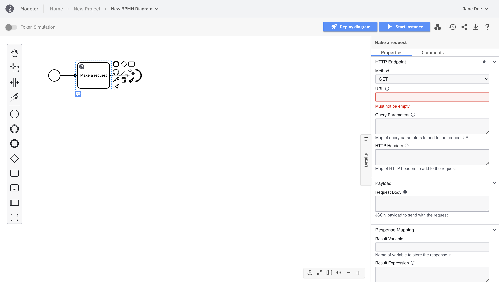

Beginner
Time estimate: 15 minutes

This guide will walk you through working with a REST Connector task as a first time Camunda 8 user. The REST Connector is a [protocol Connector](/docs/components/connectors/out-of-the-box-connectors/available-connectors-overview.md#protocol-connectors), where you can make a request to a REST API and use the response in the next steps of your process.

:::note
New to Connectors? Review our [introduction to Connectors](/docs/components/connectors/introduction.md) to get familiar with their capabilities, and have a closer look at all of the available [out-of-the-box Connectors](/docs/components/connectors/out-of-the-box-connectors/available-connectors-overview.md).
:::

The concept of a Connector consists of two parts: the business logic is implemented as a job worker, and the user interface during modeling is provided using an element template. In this guide, you will create a REST Connector task in your process, handle the HTTP response, and deploy your process. New to creating a process? Get started by [modeling your first diagram](/docs/guides/model-your-first-process.md).

## Create a REST Connector task

To use a **REST Connector** in your process, follow the steps below:

1. Create a BPMN diagram. To do this, navigate to Web Modeler by clicking the square-shaped icon in the top left corner of the page. Click **New project**.
2. Name your project and select **Create new file > BPMN Diagram**.
3. Give your model a descriptive name and id. On the right side of the page, expand the **General** section of the properties panel to find the name and id fields. For this guide, we'll use `API Orchestration Tutorial` for the name and `api-orchestration-tutorial` for the id.
4. Use Web Modeler to design a BPMN flow with a Connector. Create a Connector by dragging the rectangular task element from the palette, or click the existing start event and the displayed task element to the right of the start event.
5. Change the task type by clicking the wrench icon and select **REST Outbound Connector** in the **Connectors** section. Alternatively, you can directly choose a **REST Outbound Connector** by using the context pad.

   

6. Add a descriptive name using the **General** section in the properties panel. For this guide, we'll use `Make a request`.

## Make your REST Connector executable

To make the **REST Connector** executable, fill out the mandatory **URL** field in the HTTP Endpoint section (highlighted in red) in the properties panel with `https://catfact.ninja/fact` so we can get a random cat fact from the [Cat Fact API](https://catfact.ninja/) for this example.

## Handle your response

The HTTP response will be available in a temporary local response variable. This variable can be mapped to the process by specifying **Result Variable**.
In the **Response Mapping** section use `={"body" : body}` as the **Result Expression** so you can see the entire JSON object returned if it's successful.

## Deploy your process

To deploy your process, take the following steps:

1. Drag the bolded circular end event element from the palette and onto the canvas, or by clicking on the final service task, and then the end event element alongside it. Ensure there is an arrow connecting the service task to the end event.
2. In the top right corner click the blue **Deploy** button. Your diagram is now deployed to your cluster.
   :::note
   If you have not yet created a cluster, clicking **Deploy** will take you to the console to create a cluster. Once you make your cluster creation request, you will automatically be redirected back to Modeler. The creation of a cluster can take 1 to 5 minutes. To read more about creating clusters, visit our documentation on [creating a cluster](create-cluster.md).
   :::
3. Start a new process instance by clicking on the blue **Run** button.
4. In the top left corner of the screen, click the square-shaped **Camunda apps** button. Navigate to Operate to see your process instance with a token waiting at the service task by clicking **View process instances**.

## Wrap up

Congratulations! You successfully built your first microservice orchestration solution with Camunda 8.

Camunda 8 empowers users to automate processes faster. Connectors are reusable components that allow you to access APIs without writing code.

Don't want to build the process yourself? Click this button to create it from a template in Camunda 8 SaaS, or sign up first.

   <a
      className={clsx(
         "button button--outline button--secondary button--lg"
      )}
      href="https://modeler.cloud.camunda.io/tutorial/quick-start-api-orchestration?utm_source=docs.camunda.io.gettingstarted">
      Open model in Camunda 8
   </a>
   <a
      className={clsx(
         "button button--outline button--secondary button--lg"
      )}
      href="https://signup.camunda.com/accounts?utm_source=docs.camunda.io&utm_medium=referral">
      Sign up
   </a>

## Additional resources and next steps

- Learn more about Camunda 8 and what it can do by reading [What is Camunda 8](/components/concepts/what-is-camunda-8.md) or watching our [Overview video](https://bit.ly/3TjNEm7) in Camunda Academy.
- [Learn about types of Connectors](/docs/components/connectors/connector-types.md)
- [Use Connectors in your BPMN process](/docs/components/connectors/use-connectors/index.md)
