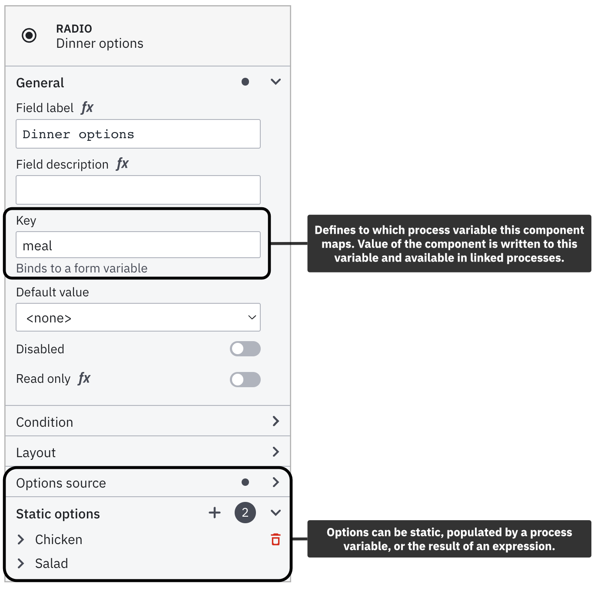

Using [Camunda Platform 8](https://camunda.io), you can orchestrate human tasks by assigning them to users. Then, users can enter the necessary data to drive the business process.

<<<<<<< HEAD
When a process instance arrives at such a user task, a new job is created. The process instance stops at this point and waits until the job is completed. Applications like [Tasklist](../components/tasklist/introduction.md) can be used by humans to complete these tasks.
=======
When a process instance arrives at such a user task, a new job similar to a service task is created. The process instance stops at this point and waits until the job is completed. Applications like [Tasklist](../components/tasklist/introduction-to-tasklist.md) can be used by humans to complete these tasks.

> > > > > > > main

While it may originally seem like the goal of automating a process is to remove humans entirely, efficiently allocating work through user tasks can be even more beneficial.

In this guide, we’ll step through one way to create an automated process utilizing user tasks – all entirely executable in the browser.

:::note
If you are new to BPMN or or feel a bit rusty, find our [cheat sheet](https://page.camunda.com/wp-bpmn-2-0-business-process-model-and-notation-en?_ga=2.261291401.507343211.1658730870-74482448.1649404132&_gl=1*1x5ykzg*_ga*NzQ0ODI0NDguMTY0OTQwNDEzMg..*_ga_4EYN8X5FNR*MTY1ODc1MjkzOS4yMTAuMS4xNjU4NzUyOTQ5LjA.) to have a quick overview of all the symbols.
:::

## Create an automated process with user tasks

To create an automated process with user tasks, take the following steps:

### Develop your automated process with user tasks

1. To create a BPMN diagram, navigate to Web Modeler via the **Modeler** tab, and click **New project**.
2. Name your project and select **New > BPMN Diagram > + Create blank**.
3. Give your model a descriptive name, and then give your model a descriptive id within the **General** tab inside the properties panel on the right side of the screen. In this case, we've named our model `Preparing dinner` with an id of `preparing-dinner`.
   
4. Use Web Modeler to design a BPMN flow with user tasks. Create a user task by dragging the task icon from the palette, or click the existing start event and the displayed task icon.
5. Change the task type by clicking the wrench icon. Select [**User Task**](https://docs.camunda.io/docs/components/modeler/bpmn/user-tasks/).
   
6. Add a descriptive name using the properties panel. In this case, we've named ours `Decide what's for dinner`.
7. Assign this task to a user or group using the properties panel.
   - User tasks support specifying assignments, using the `zeebe:AssignmentDefinition` extension element. This can be used to define which user the task can be assigned to. One or both of the following attributes can be specified simultaneously:
   - `assignee`: Specifies the user assigned to the task. Tasklist will claim the task for this user.
   - `candidateGroups`: Specifies the groups of users that the task can be assigned to.
     
8. Append a gateway to your user task by dragging it onto the dashboard from the palette on the left side of the screen, or by clicking on the user task `Decide what's for dinner` and clicking on the element you'd like to create next. In this case, we've selected the diamond icon to create a gateway.
9. Create two sequence flows (represented by the arrows) from the gateway and two new user tasks based on what the user decides to eat. In this case, we've named ours `Prepare chicken` and `Prepare salad`.
   :::note
   The sequence flows require [expressions](../components/concepts/expressions.md) to access variables from the form we'll create below to determine what to eat for dinner. To add an expression, click on the sequence flow to view the properties panel, and open the **Condition** tab to insert a conditional expression.
   :::
10. Attach an end event to the two user tasks.

:::note
Variables are part of a process instance and represent the data of the instance. To learn more about these values, variable scope, and input/output mappings, visit our documentation on [variables](../components/concepts/variables.md).
:::

### Implement a form

1. To add a form and decide what's for dinner, return to the **Modeler** homepage and click **New > Form**.
2. Name your form. In this case, we've named ours **Decide what's for dinner**.
3. Click and drag the **Select** element onto the palette. Give this **Select** field a description within the properties panel. We've described ours as **What's for dinner?**
   <<<<<<< HEAD
4. Scroll down to the **Values** section of the properties panel to add your values. For our dinner add an extra value by clicking on the plus sign. Enter the value **Chicken** with the label as **Chicken** and enter the value **Salad** with the label as **Salad** in the other value.

:::note
You'll need to insert the defined variable values into the appropriate sequence flows in the BPMN model to execute your process. For example, our sequence flow will now have the expressions of `= meal = "salad"`.
:::

======= 4. Scroll down to the **Values** section of the properties panel to add your values. For our dinner, we've created two values: one labeled **Chicken** and one labeled **Salad**.
:::note
As mentioned earlier, you'll need to insert the defined variable values into the appropriate sequence flows to execute your process. For example, our sequence flow will now have the expressions of `= meal = "salad"`.
:::

> > > > > > > main 5. You can add the form to your BPMN diagram in a few ways:

1.  Within your BPMN diagram, click the appropriate user task, and click the blue square icon in the bottom right corner of your user task. Select the form you'd like to apply to your user task, and click **Import**.
    
2.  Within your form, click the rectangular **Copy JSON** icon to copy the form JSON to your clipboard. Navigate to your BPMN diagram, and click the appropriate user task. Within the properties panel of the user task, navigate to the **Form** section, select a **Type** of **Camunda forms** and paste your JSON into the **Form JSON configuration** field.

## Create a cluster

import CreateCluster from './assets/react-components/create-cluster.md'

<CreateCluster/>

### Start and view your process instance

1. To deploy your diagram to your cluster, click **Deploy diagram > Deploy**.
2. To officially start a new process instance, click **Start instance**.
   <<<<<<< HEAD
3. # Navigate to [Operate](../components/operate/index.md) by clicking the honeycomb icon next to the **Start instance** button. 
4. Navigate to [Operate](../components/operate/operate-introduction.md) by clicking the honeycomb icon next to the **Start instance** button.
   > > > > > > > main
5. Click **View process instances** to see your process instance alongside the green token waiting at the user task.

### Complete a user task

Within this example, we've included a form to demonstrate the completion of a human task. To learn more about creating forms within your diagrams, visit our guide on [building forms with Modeler](../components/modeler/bpmn/user-tasks/user-tasks.md#user-task-forms).

1. Go back to your Camunda Platform 8 diagram and select the honeycomb icon and then **View user tasks** to take a look at your user tasks inside Tasklist.
2. Select the open user task on the left panel of **Tasks**. In our example below, this is **Decide what's for dinner**.
3. Next to **Assignee**, click **Claim** to claim the task.
   - To automatically assign this task, edit the **Assignee** field in the user task in your BPMN diagram. To learn more about automatically assigning tasks, visit our documentation on [user tasks](https://docs.camunda.io/docs/components/modeler/bpmn/user-tasks/#assignments).
4. Once finished entering the appropriate information, click **Complete Task**.
   
5. On the left panel of **Tasks**, filter by **Completed** tasks to see your task has been finished.

You can now navigate back to Operate and notice the process instance has continued, and the token has moved forward.

The token moves through the exclusive gateway (also called the XOR gateway), and is used to model the decision in the process. When the execution arrives at this gateway, all outgoing sequence flows are evaluated in the order in which they have been defined. The sequence flow which condition evaluates to ‘true’ (or which doesn’t have a condition set, conceptually having a ‘true’ value defined on the sequence flow) is selected for continuing the process.

:::note
Here, after implementing your gateway, is when [expressions](../components/concepts/expressions.md) will become useful in accessing [variables](../components/concepts/variables.md) and calculating their value to move forward in a process.
:::

In this case, the token will move through the gateway and (according to the conditional expressions we outlined earlier) to the selected dinner based on the **Decide what's for dinner** user task we completed. If we select **Chicken**, the token moves forward to **Prepare chicken**. If we select **Salad**, the token moves forward to **Prepare salad**.

## Additional resources and next steps

- [BPMN user tasks](../components/modeler/bpmn/user-tasks/user-tasks.md)
- [Building Forms with Modeler](./utilizing-forms.md)
- [Introduction to Operate](../components/operate/operate-introduction.md)
- [Introduction to Tasklist](../components/tasklist/introduction-to-tasklist.md)
- [Intermediate Modeler example](https://github.com/NPDeehan/Whos50GameCamundaCloud)
