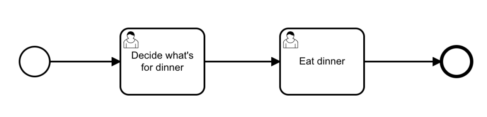
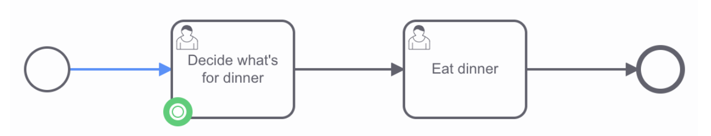

## Getting started with user task orchestration

### Purpose

Using [Camunda Cloud](./getting-started/create-camunda-cloud-account.md), you can orchestrate human tasks by assigning them to users. Then, users can enter the necessary data to drive the business process.

When a process instance arrives at such a user task, a new job similar to a service task is created. The process instance stops at this point and waits until the job is completed. Applications like [Tasklist](../components/tasklist/introduction.md) can be used by humans to complete these tasks.

While it may originally seem like the goal of automating a process is to remove humans entirely, efficiently allocating work through user tasks can be even more beneficial.

In this guide, we’ll step through one way to create an automated process utilizing user tasks – all entirely executable in the browser.

### Prerequisites

- Ensure you have a valid [Camunda Cloud account](./getting-started/create-camunda-cloud-account.md), or sign up if you still need one.
- (Optional) Install [Camunda Desktop Modeler](../components/modeler/desktop-modeler/install-the-modeler.md).

### Create an automated process with user tasks

To create an automated process with user tasks, take the following steps:

#### Develop your automated process with user tasks

1. Log in to your Camunda Cloud account.
2. To create a BPMN diagram, navigate to Web Modeler via the **Modeler** tab, and click **New project**.
3. Name your project and select **New > BPMN Diagram > + Create blank**.
4. Give your model a descriptive name, and then give your model a descriptive id within the **General** tab inside the properties panel on the right side of the screen.
5. Use Web Modeler to design a BPMN flow with user tasks. Create a user task by dragging the task icon from the palette, or click the existing start event and the displayed task icon.
6. Change the task type by clicking the wrench icon. Select **User Task**.
7. Add a descriptive name using the properties panel.
8. Assign this task to a user or group using the properties panel.
   - User tasks support specifying assignments, using the `zeebe:AssignmentDefinition` extension element. This can be used to define which user the task can be assigned to. One or both of the following attributes can be specified simultaneously:
   - `assignee`: Specifies the user assigned to the task. Tasklist will claim the task for this user.
   - `candidateGroups`: Specifies the groups of users that the task can be assigned to.

In our example process, we’ll take a look at two user tasks: choosing what to eat for dinner, and eating dinner.

#### Start and view your process instance

1. To deploy your diagram to your cluster, click **Deploy diagram > Deploy**.
2. To officially start a new process instance, click **Start instance**.
3. Navigate to [Operate](../components/operate/index.md) by clicking the honeycomb icon next to the **Start instance** button.
4. Click **View process instances** to see your process instance alongside the green token waiting at the task.

#### Complete a user task

1. Go back to your Camunda Cloud diagram and select the honeycomb icon and then **View user tasks** to take a look at your user tasks inside Tasklist.
2. Select the open user task on the left panel of **Tasks**. In our example below, this is **Decide what's for dinner**.
3. Next to **Assignee**, click **Claim** to claim the task.
4. Once finished entering the appropriate information, click **Complete Task**.

5. On the left panel of **Tasks**, filter by **Completed** tasks to see your task has been finished.

You can now navigate back to Operate and notice the process instance has continued, and the token has moved forward.

### Additional resources and next steps

- [BPMN user tasks](../components/modeler/bpmn/user-tasks/user-tasks.md)
- [Building Forms with Modeler](./utilizing-forms.md)
- [Introduction to Operate](../components/operate/index.md)
- [Introduction to Tasklist](../components/tasklist/introduction.md)
- [Intermediate Modeler example](https://github.com/NPDeehan/Whos50GameCamundaCloud)
