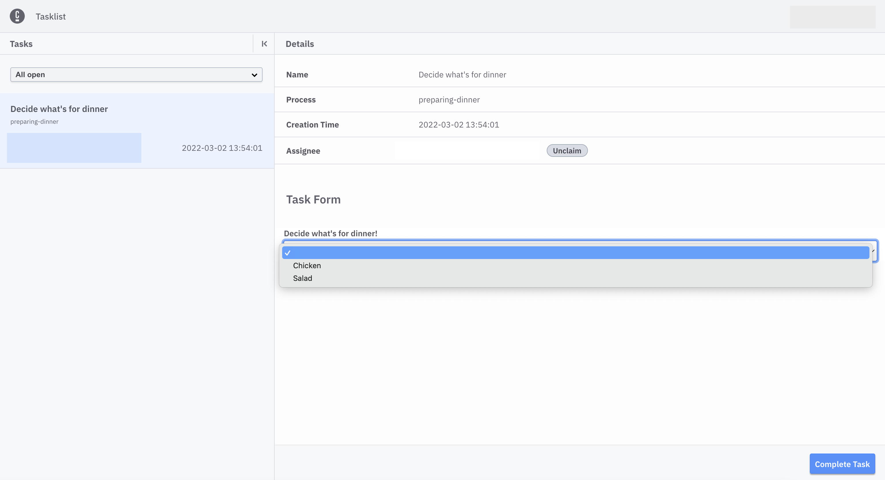
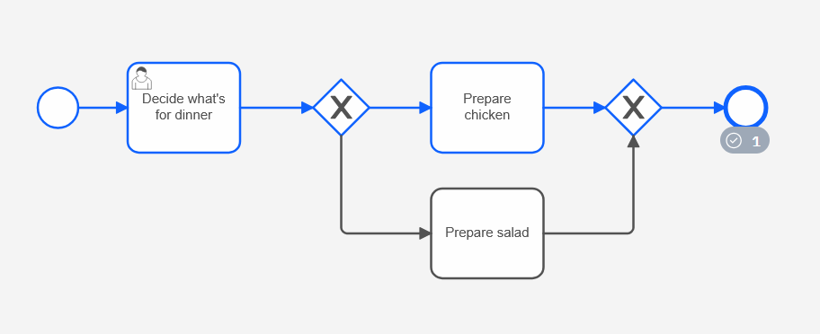

Beginner
Time estimate: 15 minutes

import ExpressionInputImg from './img/expression-input-example.png';
import FormValuesTop from './img/form-values-top.png';
import FormValuesBottom from './img/form-values-bottom.png';
import FormId from './img/form-id.png';
import ModelerGlobalNavImg from './img/modeler-global-nav.png';
import ModelerFormMenuImg from './img/modeler-form-menu.png';
import RunProcessImg from './img/run-process.png';
import OperateHumanTasks from './img/operate-human-tasks.png';
import FormEditorImg from './img/form-editor.png';

import clsx from "clsx";
import Tabs from '@theme/Tabs';
import TabItem from '@theme/TabItem';
import SaasPrereqs from './react-components/\_saas-prerequisites.md'
import Install from './react-components/\_install-c8run.md'

This guide is designed for users who prefer a low-code approach to process automation. You can follow this tutorial using either a local, Self-Managed lightweight setup, or Camunda 8 SaaS.

Camunda 8 allows you to orchestrate processes with human tasks of any complexity. Utilizing [user tasks](/reference/glossary.md#user-task), you can create and assign tasks to users. Then, users can perform their work and enter the necessary data to drive the business process.

:::note
If you prefer a video-based learning experience or a more complex example, visit [this Camunda Academy course](https://bit.ly/3PJJocB).
:::

This guide introduces you to the basics of human task orchestration. You will create a simple process to decide on dinner, and drive the process flow according to that decision.

<Tabs groupId="install" defaultValue="saas" queryString values={
[
{label: 'Self-Managed', value: 'sm' },
{label: 'SaaS', value: 'saas' },
]}>
<TabItem value="sm">

Have you installed Camunda yet?

<Install/>

</TabItem>
<TabItem value="saas">

Have you signed up for Camunda yet?

<SaasPrereqs/>

</TabItem>
</Tabs>

Take the following five steps to create and run your first process with a human in the loop:

## Step 1: Create a new process

In this step, you will design a process that demonstrates how to route the process flow based on a user decision. In this example, you will create a process to decide what is for dinner.

### Create a new file

<Tabs groupId="install" className="tabs-hidden">
<TabItem value="saas">

1. In Camunda Hub, navigate to your workspace.
2. In the workspace, click **New project**, and name your project.
3. In your project, select **Create new > BPMN diagram**.
4. In the top navigation, next to **New BPMN diagram**, click the vertical ellipsis menu, and rename the file `Decide for Dinner`.
5. Make sure to name the process itself as well. Click the empty canvas, and specify the process name and technical ID in the properties panel on the right side of the screen. This specifies how the process will appear in other tools of Camunda 8.

</TabItem>
<TabItem value="sm">

Within Desktop Modeler:

1. Under **Create a new file**, select **BPMN diagram**.
2. Click the empty canvas, and specify the process name and technical ID in the properties panel on the right side of the screen. This specifies how the process will appear in other tools of Camunda 8.

</TabItem>
</Tabs>

### Design the process

<Tabs groupId="install" className="tabs-hidden">
<TabItem value="saas">

:::note
To run this guide, make sure to be in [**Implement** mode](../components/hub/workspace/modeler/collaboration/implement-your-process.md) to specify the technical details of the process.
:::

</TabItem>
<TabItem value="sm">

</TabItem>
</Tabs>

1. A **start event** is automatically added to the canvas. Click it to display configuration and append options.
2. Click the rectangular **Append Task** icon to append a task.
3. Enter a descriptive name for the task, such as `Decide what's for dinner`.
4. Change the task type by clicking on the element and selecting the **Change element** menu icon. Select **User Task**.
5. Select the user task and click on the diamond-shaped icon to append an exclusive gateway. The gateway allows you to route the process flow differently, depending on conditions.
6. Select the gateway and append a task by clicking the task icon. Repeat it to create a second process flow. Name the tasks based on what the user decides to eat: in this case, we've named ours `Prepare chicken` and `Prepare salad`.
7. To route the user to the right task, add [expressions](/components/concepts/expressions.md) to the **sequence flows**. Sequence flows are represented by arrows connecting the gateway to the tasks. To add an expression, click on a sequence flow to view the **properties panel**, and open the **Condition** section.
8. Verify the sequence flows have the following expressions: `meal = "Salad"` on one side, and `meal = "Chicken"` on the other. You will define the variable `meal` later when designing a form for the user task.
   

9. Connect the split process flows again. Append another exclusive gateway to one of the tasks. Select the other task and drag the arrow-shaped sequence flow tool to connect it to the gateway.
10. Select the gateway and add an **end event** to your process, denoted by the circle with the thick outline.
11. Save the process file.

:::note
New to BPMN or want to learn more? Visit our [BPMN cheat sheet](https://page.camunda.com/wp-bpmn-2-0-business-process-model-and-notation-en) for an overview of all BPMN symbols.
Variables are part of a process instance and represent the data of the instance. To learn more about these values, variable scope, and input/output mappings, visit our documentation on [variables](/components/concepts/variables.md).
:::

<!-- TODO note that processes can be of any complexity, and link to advanced guides -->

## Step 2: Design a form

You have now designed the process. To allow the user to make the decision, you will now design a [form](../components/modeler/forms/camunda-forms-reference.md). Forms can be added to user tasks and start events to capture user input, and the user input can be used to route the process flow, to make calls to APIs, or to orchestrate your services.

<Tabs groupId="install" className="tabs-hidden">
<TabItem value="saas">

1. Select the user task you created in **[Step 1](#step-1-create-a-new-process)**.
1. In the floating menu, click the link icon. A menu expands that allows you to create a new form.
   
1. Click **Create new form**. A form will be created and opened in the form editor. The form is automatically named.

:::note
Don't worry about saving your process diagram. Every change you make is automatically saved.
:::

1. In the left **Components** pane, under **Presentation**, click and drag the **Text view** component to the empty form.
   

1. On the right side of the modeling interface, in the properties panel, open the **General** section, and enter a **Text** value, such as `What's for dinner?`.
1. In the left **Components** pane, under **Selection**, click and drag the **Radio group** component to the form. In the properties panel, enter the following:
   - **Field label**: `Options`
   - **Key**: `meal`. The key maps to a process variable. The value of the component will be stored in this variable, and it can be read by the process that uses this form. You use `meal` here because you already used this key for the conditions you set up in the process.
     
1. Scroll down to the **Static options** section of the properties panel to add radio options. Since there are two options for the dinner, add an extra value by clicking on the plus sign. Enter the value `Chicken` with the same label as `Chicken` and enter the value `Salad` with the label as `Salad` in the other value. The `meal = "<OPTION>"` conditions you configured earlier are case-sensitive. Make sure the values you set here match those exactly.
   

</TabItem>
<TabItem value="sm">

1. Create a new form in Desktop Modeler by navigating to **File > New File > Form (Camunda 8)**.
1. In the left **Components** pane, under **Presentation**, click and drag the **Text view** component to the empty form.

   

1. On the right side of the modeling interface, in the properties panel, open the **General** section, and enter a **Text** value, such as `What's for dinner?`.
1. In the left **Components** pane, under **Selection**, click and drag the **Radio group** component to the form. In the properties panel, enter the following:
   - **Field label**: `Options`
   - **Key**: `meal`. The key maps to a process variable. The value of the component will be stored in this variable, and it can be read by the process that uses this form. You use `meal` here because you already used this key for the conditions you set up in the process.

   

1. Scroll down to the **Static options** section of the properties panel to add radio options. Since there are two options for the dinner, add an extra value by clicking on the plus sign. Enter the value `Chicken` with the same label as `Chicken` and enter the value `Salad` with the label as `Salad` in the other value. The `meal = "<OPTION>"` conditions you configured earlier are case-sensitive. Make sure the values you set here match those exactly.

   

1. Click the canvas to reveal the form's properties panel. Copy the form's ID for use in your process.

   

1. Save the form.

</TabItem>
</Tabs>

## Step 3: Link the form to your process

Once the form is designed, verify it's linked properly in your process.

<Tabs groupId="install" className="tabs-hidden">
<TabItem value="saas">

1. Navigate to the process you created in [Step 1](#step-1-create-a-new-process).
2. Select the user task. Click the blue **form link icon** to open the form menu.
3. Verify the task is linked to your new form.

</TabItem>
<TabItem value="sm">

1. Open the process you created in **[Step 1](#step-1-create-a-new-process)** by clicking on the process file's name in the top bar.
2. Select the user task, and open the **Form** section in the properties panel.

:::note
If the properties panel for your task doesn't open automatically, navigate to **Window > Toggle Properties Panel** to open it manually.
:::

3. In the form section, select **Camunda Form**, and enter the **Form ID** for the form you created in **[Step 2](#step-2-design-a-form)**.

</TabItem>
</Tabs>

## Step 4: Run your process

Your process is now ready to run. Given its human-centric nature, it is well suited to be run in Tasklist. In order to make it accessible from Tasklist, the process must be deployed first.

:::tip
Human-centric processes involving user tasks seamlessly unfold within Tasklist, offering a cost-effective orchestration solution for human work with forms. However, the versatility of these processes extends beyond Tasklist, encompassing various alternative methods and applications. For instance, users can be redirected to external applications to fulfill tasks, bespoke task applications can be developed for any domain, or interactions with the physical world can be captured through event signals from sensors and IoT devices.
:::

### Deploy and test run

<Tabs groupId="install" className="tabs-hidden">
<TabItem value="saas">

If you have not yet configured a cluster to deploy to, you'll see a notification. You must [configure at least one cluster](/components/hub/workspace/manage-projects/create-a-project.md#connect-clusters) before moving on.

1. At the top right of the modeling interface, click **Deploy & run** to deploy the process to your cluster.
2. Select a target cluster.
3. Under **Resources**, select **All resources**. Your project contains two files: the BPMN process diagram and the linked form. This option deploys both together. In other contexts, it might make sense to deploy **Only this resource** for individual files.
4. Click **Deploy & run**.

This deploys both project resources and starts a process instance.

:::tip
Other options to run a process are to start it via Tasklist, test it in the Test mode, or call it via the API or an inbound trigger. Read more about [run options](/components/hub/workspace/modeler/run-or-publish-your-process.md).
:::

</TabItem>
<TabItem value="sm">

:::note
Ensure your installation of [Camunda 8 Run](/self-managed/quickstart/developer-quickstart/c8run.md) is running prior to deploying your process.
:::

You need to deploy both the form and process before running a process instance.

Deploy your form:

1. Open your form.
2. Using the **c8run (local)** connection, click the rocket-shaped **Deploy** icon to begin deploying your process.
3. Click **Deploy Form**.

Deploy your process:

1. Open your BPMN process.
2. Using the **c8run (local)** connection, click the rocket-shaped **Deploy** icon to begin deploying your process.
3. Click **Deploy BPMN**.

With both resources deployed, you can run a process instance. Click the play icon, then click **Start BPMN process instance**.

</TabItem>
</Tabs>

### Check successful start in Operate

<Tabs groupId="install" className="tabs-hidden">
<TabItem value="saas">

1. At the top right of the screen, a notification message confirms the instance started. Click **View process instance**. If you miss the notification message, next to **Deploy & run**, open the chevron menu, and click **View process in Operate**:

   

2. In Operate, you will see a visualization of the running process instance. Notice that a green **token** is waiting at the user task. This means that a task is waiting to be worked on in Tasklist.
   

:::tip
In production, Operate is used to monitor both long-running and straight-through, high-throughput processes. In development environments, use Operate to confirm if the process flow works as expected. For faster in-place validation during development, use the [Test mode](/components/hub/workspace/modeler/validation/test-your-process.md).
:::

</TabItem>
<TabItem value="sm">

1. Open Operate at `http://localhost:8080/operate`, and select **Processes** from the left panel.
2. In the **Process** panel, use the **Name** drop-down to select your process.
3. A visualization of your running process instance now displays in Operate, and your user task is marked with a green **token** icon. This means that a task is waiting to be worked on in Tasklist.

   

</TabItem>
</Tabs>

## Step 5: Complete a user task

When the process instance arrives at the user task, a new user task instance is created at Zeebe. The process instance stops at this point and waits until the user task is completed. Applications like [Tasklist](/components/tasklist/introduction-to-tasklist.md) can be used by humans to complete these tasks. In this last step, you will open Tasklist to run the user task you created.

:::tip
While it may originally seem like the goal of automating a process is to remove humans entirely, efficiently allocating work through user tasks can be even more beneficial. Within this example, we've included a form to demonstrate the completion of a user task.

Using the Zeebe or Tasklist API, many other ways to complete a user task are possible, such as redirecting to another application to complete the task, or even listening to IoT devices to capture human interaction with the real world via job workers.
:::

<Tabs groupId="install" className="tabs-hidden">
<TabItem value="saas">

1. In the top navigation, on the far left side next to **Operate**, click the **Camunda components** menu icon.
1. Click **Tasklist**.

</TabItem>
<TabItem value="sm">

1. Open Tasklist at `http://localhost:8080/tasklist`.

</TabItem>
</Tabs>

In Tasklist:

1. On the left, you will notice a list of **tasks**. There should be one open task `Decide what's for dinner`. Click this task to open it in the detail view.
1. In the detail view, the form you created in **[Step 2](#step-2-design-a-form)** appears. It is read only since this task is currently unassigned. You have to claim the task to work on it. Click **Assign to me** to claim the task.
1. Select one of the radio options.
1. Click **Complete Task** to submit the form.

   

1. To verify your task completion, you can filter by **Completed** tasks in the left task list panel.

You can now navigate back to Operate and notice the process instance has continued as the token has moved forward to the selected option.

The token moves through the exclusive gateway (also called the XOR gateway), and is used to model the decision in the process. When the execution arrives at this gateway, all outgoing sequence flows are evaluated in the order in which they have been defined. The sequence flow which condition evaluates to ‘true’ is selected for continuing the process.

In this case, the token will move through the gateway and (according to the conditional expressions we outlined earlier) to the selected dinner based on the **Decide what's for dinner** user task we completed. If we select **Chicken**, the token moves forward to **Prepare chicken**. If we select **Salad**, the token moves forward to **Prepare salad**.

## Wrap up

At this point, you've successfully crafted a human-centered process that routes the process flow based on a decision made by a user.

A core value of Camunda 8 lies in the combination of automation and human interaction. The same pattern applies when an [AI agent](/reference/glossary.md#ai-agent) produces the result a person acts on: the user task, form, and gateway you built here work the same way, whichever kind of step supplied the data.

Continue with the [following resources](#additional-resources-and-next-steps) to learn about intelligent task assignments, flexible forms to capture data and decisions, operational insights to refine task efficiency, and pathways to publish your processes to users via Tasklist or even publicly.

Don't want to build the process yourself? Click this button to create it from a template in Camunda 8 SaaS, or sign up first.

   <a
      className={clsx(
         "button button--outline button--secondary button--lg"
      )}
      href="https://marketplace.camunda.com/en-US/apps/437142/human-task-orchestration-quick-start">
      Open model in Camunda 8
   </a>
   <a
      className={clsx(
         "button button--outline button--secondary button--lg"
      )}
      href="https://signup.camunda.com/accounts?utm_source=docs.camunda.io&utm_medium=referral">
      Sign up
   </a>

 

## Additional resources and next steps

- Learn how to use [BPMN user tasks](/components/modeler/bpmn/user-tasks/user-tasks.md) to route tasks to the right users.
- Learn how to [build more complex forms](/components/modeler/forms/utilizing-forms.md) using the form editor.
- Learn how to write powerful [expressions](/components/concepts/expressions.md) and utilize [variables](/components/concepts/variables.md) to route complex process flows.
- Get an [introduction to Operate](/components/operate/operate-introduction.md).
- Learn how to [set up Tasklist](/components/tasklist/introduction-to-tasklist.md) for efficient task management.
- Explore start forms and attach the form directly to the start event for authenticated starts in Tasklist.
