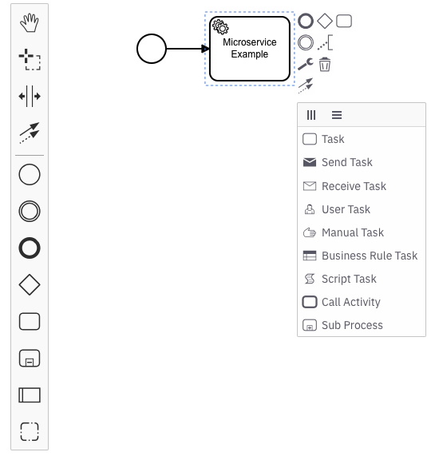
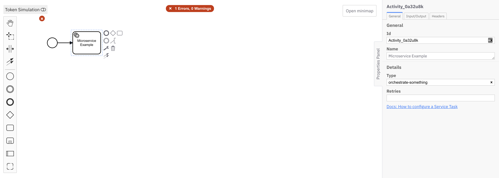

Beginner
Time estimate: 25 minutes

import CreateCluster from './assets/react-components/create-cluster.md';

Using Camunda 8, you can orchestrate the microservices necessary to achieve your end-to-end automated business process. Whether you have existing microservices or are looking to build out your microservices, this guide will help you understand how you can start your microservice orchestration journey with Camunda 8.

While this guide uses code snippets in Java, you do not need to be a Java developer to be successful. Additionally, you can orchestrate microservices with Camunda 8 in other programming languages.

## Prerequisites

- Ensure you have a valid [Camunda 8 account](create-account.md), or sign up if you still need one.
- Java >= 8
- Maven
- IDE (IntelliJ, VSCode, or similar)
- Download and unzip or clone the [repo](https://github.com/camunda/camunda-platform-tutorials), then `cd` into `camunda-platform-tutorials/orchestrate-microservices/worker-java`

### Design your process with BPMN

Start by designing your automated process using BPMN. This guide introduces you to the palette and a few BPMN symbols in Web Modeler.

1. To create a BPMN diagram, navigate to Web Modeler via the **Modeler** tab, and click **New project**.
2. Name your project and select **Create new file > BPMN Diagram**.
3. Give your model a descriptive name and id. On the right side of the page, expand the **General** section of the properties panel to find the name and id fields. For this guide, we'll use `Microservice Orchestration Tutorial` for the name and `microservice-orchestration-tutorial` for the id.
4. Use Web Modeler to design a BPMN process with service tasks. These service tasks are used to call your microservices via workers. Create a service task by dragging the task icon from the palette, or by clicking the existing start event and clicking the task icon. Make sure there is an arrow connecting the start event to the task. Click the wrench icon and select **Service Task** to change the task type.
   
5. Add a descriptive name using the **General** section in the properties panel. For this guide, we'll use `Call Microservice`.
6. In the properties panel, expand the **Task definition** section and use the **Type** field to enter a string used in connecting this service task to the corresponding microservice code. For this guide, we'll use `orchestrate-something` as the type. You will use this while [creating a worker for the service task](#create-a-worker-for-the-service-task). If you do not have an option to add the **Type**, use the wrench icon and select **Service Task**.

   

7. Add an end event by dragging one from the palette, or by clicking the end event when the last service task in your diagram has focus. Make sure there is an arrow connecting the service task to the end event.
8. On the right upper corner click the blue **Deploy** button. Your diagram is now deployed to your cluster.
9. Start a new process instance by clicking on the blue **Run** button.
10. In the top left corner of the screen, click the square-shaed **Camunda apps** button. Navigate to Operate to see your process instance with a token waiting at the service task by clicking **View process instances**.

### Create a cluster

<CreateCluster/>

### Create credentials for your Zeebe client

To interact with your Camunda 8 cluster, you'll use the Zeebe client. First, you'll need to create credentials.

1. The main page for Console should be open on another tab. Use Console to navigate to your clusters either through the navigation **Clusters** or by using the section under **View all** on the **Clusters** section of the main dashboard. Click on your existing cluster. This will open the **Overview** for your cluster, where you can find your cluster id and region. You will need this information later when creating a worker in the next section.
   :::note
   If your account is new, you should have a cluster already available. If no cluster is available, or you’d like to create a new one, click **Create New Cluster**.
   :::
2. Navigate to the **API** tab. Click **Create**.
3. Provide a descriptive name for your client like `microservice-worker`. For this tutorial, the scope can be the default Zeebe scope. Click **Create**.
4. Your client credentials can be copied or downloaded at this point. You will need your client id and your client secret when creating a worker in the next section, so keep this window open. Once you close or navigate away from this screen, you will not be able to see them again.

### Create a worker for the service task

Next, we’ll create a worker for the service task by associating it with the type we specified on the service task in the BPMN diagram.

1. Open the downloaded or cloned project ([repo](https://github.com/camunda/camunda-platform-tutorials), then `cd` into `camunda-platform-tutorials/orchestrate-microservices/worker-java`) in your IDE .
2. Add your credentials to `application.properties`. Your client id and client secret are available from the previous section in the credential text file you downloaded or copied. Go to the cluster overview page to find your cluster id and region.
3. In the `Worker.java` file, change the type to match what you specified in the BPMN diagram. If you followed the previous steps for this guide and entered “orchestrate-something”, no action is required.
4. After making these changes, perform a Maven install, then run the Worker.java `main` method via your favorite IDE. If you prefer using a terminal, run `mvn package exec:java`.
5. Using the Modeler tab in your browser, navigate to Operate and you will see your token has moved to the end event, completing this process instance.

Congratulations! You successfully built your first microservice orchestration solution with Camunda 8.

## Additional resources and next steps

- Learn more about Camunda 8 and what it can do by reading [What is Camunda 8](/components/concepts/what-is-camunda-8.md) or watching our [Overview video](https://bit.ly/3TjNEm7) in Camunda Academy.
- Get your local environment ready for development with Camunda 8 by [setting up your first development project](setting-up-development-project.md).
