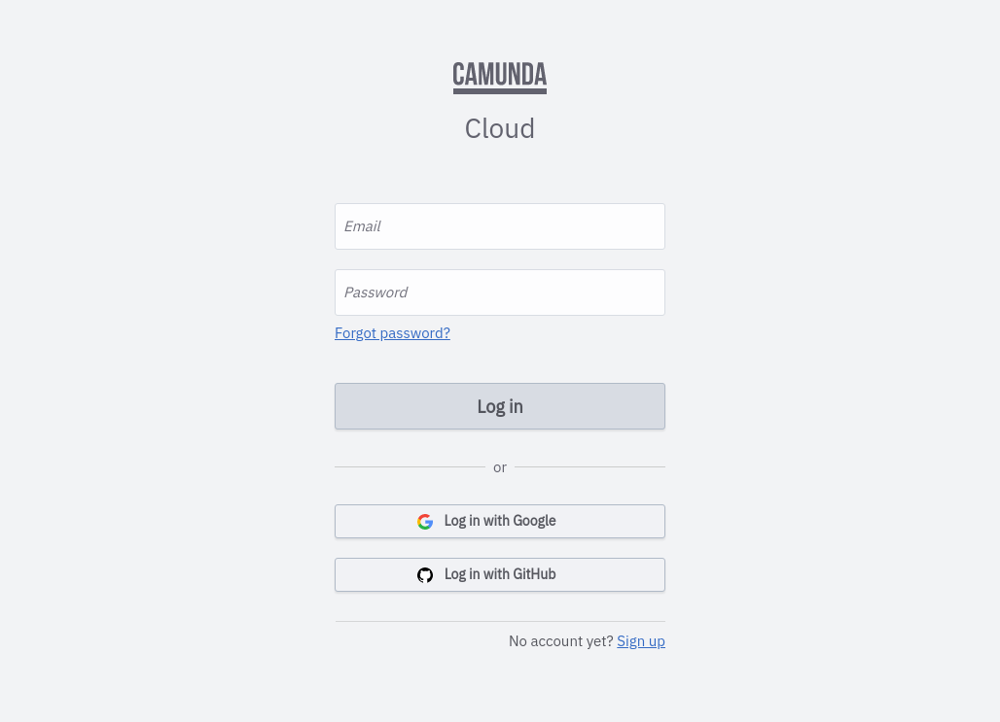
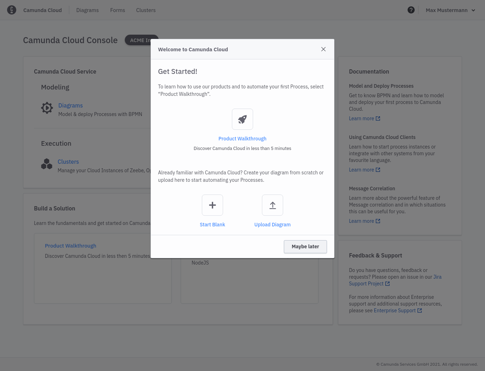

Beginner
Time estimate: 5 minutes

## Sign up for Camunda Cloud

Create a Camunda Cloud account so you can create clusters, deploy processes, and create a new instance.

### Visit [https://camunda.io/signup](https://camunda.io/signup)

Visit [https://camunda.io/signup](https://camunda.io/signup) and view the **Sign Up** screen:

### Create an account

Fill out the form and submit, or sign up using the social sign up buttons like Google or GitHub.

If you fill out the form, you'll receive a confirmation email. Click on the link to verify your email address and set your password.

If you choose to create an account through the social sign up buttons, you'll be redirected to Console directly.

## Log in to your Camunda Cloud account

### Visit [https://camunda.io](https://camunda.io)

Log in with the email address and password you used in the previous form, or use the social login buttons.

After login, you'll see the console overview page. This is the central place to manage your clusters, and the diagrams and forms you want to deploy to Camunda Cloud.

You can now take a guided tour through Camunda Cloud using the **Product Walkthrough** button.
