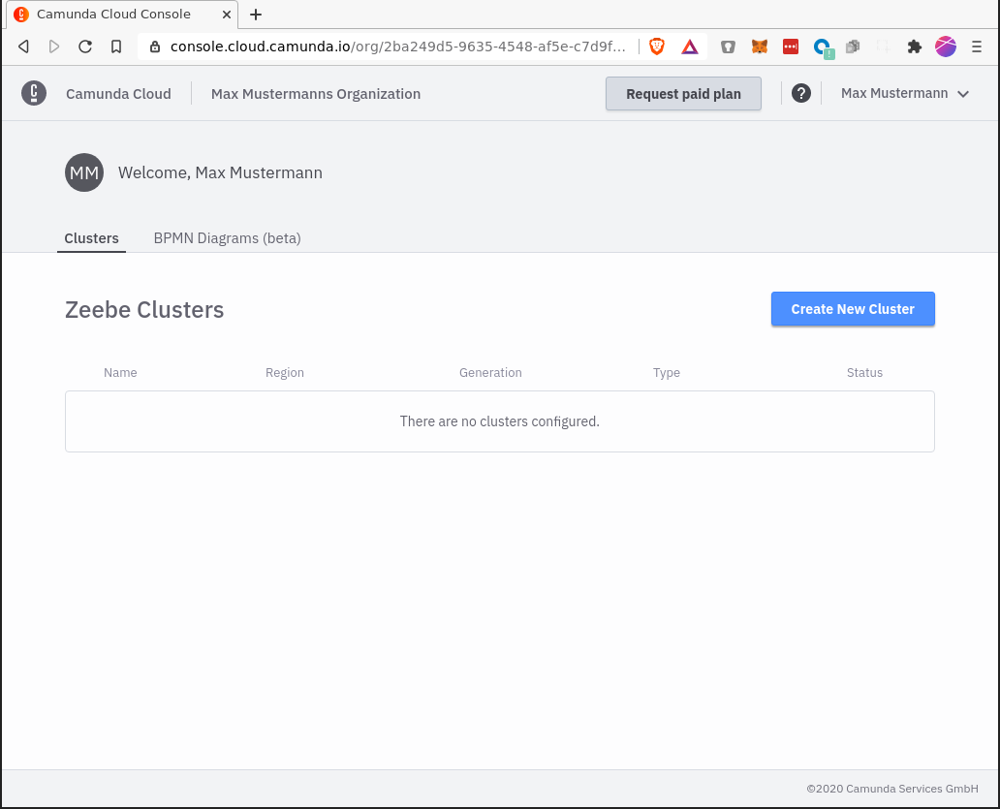
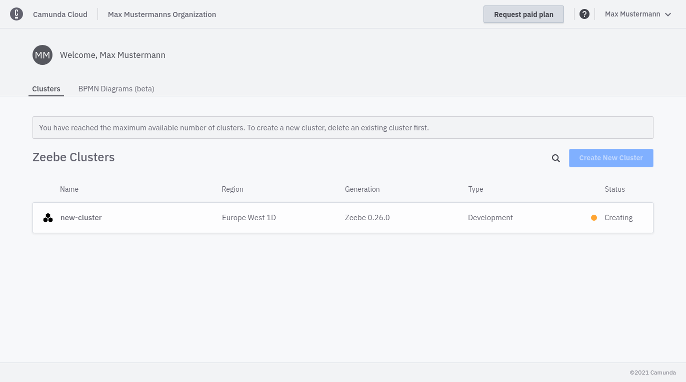

After login you'll see the console overview page. Since you haven't created a cluster, the overview will be empty.

In the upper right area you'll find the button _Create New Cluster_. Click on it to create a new cluster. After you've assigned a name and created the cluster, a new entry appears in the overview:

For this Getting Started Tutorial, please just close the dialog that pops up after the create cluster dialog.

The cluster is now being set up. During this phase, its state is _Creating_. After one or two minutes the cluster is ready for use and changes its state to _healthy_:

After the cluster has been created, you can jump into the cluster detail page by clicking at the newly created cluster.
