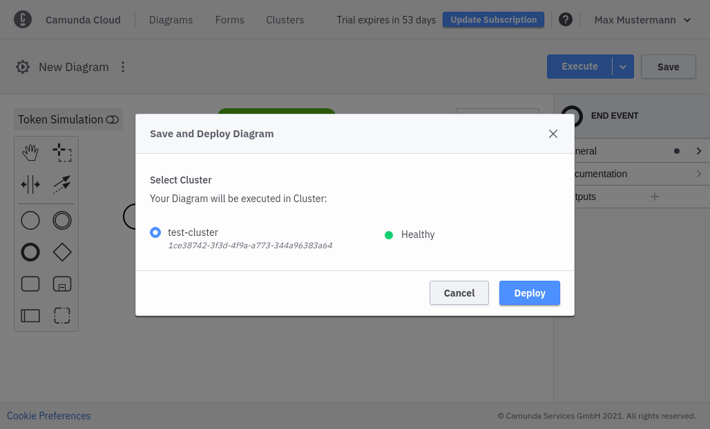
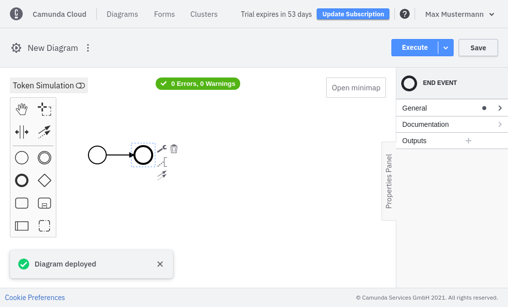
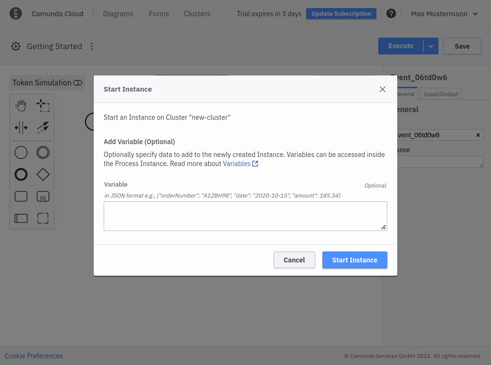
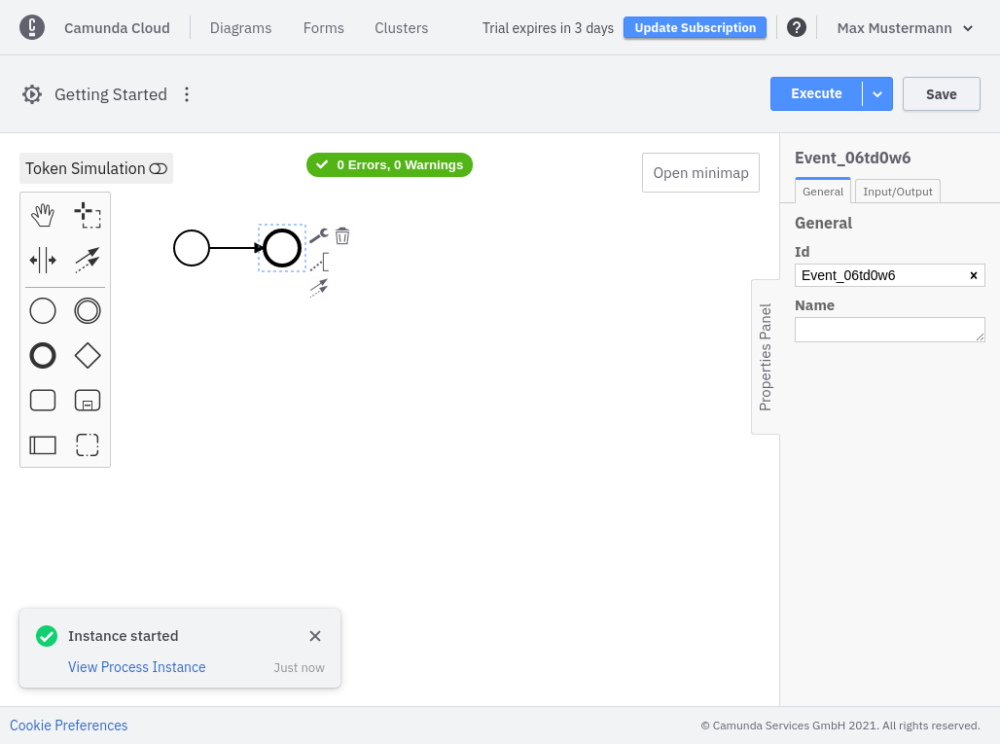

<span class="badge badge--primary">Beginner</span>
<span class="badge badge--primary">Time estimate: 5 minutes</span>

## Prerequisites

- Console Modeler or [Camunda Modeler](https://camunda.com/download/modeler/)
- [Latest version of Zeebe](https://github.com/camunda-cloud/zeebe/releases)

:::note

BPMN diagrams must be created for the process engine they intend to be deployed on. You cannot currently run a BPMN diagram modeled for Camunda Platform in Camunda Cloud, or vice versa.
:::

## Deploy and start your process instance

import Tabs from "@theme/Tabs";
import TabItem from "@theme/TabItem";

<Tabs groupId="modeler" defaultValue="console" values={
[
{label: 'Console Modeler', value: 'console', },
{label: 'Camunda Modeler', value: 'desktop', },
]
}>

<TabItem value='console'>

You can now use the **Save & Deploy** option in the **Execute** menu to deploy the newly-created process to your cluster.



Deployment can take a few seconds, but you should get a confirmation for successful deployment.



You can now start a new process instance. For this example, you can start an instance with an empty payload.



Once the instance is started, you'll receive a confirmation with a link to open Operate.



</TabItem>

<TabItem value='desktop'>

Take the following steps:

1. On the right side of the navigation menu, note the buttons for deploying and starting processes.


2. In the deployment dialog, the connection information must now be specified: `Cluster Id`, `Client Id`, and `Client Secret`.

`Client Id` and `Cluster Id` can be retrieved by clicking on **View** on the client in the **API** tab.


The `Client Secret` can be retrieved from the downloaded connection file:

```bash
grep SECRET  ~/Downloads/CamundaCloudMgmtAPI-Client-test-client.txt
export ZEEBE_CLIENT_SECRET='zbzsZI_6UnCsH_CIo0lNUN8qGyvLJr9VrH77ewNm8Oq3elvhPvV7g.QmJGydzOLo'
```

3. Click **Deploy** to deploy the process. Use **Play** from the navigation to start a new instance.

</TabItem>
</Tabs>

## Next steps

- [Implement a service task](implement-service-task.md)