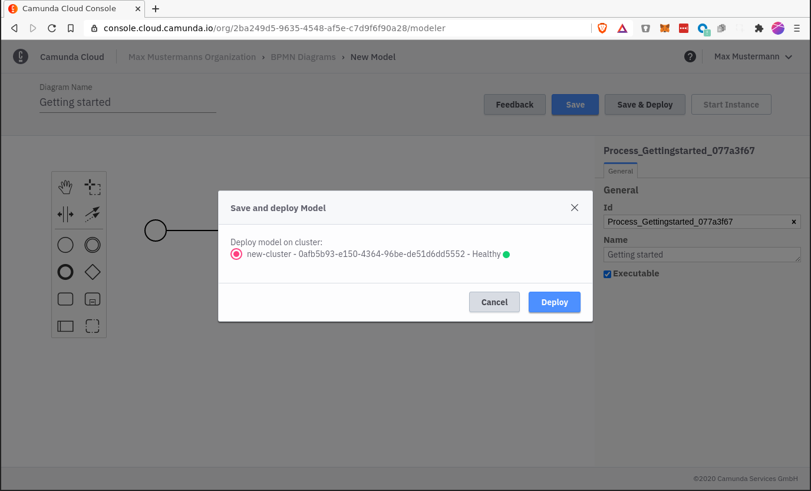
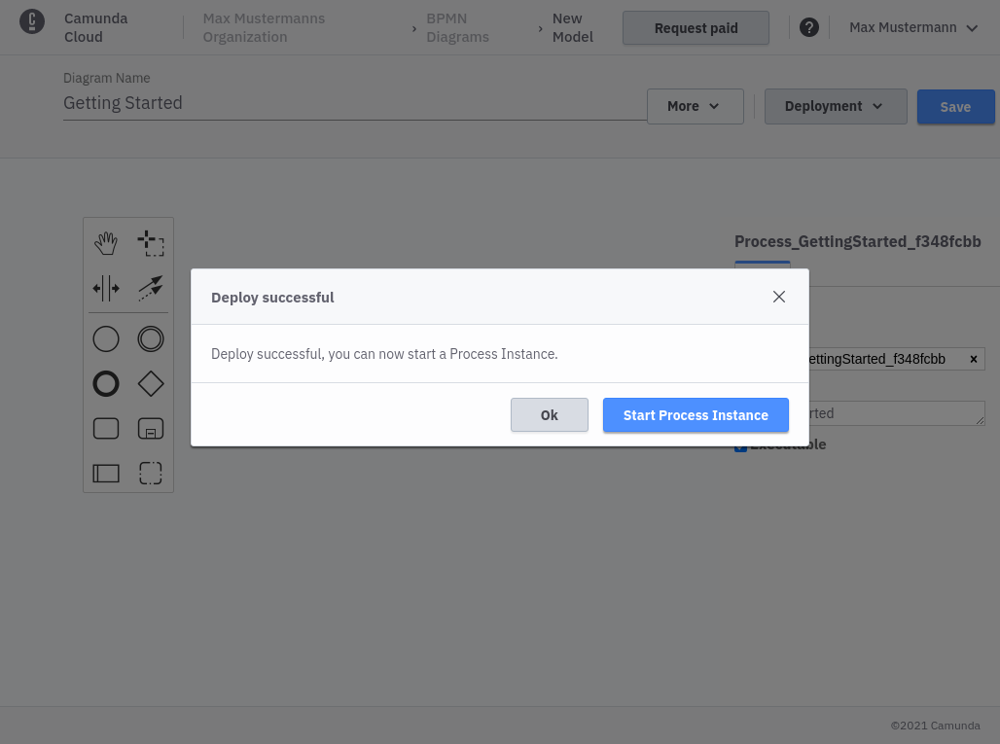
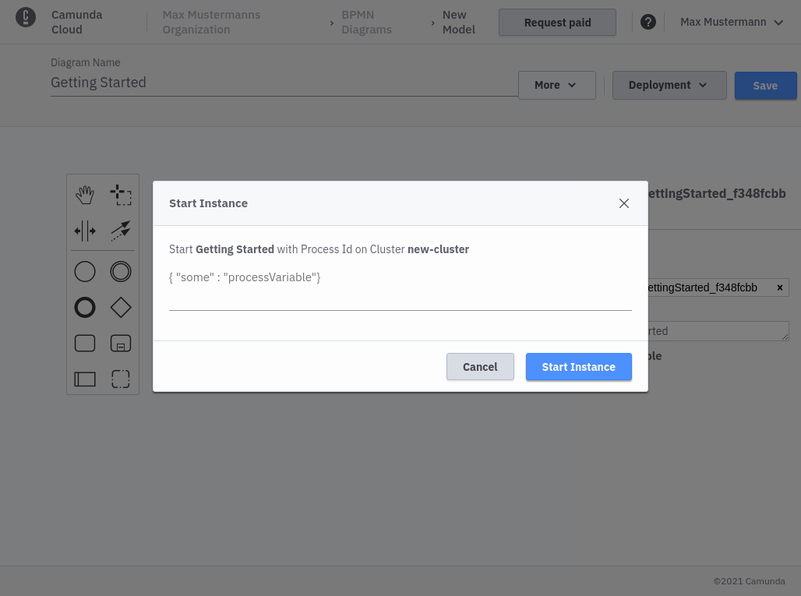
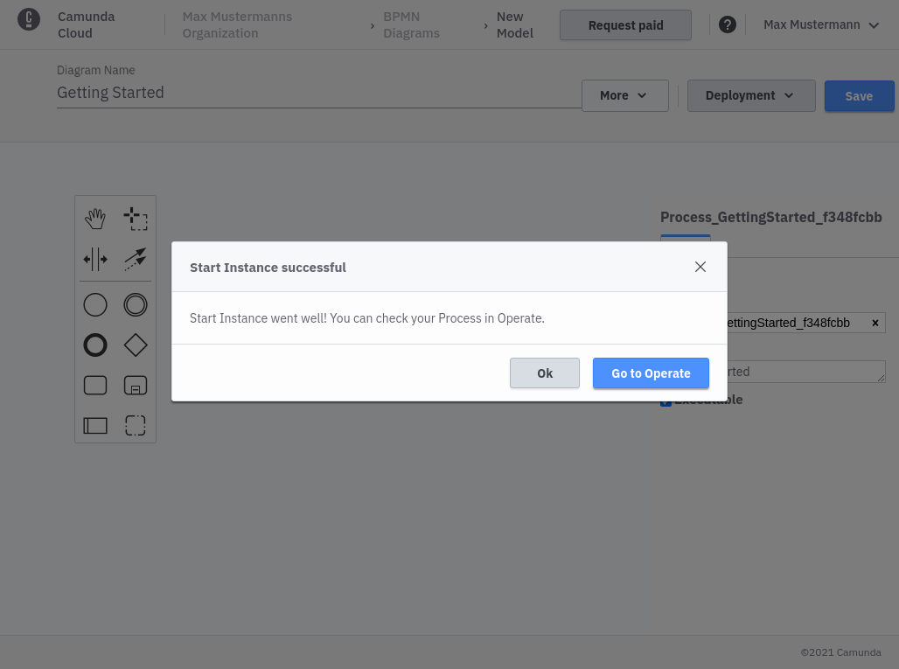

import Tabs from "@theme/Tabs";
import TabItem from "@theme/TabItem";

<Tabs groupId="modeler" defaultValue="console" values={
    [
        {label: 'Console Modeler', value: 'console', },
        {label: 'Zeebe Modeler', value: 'desktop', },
    ]
}>

<TabItem value='console'>

You can now use the "Save & Deploy" button to deploy the newly created process to your cluster

Deployment can take some seconds but you should get a confirmation for the successfull deployment.

You can now start a new process instance. For this example you can just start an instance with an empty payload.

Once the instance is started you get a confirmation with a link to jump into operate directly.

</TabItem>

<TabItem value='desktop'>

On the right side of the navigation menu there are buttons for deploying and starting workflows.

In the deployment dialog, the connection information must now be specified: ClusterId, ClientId and ClientSecret. Click Deploy to **deploy** the workflow now. Use the Play button from the navigation to **start a new instance**.

</TabItem>
</Tabs>