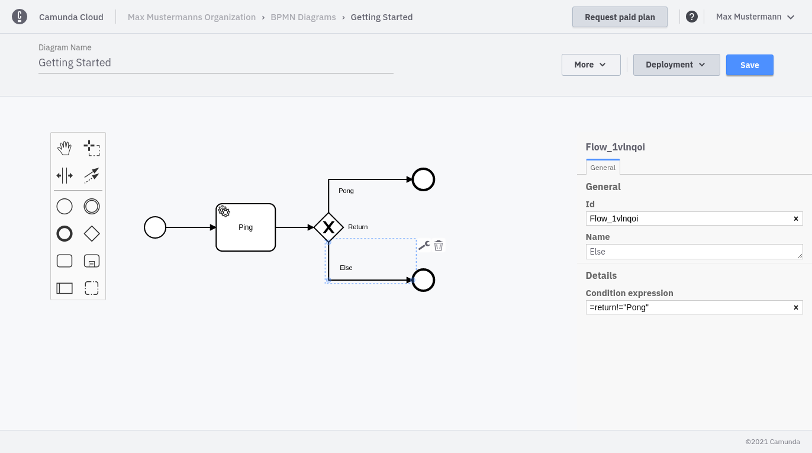

import Tabs from "@theme/Tabs";
import TabItem from "@theme/TabItem";

In [the last section](./implement-service-task.md) we connected a worker that will return a JSON object, which is used to decide which path to take in the process. Now, we can use the JSON object to route your process by filling in the condition expression on the two sequence flows after the XOR gateway.

Use the following conditional expression for the "Pong" sequence flow:

```bash
=return="Pong"
```

And for the else sequence flow:

```bash
=return!="Pong"
```

<Tabs groupId="modeler" defaultValue="console" values={
[
{label: 'Cloud Modeler', value: 'console', },
{label: 'Zeebe Modeler', value: 'desktop', },
]
}>

<TabItem value='console'>



</TabItem>

<TabItem value='desktop'>


</TabItem>
</Tabs>

Deploy the updated process again so the specified decisions in the gateway will be used.
