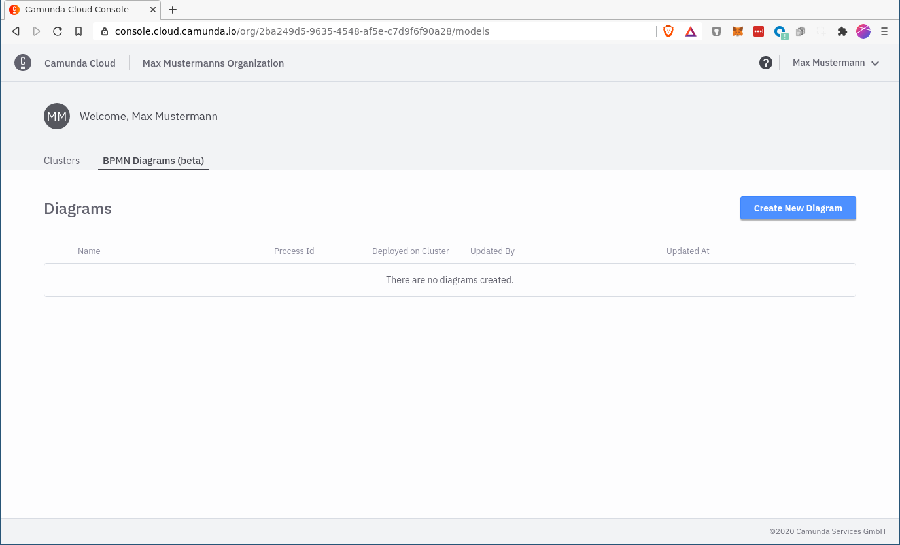
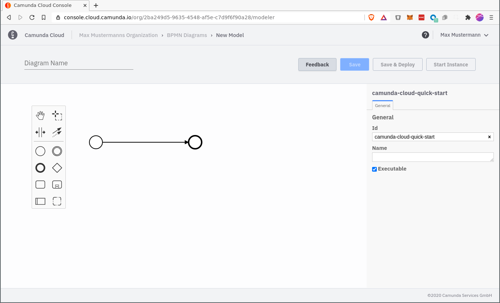
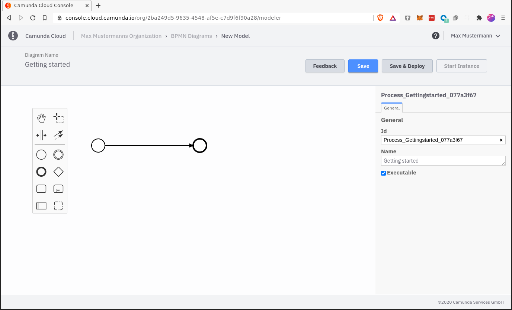

import Tabs from "@theme/Tabs";
import TabItem from "@theme/TabItem";

In Camunda Cloud you have two options to design and deploy a workflow: the [Zeebe Modeler](https://github.com/zeebe-io/zeebe-modeler/releases) and the Console Modeler.
 

<Tabs groupId="modeler" defaultValue="console" values={
    [
        {label: 'Console Modeler', value: 'console', },
        {label: 'Zeebe Modeler', value: 'desktop', },
    ]
}>

<TabItem value='console'>
Using the Console Modeler, workflows can be designed and deployed, and new instances can be created directly from the console. You can find all your saved models under the "BPMN Diagrams" tab

Just create a new diagram

and give it a name

The Save button should now appear.

</TabItem>

<TabItem value='desktop'>

Using the Zeebe Modeler, workflows can be designed and deployed, and new instances can be created.

Design a simple workflow with one start event and one end event or download this [BPMN model](./bpmn/gettingstarted_quickstart.bpmn).

</TabItem>
</Tabs>

