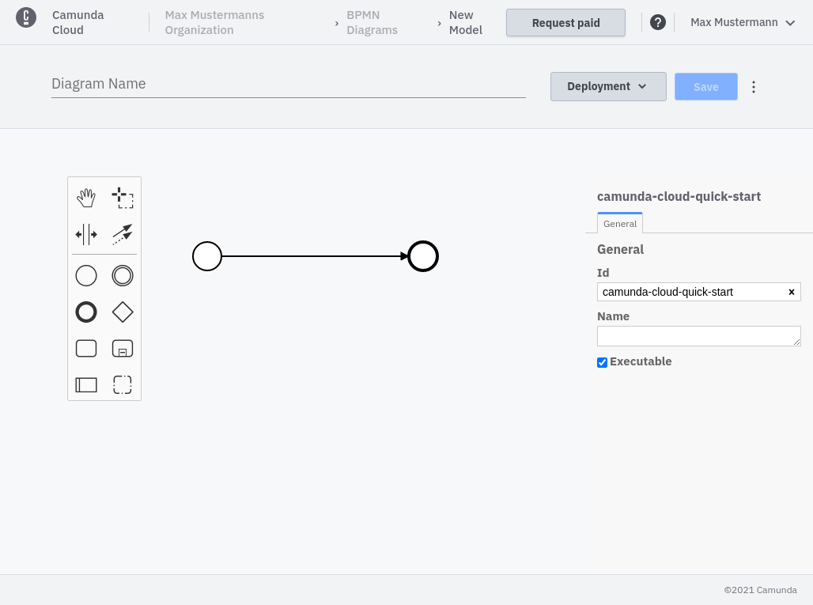
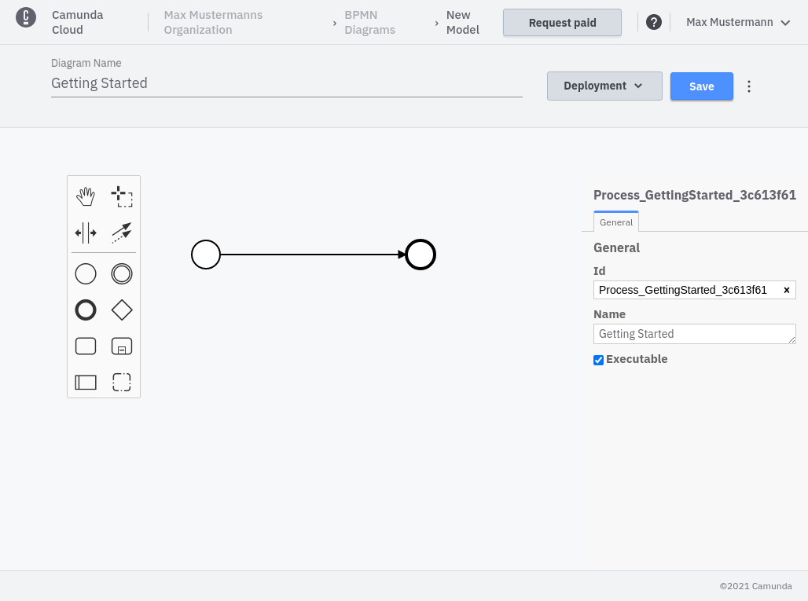

import Tabs from "@theme/Tabs";
import TabItem from "@theme/TabItem";

In Camunda Cloud you have two options to design and deploy a workflow: the Console Modeler and the [Zeebe Modeler](https://github.com/zeebe-io/zeebe-modeler/releases).

<Tabs groupId="modeler" defaultValue="console" values={
[
{label: 'Console Modeler', value: 'console', },
{label: 'Zeebe Modeler', value: 'desktop', },
]
}>

<TabItem value='console'>

Using the Console Modeler, workflows can be designed and deployed, and new instances can be created directly from the console.

You can find all your saved models under the **BPMN Diagrams** tab

Click **Create New Diagram**.

Give your diagram a name like `Getting Started`.

The **Save** button should now appear for you to save your diagram.

</TabItem>

<TabItem value='desktop'>

Using the Zeebe Modeler, workflows can be designed and deployed, and new instances can be created.

Design a simple workflow with one start event and one end event or download this [BPMN model](./bpmn/gettingstarted_quickstart.bpmn).

</TabItem>
</Tabs>
