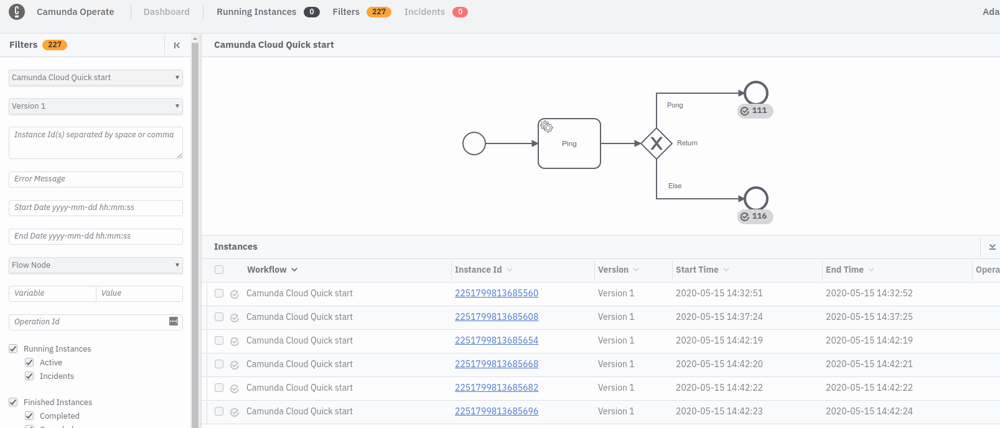

import Tabs from '@theme/Tabs';
import TabItem from '@theme/TabItem';

Camunda Cloud offers Operate to monitor your process instances. An entry point can be found in the cluster details.


By selecting the deployed process you will see a list of instances that can be filtered:


Because [the started worker](./implement-service-task.md) returns

```json
{
  "return": "Pong"
}
```

the process ends in the upper end event following the Ping sequence flow.

Changing the worker to

```bash
zbctl create worker test-worker --handler "echo {\"return\":\"...\"}"
```

and creating a new instance leads to a second instance in Operate, which you'll see ending in the second end event following the else sequence flow:


As a next step you can now connect both workers in parallel and create more process instances:

```bash
while true; do zbctl create instance camunda-cloud-quick-start-advanced; sleep 1; done
```

In Operate you will see instances ending in both end events depending on which worker picked up the job.


