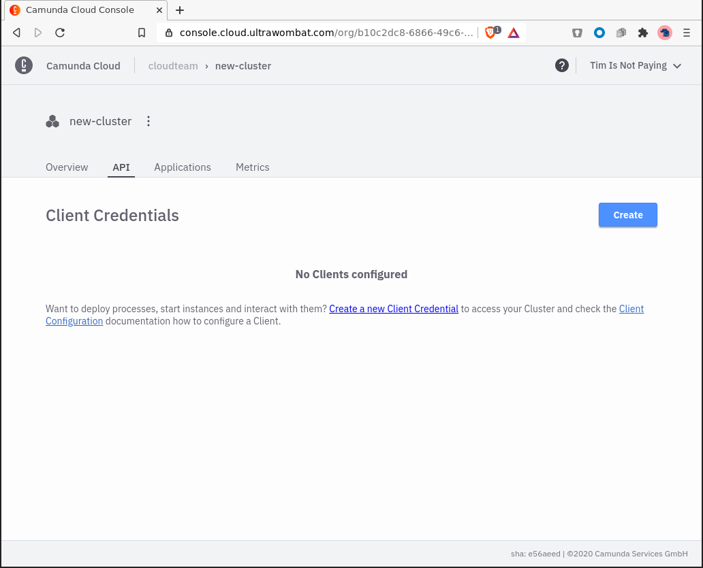
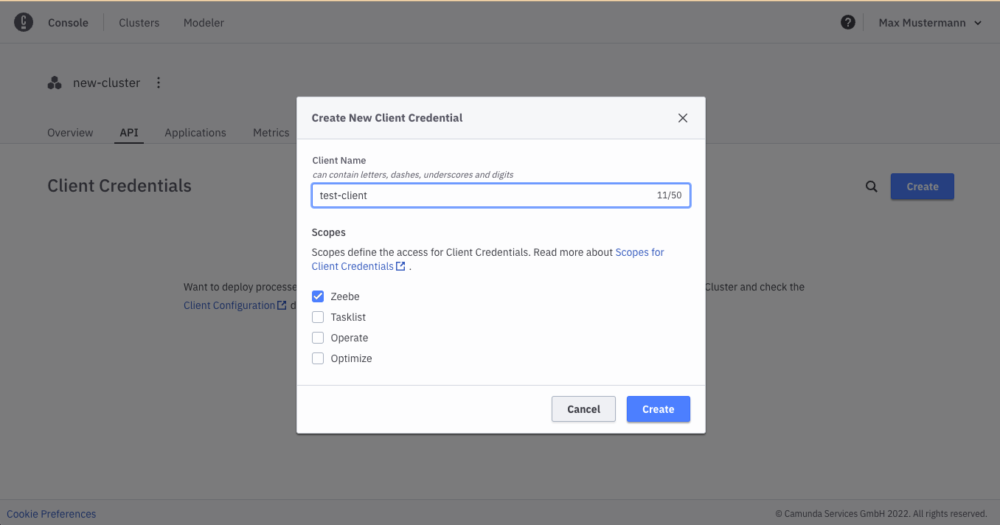
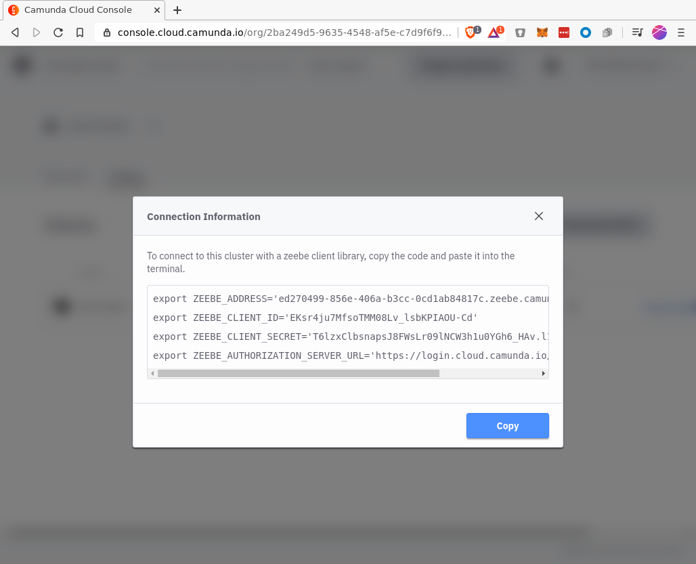

To create a new client you have to navigate into the API tab:

Click on _Create New Client_-Button to create a new client, name your client accordingly:

The newly created client appears in the list, click on `Connection Information` to get all the information you need to connect:

- `ZEEBE_ADDRESS`: Address where your cluster can be reached.
- `ZEEBE_CLIENT_ID` and `ZEEBE_CLIENT_SECRET`: Credentials to request a new access token.
- `ZEEBE_AUTHORIZATION_SERVER_URL`: A new token can be requested at this address, using the credentials.

You can use the `Copy` button to get all of this into your clipboard so you can paste it into your terminal later.

