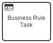

This guide describes how to migrate process solutions developed for Camunda Platform in order to run them on Camunda Cloud. You will learn about necessary steps, but also limitations of migration.

## Migration Overview

For migration you need to look at development artifacts (BPMN models and application code), but might also want to look at workflow engine data (runtime and history) in case you migrate an in-production process solution. 

In general, **development artifacts** can be migrated: 

* **BPMN models:** Camunda Cloud uses BPMN like Camunda Platform, which generally allows to use the same model files, but you might need to configure *different extension atrributes* (at least by using a different namespace). Furthermore, Camunda Cloud has a *different coverage* of BPMN concepts that are supported (see [Camunda Cloud BPMN coverage](https://docs.camunda.io/docs/reference/bpmn-processes/bpmn-coverage) vs [Camunda Platform BPMN coverage](https://docs.camunda.org/manual/latest/reference/bpmn20/)), which might require some model changes. Note that the coverage of Camunda Cloud will of-course increase over time.

* **DMN models:** TBD

* **CMMN models:** It is not possible to run CMMN on Zeebe, *CMMN models cannot be migrated*. You could remodel cases in BPMN according to ["Building Flexibility into BPMN Models"](https://camunda.com/best-practices/building-flexibility-into-bpmn-models/). 

* **Application code:** The application code needs to use *a different client library and different APIs*. This will lead to code changes you have to implement. 

* **Architecture:** The different architecture of the core workflow engine might require some *changes in your architecture* (e.g. if you used the embedded engine approach). Furthermore, certain concepts of Camunda Platform are no longer possible (like hooking in Java code at various places or control transactional behavior with asynchronous continuations) which might lead to *changes in your model and code*. 

In general, **data** *cannot* yet be migrated to Camunda Cloud.

* **Runtime data:** Running process instances of Camunda Platform are stored in the Camunda Platform database. *Runtime data cannot be migrated* to Camunda Cloud. A possible workaround is to create a process model on Camunda Cloud that is purely used for migration to bring process instances to their respective wait state as described in the whitepaper [How to migrate to Camunda](https://page.camunda.com/wp-how-to-migrate-to-camunda).

* **History data:** *Historic data cannot be migrated*.

Let's now explore migration steps for your development artifacts in more detail.


## Migrating Your Application

Let's explore the basic switch to Camunda Cloud by looking at different common architectures possible with Camunda Platform.


### Java and Spring Boot

With Camunda Platform you can easily start the workflow engine within your Spring Boot application. While Camunda Cloud also provides Spring Boot support, it is reduced to the client to the workflow engine. Camunda Cloud does not support the embedded engine mode of Camunda Platform. This means, the broker cannot be started within the same Spring Boot application and JVM as the business application. Respectively, the configuration of the workflow engine itself is also not part of the Spring Boot application any more.


In order to migrate an existing Spring Boot application you need to follow the following basic steps:

* Adjust Maven dependencies
  * Remove Camunda Platform Spring Boot Starter and all other Camunda dependencies
  * Add [Spring Zeebe Starter](https://github.com/zeebe-io/spring-zeebe)
* Adjust config
  * Make sure to set [Camunda Cloud credentials](https://github.com/camunda-community-hub/spring-zeebe#configuring-camunda-cloud-connection), for example in `src/main/resources/application.properties` and point it to an existing Zeebe cluster
  * Remove existing Camunda Platform setting
* Replace `@EnableProcessApplication` with `@EnableZeebeClient` in your main Spring Boot application class
* Add `@ZeebeDeployment(resources = "classpath*:**/*.bpmn")` to automatically deploy all BPMN models

Now you have adjust your source code as described below.

Implications on testing: TODO


### Container-Managed Engine (Tomcat, WildFly, Websphere & co)

Zeebe doesn't provide integration into Jakarta EE application servers like Camunda Platform did. Instead, Jakarta EE applications need to manually add the Zeebe client library. The implications are comparable to what was described for Spring Boot applications.


### CDI or OSGI

Due to limited adoption there is no support for CDI or OSGI in Camunda Cloud. A lightweight integration layer comparable to [Spring Zeebe](https://github.com/camunda-community-hub/spring-zeebe) might evolve in the feature and we are happy to support this as community extension to the Zeebe project.


### Polyglot Applications (C#, NodeJS, ...)

When you run your application in NodeJS or C# you basically exchange one remote engine (Camunda Platform) with another (camunda Cloud). As Zeebe comes with a different API, you need to adjust your source code. Also note, that Zeebe does not provide a REST API at this point in time, so you need to leverage a [client library](https://docs.camunda.io/docs/product-manuals/clients/overview).


## Architecture Considerations

### Adjusting Your Source Code

In general, the API did change completely, so you need to adjust your code.

* Client API
* Service tasks


### Concepts That Differ In Camunda Cloud

* Listeners

Not supported in Zeebe
some use cases might be able to implement in the client (Q: do we need an example?)
some use cases might be able to implement via exporters (Q: do we need an example?)


* Process Engine Plugisn

Will not work, need to be revisited
Some use cases might be able to support via exporters in Zeebe (Event Streaming…)


* Spin and data formats

You can easily use primary data types and json
If you use Java classes they might be mapped to JSON or XML. You can still use this but have to do the mapping yourself, probably using:
Java -> JSON / Jackson
Java -> XML / JAXB
Binary data / blobs


* Transaction Integration

Is quite different. Camunda runs in the same transaction of Spring Boot as the application. If both share the same database, it is even a real joined transaction, that can be rolled back in case of errors. This is not possible in Zeebe.

* Connectors


## Migration Tooling

This applies to clients talking to the workflow engine (e.g. to start process instances), but also to glue code (e.g. connected to service tasks) as external task workers from Camunda Platform need to be changed to job workers in Camunda Cloud. If you are in Java and used the Camunda Platform Java Client, you can leverage [the Camunda Platform to Cloud Adapter](https://github.com/berndruecker/camunda-platform-to-cloud-migration/tree/main/camunda-platform-to-cloud-adapter), which removes some manual work for code changed. Note, that this will not completly automate this step.


 BPMN models can be semi-automatically converted using [the Camunda Platform To Cloud Converter Modeler Plugin](https://github.com/berndruecker/camunda-platform-to-cloud-migration/tree/main/camunda-modeler-plugin-platform-to-cloud-converter). Note that some elements or attributes are either not supported or behave slightly different in Camunda Cloud, so the convertion will require manual supervision.


## Service Tasks And Glue Code

One of the biggerst 


[Service Tasks used with Camunda Platform](https://docs.camunda.org/manual/7.15/reference/bpmn20/tasks/service-task/) can

* Attach Java glue code that is called by the engine. 
* Use External Tasks, where workers subscribe to the engine.

In Camunda Cloud, you always have external workers that subscribe to the engine, which is why code that uses External Tasks is generally easier to migrate.


### Attached Java Code

There are three ways to implement this marked by different attributes in the BPMN model:

* Specifying a class that implements a JavaDelegate or ActivityBehavior: ```camunda:class```
* Evaluating an expression that resolves to a delegation object: ```camunda:delegateExpression```
* Invoking a method or value expression: ```camunda:expression```

Camunda Cloud can not directly execute custom Java code. Instead, there must be a worker, subscribing to the service task, that can execute your existing code.

The [Camunda Platform to Cloud Adapter](https://github.com/berndruecker/camunda-platform-to-cloud-migration/tree/main/camunda-platform-to-cloud-adapter) implements a worker based on [Spring Zeebe](https://github.com/camunda-community-hub/spring-zeebe), which can either be used directly, be used as a starting point or simply serve for inspiration. It subscribes to the topic ```camunda-platform-to-cloud-migration```. [Task headers](https://docs.camunda.io/docs/reference/bpmn-processes/service-tasks/service-tasks#task-headers) are used to configure a delegation class or expression for this worker. 

The [Camunda Platform To Cloud Converter Modeler Plugin](https://github.com/berndruecker/camunda-platform-to-cloud-migration/tree/main/camunda-modeler-plugin-platform-to-cloud-converter) will adjust your service tasks automatically for this adapter.

The following attributes/elements are migrated:
* ```camunda:class```
* ```camunda:delegateExpression```
* ```camunda:expression``` and ```camunda:resultVariable```


Note that some attributes cannot be migrated:
* ```camunda:asyncBefore```: every task in Zeebe is always asyncBefore and asyncAfter
* ```camunda:asyncAfter```: every task in Zeebe is always asyncBefore and asyncAfter
* ```camunda:exclusive```: jobs are always exclusive in Zeebe
* ```camunda:jobPriority```: There is no way to priotize jobs in Zeebe (yet)
* ```camunda:failedJobRetryTimeCycle```: You cannot yet configure the retry time cycle


### External Tasks

External Tasks in Camunda Platform also used a worker, like in Camunda Cloud. So the ```external task topic``` is directly translated in a ```task type name``` in Camunda Cloud. This means, you have to migrate your existing external task worker to a Zeebe worker.

If you developed your Camunda Platform external task worker using [the Java client](https://github.com/camunda/camunda-bpm-platform/tree/master/clients/java), you can use [Camunda Platform to Cloud Adapter](https://github.com/berndruecker/camunda-platform-to-cloud-migration/tree/main/camunda-platform-to-cloud-adapter) to adapt your worker code. 


The following attributes/elements are migrated:
* ```camunda:topic```


The following attributes/elements cannot be migrated:
* ```camunda:taskPriority```


### Connectors

Connectors cannot be migrated at this moment. You need to look at what connectors you are using and decide for your migration strategy.

The following attributes/elements cannot be migrated:

* ```camunda:connector```

### General Configuration for Service Tasks

Field Injection

* ```camunda:field``` (TODO)


TODO: Check https://docs.camunda.org/manual/7.15/user-guide/process-engine/delegation-code/#field-injection - especially value setting & Expression Language


Todo / To Check:
* ```camunda:inputOutput``` (TODO)
* ```camunda:errorEventDefinition``` (TODO)

The following attributes/elements cannot be migrated:
* ```camunda:type```


## Expression Language


## Human Task Management And Forms


## BPMN Overview

### Service Tasks


Migrating a service task was described in the section about delegation code above.

### Send Tasks


In both engines, a send task has the same behavior as a service task - so please refer to the details above. A send task is migrated exactly like a service task.


### Human Tasks


Human task management is still catching up in Camunda Cloud, so many configuration options are not yet available. Specifically, the following attributes/elements cannot be migrated:

* Task assignment (to users or groups):
  * ```camunda:humanPerformer```
  * ```camunda:potentialOwner```
  * ```camunda:assignee```
  * ```camunda:candidateUsers```
  * ```camunda:candidateGroups```
* Form handling:
  * ```camunda:formKey```
  * ```camunda:formHandlerClass```
  * ```camunda:formData```
  * ```camunda:formProperty```
* ```camunda:taskListener```
* ```camunda:dueDate```
* ```camunda:followUpDate```
* ```camunda:priority```


Todo / To Check:
* ```camunda:inputOutput``` (TODO)


TODO: Forms?


### Business Rule Tasks



```
DecisionService decisionService = BpmPlatform.getDefaultProcessEngine()
					.getDecisionService();
				DmnDecisionResult decisionResult = decisionService.evaluateDecisionByKey(decisionRef)
					.variables(job.getVariablesAsMap())
					.evaluate();

				// TODO: implement other result mappings
				DmnDecisionResultEntries singleResult = decisionResult.getSingleResult();
				resultPayload = new HashMap<>();
				String resultVariableName = (String) jobHeaders.get("resultVariable");
				resultPayload.put(resultVariableName, singleResult.getEntryMap());
```


### Call Activities


Call activities are generally supported in Zeebe. The following attributes/elements can be migrated:
* ```camunda:calledElement``` --> zeebe:calledElement

The following attributes/elements cannot be migrated:
* ```camunda:calledElementBinding```: Currently Zeebe always assumes 'late' binding
* ```camunda:calledElementVersionTag```: Zeebe does not know a version tag
* ```camunda:variableMappingClass```: You cannot execute code to do variable mapping in Zeebe
* ```camunda:variableMappingDelegateExpression```: You cannot execute code to do variable mapping in Zeebe
* Data Mapping
  * ```camunda:in```: There is no way to priotize jobs in Zeebe (yet)
  * ```camunda:out```: You cannot yet configure the retry time cycle


TODO: inputOutput


### Message Receive Events And Receive Tasks

### Script Task


Script tasks are not natively executed by the Zeebe engine. They behave like normal service tasks instead, which means you have to operate a worker that can execute scripts. One available option is the [Zeebe script worker](https://github.com/camunda-community-hub/zeebe-script-worker) as community extension. 

If you do this, the following attributes/elements are migrated:
* ```camunda:scriptFormat```
* ```camunda:script```
* ```camunda:resultVariable```

The following attributes/elements cannot be migrated:
* ```camunda:asyncBefore```: every task in Zeebe is always asyncBefore and asyncAfter
* ```camunda:asyncAfter```: every task in Zeebe is always asyncBefore and asyncAfter
* ```camunda:exclusive```: jobs are always exclusive in Zeebe
* ```camunda:jobPriority```: There is no way to priotize jobs in Zeebe (yet)
* ```camunda:failedJobRetryTimeCycle```: You cannot yet configure the retry time cycle

TODO: inputOutput


### Gateways & Expression Language


### Multiple Instance Markers


### Unsupported Attributes (?)

* Asynchronous Continouations


## Summary