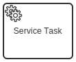
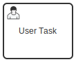

Ensure your BPMN process models are adjusted as follows to migrate them from Camunda 7 to Camunda 8:

- The namespace of extensions has changed from `http://camunda.org/schema/1.0/bpmn` to `http://camunda.org/schema/zeebe/1.0`.
- `modeler:executionPlatform` has been set to `Camunda Cloud`. Prior to this change, you will see `Camunda Platform`, indicating designed compatibility with Camunda 7.
- `modeler:executionPlatformVersion` has been set to `8.2.0`. Prior to this change, you will see `7.19.0` or similar.
- Different configuration attributes are used between platform versions, as described for each BPMN element below.
- Camunda 8 has a _different coverage_ of BPMN elements (see [Camunda 8 BPMN coverage](/components/modeler/bpmn/bpmn-coverage.md) versus [Camunda 7 BPMN coverage](https://docs.camunda.org/manual/latest/reference/bpmn20/)), which might require some model changes. Note that the coverage of Camunda 8 will increase over time.

:::info
Web Modeler will automatically update `modeler:executionPlatform` and `modeler:executionPlatformVersion` to the correct values when you upload a BPMN file.
:::

The following sections describe the capabilities of the existing community-supported [backend diagram converter](https://github.com/camunda-community-hub/camunda-7-to-8-migration/tree/main/backend-diagram-converter) for relevant BPMN symbols, including unsupported element attributes that cannot be migrated.

### General considerations

The following attributes/elements **cannot** be migrated:

- `camunda:asyncBefore`: Every task in Zeebe is always asyncBefore and asyncAfter.
- `camunda:asyncAfter`: Every task in Zeebe is always asyncBefore and asyncAfter.
- `camunda:exclusive`: Jobs are always exclusive in Zeebe.
- `camunda:jobPriority`: There is no way to prioritize jobs in Zeebe (yet).
- `camunda:failedJobRetryTimeCycle`: You cannot yet configure the retry time cycle. Alternatively, you can [modify your code](/apis-tools/zeebe-api/gateway-service.md#input-failjobrequest) to use the `retryBackOff` timeout (in ms) for the next retry.

### Processes

The following attribute can be migrated:

- `camunda:versionTag` to `bpmn:extensionElements > zeebe:versionTag value`

### Service tasks

:::note
Migrating a service task is described in [adjusting your source code](/guides/migrating-from-camunda-7/adjusting-source-code.md). You will have both BPMN and source code changes.
:::

A service task might have **attached Java code**. In this case, the following attributes/elements are migrated and put into a task header:

- `camunda:class`
- `camunda:delegateExpression`
- `camunda:expression` and `camunda:resultVariable`

The topic `camunda-7-adapter` is set.

- `camunda:failedJobRetryTimeCycle`: Here, the amount of defined retries is set to the `zeebe:taskDefinition retries` attribute.

A service task might leverage **external tasks** instead. In this case, the following attributes/elements are migrated:

- `camunda:topic` becomes `zeebe:taskDefinition type`.

The following attributes/elements **cannot** be migrated:

- `camunda:taskPriority`

Service tasks using `camunda:connector` will be migrated with the following changes:

- `camunda:connectorId` becomes `zeebe:taskDefinition type`
- All inputs and outputs are treated like all other inputs and outputs.

### Send tasks

In both engines, a send task has the same behavior as a service task. A send task is migrated exactly like a service task.

### Gateways

Gateways rarely need migration. The relevant configuration is mostly in the [expressions](/components/concepts/expressions.md) on outgoing sequence flows.

### Expressions

Expressions must be in [friendly-enough expression language (FEEL)](/components/concepts/expressions.md#the-expression-language) instead of [Java unified expression language (JUEL)](https://docs.camunda.org/manual/latest/user-guide/process-engine/expression-language/).

Migrating simple expressions is doable (as you can see in [these test cases](https://github.com/camunda-community-hub/camunda-7-to-8-migration/blob/main/backend-diagram-converter/core/src/test/java/org/camunda/community/migration/converter/ExpressionTransformerTest.java)), but not all expressions can be automatically converted.

The following is **not** possible:

- Calling out to functional Java code using beans in expressions
- Registering custom function definitions within the expression engine
- Using SPIN library (the FEEL data structure behaves like JSON natively, so SPIN can be omitted or replaced)
- Using the `execution` or `task`

### User tasks

[Human task management](/guides/getting-started-orchestrate-human-tasks.md) is also available in Camunda 8, but uses a different Tasklist user interface and API.

In Camunda 7, you have [different ways to provide forms for user tasks](https://docs.camunda.org/manual/latest/user-guide/task-forms/):

- Embedded Task Forms (embedded custom HTML and JavaScript)
- External Task Forms (link to custom applications)
- [Camunda Forms](/guides/utilizing-forms.md)

:::note
Only Camunda Forms are currently supported in Camunda 8 and can be migrated.
:::

The following attributes/elements can be migrated:

- Task assignment (to users or groups):
  - `bpmn:humanPerformer`
  - `bpmn:potentialOwner`
  - `camunda:assignee` to `zeebe:assignmentDefinition assignee`
  - `camunda:candidateGroups` to `zeebe:assignmentDefinition candidateGroups`
  - `camunda:candidateUsers` to `zeebe:assignmentDefinition candidateUsers`
- Task schedule:
  - `camunda:dueDate` to `zeebe:taskSchedule dueDate`
  - `camunda:followUpDate` to `zeebe:taskSchedule followUpDate`
- Task priority:
  - `camunda:priority` to `zeebe:priorityDefinition priority`
- Form handling:
  - `camunda:formKey` to `zeebe:formDefinition formKey`, but Camunda 8 requires you to embed the form definition itself into the root element of your BPMN XML models, see [the user task documentation](/components/modeler/bpmn/user-tasks/user-tasks.md#user-task-forms).
  - `camunda:formRef` to `zeebe:formDefinition formId`
  - `camunda:formRefBinding` to `zeebe:formDefinition bindingType`
    :::note
    Camunda 8 only supports the `latest`, `deployment`, and `versionTag` [binding types](/components/best-practices/modeling/choosing-the-resource-binding-type.md) for user task forms.
    :::

The following attributes/elements **cannot** yet be migrated:

- Form handling:
  - `camunda:formHandlerClass`
  - `camunda:formData`
  - `camunda:formProperty`
  - `camunda:formRefVersion`
- `camunda:taskListener`

### Business rule tasks

Camunda 8 supports the DMN standard just as Camunda 7 does, so the business rule task can be migrated with the following slight changes:

The following attributes/elements can be migrated:

- `camunda:decisionRef` to `zeebe:calledDecision decisionId`
- `camunda:resultVariable` to `zeebe:calledDecision resultVariable`
- `camunda:decisionRefBinding` to `zeebe:calledDecision bindingType`
  :::note
  Camunda 8 only supports the `latest`, `deployment`, and `versionTag` [binding types](/components/best-practices/modeling/choosing-the-resource-binding-type.md) for business rule tasks.
  :::
- `camunda:decisionRefVersionTag` to `zeebe:calledDecision versionTag`

The following attributes are **not** yet supported:

- `camunda:decisionRefVersion`
- `camunda:mapDecisionResult` (no mapping happens)
- `camunda:decisionRefTenantId`

A business rule task can also _behave like a service task_ to allow integration of third-party rule engines. In this case, all attributes described above for the service task migration can also be converted.

### Call activities

Call activities are generally supported in Zeebe. The following attributes/elements can be migrated:

- `camunda:calledElement` to `zeebe:calledElement processId`
- `camunda:calledElementBinding` to `zeebe:calledElement bindingType`
  :::note
  Camunda 8 only supports the `latest`, `deployment`, and `versionTag` [binding types](/components/best-practices/modeling/choosing-the-resource-binding-type.md) for call activities.
  :::
- `camunda:calledElementVersionTag` to `zeebe:calledElement versionTag`
- Data mapping
  - `camunda:in` to `zeebe:input`
  - `camunda:out` to `zeebe:output`

The following attributes/elements **cannot** be migrated:

- `camunda:calledElementVersion`: Zeebe does not support the `version` binding type.
- `camunda:variableMappingClass`: You cannot execute code to do variable mapping in Zeebe.
- `camunda:variableMappingDelegateExpression`: You cannot execute code to do variable mapping in Zeebe.

### Script task

Only FEEL scripts can be executed by Zeebe. The converter will create internal scripts as long as you are using FEEL scripts.

If you require a different scripting language, a script task can behave like normal service tasks instead, which means you must run a job worker that can execute scripts. One available option is to use the [Zeebe Script Worker](https://github.com/camunda-community-hub/zeebe-script-worker), provided as a community extension.

If you do this, the following attributes/elements are migrated:

- `camunda:scriptFormat`
- `camunda:script`
- `camunda:resultVariable`

The task type is set to `script`.

### Message receive events and receive tasks

Message correlation works slightly different between the two products:

- Camunda 7 waits for a message, and the code implementing that the message is received queries for a process instance the message will be correlated to. If no process instance is ready to receive that message, an exception is raised.

- Camunda 8 creates a message subscription for every waiting process instance. This subscription requires a value for a `correlationKey` to be generated when entering the receive task. The code receiving the external message correlates using the value of the `correlationKey`.

:::note
This means you must inspect and adjust **all** message receive events or receive tasks in your model to define a reasonable `correlationKey`. You also must adjust your client code accordingly.
:::

The `bpmn message name` is used in both products and doesn't need migration.

### Multi-instance activities

Multi-instance activities do exist in the same flavor in Camunda 8 as they did in Camunda 7 (parallel and sequential multi-instance are supported, a loop is not.)

For implementation, the only current limitation is that a loop cardinality is not supported.

These elements **cannot** be migrated:

- `bpmn:loopCardinality`

These elements can still be used:

- `bpmn:completionCondition`: Here, the expression has to be transformed to FEEL.

These elements will be converted:

- `bpmn:multiInstanceLoopCharacteristics camunda:collection` to `zeebe:loopCharacteristics inputCollection`
- `bpmn:multiInstanceLoopCharacteristics camunda:elementVariable` to `zeebe:loopCharacteristics inputElement`

Additionally, there is now a built-in way to collect results using `zeebe:loopCharacteristics outputCollection` and `zeebe:loopCharacteristics outputElement`. You should consider this before using a workaround (for example, collecting local variables to a collection in parent scope in an exclusive job).
