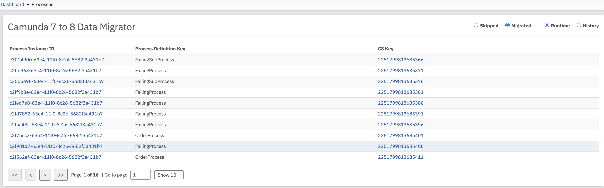
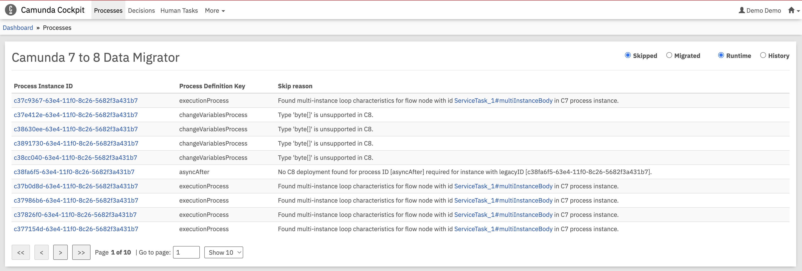
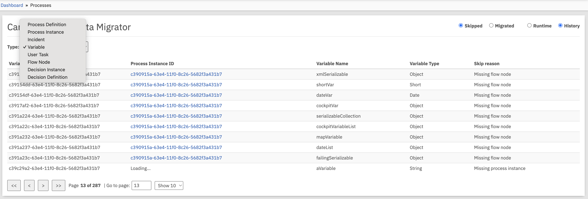
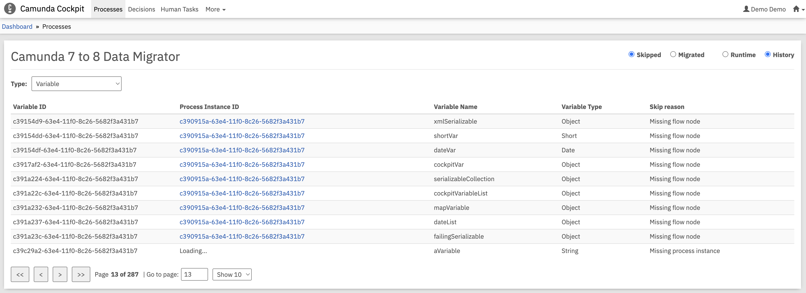

:::warning Experimental Feature
The Cockpit plugin is currently an **EXPERIMENTAL** feature and should be used with caution in production environments.
:::

The Cockpit plugin provides a web-based interface to view information about skipped entities during the migration process. This plugin integrates with Camunda 7 Cockpit to give you visibility into which process instances, variables, or other entities were skipped during migration and why.

Visit the [Camunda 7 documentation](https://docs.camunda.org/manual/latest/webapps/cockpit/extend/plugins/) to learn more about Camunda 7 plugins.

## Prerequisites

To use the Cockpit plugin, you must run the migrator with the following setting:

```yaml
camunda.migrator:
  save-skip-reason: true
```

:::info Required Configuration
Running the migrator with `save-skip-reason` enabled is **required** for the Cockpit plugin to function properly. Without this setting, skip reasons will not be persisted to the database and the plugin will not display it.
:::

## Installation

1. **Download the latest release** from the [releases page](https://github.com/camunda/camunda-7-to-8-data-migrator/releases)
   or **Build the plugin**:

   ```bash
   cd plugins/cockpit
   mvn clean install
   ```

2. **Deploy the plugin** to your Camunda 7 installation by copying the generated JAR file to the Camunda 7 plugins directory.
   For example in case of the Tomcat distribution the path is `/camunda-bpm-ee-tomcat-<Camunda7Version>-ee/server/apache-tomcat-<TomcatVersion>/webapps/camunda/WEB-INF/lib/`

3. **Inspect skipped entities in Cockpit**

## Using the Cockpit Plugin

Once installed and configured, the Cockpit plugin provides:

- **Skipped Entity Overview**: View all entities that were skipped during migration
- **Detailed Skip Reasons**: Understand why specific entities were not migrated
- **Migration Status Tracking**: Monitor the overall progress and health of your migration

## Limitations

The Cockpit plugin has the following limitations in its current experimental state:

- **Performance Impact**: Saving skip reasons may impact migration performance for large datasets
- **Storage Requirements**: Additional database storage is required to persist skip reason data
- **Camunda 7 Dependency**: The plugin requires a running Camunda 7 instance with Cockpit
- **Limited Customization**: UI customization options are currently limited

## Screenshots

The following screenshots demonstrate the Cockpit plugin interface and functionality:

### Migrated Process Instances View

This view shows a table of successfully migrated process instances from Camunda 7 to Camunda 8. The table includes process instance Id, Process Definition Key, and the corresponding Camunda 8 Key.



### Skipped Process Instances Overview

This view shows process instances that were skipped during migration, allowing users to identify which instances failed migration and need attention.



### Entity Type Selection

When viewing historic entities, it is possible to filter them by specific types (such as process instances, variables, tasks, etc.), making it easier to analyze migration issues by category.



### Variable-Specific Skip Analysis

When viewing historic variable data, the type and value of primitives are also retrieved to provide additional context.



## Troubleshooting

**Plugin Not Visible in Cockpit**

- Verify the plugin JAR is in the correct Camunda 7 plugins directory
- Check Camunda 7 logs for plugin loading errors
- Ensure Camunda 7 has been restarted after plugin deployment

**No Skip Data Displayed**

- Confirm `save-skip-reason: true` is set in migrator configuration
- Verify migration has been run with this setting enabled
- Check database connectivity between plugin and migrator database

For additional support with the Cockpit plugin, please refer to the main [troubleshooting section](troubleshooting.md) or create an issue in the project repository.
