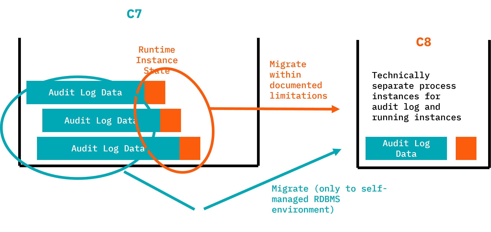

:::info Production Readiness Status

- [Runtime migration](runtime.md): Targeted for Camunda 8.8.
- [History migration](history.md): Experimental and not intended for production usage.
  :::

The data migrator can copy runtime and audit data from Camunda 7 to Camunda 8.

The Data Migrator offers two modes of operation:

1. [Runtime migration](runtime.md): migrate running process instances and continue execution in C8.
   - Will be production-ready with the Camunda 8.8 release.
2. [History migration](history.md): copy audit (history) data to C8 (experimental).
   - Not intended for production, is currently an experimental feature.

| What it migrates                                                                                                                                                     | What it does NOT migrate                                                                                                                                                                                                                                                                                                                                             |
| -------------------------------------------------------------------------------------------------------------------------------------------------------------------- | -------------------------------------------------------------------------------------------------------------------------------------------------------------------------------------------------------------------------------------------------------------------------------------------------------------------------------------------------------------------- |
| <ul><li>Running process instances (state-preserving).</li><li>Process variables and their values.</li><li>Execution history (experimental mode available).</li></ul> | <ul><li>BPMN process models (use the [Migration Analyzer & Diagram Converter](../migration-tooling#migration-analyzer--diagram-converter)).</li><li>Custom code or integrations (use [Code Conversion Utilities](../code-conversion)).</li><li>Users, groups, tenants, and authorizations.</li><li>Task assignments and states (due date, priority, etc.).</li></ul> |

## Key Features

- **State-preserving migration**: Maintains exact execution state of running process instances
- **Variable data migration**: Converts and migrates process variables with proper type handling
- **Validation and verification**: Pre-migration validation to ensure successful migration
- **Skip and retry capabilities**: Handle problematic instances gracefully with retry options
- **Detailed logging and reporting**: Comprehensive logging for monitoring migration progress
- **Database flexibility**: Support for multiple database vendors (H2, PostgreSQL, Oracle)

## Typical choreography of runtime and history migration

As described in [the roll-out phase of the migration journey](../migration-journey.md#6roll-out), you will typically use the following sequence of tasks when applying both data migrations while keeping downtimes to a minimum:

1. Stop the Camunda 7 solution (normally shut down your application).
2. Start the Data Migrator in "running instance migration mode".
3. Wait until running instance migration is completed.
4. Start the new Camunda 8 solution immediately so migrated process instances can continue right away.
5. Start the Data Migrator in "history migration mode".
6. The migrator runs until all history data is migrated while Camunda 8 process execution continues in parallel.

With this approach, the duration of history migration doesn't block big bang migrations.

## Customization

You might need to customize the data migration, especially if you used complex data formats in C7 (for example, Java objects) that need to be converted to something Camunda 8 can handle (for example, JSON). As part of this step, you might also need to extract big payloads and binaries (like documents) into an external data store and reference it from the process (using, for example, upcoming document handling possibilities).

<!-- TODO link to document handling docs -->

## Repository

Track progress and releases: https://github.com/camunda/camunda-7-to-8-data-migrator
