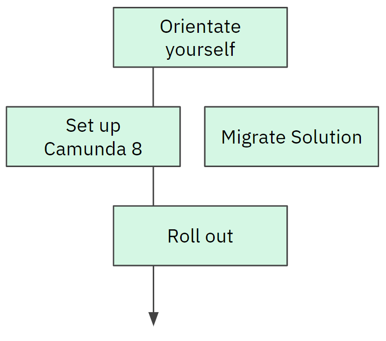
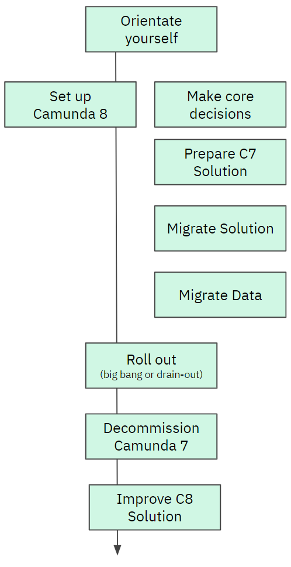
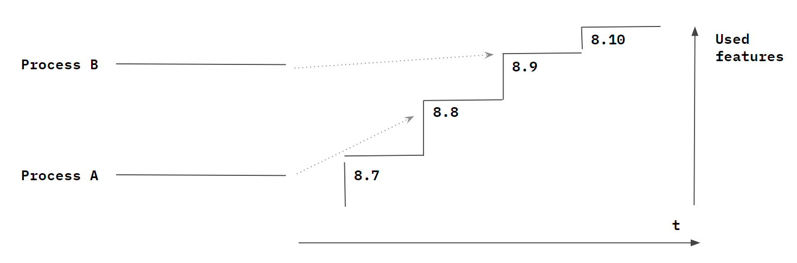
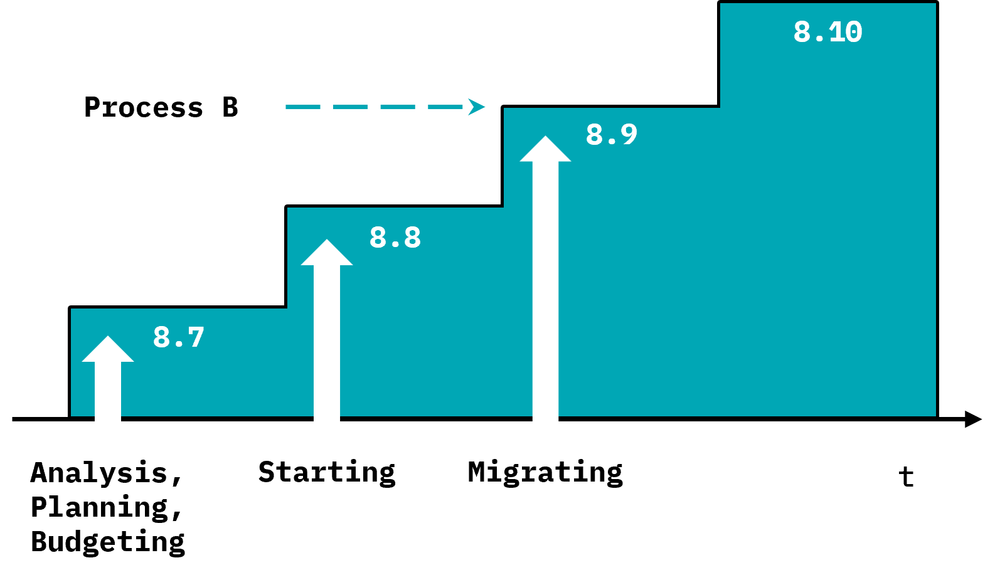
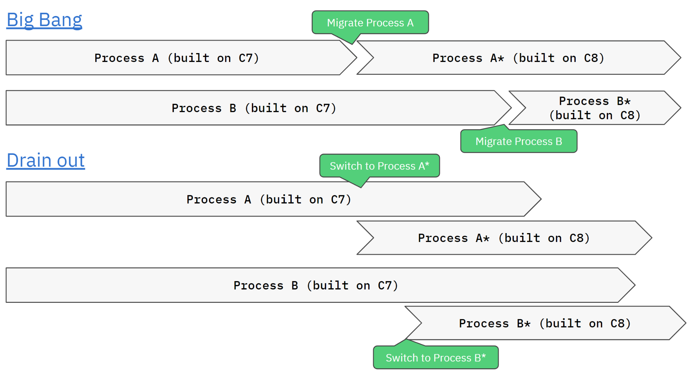
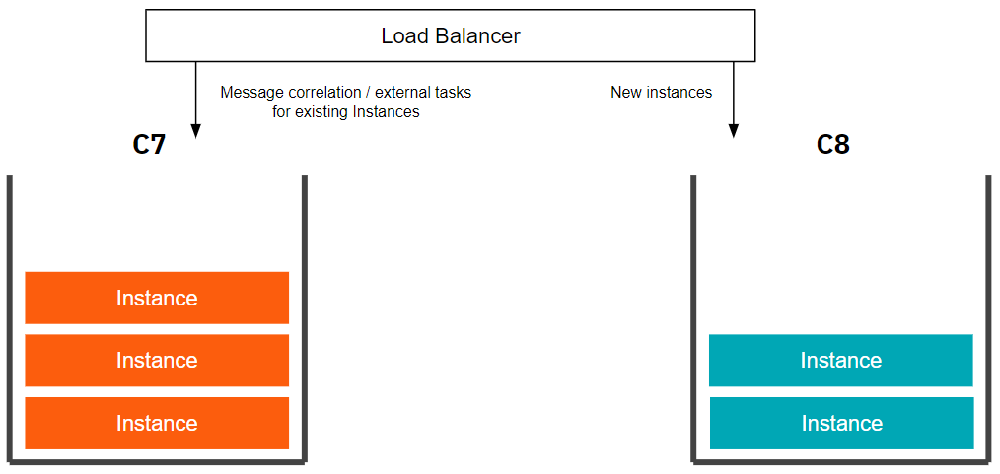
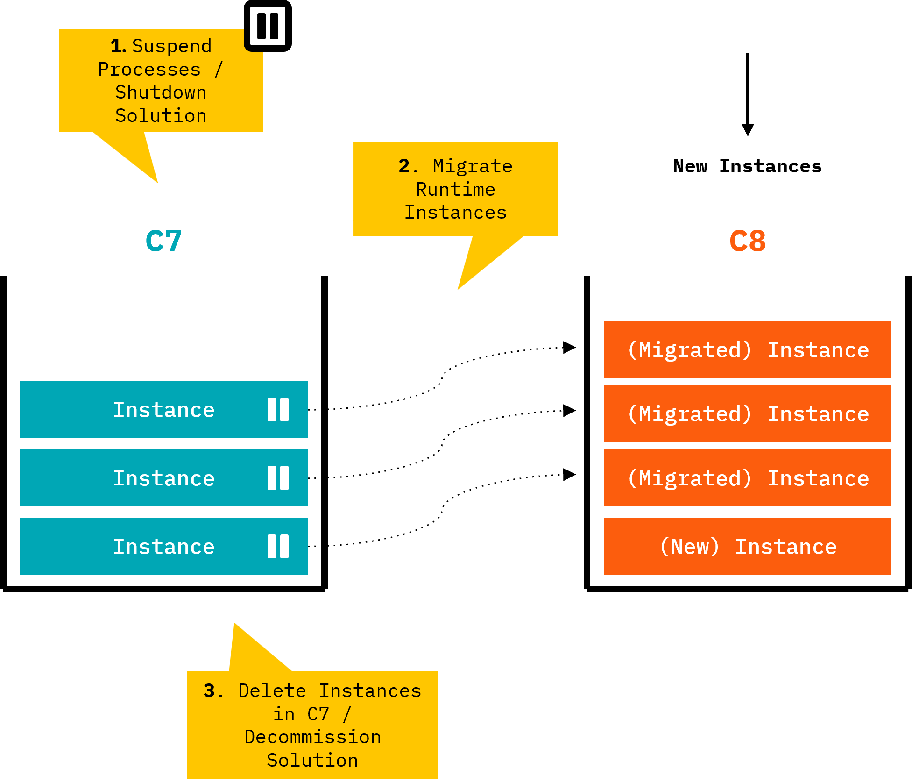

Migration projects differ depending on complexity and approach. However, there is a common theme how they are approached which is described in this guide.

The complexity of Camunda-7-based solutions differ big time. Solutions range from small solutions that implement [clean delegates](http://x) to huge solutions with hundreds of processes doing quite dirty hacks around the Camunda-internal API. This is why this guide describes two typical journeys:

- **A simplified migration journey**: A very simple migration approach, suitable for solutions that are easy to migrate. If your solution fits into this category, migrating it to Camunda 8 will be straightforward.
- **An advanced migration journey**: A sophisticated approach looking into the complexities bigger solutions need to tackle.

Maybe the truth might be even somewhere in the middlefor you. As a rule of thumb we advise to keep things as simple as possible, but of course not simpler.

## Simplified migration journey

First, you need to orientate yourself:

- Use the [[Migration Analyzer]](http://xxx) to get a first understanding of required changes based on your models.
- Explore [[code conversion]](http://xxx) patterns.
- [[Define your target Camunda version]](http://xxx) for migration.

Then you can do two things in parallel:

- Set up Camunda 8, we recommend going with SaaS to keep things simple.
- Migrate your solution, which should hopefully be done by relative simple refactorings.

Once, your adjusted solution is ready for prime time, you roll it out, meaning you deploy it to production and route all new traffic to it. The legacy Camunda-7-solution can either be switched off immediately, or the still running process instances need some time to drain out (read: to complete).

## Advanced migration journey

Let's explore those steps in more detail.

### Orientate yourself

First, you have to understand what needs to be done in order to migrate, and what effort to expect. This allows you to plan (and budget) a migration project properly. The important steps are:

- Understand [conceptual differences between Camunda 7 and Camunda 8](./conceptual-differences/)
- [Analyze your solution](#analyze-your-solution) to get a first understanding of required changes based on your models.
- Explore [code conversion patterns](./code-conversion/)
- [Estimate migration effort](#estimate-migration-effort-and-budget-project) and budget project
- [Define your target Camunda version](#define-your-target-camunda-version-for-migration) and derive a time plan for migration
- [Leverage advisory services](#leverage-guidance-advisory-and-tooling) from Camunda consulting or certified partners.

After orientation you can plan your migration project and start two independent work streams:

- [Set up Camunda 8](#set-up-camunda-8)
- [Migrate your solution(s)](#migrate-solutions)

But let's first understand orientation in a bit more detail.

#### Analyze your solution

Camunda currently develops the **Migration Analyzer**, a tool to gain a first understanding of migration tasks. This tool will be based on the existing [[diagram converter]](https://github.com/camunda-community-hub/camunda-7-to-8-migration/tree/main/backend-diagram-converter), which already today can be used via CLI (command line interface) to produce a CSV file with tasks in your model. Our consultants then import this data into a [[Google Spreadsheet template]](https://docs.google.com/spreadsheets/d/1ZUxGhj1twgTnXadbopw1CvZg_ZvDnB2VXRQDSrKtmcM/edit?gid=6013418#gid=6013418) to analyze what tasks need to be done to migrate. To give you an example, the following report is generated for the [[Camunda 7 invoice example]](https://github.com/camunda/camunda-bpm-platform/tree/master/examples/invoice).

**_TODO: Screenshot Spreadsheet / Results_**

To add some flavor: In a real world customer example, our consultants run 400 BPMN files through that tool, which resulted in roughly 12,000 lines of findings. Analyzing those lines using the spreadsheet reduced that big number to roughly 30 different types of tasks, which made the migration project manageable (and gave hooks for automated refactorings).

Doing this analysis will foster your understanding of what needs to be done in order to migrate.

#### Estimate migration effort and budget project

This analysis is the basis to estimate migration efforts. Our consultants work with rule of thumb numbers how much effort typical tasks require. So, for example, converting a Camunda 7 Java Delegate to a Camunda 8 Job Worker, might result in one hour of work if this just means refactoring the JavaDelegate. It might be more effort if internal Camunda API is used in the delegate though. Looking at [code conversion patterns](<./code-conversion()>) allows you to come up with your own estimate, which you can multiply with the number of tasks from the analyzer.

In past migration projects, this gave us a good ballpark estimation which could be used to plan and budget the project.

#### When to migrate?

It goes without saying that any new projects should already be started using Camunda 8.

For Camunda 7 solutions you need to understand the support timeline for the Camunda 7 product:

- Camunda 7 CE (Community Edition) will EOL (end of life) in October 2025 with a final release (v7.24) happening on Oct 14, 2025.
- There will be no more Camunda 7 CE releases after that date and the GitHub repo will be archived. The code will still be available, but we'll close all issues and pull requests, and update the README to reflect the EOL status.
- Camunda 7 EE (Enterprise Edition) customers will continue to get patch releases (security patches & bug fixes) on a rolling basis till at least 2030.
- Camunda 7 CE users could still switch to Camunda 7 EE to benefit from this long-term support to have enough time for migration.

In that sense, while there is some urgency to start migration efforts, you are not yet under hard pressure.

Note, that migrating to Camunda 8 gives you additional advantages - which might raise priority for your solution - if:

- You are looking to leverage a SaaS offering (e.g. to reduce the effort for hardware or infrastructure setup and maintenance).
- You are in need of performance at scale and/or improved resilience.
- You are in need of certain features that can only be found in Camunda 8 (e.g. BPMN message buffering, improved multi-instance handling, the new Connectors framework, RPA, IDP, or the improved collaboration features in Web Modeler).

#### Define your target Camunda version for migration

Because of the improved core architecture of Camunda 8, features need to be re-added to Camunda 8 step-by-step. That means there is a possibility that the current Camunda 8 version might not yet have sufficient feature parity for your scenario to migrate. Prominent examples are task listeners (which will be introduced with 8.8) or the business key (which is planned to be introduced with 8.9).

If your solution requires those features, it might make sense for you to wait for the Camunda 8 version that will provide these features. You can [check the public feature roadmap](http://x) to understand timelines.

The Camunda version to target might differ per process solution. So for example, Process A might not need additional features and can migrate right away, but Process B might use the business key planned for 8.9. That means, you wait for rolling out migration for Process B till that version. As we are currently running [an architecture streamlining initiative](https://camunda.com/blog/2024/04/simplified-deployment-options-accelerated-getting-started-experience/) to improve the core architecture, which [will be released with Camunda 8.8](https://camunda.com/blog/2025/01/camunda-87-88-release-update/). Unless you have time pressure or momentum to lose, we geenrally recommend to wait for this to happen and target a Camunda version \>= 8.8 for migration.

That said, it is important to note that targeting for example the 8.9 release doesn't mean you wait for it to happen before thinking about migration. Typically you can already do analysis (which you might need to do anyway to understand the right target version), which is also especially important to plan your project and apply for the required budget on time. Doing the migration tasks can also happen before the actual release, either independently or probably based on early alpha versions.

#### Leverage guidance, advisory, and tooling

This guide is the main resource walking you through migration.

As part of your migration journey, you might also want to consider engaging professional services to help you. The main starting points are:

- [Migration evaluation workshop (Camunda)](https://camunda.com/wp-content/uploads/2024/03/Camunda_ConsultingWorkshops_5-Migration-Evaluation_2024.pdf)
- Scoping Workshop (Camunda) **_TODO_**
- Professional advisory services (Camunda, Partners)
- Implementation services (Partners)

Furthermore, you can [[leverage the migration tooling]](./migration-tooling/) and related resources.

### Set Up Camunda 8

To run any solution on Camunda 8, of course you need to have a running Camunda 8 installation.

If you used an embedded engine with Camunda 7 in the past, this model is no longer possible (see [[conceptual differences between Camunda 7 and Camunda 8]](https://docs.camunda.io/docs/next/guides/migrating-from-camunda-7/conceptual-differences/) and this might be new to your organization to operate Camunda in addition to your solution itself. What we see as the most succesful operating model is to have a central team in the organization caring about Camunda, offering it as a self-service platform to others. This is also described in our [process automation Center of Excellence playbook](https://camunda.com/process-orchestration/automation-center-of-excellence/).

There are multiple ways to set up Camunda 8:

- Use **Camunda's SaaS** offering: You don't need to install or operate the platform yourself. This is the most convenient and generally recommended option. If you face legal challenges around information security, privacy and compliance you might to check the [[Camunda Trust Center]](https://camunda.com/trust-center/). Please note that this option comes with limitations. For example you can't [[migrate historical audit data from Camunda 7]](./migration-tooling/) to Camunda 8 SaaS. Or, [[multi-tenancy will just be introduced in SaaS with Camunda 8.8]](https://docs.camunda.io/docs/self-managed/concepts/multi-tenancy/)).

- Run the platform **self-managed**. You might want to have a look at the [[Camunda 8 Run distribution]](http://x) or [[RDBMS support]](http://x) (will be introduced with 8.9), which allows relatively simple setups that Camunda 7 users often like. Still, you can of course also go for [[more scalable options]](http://x). Refer to the [[installation guide]](http://x) for details. **_TODO_**

While setting up Camunda 8 is not part of the core migration journey, it is a pre-requisite and should be tackled early in the migration journey to make sure to not run into any blockers.

### Making Core Decisions

There are a small number of core decisions that will influence your overall migration journey. You might make them later in your journey when you better understand the consequences. But we present them now so that you have them top of mind for the remainder of this guide.

#### Drain-out vs big bang

There are two possible migration scenarios: Drain out and big bang. Both are valid approaches, let's look at the differences briefly. Please note that a "big bang" relates to one process solution only. So if you run multiple processes, you typically migrate them one by one so in multiple big bangs, not in one super big bang. Just that for any of those processes, when you migrate, you flip the switch and are on C8 for those processes.

- **Drain out**: Keep running the C7-based solution, but run the C8-based (migrated) solution in parallel. New process instances are started in the new one. After some time, no processes are active in C7 any more and the C7-based solution can be decommissioned.

- **Big bang**: The solution is migrated from C7 to C8, including data migration scripts. At one moment in time, the C7-based solution is stopped, the data is migrated, and the new C8-based solution is started. This C7 solution can be decommissioned right after.

Let's look at pros and cons of the approaches.

**Drain out**

Pro:

- No downtime
- No data migration required
- Easy fallback to old solution in case of problems

Con:

- Requires code switch (e.g. forwarding messages to either C7 or C8 depending on where the corresponding process was started)
- Duplicate tooling (e.g. one tasklist for C7 and one for C8 processes; same for operators with Cockpit and Optimize)
- Need to operate two solutions at the same time

**Big bang**

Pro:

- Only one solution is running
- No code switches necessary
- No need to support the legacy codebase

Con:

- Requires data migration, at least runtime instances, which has some limitations (see [[documentation]](http://x))
- Complexity of the necessary data migration might drive effort
- Might require a downtime

There are some scenarios where process instances are short lived and the big bang approach can simply drain out existing instances and then restart without the need for data migration, making migration simpler.

**Recommendation**

There is no general recommendation for which strategy to be used.

You could consider the big bang approach less complex in many scenarios. However, there are some indicators to use drain out instead:

- **Short lived processes**: If processes finish quickly, the drain out happens fast and it might even be a possibility to delay new process starts for it to happen.
- **Latency sensitive processes**: Some use cases can't stand the outage time required for data migration. Maybe you can delay data migration and do it after you have already switched to the C8-based solution, otherwise big bang might simply not be feasible or requires a more sophisticated data migration strategy.
- **Risk**: If your use case carries a lot of risk you might not feel comfortable with the big bang. Most often this can be mitigated by properly testing your migration.
- **No switching logic required**: Maybe running the C8-based solution in parallel requires almost no effort on your end (as you don't have user tasks or message receive events), then it might be simply the simpler choice.
- **Complexity of data migration**: If data migration turns out to be complex in your solution, draining out might be the better choice.

**Migrating your solution landscape step-by-step**

If you run multiple process solutions you might best migrate them one by one.

You can also drive this idea one step further. If you have complex solutions with multiple BPMN models, call activities, and further dependencies, even migrating those solutions in one go might be overwhelming. In this case you could apply a microservices mindset and adjust your call activities to be service calls to other components. This way, you could migrate that solution process by process. To be clear: this is not a general recommendation to do this, just illustrating possibilities to reduce the migration scope (read: blast radius) of changes.

#### Adapt existing code vs refactoring

You need to adjust the code of your solution during migration. There are two general possibilities:

1. Keep existing code written for Camunda 7 and add an **adapter** to run it with Camunda 8. The [[Camunda 7 Adapter]](https://github.com/camunda-community-hub/camunda-7-to-8-migration/tree/main/camunda-7-adapter) is a starting point for doing this.
2. **Refactor** your code to work with Camunda 8. The [[code conversion part of this guide]](./code-conversion/) will focus on this approach.

**We generally recommend to refactor your code.** Let's briefly dive into both options.

**Adapt existing Code**

While this approach sounds easy at a first glance, it typically works only with very cleanly implemented Java Delegates (which would also be simply refactored to Job Workers). The Adapter furthermore will not free you from understanding architectural implications (like transactional boundaries), and it does not adapt all assets (for example, the Camunda 7 service API or test cases are not adapted).

In general, the adapter approach therefore is rarely used.

**Refactor code**

You rewrite your code. This follows typical patterns and might even be automated to some extent using OpenRewrite recipes. See the [[code conversion guide]](./code-conversion)) for details.

This approach has the big advantage, that the resulting solution will comply with best practices on how Camunda 8 solutions should be written. Furthermore, architectural differences can be understood better while refactoring the solution. And some projects are also simply happy to clean up a codebase that has grown over time, so they can reduce technical debt as part of the migration effort.

The downside, of course, is the effort required to refactor. The best strategy is to not overengineer the approach for small code bases, but to automate migration of big code bases as much as possible.

### Migrate Solution(s)

The main tasks to migrate your solutions to run on Camunda 8 include:

- Prepare your Camunda 7 solution (optional)
- Convert models
- Convert expressions
- Refactor code
- Improve Camunda 8 Solution (optional)

Let's dive into details of all those tasks.

#### Prepare your Camunda 7 solution (optional)

It can make sense to do a first refactoring step in your Camunda 7 codebase to prepare for easier migration. The advantage of this approach is that you can do changes in a codebase and environment you understand well while you can still run existing test cases without changes, derisking any changes you do.

Typical preparation steps include:

- **Extract complex code from your JavaDelegates** into Camunda-independent classes (e.g. Spring beans) that are then invoked from the original JavaDelegate. This way, you do a step towards [[Clean Delegates]](http://x) that will be easy to refactor.

- **Remove the usage of internal APIs** or calls that depend on the transactionaly integrated architecture of Camunda 7 (e.g. querying the HistoryService within a JavaDelgate and expect it to know current changes already).

- **Increase test coverage** of the solution to increase confidence that code conversions during migration do not break anything. This is especially important if your C7-based solutions lacks good test coverage. To avoid migration effort on test cases, ideally **abstract the test cases from the Camunda version** used, either by using a small own abstraction layer, or by using a test framework like [[Cucumber]](https://cucumber.io/) or [[Sentinel]](https://developer.hashicorp.com/sentinel/docs/intro).
<!-- TODO: Mention Scenario Tests -->

- **Structural changes in your BPMN model** to be runnable on Camunda 8. One trigger could be that you are using constructs that are not supported in Camunda 8 (for example execution listeners on sequence flows). Or you want to get your models into a state that allows runtime data migration (see [data migration](#migrate-data-optional)), e.g. by adding artificial wait states before multi-instance tasks that are not supported for runtime data migration.

- **Replace JUEL expressions with FEEL**. JUEL is not supported in Camunda 8 (see [conceptual differences](./conceptual-differences/)). We [soon release a FEEL plugin for the Camunda 7 platform](https://github.com/camunda/camunda-bpm-platform/issues/2384), allowing you to already rewrite your expressions within your Camunda 7 environment. This might go beyond simply converting JUEL to FEEL, but also removing any calls to Spring beans that are not possible in FEEL. So you might for example add execution listeners invoking the code you need, writing a process variable that then can be evaluated in FEEL.

This step is optional and can also be skipped, either because the codebase is already in a clean state or you are feeling confident to directly convert your codebase to Camunda 8.

#### Convert models

Your BPMN and DMN models need to be adjusted.

The [[Diagram Converter]](./migration-tooling/) takes care of most changes. Depending on how you refactor your code and what elements of Camunda 7 you have used, you can extend or customize the diagram converter to suit your needs.

You can dive into the [technical details of model differences](./technical-details/) if you are interested in more detail.

#### Convert expressions

Your models might contain JUEL expressions, which are not supported in Camunda 8.

Simple expressions are [[directly converted by the Diagram Converter]](https://github.com/camunda-community-hub/camunda-7-to-8-migration/blob/main/backend-diagram-converter/core/src/main/java/org/camunda/community/migration/converter/expression/ExpressionTransformer.java).

Use the [[FEEL copilot]](https://feel-copilot.camunda.com/) to rewrite more complex expressions for you.

Check the [[code conversion patterns section]](./code-conversion/) for typical more complicated scenarios where you use a lot of Java bean logic called from JUEL expressions.

#### Refactor code

You need to refactor your code to use Camunda 8 APIs and SPIs only.

Most prominently you need to convert any API calls to Camunda (e.g. RuntimeService) and the glue code attached to process models (e.g. JavaDelegates). [Code conversion patterns](./code-conversion/) goes into more details how to approach this. Some of those changes might be automated using [[OpenRewrite recipes]](http://x).

Depending on your architecture you might also have to re-architect core parts of your solution. This is especially true if you rely on transaction integration, threading, internal API (like calling the HistoryService from within a JavaDelegate), or features that are deprecated and thus are not planned for Camunda 8. See [[conceptual differences between Camunda 7 and Camunda 8]](https://docs.camunda.io/docs/next/guides/migrating-from-camunda-7/conceptual-differences/) for more details on this.

<!--TODO!!! -->

As part of this effort you also have to rewrite your test cases. If you used [[camunda-bpm-assert]](http://x), a natural choice is to migrate to [[Camunda Process Test]](http://x). You can also leverage [[code conversion patterns]](http://x) or [[OpenRewrite recipes]](http://x). If you use other means of testing (like Cucumber, camunda-bpm-scneario, ...) you need to adjust accordingly.

The [[Code Migration Detector]](https://github.com/camunda-community-hub/camunda-7-to-8-migration/tree/main/code-migration-detector) (based on ArchUnit) can check how much Camunda 7 API is used in your codebase to allow you refactor to reduce the footprint step-by-step. Ideally, you can remove any Camunda 7 dependency at the end of your refactoring.

#### Improve Camunda 8 Solution (optional)

One optional step many customers are doing is to adjust their solution to the latest Camunda best practices after migration. This allows to reduce technical debt or remove workarounds that either krept into the solution over time or during the migration project to go live quicker. This step does not have to block the roll out of your migrated solution and is often done after the fact to remove time pressure and incorporate any learnings operating the Camunda 8 solution.

While this step can happen during code conversion already, it might also make sense to do it in a separate later step to reduce the number of changes during conversion to reduce the risk of breaking things.

While technically it is a great thing to improve your solution, many migration projects are under pressure to run efficiently (read: minimal effort). Therefore it is advisable to at least separate two different goals:

- Migrate the solution
- Improve the solution / reduce further technical debt

While we see a lot of value in doing both tasks at the same time - as you touch a lot of the code anyway and will probably also retest your full solution thoroughly - if the budget is tight it might be better to focus on migration instead of not getting your migration project budgeted.

### Migrate Data (optional)

With your solution code migrated, you also need to look at your production data. Camunda provides the [Data Migrator](./migration-tooling/) to be used for this. You might need to customize the data migrator, especially if you used complex data formats in C7 (e.g. Java objects) that need to be converted to something Camunda 8 can handle (e.g. JSON). As part of this step you might also need to extract big payloads and binaries (like documents) into an external data store and reference it from the process (see [[TODO]](http://x)).

Data to be migrated includes rutnime instances, audit data, and optimize data. Let's look at it one by one.

**Runtime instances**

Currently running process instances. Running means that these process instances are not yet ended and currently wait in some [[wait-state]](http://x). This state is persisted in the database and a corresponding data entry needs to be created in Camunda 8, so that the process instance can continue from that state in the new solution.

Runtime instance migration has limitations, check [migration tooling](./migration-tooling/) for details. As a result you might need to adjust your process models before migration. You can then use [[process version migration]](https://docs.camunda.org/manual/7.22/user-guide/process-engine/process-instance-migration/) in the Camunda 7 environment to migrate process instances to the version that is then migratable to Camunda 8. An interesting strategy can be to define dedicated migration states you want your process instances to pile up in. Another common strategy is to use [[process instance modification]](https://docs.camunda.org/manual/7.22/user-guide/process-engine/process-instance-modification/) in the Camunda 7 environment to move out of states that are not migratable (e.g. process instances within a multiple instance task).

<!-- TODO: Expand -->

Migrating runtime instances is only necessary if you target a big bang migration for your process solution (keep in mind that "bing bang" in this context means to switch one process solution from Camunda 7 to Camunda 8 on a defined point in time - it doesn't mean that you have to migrate all your processes at once). If you drain out your Camunda 7 processes, or if they are typically very short-lived, you do not need runtime instance migration.

**Audit data**

Process instances left traces, often referred to as "history data". These are audit logs when a process instance was started, what path it took, and so on.

It is important to note, that audit data can exist for ended processes from the past, but also for currently still running processes, as those process instances also left traces up to the current wait state.

Many customers need to preserve audit data and want to transfer it to Camunda 8. This can be achieved with the [Data Migrator](./migration-tooling/) but within limitations (most priminently that you need to run Camunda 8 with RDBMS, a feature that is planned to be introduced with 8.9).

Migrating audit data is optional. If you need to do it, consider that audit data migration might need to look at a huge amount of data, which can take time to migrate. But you can run audit data migration beside the normal operations after a successful big bang migration over a period of time, which helps you to keep downtimes low.

**Optimize data**

The process intelligence tool Optimize keeps a lot of audit data to allow various analysis. This data might also want to be migrated when switching to Camunda 8.

Optimize data migration is currently not yet possible but on the roadmap.

### Roll out

After you migrated the solution and prepared and tested the data migration (if necessary) you need to roll out your changes.

- **Drain out**: In a drain out scenario you need to deploy your new solution next to the existing Camunda 7 solution. Then you need to add switching logic in your code, API gateway, or load balancer logic, which redirects traffic to your new solution. However, you still need to correlate callbacks to waiting process instances to the old solution, and might also present user tasks of both solutions to your users.

- **Big bang**: In a big bang scenario, you will typically shutdown the old solution (or at least parts of it for the process under migration), then run the runtime instance migration to make sure all waiting process instances are transferred to the Camunda 8 solution. After this step succeeded, you can start up the new solution and route traffic to it. This approach assumes there can be a downtime of the application. If that is not an option, another alternative is to startup the C8 solution in parallel and just switch the traffic routing without downtime, and then start to migrate runtime instances afterwards.

Audit data migration can run after the switch has happened, after a succesful drain-out (in parallel to normal operations) or of course during the downtime of a big bang. The best approach depends on the amount of data and the possibility for downtimes.

### Decommission Camunda 7 Solution

Whenever you successfully big banged to Camunda 8, or all running processes drained out, you can decommission your Camunda 7 solution. If this was the last Camunda 7 solution, you can further decommission Camunda Platform 7 and related practices completely.
