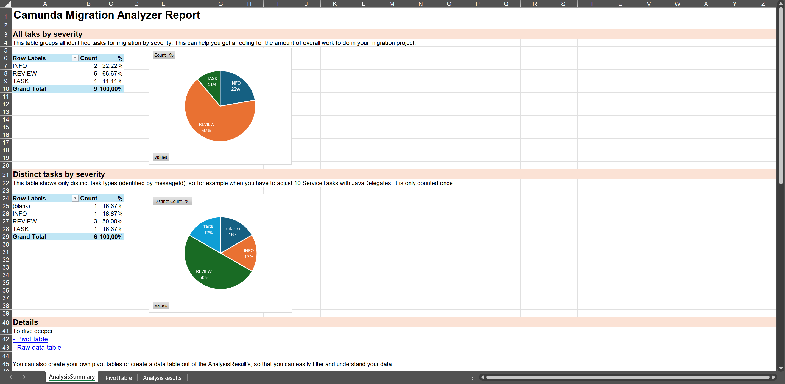
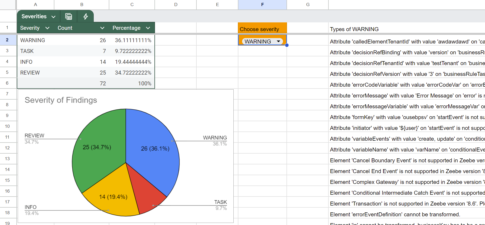

Camunda currently invests in tooling to help support and ease your migration from Camunda 7 to Camunda 8.

:::info
The migration tooling is currently under development, with an initial release planned for **Camunda 8.8 (October 2025)**.
:::

## Migration tools

Camunda provides the following migration tools:

| Migration tool                                | Description                                                                                                                                                                                        |
| :-------------------------------------------- | :------------------------------------------------------------------------------------------------------------------------------------------------------------------------------------------------- |
| **[Migration Analyzer](#migration-analyzer)** | Gain a first understanding of migration tasks. Available for local installation (Java or Docker) or [hosted as a free SaaS offering](https://diagram-converter.consulting-sandbox.camunda.cloud/). |
| **[Data Migrator](#data-migrator)**           | Copies active Camunda 7 runtime instances and existing audit trail data (history) to Camunda 8.                                                                                                    |
| **[Code Converter](#code-converter)**         | Supported by a mixture of diagram conversion tools, code conversion patterns, and automatable refactoring recipes.                                                                                 |
| **[Camunda 7 Adapter](#camunda-7-adapter)**   | Run existing Camunda 7 delegation code directly in a Camunda 8 environment.                                                                                                                        |

## Migration Analyzer

The **Migration Analyzer** is a tool to gain a first understanding of migration tasks. It analyzes Camunda 7 model files (BPMN or DMN) and derives a list of tasks you will need to do when migrating those models to Camunda 8.

In a second step, it can also convert those filese from the Camunda 7 to the Camunda 8 format. For example, it adjusts the namespace or adjust XML property names if they have changed.

The identified tasks are grouped by severity:

- INFO: Just a feedback that some elements need to change, but they can be converted automatically
- REVIEW: A hint, that the automatic conversion did some work, that requires at least a review. For example, there is a simplified conversion of expressions that always need a human eye.
- TASK: You have to adjust the converted model or add additional information to make it work with Camunda 8.
- WARNING: You will have to look into this finding. A warning could for example indicate, that an element of the original process is not (yet) supported by Camunda 8.

This allows you to focus on important findings. You can further group tasks by their type, so for example changing a JavaDelegate to a JobWorker might occur 100 times in your codebase, but is still one and the same pattern.

You can use the Migration Analyzer in the following ways:

- **Web Interface**: An interactive web-based wizard, implemented as a Java Spring Boot + React application. This can be installed
  - locally as Java jar,
  - using Docker, or
  - consumed as SaaS from our free hosted version.
- **CLI**: A Command-Line Interface for the Migration Analyzer, implemented as a Java application.

The results of the analysis is provided as:

- **XSLS**: Microsoft Excel file, that includes pre-built Pivot tables to drill into the data properly,
- **CSV**: As comma-separated list, which can be imported into any spreadsheet tool you like to use.

Let's go over this step-by-step:

- [How to install?](#installation)
- [How to analyze your models?](#analyzing-your-models-using-the-web-interface)
- [How to convert your models?](#converting-your-models)

### Installation

Please refer to the [Installation Guide](https://github.com/camunda-community-hub/camunda-7-to-8-migration-analyzer#installation) for local installation.

For a free SaaS version that can be used right away, just navigate to [https://diagram-converter.consulting-sandbox.camunda.cloud/](https://diagram-converter.consulting-sandbox.camunda.cloud/).

### Analyzing your models using the Web Interface

After [local installation](https://github.com/camunda-community-hub/camunda-7-to-8-migration-analyzer#installation), you can access the Migration Analyzer via [http://localhost:8080/](http://localhost:8080/) (or you use the [SaaS deployment](https://diagram-converter.consulting-sandbox.camunda.cloud/) that doesn't require any local installation).

The wizard should be self-explantory. You simply upload one or more models and click **analyze**:


Now you can:

- Download the analyzer result as Microsoft Excel file
- Download the analyzer result as CSV file
- Download the converted models either indicidually or as complete ZIP file.

Let's explore how to use those results.

### Understanding analyzer results using Microsoft Excel



The XLSX file contains three tabs:

- AnalysisSummary: Some PivotTables and Diagrams showing typical analysis tasks. Feel free to adjust to your needs.
- PivotTable: One big pivot table that allows to dynamically explore the data set. Feel free to adjust to your needs.
- AnalysisResults: The raw data provided by the analysis step. This can also be copied in any other spreadhseet or crunched in the way that is helpful to you.

Note that this file can be either opened with a local installation of Microsoft Excel or the online equivalent in Office 365.

### Understanding analyzer results using Google Sheets or Libre Office

You can also open/import the XSLX file into Google Sheets, Libre Office, Open Office, or the tool of your choice. The plain data is corretly imported, but the pivot table logic gets removed. This might be totally OK for your use case, otherwise please use the appropriate wizard in your tool to re-create the pivot tables.

The best way to work with other tools is to create your own template file in this tool and then copy and paste the analysis data from the downloaded Excel file (take everything from the AnalysisResults tab).

If you use Google Sheets you can for example leverage this [Google Spreadsheet template](https://docs.google.com/spreadsheets/d/1ZUxGhj1twgTnXadbopw1CvZg_ZvDnB2VXRQDSrKtmcM/edit?gid=6013418#gid=6013418) that the Camunda consultants are sometimes using.



### Understanding analyzer results using any other tool via CSV

Instead of copy and pasting data from the XSLX file, you can of course also just download the results as CSV and important this into the tool of your choice.

### Analyzing your models using the CLI

You can also use a command line tool if you prefer. This can be useful if you want to convert many files in different locations.

After [local installation](https://github.com/camunda-community-hub/camunda-7-to-8-migration-analyzer#installation), the CLI can be called and prints a help:

```shell
java -jar camunda-7-to-8-migration-analyzer-cli.jar local
Missing required parameter: '<file>'
Usage: backend-diagram-converter-cli local [-dhoV] [--check] [--csv]
       [--delegate-execution-as-job-type] [--disable-append-elements]
       [--disable-default-job-type] [--md] [-nr]
       [--default-job-type=<defaultJobType>]
       [--platform-version=<platformVersion>] [--prefix=<prefix>] <file>
Converts the diagram from the given directory or file

Execute as:

java -Dfile.encoding=UTF-8 -jar backend-diagram-converter-cli.jar local

Parameter:
      <file>                 The file to convert or directory to search in
Options:
      --check                If enabled, no converted diagrams are exported
      --csv                  If enabled, a CSV file will be created containing
                               the conversions results
      --xslx                 If enabled, a XSLX file will be created containing
                               the analysis results
  -d, --documentation        If enabled, messages are also appended to
                               documentation
      --default-job-type=<defaultJobType>
                             If set, the default value from the
                               'converter-properties.properties' for the job
                               type is overridden
      --delegate-execution-as-job-type, --delegate-expression-as-job-type
                             If enabled, sets the delegate expression as the
                               job type
      --disable-append-elements
                             Disables adding conversion messages to the bpmn xml
      --disable-default-job-type
                             Disables the default job type
  -h, --help                 Show this help message and exit.
      --md, --markdown       If enabled, a markdown file will be created
                               containing the results for all conversions
      -nr, --not-recursive   If enabled, recursive search in subfolders will be
                               omitted
  -o, --override             If enabled, existing files are overridden
      --platform-version=<platformVersion>
                             Semantic version of the target platform, defaults
                               to latest version
      --prefix=<prefix>      Prefix for the name of the generated file
                               Default: converted-c8-
  -V, --version              Print version information and exit.
```

### Converting your models

As indicated above, the Migration Analyzer can also convert your Camunda 7 BPMN and CMN models to be executable with Camunda 8.

It therefore will adjust the XML files and for example change the namespace. Refer to [technical details](../technical-details.md) to understand details around those conversions.

The analyzer can provide converted diagrams via the web interface or CLI.

Note that you can extend or customize the converter to suit your needs, see [Extending the Migration Analyzer](https://github.com/camunda-community-hub/camunda-7-to-8-migration-analyzer?tab=readme-ov-file#how-to-extend-diagram-conversion) for details.

If your models also contain JUEL expressions, which are not supported in Camunda 8, they also need to be converted. Simple expressions are [directly converted by this code](https://github.com/camunda-community-hub/camunda-7-to-8-migration-analyzer/blob/main/core/src/main/java/org/camunda/community/migration/converter/expression/ExpressionTransformer.java). You can check what it can already do in the respective [test case](https://github.com/camunda-community-hub/camunda-7-to-8-migration-analyzer/blob/main/core/src/test/java/org/camunda/community/migration/converter/ExpressionTransformerTest.java). You can also extend the transformer to suit your needs.

// document the expression transformer instead of referencing code

Note that the [FEEL copilot](https://feel-copilot.camunda.com/) might be very helpful to rewrite more complex expressions for you.

## Data Migrator

The data migrator can copy runtime and audit data from Camunda 7 to Camunda 8.

:::info
Camunda is developing the Data Migrator with a first release planned for **Camunda 8.8 (October 2025)**. Iterative improvements might follow.
:::


It provides two important modes that can be applied separately:

- Runtime instance migration mode
- History migration mode

### Runtime instance migration mode

Migrate currently running process instances. Running means that these process instances in Camunda 7 are not yet ended and currently wait in some [wait-state](https://docs.camunda.org/manual/latest/user-guide/process-engine/transactions-in-processes/#wait-states). This state is persisted in the database and a corresponding data entry needs to be created in Camunda 8, so that the process instance can continue from that state in the new solution.

**Requirements and limitations:**

// TODO this is an important deep link - we need to create a headline here

- The Runtime Data Migrator needs to access the Camunda 7 database.
- The Runtime Data Migrator needs to access Camunda 8 APIs (which means you can also use this tool when you run on SaaS).
- Multiple Instance is not supported, so process instances that are currently waiting in a multiple instance task cannot be migrated and need to be moved out of that state in Camunda 7 beforehand.

If you need to adjust your process models before migration, you can use [process version migration](https://docs.camunda.org/manual/7.22/user-guide/process-engine/process-instance-migration/) in the Camunda 7 environment to migrate process instances to versions that are migratable to Camunda 8. An interesting strategy can be to define dedicated migration states you want your process instances to pile up in. Another common strategy is to use [process instance modification](https://docs.camunda.org/manual/7.22/user-guide/process-engine/process-instance-modification/) in the Camunda 7 environment to move out of states that are not migratable (for example, process instances within a multiple instance task).

// TODO pile up: mention the job pause feature in Camunda 7

### History migration mode (copying audit log data)

Process instances left traces, referred to as [History in Camunda 7](https://docs.camunda.org/manual/latest/user-guide/process-engine/history/). These are audit logs of when a process instance was started, what path it took, and so on.

It is important to note that audit data can exist for ended processes from the past, but is also available for currently still running process instances, as those process instances also left traces up to the current wait state.

The History Data Migrator can copy this audit data to Camunda 8.

Audit data migration might need to look at a huge amount of data, which can take time to migrate. In early measurements, migrating 10,000 process instances took around 10 minutes, but the number varies greatly based on the amount of data attached to a process instance (for example, user task instances, variable instances, and so on).

You can run audit data migration alongside normal operations (for example, after the successful big bang migration of runtime process instances) so that it doesn't require downtime and as such, the performance might not be as critical as for runtime instance migration.

**Requirements and limitations:**

- The History Data Migrator needs to access the Camunda 7 database.
- The History Data Migrator can only migrate to Camunda 8 **if a relational database (RDBMS) is used**, a feature planned for **Camunda 8.9**.
- The History Data Migrator needs to access the Camunda 8 database (which means you can only run this tool in a **self-managed environment**).
- If runtime and history data are migrated at the same time, you will end up with two instances in Camunda 8: a canceled historic process instance and an active new one in the runtime. They are linked by process variables.

### Typical choreography of runtime and history migration

As described in [the roll-out phase of the migration journey](./migration-journey.md#6roll-out), you will typically use the following sequence of tasks when applying both data migrations while keeping downtimes to a minimum:

1. Stop the Camunda 7 solution (normally shut down your application).
2. Start the Data Migrator in "running instance migration mode".
3. Wait until running instance migration is completed.
4. Start the new Camunda 8 solution immediately so migrated process instances can continue right away.
5. Start the Data Migrator in "history migration mode".
6. The migrator runs until all history data is migrated while Camunda 8 process execution continues in parallel.

With this approach, the duration of history migration doesn't block big bang migrations.

### Customization of Data Migrator

You might need to customize the data migration, especially if you used complex data formats in C7 (for example, Java objects) that need to be converted to something Camunda 8 can handle (for example, JSON). As part of this step, you might also need to extract big payloads and binaries (like documents) into an external data store and reference it from the process (using, for example, upcoming document handling possibilities).

// TODO link to document handling docs

## Code Converter

Code conversion is described in [Code Conversion](./code-conversion.md).

## Camunda 7 Adapter

The adapter and its documentation are available on GitHub: [Camunda 7 Adapter](https://github.com/camunda-community-hub/camunda-7-to-8-migration/tree/main/camunda-7-adapter).
