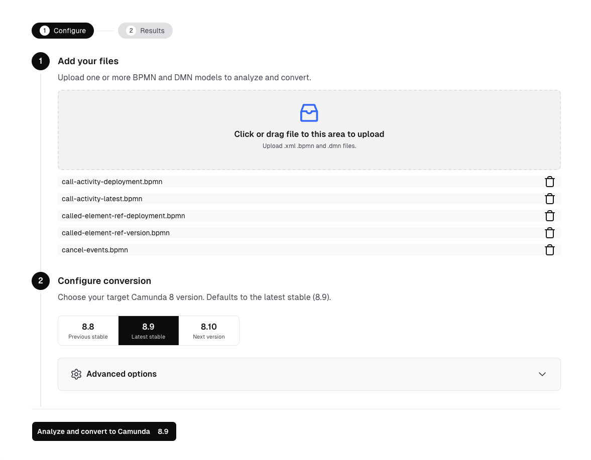
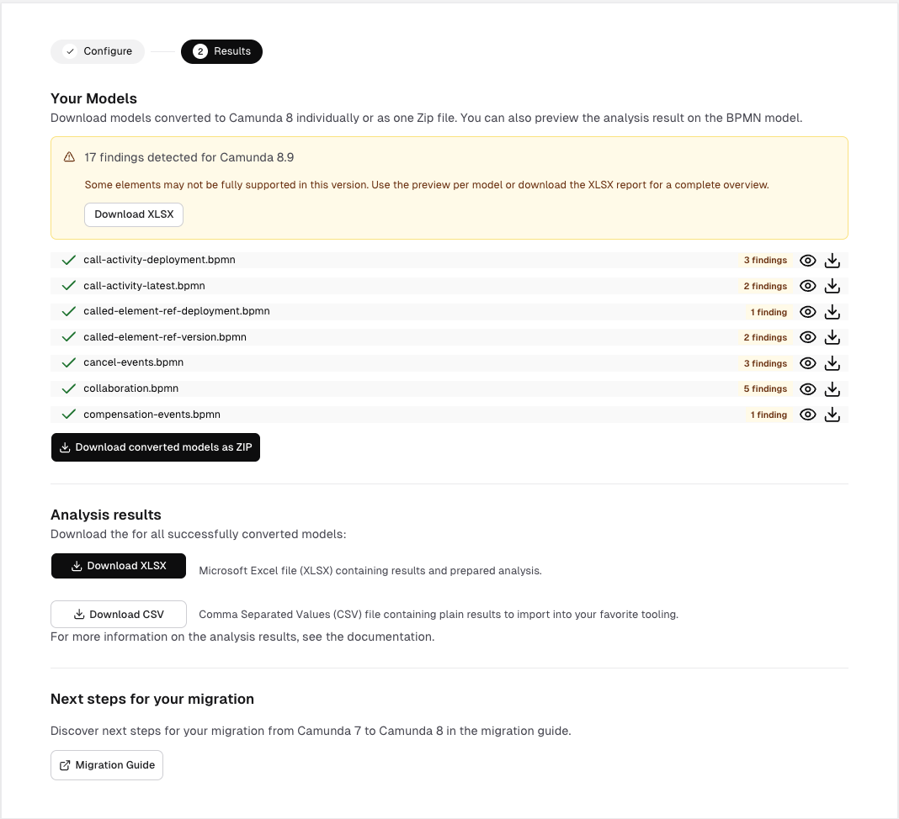
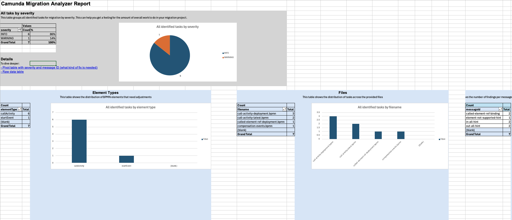
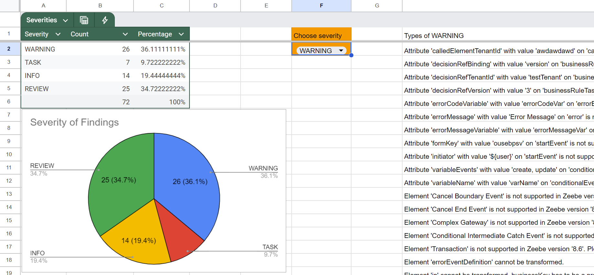

import Tabs from "@theme/Tabs";
import TabItem from "@theme/TabItem";

With **Diagram Converter**, you'll get an initial understanding of the migration tasks you'll need to perform when moving from Camunda 7 to Camunda 8. It analyzes Camunda 7 BPMN, DMN, and Camunda 7 form definition files (`.form`) and generates a list of tasks required for the migration.

In a second step, it can also convert these files from the Camunda 7 format to the Camunda 8 format. For example, it updates namespaces, renames XML properties, and updates form metadata, if needed.

All BPMN elements supported by Camunda 8 can be transformed. For the full list see the [BPMN coverage page](../../../components/modeler/bpmn/bpmn-coverage.md).

:::tip Automate diagram conversion with AI
Use the [Camunda migration agent skill](./index.md#agentic-migration) to run the Diagram Converter CLI as part of an end-to-end migration workflow, resolve conversion findings with AI, and focus on reviewing migration-ready results.
:::

You can use the Diagram Converter in the following ways:

- **Web Interface**: A wizard-like UI built with Java (Spring Boot) and React. Available versions:
  - Java JAR
  - Docker
  - Free, hosted SaaS
- **CLI**: A command-line interface implemented in Java.

The results are available as:

- **XLSX**: A Microsoft Excel file, including pre-built pivot tables for data exploration.
- **CSV**: A plain-text comma-separated file, compatible with any spreadsheet tool.
- **JSON**: A flat, machine-readable report for AI assistants and other automation.

In the following sections, you'll learn how to:

- [Install the Diagram Converter](#install-the-diagram-converter)
- [Analyze your diagrams and forms using the web interface](#analyze-your-diagrams-using-the-web-interface)
- [Download JSON analysis results](#download-json-analysis-results)
- [Use the CLI](#use-the-cli)
- [Convert your diagrams](#convert-your-diagrams)
- [Convert Camunda 7 forms](#convert-camunda-7-forms)
- [Extend the conversion logic](#extend-the-conversion-logic)
- [Convert expressions](#convert-expressions)

## Install the Diagram Converter

### Hosted Diagram Converter

Use the hosted Diagram Converter at [https://diagram-converter.camunda.io/](https://diagram-converter.camunda.io/). This option requires no local setup and is suitable for quick evaluations or one-off migrations.

Your models are not stored on this platform, and all processing happens in-memory. Your data is transmitted securely over HTTPS.

:::note
The hosted version has a limit on the number of files that can be processed in a single batch request. If you need to convert a larger number of files, use the [local web application](#local-web-application) or the [CLI](#use-the-cli).
:::

### Local web application

#### Prerequisites

- Java 21 or later

#### Steps

1. Download the latest `camunda-7-to-8-diagram-converter-webapp-{version}.jar` from [GitHub Releases](https://github.com/camunda/camunda-7-to-8-migration-tooling/releases).
2. Run the application:

   ```shell
   java -jar camunda-7-to-8-diagram-converter-webapp-{version}.jar
   ```

3. Access the web application at [http://localhost:8080/](http://localhost:8080/).

To run the application on a different port, for example `8090`:

```shell
java -jar camunda-7-to-8-diagram-converter-webapp-{version}.jar --server.port=8090
```

To increase the maximum number of files allowed per batch request (default is 100), configure `server.tomcat.max-part-count`:

```shell
java -jar camunda-7-to-8-diagram-converter-webapp-{version}.jar --server.tomcat.max-part-count=200
```

### CLI installation

#### Prerequisites

- Java 21 or later

#### Steps

1. Download the latest `camunda-7-to-8-diagram-converter-cli-{version}.jar` from [GitHub Releases](https://github.com/camunda/camunda-7-to-8-migration-tooling/releases).
2. Verify the installation:

   ```shell
   java -jar camunda-7-to-8-diagram-converter-cli-{version}.jar --help
   ```

## Analyze your diagrams using the web interface

Open the Diagram Converter:

- For a local installation, open [http://localhost:8080/](http://localhost:8080/).
- For the hosted SaaS version, open [https://diagram-converter.camunda.io/](https://diagram-converter.camunda.io/).

Upload one or more BPMN, DMN, or `.form` files, then configure the conversion target:



In **Configure conversion**, select the target Camunda 8 version. The default is the latest stable version, and you can select other supported versions to estimate migration impact for that target runtime.

If needed, expand **Advanced options** to fine-tune conversion behavior before starting the run.

Click **Analyze and convert to Camunda 8.x**.

Review the results:



On this screen you can:

- See the total number of findings for the selected target version
- Review findings per file, and open a preview for BPMN, DMN, or form files
- Download converted files individually, or download all converted files as a ZIP
- Download the analyzer results as a Microsoft Excel file (XLSX)
- Download the analyzer results as a CSV file
- Download the analyzer results as a JSON file for AI-assisted migration tooling

Analysis results contain a list of items where each row represents an action item required for migrating your solution to Camunda 8. Findings are calculated for the selected target Camunda 8 version and grouped by severity:

- **INFO**: No action needed. Diagram conversion can successfully map attributes to the Camunda 8 implementation.
- **REVIEW**: The conversion will modify some expressions or attributes. Please verify that the intended functionality remains unchanged.
- **WARNING**: A Camunda 7 concept cannot be directly mapped to a Camunda 8 equivalent. Consider reviewing the Camunda 8 roadmap or exploring possible workarounds.
- **TASK**: Manual changes are required to make the diagram work in Camunda 8.

This allows you to focus on the most important findings. Tasks can also be grouped by type. For example, changing a `JavaDelegate` to a `JobWorker` might appear 100 times in your codebase, but still represents just one recurring pattern.

Pivot tables can help you identify tasks that appear multiple times across different files, providing a comprehensive overview of migration efforts.

Next, you'll learn how to use those results.

### Download JSON analysis results

Download the analysis results as JSON when you want to use them with AI-assisted migration tooling or other automation.

- In the web interface, click **Download JSON**.
- In the CLI, pass `--json` to create `analysis-results.json` in the target directory. If that file already exists, the converter creates a numbered variant instead of overwriting it.

<details>
<summary>View JSON report details</summary>

The JSON report is a flat array with one object per finding.

Each finding includes the following fields:

| Field         | Description                                 |
| ------------- | ------------------------------------------- |
| `filename`    | Name of the source file                     |
| `elementName` | Name of the BPMN, DMN, or form element      |
| `elementId`   | ID of the element                           |
| `elementType` | Type of the element                         |
| `severity`    | Finding severity                            |
| `messageId`   | Identifier for the finding category         |
| `message`     | Finding description                         |
| `link`        | Link to conversion guidance, when available |

The CLI and web interface use the same flat JSON format. Use XLSX for human review and CSV when importing findings into spreadsheet tools.

</details>

### Analyze results in Microsoft Excel



The XLSX file includes three tabs:

- **AnalysisSummary**: Pivot tables and charts that summarize typical migration tasks.
- **PivotTable**: A large pivot table for dynamic data exploration.
- **AnalysisResults**: The raw data from the analysis, which you can copy, import, or process further.

You can open the file using Microsoft Excel (desktop or Office 365).

### Analyze results in Google Sheets or LibreOffice

You can also open the XLSX file in Google Sheets, LibreOffice, OpenOffice, or similar tools. The raw data will be imported correctly, but pivot tables won't be preserved.

Alternatively, download the results as a CSV file, and import them directly into your preferred tool.

In this case, either:

- Create your own pivot table in the tool.
- Copy the contents of the **AnalysisResults** tab into your own spreadsheet.

For Google Sheets, consider using this [Google Spreadsheet template](https://docs.google.com/spreadsheets/d/1ZUxGhj1twgTnXadbopw1CvZg_ZvDnB2VXRQDSrKtmcM/edit?gid=6013418#gid=6013418) created by Camunda consultants.



## Use the CLI

If you prefer the command line, use the CLI for batch processing or automation.

The CLI supports two modes:

- **local**: Analyze and convert diagrams from your file system
- **engine**: Analyze and convert diagrams directly from a running Camunda 7 process engine

### Local mode

The local CLI accepts a file or directory. When you provide a directory, it scans the directory and its subdirectories by default for `.bpmn`, `.bpmn20.xml`, `.dmn`, `.dmn11.xml`, and `.form` files, then processes every supported file it finds (use `-nr, --not-recursive` to disable recursion).

```shell
java -jar camunda-7-to-8-diagram-converter-cli-{version}.jar local myDiagram.bpmn --json --xlsx
```

To process all BPMN, DMN, and form files in a directory and its subdirectories:

<Tabs groupId="os" defaultValue="maclinux" values={[
{ label: 'Mac OS + Linux', value: 'maclinux' },
{ label: 'Windows', value: 'windows' }
]}>

<TabItem value="maclinux">

```shell
java -jar camunda-7-to-8-diagram-converter-cli-{version}.jar local ./my-processes/
```

</TabItem>

<TabItem value="windows">

```shell
java -jar camunda-7-to-8-diagram-converter-cli-{version}.jar local .\my-processes\
```

</TabItem>

</Tabs>

Key options for `local` mode:

| Option               | Description                                                   |
| -------------------- | ------------------------------------------------------------- |
| `--platform-version` | Semantic version of the target platform (defaults to latest)  |
| `--csv`              | Create a CSV file with analysis results                       |
| `--json`             | Create a JSON file with analysis results                      |
| `--xlsx`             | Create an XLSX file with analysis results                     |
| `--prefix`           | Prefix for the generated file name (default: `converted-c8-`) |
| `-o, --override`     | Override existing files                                       |

To see all available options:

```shell
java -jar camunda-7-to-8-diagram-converter-cli-{version}.jar local --help
```

<details>
<summary>Local mode parameter reference</summary>

| Parameter                                              | Description                                                                     |
| ------------------------------------------------------ | ------------------------------------------------------------------------------- |
| `<file>`                                               | File to convert or directory to scan for diagrams and forms                     |
| `--add-data-migration-execution-listener`              | Add an execution listener on blank start events for the Camunda 7 Data Migrator |
| `--always-use-default-job-type`                        | Always use the configured default job type                                      |
| `--check`                                              | Analyze only, without exporting converted diagrams                              |
| `--csv`                                                | Create a CSV file with analysis results                                         |
| `--json`                                               | Create a JSON file with analysis results                                        |
| `-d, --documentation`                                  | Also append messages to diagram documentation                                   |
| `--data-migration-execution-listener-job-type=<value>` | Override the listener job type from `converter-properties.properties`           |
| `--default-job-type=<value>`                           | Override the default job type from `converter-properties.properties`            |
| `--disable-append-elements`                            | Disable appending conversion messages to BPMN or DMN XML                        |
| `-h, --help`                                           | Show help and exit                                                              |
| `--keep-job-type-blank`                                | Keep job types blank so you can set them manually after conversion              |
| `--md, --markdown`                                     | Create a Markdown results file                                                  |
| `-nr, --not-recursive`                                 | Do not scan subdirectories recursively                                          |
| `-o, --override`                                       | Override existing files                                                         |
| `--platform-version=<platformVersion>`                 | Set target Camunda 8 semantic version                                           |
| `--prefix=<prefix>`                                    | Prefix for generated file names (default: `converted-c8-`)                      |
| `-V, --version`                                        | Print version information and exit                                              |
| `--xlsx`                                               | Create an XLSX file with analysis results                                       |

</details>

### Engine mode

Use engine mode to process diagrams directly from a running Camunda 7 engine via its REST API:

```shell
java -jar camunda-7-to-8-diagram-converter-cli-{version}.jar engine http://localhost:8080/engine-rest --json --xlsx
```

Key options for `engine` mode:

| Option                   | Description                                                    |
| ------------------------ | -------------------------------------------------------------- |
| `--platform-version`     | Semantic version of the target platform (defaults to latest)   |
| `-u, --username`         | Username for Basic authentication                              |
| `-p, --password`         | Password for Basic authentication                              |
| `-t, --target-directory` | Directory to save the .bpmn files (default: current directory) |
| `--csv`                  | Create a CSV file with analysis results                        |
| `--json`                 | Create a JSON file with analysis results                       |
| `--xlsx`                 | Create an XLSX file with analysis results                      |

To see all available options:

```shell
java -jar camunda-7-to-8-diagram-converter-cli-{version}.jar engine --help
```

<details>
<summary>Engine mode parameter reference</summary>

| Parameter                                              | Description                                                                           |
| ------------------------------------------------------ | ------------------------------------------------------------------------------------- |
| `<url>`                                                | Fully qualified Camunda 7 REST API URL (default: `http://localhost:8080/engine-rest`) |
| `--add-data-migration-execution-listener`              | Add an execution listener on blank start events for the Camunda 7 Data Migrator       |
| `--always-use-default-job-type`                        | Always use the configured default job type                                            |
| `--check`                                              | Analyze only, without exporting converted diagrams                                    |
| `--csv`                                                | Create a CSV file with analysis results                                               |
| `--json`                                               | Create a JSON file with analysis results                                              |
| `-d, --documentation`                                  | Also append messages to diagram documentation                                         |
| `--data-migration-execution-listener-job-type=<value>` | Override the listener job type from `converter-properties.properties`                 |
| `--default-job-type=<value>`                           | Override the default job type from `converter-properties.properties`                  |
| `--disable-append-elements`                            | Disable appending conversion messages to BPMN or DMN XML                              |
| `-h, --help`                                           | Show help and exit                                                                    |
| `--keep-job-type-blank`                                | Keep job types blank so you can set them manually after conversion                    |
| `--md, --markdown`                                     | Create a Markdown results file                                                        |
| `-o, --override`                                       | Override existing files                                                               |
| `-p, --password`                                       | Password for Basic authentication                                                     |
| `--platform-version=<platformVersion>`                 | Set target Camunda 8 semantic version                                                 |
| `--prefix=<prefix>`                                    | Prefix for generated file names (default: `converted-c8-`)                            |
| `-t, --target-directory=<targetDirectory>`             | Directory to save converted `.bpmn` files                                             |
| `-u, --username=<username>`                            | Username for Basic authentication                                                     |
| `-V, --version`                                        | Print version information and exit                                                    |
| `--xlsx`                                               | Create an XLSX file with analysis results                                             |

</details>

## Convert your diagrams

As mentioned, the Diagram Converter can also convert BPMN and DMN diagrams for use with Camunda 8.

This includes:

- Updating namespaces
- Adjusting XML structure and properties
- Transforming expressions

Converted files can be downloaded via the web interface or generated via the CLI.

## Convert Camunda 7 forms

The Diagram Converter supports Camunda 7 form definitions stored as `.form` files.

You can upload `.form` files in the web interface or include them in a local CLI conversion. For each form, the converter:

- Updates `executionPlatform` to `Camunda Cloud` and sets `executionPlatformVersion` to the selected target version.
- Converts exact simple JUEL variable references such as `${customerName}` or `#{customerName}` in component properties to FEEL, for example `= customerName`.
- Leaves complex expressions, interpolation, method calls, and Camunda 7 execution context references unchanged and reports them for manual migration.
- Preserves the form schema version and deprecated component properties because changing them without schema-aware migration could alter form behavior.

Form findings are included in the same analysis reports as BPMN and DMN findings. The web interface provides a read-only form preview. The CLI scans `.form` files in local directories, and `--check` analyzes forms without exporting converted form files.

:::note
Generated Task Forms are not static `.form` files, so the Diagram Converter does not process them. The [Camunda migration agent skill](./index.md#agentic-migration) handles them during agentic migration by creating or adapting a standard Camunda 8 form and linking it from the converted BPMN. Unsupported validation rules and ambiguous behavior remain review items.
:::

## Extend the conversion logic

You can extend the conversion logic by implementing custom visitors and conversions using the Java Service Provider Interface (SPI). This lets you:

- Add custom conversion rules for proprietary extensions
- Modify how specific BPMN elements are transformed
- Add custom analysis messages

For implementation details and examples, see the [extension example on GitHub](https://github.com/camunda/camunda-7-to-8-migration-tooling/tree/main/diagram-converter/extension-example).

## Convert expressions

JUEL expressions used in Camunda 7 aren't supported in Camunda 8. The Diagram Converter tries to [convert simple expressions, automatically](https://github.com/camunda/camunda-7-to-8-migration-tooling/blob/8a9a37/diagram-converter/core/src/main/java/io/camunda/migration/diagram/converter/expression/ExpressionTransformer.java). For an overview of what’s supported, see the [ExpressionTransformer test case](https://github.com/camunda/camunda-7-to-8-migration-tooling/blob/8a9a37/diagram-converter/core/src/test/java/io/camunda/migration/diagram/converter/ExpressionTransformerTest.java).

You may have to manually rewrite more complex expressions. The [FEEL Copilot](https://feel-copilot.camunda.com/) can help with this.

You can also customize or extend the transformer logic as needed.
