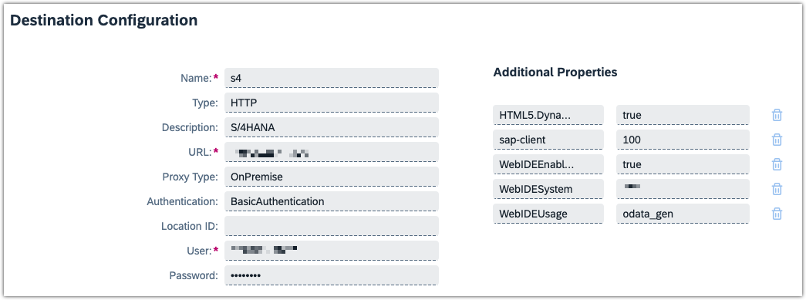

# SAP Integration

Camunda's SAP Integration consists of several -in the non-technical sense- packages. Together they live under the umbrella term "SAP Integration", yet each fulfilling a dedicated purpose. Every package of the SAP Integration can be used standalone w/o any tight coupling to the others.

- SAP OData outbound connector: interact with an S/4HANA or ECC System via OData v2 + v4 APIs, directly from your BPMN model task
- SAP RFC outbound connector: query BAPIs and remote-enable function modules on SAP ECC Systems
- SAP BTP Integration
  - use Tasklist's forms as Fiori UI
  - operate BTP services from BPMN tasks
  - Inbound proxy endpoint: start Process Instances of BPMN models, including custom variables

## SAP OData protocol outbound connector

The SAP OData protocol outbound connector (or short: SAP OData connector) runs as a docker image on BTP. 

It is designed to run in [hybrid connector mode](https://docs.camunda.io/docs/guides/use-connectors-in-hybrid-mode/), living in the customer's BTP (sub-)account in the Cloud Foundry environment.

It connects to Camunda 8 SaaS, utilizing BTP's Destination  and Connectivity concept to query an SAP system, via both OData v2 and v4.

### Prerequisistes

The Connector integrates into a standard BTP landscape and doesn't need any proprietary setup.

Yet a minimum set of SAP infrastructure requirements need to be in place for the SAP OData connector docker image to run:

- BTP subaccount with a [Cloud Foundry environment](https://discovery-center.cloud.sap/serviceCatalog/cloud-foundry-runtime?region=all) enabled and a [Space created](https://help.sap.com/docs/btp/sap-business-technology-platform/create-spaces)

- minimum [1GB storage quota, 2 GB runtime memory](https://help.sap.com/docs/btp/sap-business-technology-platform/managing-space-quota-plans)

- [Entitlements](https://help.sap.com/docs/btp/sap-business-technology-platform/managing-entitlements-and-quotas-using-cockpit) for

  - [Connectivity Service](https://discovery-center.cloud.sap/serviceCatalog/connectivity-service?region=all), `lite` plan (to connect to the SAP is on-premises)
  - [Destination Service](https://discovery-center.cloud.sap/serviceCatalog/destination?service_plan=lite&region=all&commercialModel=btpea), `lite` plan

- 1 or more instance- or subaccount-level destinations, pointing to the SAP systems to communicate with.
  

  :warning: check that `Additional Properties` are correctly set on the Destination
  Here's a recommended set of Properties:

  ```json
  HTML5.DynamicDestination: true
  sap-client: <client/"Mandant" to work with on the SAP system>
  WebIDEEnabled: true
  WebIDESystem: <SAP system ID>
  WebIDEUsage: odata_gen
  ```

  :warning: Currently, only `BasicAuthentication` is supported on the Destination by the SAP OData connector.

### Deployment to BTP

Log into the desired BTP subaccount via the Cloud Foundry `cli` (cf-cli):

```shell
$> cf login
API endpoint: https://api.cf. ...
...
```

(explain mtad)

Use the `mtad.yaml.template` depyloment descriptor template. fill in your info and credentials, and rename it to `mtad.yaml`.

Eventually adjust the names of the destination- and connectivity-instances to your liking.

Then deploy the SAP OData connector via the cf-cli:

```shell
$> cf deploy ./ # append the -f flag to shortcircuit ongoing deployments
Deploying multi-target app archive /Some/path/sap-odata-connector.mtar in org <your-org> / space <your-space> as you@example.org ..
...
Application "sap-odata-connector" started and available at "some.url.hana.ondemand.com"
```

### Deployment in Camunda 8 SaaS

Import the Element Template to use the Connector.


### Working with the Connector in Camunda Modeler

- make sure the connection from the Cloud Foundry environment via the destination to the SAP systems works.
  Using the [Terminal in Business Application Studio](https://community.sap.com/t5/technology-blogs-by-sap/how-to-check-the-connectivity-to-your-backend-system-in-business/ba-p/13479832) is a quick way to verify that. 
- validate requests first in an API client before trying with the SAP OData connector in Modeler, then copy over to the Element template fields
  → saves time and reduces potential error sources