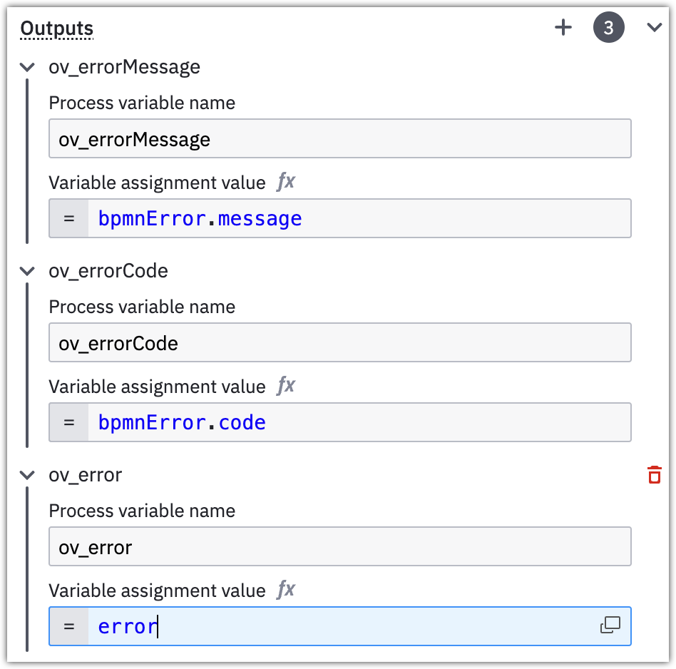

# SAP OData protocol outbound connector

The SAP OData protocol outbound connector (or short: SAP OData connector) runs as a docker image on BTP. 

It is designed to run in [hybrid connector mode](https://docs.camunda.io/docs/guides/use-connectors-in-hybrid-mode/), living in the customer's BTP (sub-)account in the Cloud Foundry environment.

It connects to Camunda 8 SaaS, and utilizes BTP's Destination  and Connectivity concept to query an SAP system, via both OData v2 and v4.

> [!IMPORTANT]
>
> The connector is in alpha phase available upon request - please use the https://camunda.com/contact to get in touch.


## For the impatient User

Here's a BPMN visualization of the steps necessary to get going with the SAP OData connector:

(embed diagram from https://modeler.camunda.io/share/80928b7d-9c2d-46ef-b1c7-cf776916b687)

## Prerequisites

The Connector integrates into a standard BTP landscape and doesn't need any proprietary setup.

Yet a minimum set of SAP infrastructure requirements need to be in place for the SAP OData connector docker image to run:

- [Cloud Foundry cli](https://github.com/cloudfoundry/cli) with [multiapps plugin](https://github.com/cloudfoundry/multiapps-cli-plugin) installed on the machine doing the deployment

- BTP subaccount with a [Cloud Foundry environment](https://discovery-center.cloud.sap/serviceCatalog/cloud-foundry-runtime?region=all) enabled and a [Space created](https://help.sap.com/docs/btp/sap-business-technology-platform/create-spaces)

- minimum [1GB storage quota, 2 GB runtime memory](https://help.sap.com/docs/btp/sap-business-technology-platform/managing-space-quota-plans)

- [Entitlements](https://help.sap.com/docs/btp/sap-business-technology-platform/managing-entitlements-and-quotas-using-cockpit) for

  - [Connectivity Service](https://discovery-center.cloud.sap/serviceCatalog/connectivity-service?region=all), `lite` plan (to connect to the SAP is on-premises)
  - [Destination Service](https://discovery-center.cloud.sap/serviceCatalog/destination?service_plan=lite&region=all&commercialModel=btpea), `lite` plan

- one or more instance- or subaccount-level destinations, pointing to the SAP systems to communicate with.
  

  :warning: check that `Additional Properties` are correctly set on the Destination
  Here's a recommended set of Properties:

  ```json
  HTML5.DynamicDestination: true
  sap-client: <client/"Mandant" to work with on the SAP system>
  WebIDEEnabled: true
  WebIDESystem: <SAP system ID>
  WebIDEUsage: odata_gen
  ```

  :warning: Currently, only `BasicAuthentication` is supported on the Destination by the SAP OData connector.

## Deployment to BTP

A descriptor file is all that's necessary to deploy the SAP OData connector to a space in a BTP subaccount. An exemplary deployment descriptor `mtad.yaml.example` is provided by us. It is a standard format in BTP's Cloud Foundry environment to describe the application that needs deployment.

Adjust the values to match those of the targeted Camunda 8 SaaS environment and rename it to `mtad.yaml`. Eventually adjust the names of the BTP destination- and connectivity-instances to your liking - both will be created automatically for you at deploy time. If instances in your subaccount of any of the two services exist, they will not be replaced, but reused.

After creating the `mtad.yaml` , log into the desired BTP subaccount via the [Cloud Foundry `cli`](https://github.com/cloudfoundry/cli) (cf-cli):

```shell
$> cf login
API endpoint: https://api.cf. ...
...
```

Then deploy the SAP OData connector via the `cf-cli`. Note that this requires t[he "multiapps" plugin of Cloud Foundry](https://github.com/cloudfoundry/multiapps-cli-plugin) to be installed on the machine the deployment runs on. 

```shell
$> cf deploy ./ # append the -f flag to shortcircuit ongoing deployments
Deploying multi-target app archive /Some/path/sap-odata-connector.mtar in org <your-org> / space <your-space> as you@example.org ..
...
Application "sap-odata-connector" started and available at "some.url.hana.ondemand.com"
```

## Deployment in Camunda 8 SaaS

If using the Web Modeler,  [import the SAP OData connector's Element Template](https://docs.camunda.io/docs/components/connectors/manage-connector-templates/#importing-existing-connector-templates) for use at design time.


If using the Desktop Modeler, [follow the standard importing procedure](https://docs.camunda.io/docs/components/modeler/desktop-modeler/element-templates/configuring-templates/).

## Working with the SAP OData connector in Camunda Modeler

### Modeling Options

The modeling of the "SAP OData connector" task is similar to any other Camunda connector. When the BPMN task is selected, the properties pane in the modeler shows the respective options. 

Note that the configuration options will dynamically change with the selected HTTP method and the OData protocol version! For example, a `payload` field is only displayed when the HTTP method is other than "GET". 


Specifying the `BTP destination name` allows for (re-)using existing Destinations from the subaccount or instance level. Authentication and authorizations are maintained at that level - that's why it's not necessary to maintain credentials for the connector. Please note that currently only `BasicAuthentication` is supported on the Destination by the SAP OData connector.

### Advanced capabilities

In addition to the basic OData settings such as Service, Entity or EntitySet, method and OData version, the "Advanced" section allow to finetune `GET` queries to the SAP method with all standard parameters. For example, supplying `$filter` and `$select` parameters help in reducing data transferred over the wire. And `$expand` helps in retrieving additional entities with a single query.


### Query result structure

The result of any query, be it reading or writing to the SAP system, is in JSON format and holds this structure:

```json
{
  result: <further json>,
  statusCode: <http status code>,
  countOrInlineCount: <integer, optional!>
}
```

- `result` contains the ...well... result of the query - be it content retrieved from an SAP system via `GET` or the result of a write or update operation via `POST`, `PUT`, `PATCH`, or `DELETE`. (Note that with the latter, the `result` is always empty.)
- `statusCode` holds the [HTTP status code](https://developer.mozilla.org/en-US/docs/Web/HTTP/Status) of the operation.
- `countOrInlineCount` is only present in the response when the corresponding option `$inlinecount` (for OData v2) or `$count` (for OData v4) was checked in the design time of the BPMN task. It then shows the number of results from `GET` query to the SAP system.


The query result can either be mapped to a single result variable or be worked on [via FEEL with an expression](https://docs.camunda.io/docs/next/components/connectors/use-connectors/#result-expression). So would `getResponse` as result variable contain the above described query JSON in its entirety, as to what the result expression `{getStatusCode: statusCode}` would only hold the HTTP status code in the `getStatusCode` process variable.

### Error handling

The SAP OData connector allow for handling of query error directly in the model. This means that an OData error is relayed to the process instance in the reserved variables `bpmnError` and `error` and can be processed accordingly. 

Equip the connector task with an error handling expression such as:

```js
if error.code = "400" then
  bpmnError("400", "client request is bad", { errorMessage: error.message, errorCode: error.code })
else if error.code = "404" then
  bpmnError("404", "queried resource not found", { errorMessage: error.message, errorCode: error.code })
else if error.code = "500" then 
  bpmnError("500", "server error", { errorMessage: error.message, errorCode: error.code })
else if error.code = "503" then 
  bpmnError("503", "I'm just an proxy teapot", { errorMessage: error.message, errorCode: error.code })
else 
  null
```


Specifically note the third parameter to `bpmnError` :

```js
{ errorMessage: error.message, errorCode: error.code }
```

It relays the error message and code to the next step in the process flow.

Then equip the BPMN task with an Error Boundary event:


In case of the SAP OData connector encountering an error, the boundary event will catch that and continue the process flow from there. The Error Boundary Event can receive these configuration parameters to contain further error details:



- `errorMessage` contains a verbose version of the error message and cause and relays it into the process scope as `ov_errorMessage`
- `errorCode` holds a predefined value describing the scope of the error, relaying it to the process scope as `errorCode`
  It can be one of:
  - `INVALID_PAYLOAD` the payload of the request was detected as erroneous by the server
  - `REQUEST_ERROR` the request contained an error, e.g. wrong combination of `GET` query parameters
  - `GENERIC_ERROR`
  - `DESTINATION_ERROR` an error occurred while claiming the Destination from the runtime environment
- `error` is the serialized Error object, available in the exampel above as `ov_error`.

## Tips

- make sure the connection from the Cloud Foundry environment via the destination to the SAP systems works.
  Using the [Terminal in Business Application Studio](https://community.sap.com/t5/technology-blogs-by-sap/how-to-check-the-connectivity-to-your-backend-system-in-business/ba-p/13479832) is a quick way to verify that. 
- validate requests first in an API client before trying with the SAP OData connector in Modeler, then copy over to the Element template fields
  → saves time and reduces potential error sources
- any payload size <= 2.5MB can be considered safe.