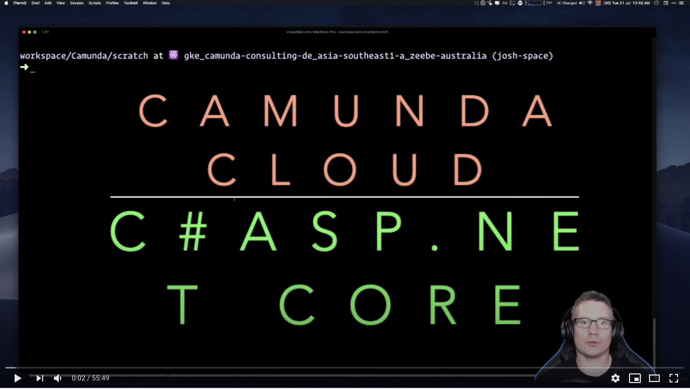
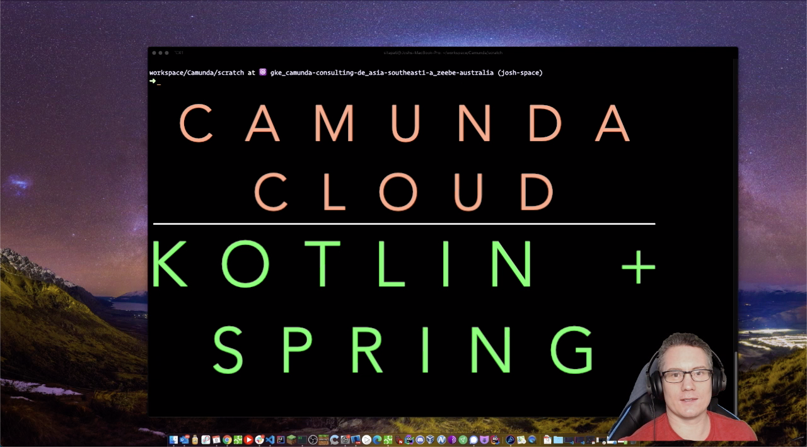
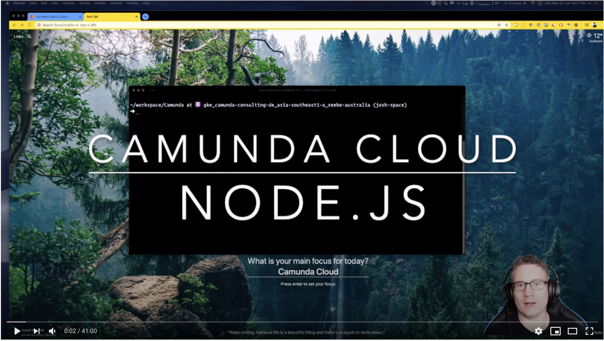
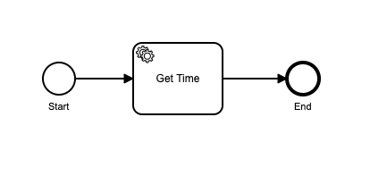
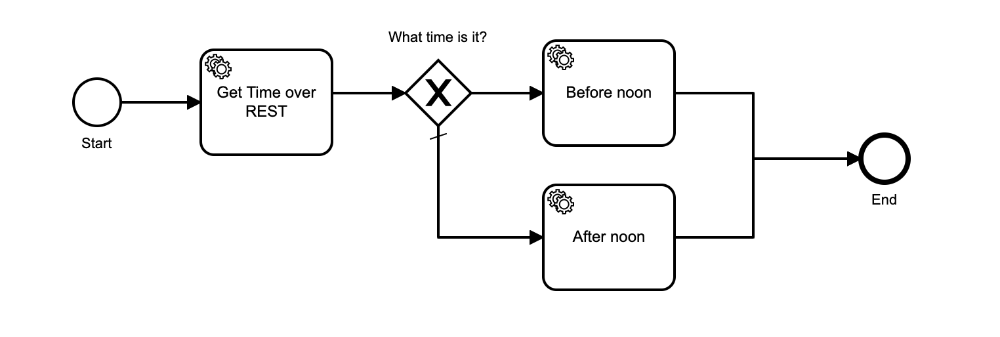

import Tabs from "@theme/Tabs";
import TabItem from "@theme/TabItem";

<Tabs groupId="language" defaultValue="csharp" values={
[
{ label: 'C# / ASP.NET Core 3', value: 'csharp', },
{ label: 'Go', value: 'go', },
{ label: 'Java + Spring', value: 'javaspring', },
{ label: 'Kotlin + Spring', value: 'kotlin', },
{ label: 'NodeJS', value: 'nodejs', },
] }>

<TabItem value="csharp">

_Approximate time to complete: 1 hour_

The [Zeebe C# Client](https://github.com/zeebe-io/zeebe-client-csharp) is available for .NET Zeebe applications.

Watch a [video tutorial on YouTube](https://youtu.be/a-0BtrRY4M4) walking through this Getting Started Guide.

[](https://youtu.be/a-0BtrRY4M4)

</TabItem>

<TabItem value="go">

_Estimated time to complete: 60 minutes_

The [Zeebe Go Client](https://github.com/zeebe-io/zeebe/tree/develop/clients/go) is available for Go applications.

Watch a [video tutorial on YouTube](https://youtu.be/_GQuqEwzWKM) walking through this Getting Started Guide.

[](https://youtu.be/_GQuqEwzWKM)

View [the complete project on GitHub](https://github.com/jwulf/camunda-cloud-getting-started-go).

</TabItem>

<TabItem value="java">
</TabItem>

<TabItem value="javaspring">

The [Spring Zeebe Client](https://github.com/zeebe-io/spring-zeebe) is available for Spring and Spring Boot applications.

Watch a [video tutorial on YouTube](https://youtu.be/7vBxJmXD3Js) walking through this Getting Started Guide.

[](https://youtu.be/7vBxJmXD3Js)

</TabItem>

<TabItem value="kotlin">

The [Spring Zeebe Client](https://github.com/zeebe-io/spring-zeebe) is available for Spring and Spring Boot applications.

Watch a [video tutorial on YouTube](https://youtu.be/TFDSv8YAazI) walking through this Getting Started Guide.

[](https://youtu.be/TFDSv8YAazI)

</TabItem>

<TabItem value="nodejs">

The [Zeebe Node Client](https://github.com/creditsenseau/zeebe-client-node-js) exists for Node.js applications.

Watch a [video tutorial on YouTube](https://youtu.be/AOj64vzEZ_8) walking through this Getting Started Guide.

[](https://youtu.be/AOj64vzEZ_8)

</TabItem>

</Tabs>

## Prerequisites

<Tabs groupId="language" defaultValue="csharp" values={
[
{ label: 'C# / ASP.NET Core 3', value: 'csharp', },
{ label: 'Go', value: 'go', },
{ label: 'Java + Spring', value: 'javaspring', },
{ label: 'Kotlin + Spring', value: 'kotlin', },
{ label: 'NodeJS', value: 'nodejs', },
] }>

<TabItem value="csharp">

- [Zeebe Modeler](https://github.com/zeebe-io/zeebe-modeler/releases)

</TabItem>

<TabItem value="go">

- [Go 1.13+](https://golang.org/dl/)
- [Zeebe Modeler](https://github.com/zeebe-io/zeebe-modeler/releases)

</TabItem>

<TabItem value="java">
</TabItem>

<TabItem value="javaspring">

- [Zeebe Modeler](https://github.com/zeebe-io/zeebe-modeler/releases)

</TabItem>

<TabItem value="kotlin">

- [Zeebe Modeler](https://github.com/zeebe-io/zeebe-modeler/releases)

</TabItem>

<TabItem value="nodejs">

- [Node.js](https://nodejs.org)
- [Zeebe Modeler](https://github.com/zeebe-io/zeebe-modeler/releases)

</TabItem>

</Tabs>

## Scaffolding the project

<Tabs groupId="language" defaultValue="csharp" values={
[
{ label: 'C# / ASP.NET Core 3', value: 'csharp', },
{ label: 'Go', value: 'go', },
{ label: 'Java + Spring', value: 'javaspring', },
{ label: 'Kotlin + Spring', value: 'kotlin', },
{ label: 'NodeJS', value: 'nodejs', },
] }>

<TabItem value="csharp">

[Video link](https://youtu.be/a-0BtrRY4M4?t=43)

- Create a new .NET Core Web API application:

```bash
dotnet new webapi -o Cloudstarter
cd Cloudstarter
```

- Add the [Zeebe C# Client](https://www.nuget.org/packages/zb-client/) from Nuget:

```bash
dotnet add package zb-client --version 0.16.1
```

**Configure NLog for logging**

[Video link](https://youtu.be/a-0BtrRY4M4?t=96)

- Install NLog packages (we'll use NLog):

```bash
dotnet add package NLog
dotnet add package NLog.Schema
dotnet add package NLog.Web.AspNetCore
```

- Create a file `NLog.config`, with the following content:

```xml
<?xml version="1.0" encoding="utf-8" ?>
<nlog xmlns="http://www.nlog-project.org/schemas/NLog.xsd"
      xmlns:xsi="http://www.w3.org/2001/XMLSchema-instance"
      autoReload="true"
>
    <extensions>
        <add assembly="NLog.Web.AspNetCore"/>
    </extensions>

    <targets>
        <target name="logconsole" xsi:type="Console"
                layout="${longdate} | ${level:uppercase=true} | ${logger} | ${message} ${exception:format=tostring}"/>
     </targets>

    <rules>
       <logger name="*" minlevel="Trace" writeTo="logconsole" />
     </rules>
</nlog>
```

- Edit the file `Program.cs` to configure NLog:

```c#
public class Program
{
    public static async Task Main(string[] args)
    {
        var logger = NLogBuilder.ConfigureNLog("NLog.config").GetCurrentClassLogger();
        try
        {
            logger.Debug("init main");
            await CreateHostBuilder(args).Build().RunAsync();
        }
        catch (Exception exception)
        {
            logger.Error(exception, "Stopped program because of exception");
            throw;
        }
        finally
        {
            NLog.LogManager.Shutdown();
        }
    }

    private static IHostBuilder CreateHostBuilder(string[] args) =>
        Host.CreateDefaultBuilder(args)
            .ConfigureWebHostDefaults(webBuilder => { webBuilder.UseStartup<Startup>(); })
            .ConfigureLogging(logging =>
            {
                logging.ClearProviders();
                logging.SetMinimumLevel(LogLevel.Trace);
            })
            .UseNLog();
}
```

</TabItem>

<TabItem value="go">

[Video link](https://youtu.be/_GQuqEwzWKM?t=41)

- Run the following command to create a new Go project:

```bash
mkdir -p $GOPATH/src/github.com/$USER/cloud-starter
cd $GOPATH/src/github.com/$USER/cloud-starter
```

- Add the [Zeebe Go Client](https://github.com/zeebe-io/spring-zeebe) to the project:

```bash
go get -u github.com/zeebe-io/zeebe/clients/go/...
```

</TabItem>

<TabItem value="java">
</TabItem>

<TabItem value="javaspring">

- Download a maven Spring starter from [here](https://start.spring.io/#!type=maven-project&language=java&platformVersion=2.3.1.RELEASE&packaging=jar&jvmVersion=11&groupId=io.camunda&artifactId=cloudstarter&name=cloudstarter&description=Getting%20Started%20with%20Camunda%20Cloud%20and%20Spring%20Boot&packageName=io.camunda.cloudstarter&dependencies=webflux).

- Unzip it into a new directory.

[Video link](https://youtu.be/7vBxJmXD3Js?t=71)

- Add the [Spring Zeebe Client](https://github.com/zeebe-io/spring-zeebe) dependency to the `pom.xml` file:

```xml
<dependency>
    <groupId>io.zeebe.spring</groupId>
    <artifactId>spring-zeebe-starter</artifactId>
    <version>0.23.0</version>
</dependency>
```

[Video link](https://youtu.be/7vBxJmXD3Js?t=192)

</TabItem>

<TabItem value="kotlin">

- Download a maven Spring starter from [here](https://start.spring.io/#!type=maven-project&language=kotlin&platformVersion=2.3.1.RELEASE&packaging=jar&jvmVersion=11&groupId=io.camunda&artifactId=cloudstarter&name=cloudstarter&description=Getting%20Started%20with%20Camunda%20Cloud%20and%20Spring%20Boot&packageName=io.camunda.cloudstarter&dependencies=webflux).

- Unzip it into a new directory.

[Video link](https://youtu.be/TFDSv8YAazI?t=27)

- Add the [Spring Zeebe Client](https://github.com/zeebe-io/spring-zeebe) dependency to the `pom.xml` file:

```xml
<dependency>
    <groupId>io.zeebe.spring</groupId>
    <artifactId>spring-zeebe-starter</artifactId>
    <version>0.23.0</version>
</dependency>
```

[Video link](https://youtu.be/TFDSv8YAazI?t=119)

</TabItem>

<TabItem value="nodejs">

- Install tools:

```bash
npm i -g typescript ts-node
```

[Video link](https://youtu.be/AOj64vzEZ_8?t=30)

- Create project:

```bash
mkdir camunda-cloud-get-started-node
cd camunda-cloud-get-started-node
npm init -y
tsc --init
```

[Video link](https://youtu.be/AOj64vzEZ_8?t=95)

- Edit `tsconfig.json` with the following config:

```json
{
  "compilerOptions": {
    "target": "es2020",
    "module": "commonjs",
    "outDir": "./dist",
    "rootDir": "./src",
    "strict": true,
    "noImplicitAny": false,
    "esModuleInterop": true,
    "skipLibCheck": true,
    "forceConsistentCasingInFileNames": true
  }
}
```

[Video link](https://youtu.be/AOj64vzEZ_8?t=155)

- Install `zeebe-node` and `dotenv`:

```
npm i zeebe-node dotenv
```

</TabItem>

</Tabs>

## Create Camunda Cloud cluster

<Tabs groupId="language" defaultValue="csharp" values={
[
{ label: 'C# / ASP.NET Core 3', value: 'csharp', },
{ label: 'Go', value: 'go', },
{ label: 'Java + Spring', value: 'javaspring', },
{ label: 'Kotlin + Spring', value: 'kotlin', },
{ label: 'NodeJS', value: 'nodejs', },
] }>

<TabItem value="csharp">

[Video link](https://youtu.be/a-0BtrRY4M4?t=299)

</TabItem>

<TabItem value="go">

[Video link](https://youtu.be/_GQuqEwzWKM?t=84)

</TabItem>

<TabItem value="java">
</TabItem>

<TabItem value="javaspring">

[Video link](https://youtu.be/7vBxJmXD3Js?t=233)

</TabItem>

<TabItem value="kotlin">

[Video link](https://youtu.be/TFDSv8YAazI?t=148)

</TabItem>

<TabItem value="nodejs">

[Video link](https://youtu.be/AOj64vzEZ_8?t=198)

</TabItem>

</Tabs>

- Log in to [https://camunda.io](https://camunda.io).
- Create a new Zeebe Cluster.
- When the new cluster appears in the console, create a new set of client credentials.
- Copy the client Connection Info environment variables block.

## Configure connection

<Tabs groupId="language" defaultValue="csharp" values={
[
{ label: 'C# / ASP.NET Core 3', value: 'csharp', },
{ label: 'Go', value: 'go', },
{ label: 'Java + Spring', value: 'javaspring', },
{ label: 'Kotlin + Spring', value: 'kotlin', },
{ label: 'NodeJS', value: 'nodejs', },
] }>

<TabItem value="csharp">

[Video link](https://youtu.be/a-0BtrRY4M4?t=409)

- Add the `dotenv.net` package to the project:

```bash
dotnet add package dotenv.net.DependencyInjection.Microsoft
```

- Edit `Startup.cs` and add the service in the `ConfigureServices` method:

```c#
public void ConfigureServices(IServiceCollection services)
{
    // ...
    services.AddEnv(builder => {
        builder
            .AddEnvFile("CamundaCloud.env")
            .AddThrowOnError(false)
            .AddEncoding(Encoding.ASCII);
    });
    services.AddEnvReader();
}
```

- Create a file in the root of the project `CamundaCloud.env`, and paste the client connection details into it, removing the `export` from each line:

```bash
ZEEBE_ADDRESS=656a9fc4-c874-49a3-b67b-20c31ae12fa0.zeebe.camunda.io:443
ZEEBE_CLIENT_ID=~2WQlDeV1yFdtePBRQgsrNXaKMs4IwAw
ZEEBE_CLIENT_SECRET=3wFRuCJb4YPcKL4W9Fn7kXlsepSNNJI5h7Mlkqxk2E.coMEtYdA5E58lnkCmoN_0
ZEEBE_AUTHORIZATION_SERVER_URL=https://login.cloud.camunda.io/oauth/token
```

**Note:** if you change cluster configuration at a later date, you may need to delete the file `~/zeebe/cloud.token`. See [this bug report](https://github.com/zeebe-io/zeebe-client-csharp/issues/146).

- Add an `ItemGroup` in `CloudStarter.csproj` to copy the `.env` file into the build:

```xml
<ItemGroup>
    <None Update="CamundaCloud.env" CopyToOutputDirectory="PreserveNewest" />
</ItemGroup>
```

- Create a file in `Services/ZeebeService.cs`, with the following content:

```c#
namespace Cloudstarter.Services
{
    public interface IZeebeService
    {
        public Task<ITopology> Status();
    }
    public class ZeebeService: IZeebeService
    {
        private readonly IZeebeClient _client;
        private readonly ILogger<ZeebeService> _logger;

        public ZeebeService(IEnvReader envReader, ILogger<ZeebeService> logger)
        {
            _logger = logger;
            var authServer = envReader.GetStringValue("ZEEBE_AUTHORIZATION_SERVER_URL");
            var clientId = envReader.GetStringValue("ZEEBE_CLIENT_ID");
            var clientSecret = envReader.GetStringValue("ZEEBE_CLIENT_SECRET");
            var zeebeUrl = envReader.GetStringValue("ZEEBE_ADDRESS");
            char[] port =
            {
                '4', '3', ':'
            };
            var audience = zeebeUrl?.TrimEnd(port);

            _client =
                ZeebeClient.Builder()
                    .UseGatewayAddress(zeebeUrl)
                    .UseTransportEncryption()
                    .UseAccessTokenSupplier(
                        CamundaCloudTokenProvider.Builder()
                            .UseAuthServer(authServer)
                            .UseClientId(clientId)
                            .UseClientSecret(clientSecret)
                            .UseAudience(audience)
                            .Build())
                    .Build();
        }

        public Task<ITopology> Status()
        {
            return _client.TopologyRequest().Send();
        }
    }
}
```

- Save the file.

</TabItem>

<TabItem value="go">

[Video link](https://youtu.be/_GQuqEwzWKM?t=281)

We will use [GoDotEnv](https://github.com/joho/godotenv) to environmentalize the client connection credentials.

- Add GoDotEnv to the project:

```bash
go get github.com/joho/godotenv
```

- Add the client connection credentials for your cluster to the file `.env`:

**Note**: _make sure to remove the `export` keyword from each line_.

```
ZEEBE_ADDRESS='aae86771-0906-4186-8d82-e228097e1ef7.zeebe.camunda.io:443'
ZEEBE_CLIENT_ID='hj9PHRIiRqT0~qHvFeqXZV-J8fLRfifB'
ZEEBE_CLIENT_SECRET='.95Vlv6joiuVR~mJDjGPlyYk5Pz6iIwFYmmQyX8yU3xdB1gezntVMoT1SQTdrCsl'
ZEEBE_AUTHORIZATION_SERVER_URL='https://login.cloud.camunda.io/oauth/token'
```

- Save the file.

</TabItem>

<TabItem value="java">
</TabItem>

<TabItem value="javaspring">

[Video link](https://youtu.be/7vBxJmXD3Js?t=368)

- Add the client connection credentials for your cluster to the file `src/main/resources/application.properties`:

```
zeebe.client.cloud.clusterId=3b640f45-0dcd-469a-8551-7f68a5d4f53b
zeebe.client.cloud.clientId=rvQhH1LgzZ8hWxYpnX-WCFoqxl3ps6_o
zeebe.client.cloud.clientSecret=Y_tumI88mpbDbxlY0ueVyPK6BHjMAe5FpBtPU4TQPPyr4FuDxpMN7P9Mj7M26j6a
zeebe.client.worker.defaultName=myworker
```

- Save the file.

</TabItem>

<TabItem value="kotlin">

[Video link](https://youtu.be/TFDSv8YAazI?t=232)

- Add the client connection credentials for your cluster to the file `src/main/resources/application.properties`:

```
zeebe.client.cloud.clusterId=3b640f45-0dcd-469a-8551-7f68a5d4f53b
zeebe.client.cloud.clientId=rvQhH1LgzZ8hWxYpnX-WCFoqxl3ps6_o
zeebe.client.cloud.clientSecret=Y_tumI88mpbDbxlY0ueVyPK6BHjMAe5FpBtPU4TQPPyr4FuDxpMN7P9Mj7M26j6a
zeebe.client.worker.defaultName=myworker
```

- Save the file.

</TabItem>

<TabItem value="nodejs">

[Video link](https://youtu.be/AOj64vzEZ_8?t=454)

- Create a file `.env` in the root of the project
- Paste the client connection environment variable block
- Delete the `export` from in front of each line in the file

You will end up something that looks like this:

```bash
ZEEBE_ADDRESS='231bb36a-1588-4f1e-b4f6-e09944d7efd7.zeebe.camunda.io:443'
ZEEBE_CLIENT_ID='Ny-WTmQniq4XluEG0_L9KAl-G8~i_dH1'
ZEEBE_CLIENT_SECRET='9QZWpArT_2C1jU7Kru3Kll~7Hev9jyMsuo5tCk2ko0ZpzNRDb7nbiVqmcUBL'
ZEEBE_AUTHORIZATION_SERVER_URL='https://login.cloud.camunda.io/oauth/token'
```

- Save the file.

</TabItem>

</Tabs>

## Test Connection with Camunda Cloud

<Tabs groupId="language" defaultValue="csharp" values={
[
{ label: 'C# / ASP.NET Core 3', value: 'csharp', },
{ label: 'Go', value: 'go', },
{ label: 'Java + Spring', value: 'javaspring', },
{ label: 'Kotlin + Spring', value: 'kotlin', },
{ label: 'NodeJS', value: 'nodejs', },
] }>

<TabItem value="csharp">

[Video link](https://youtu.be/a-0BtrRY4M4?t=738)

We will create a controller route at `/status` that retrieves the status and topology of the cluster.

- Create a file `Controllers/ZeebeController.cs`, with the following content:

```c#
namespace Cloudstarter.Controllers
{
    public class ZeebeController : Controller
    {
        private readonly IZeebeService _zeebeService;

        public ZeebeController(IZeebeService zeebeService)
        {
            _zeebeService = zeebeService;
        }

        [Route("/status")]
        [HttpGet]
        public async Task<string> Get()
        {
            return (await _zeebeService.Status()).ToString();
        }
    }
}
```

- Edit the file `Startup.cs`, and inject the `ZeebeService` class into the service container in the `ConfigureServices` method, like this:

```c#
public void ConfigureServices(IServiceCollection services)
{
    services.AddSingleton<IZeebeService, ZeebeService>();
    services.AddControllers();
}
```

- Run the application with the command `dotnet run` (remember to set the client connection variables in the environment first).

Note: you can use `dotnet watch run` to automatically restart your application when you change your code.

- Open [http://localhost:5000/status](http://localhost:5000/status) in your web browser.

You will see the topology response from the cluster.

</TabItem>

<TabItem value="go">

[Video link](https://youtu.be/_GQuqEwzWKM?t=337)

- Paste the following code into the file `main.go`:

```go
package main

import (
	"context"
	"fmt"
	"github.com/joho/godotenv"
	"github.com/zeebe-io/zeebe/clients/go/pkg/pb"
	"github.com/zeebe-io/zeebe/clients/go/pkg/zbc"
	"log"
	"os"
)

func main() {
    zbClient := getClient()
    getStatus(zbClient)
}

func getClient() zbc.Client {
	err := godotenv.Load()
	if err != nil {
		log.Fatal("Error loading .env file")
	}

	gatewayAddress := os.Getenv("ZEEBE_ADDRESS")

	zbClient, err := zbc.NewClient(&zbc.ClientConfig{
		GatewayAddress:  gatewayAddress,
	})

	if err != nil {
		panic(err)
	}

    return zbClient
}

func getStatus(zbClient zbc.Client) {
	ctx := context.Background()
	topology, err := zbClient.NewTopologyCommand().Send(ctx)
	if err != nil {
		panic(err)
	}

	for _, broker := range topology.Brokers {
		fmt.Println("Broker", broker.Host, ":", broker.Port)
		for _, partition := range broker.Partitions {
			fmt.Println("  Partition", partition.PartitionId, ":", roleToString(partition.Role))
		}
	}
}

func roleToString(role pb.Partition_PartitionBrokerRole) string {
	switch role {
	case pb.Partition_LEADER:
		return "Leader"
	case pb.Partition_FOLLOWER:
		return "Follower"
	default:
		return "Unknown"
	}
}
```

- Run the program with the command `go run main.go`.

- You will see output similar to the following:

```
2020/07/29 06:21:08 Broker zeebe-0.zeebe-broker-service.aae86771-0906-4186-8d82-e228097e1ef7-zeebe.svc.cluster.local : 26501
2020/07/29 06:21:08   Partition 1 : Leader
```

This is the topology response from the cluster.

</TabItem>

<TabItem value="java">
</TabItem>

<TabItem value="javaspring">

[Video link](https://youtu.be/7vBxJmXD3Js?t=436)

- Annotate the `CloudStarterApplication` class in the file `src/main/java/io.camunda/CloudStarterApplication.java` with
  the `@EnableZeebeClient` annotation, and add the `@Autowired` `ZeebeClientLifecycle` property:

```java
@SpringBootApplication
@EnableZeebeClient
public class CloudStarterApplication {
    	@Autowired
    	private ZeebeClientLifecycle client;
}
```

- Add the `@RestController` annotation to the class, and create a REST mapping that returns the cluster topology:

```java
@SpringBootApplication
@RestController
@EnableZeebeClient
public class CloudStarterApplication {

	@Autowired
	private ZeebeClientLifecycle client;
	public static void main(String[] args) {
		SpringApplication.run(CloudStarterApplication.class, args);
	}

	@GetMapping("/status")
	public String getStatus() {
		Topology topology = client.newTopologyRequest().send().join();
		return topology.toString();
	}
}
```

- Run the application with the command `mvn spring-boot:run`.

- Open [http://localhost:8080/status](http://localhost:8080/status) in your web browser.

You will see the topology response from the cluster.

</TabItem>

<TabItem value="kotlin">

[Video link](https://youtu.be/TFDSv8YAazI?t=324)

- Annotate the `CloudStarterApplication` class in the file `src/main/java/io.camunda/CloudStarterApplication.kt` with
  the `@EnableZeebeClient` annotation, and add the `@Autowired` `ZeebeClientLifecycle` property:

```kotlin
@SpringBootApplication
@EnableZeebeClient
class CloudstarterApplication {

	@Autowired
	private val client: ZeebeClientLifecycle? = null

	fun main(args: Array<String>) {
		runApplication<CloudstarterApplication>(*args)
	}
}
```

- Add the `@RestController` annotation to the class, and create a REST mapping that returns the cluster topology:

```kotlin
@SpringBootApplication
@EnableZeebeClient
@RestController
class CloudstarterApplication {

	@Autowired
	private val client: ZeebeClientLifecycle? = null

	@GetMapping("/status")
	fun getStatus(): String? {
		val topology = client!!.newTopologyRequest().send().join()
		return topology.toString()
	}

	fun main(args: Array<String>) {
		runApplication<CloudstarterApplication>(*args)
	}
}
```

- Run the application with the command `mvn spring-boot:run`.

- Open [http://localhost:8080/status](http://localhost:8080/status) in your web browser.

You will see the topology response from the cluster.

</TabItem>

<TabItem value="nodejs">

[Video link](https://youtu.be/AOj64vzEZ_8?t=370)

We will connect to the Zeebe cluster in Camunda Cloud, and request its topology.

- In the `src` folder, create a file called `app.ts`.
- Edit the file, and put in the following code:

```typescript
import { ZBClient } from "zeebe-node";
require("dotenv").config();

async function main() {
  const zbc = new ZBClient();
  const res = await zbc.topology();
  console.log(res);
}

main();
```

- Run the program with the command: `ts-node src/app.ts`

You will see output like this:

```json
03:19:46.658 | zeebe |  INFO: Authenticating client with Camunda Cloud...
03:19:49.998 | zeebe |  INFO: Established encrypted connection to Camunda Cloud.
{
  brokers: [
    {
      partitions: [Array],
      nodeId: 0,
      host: 'zeebe-0.zeebe-broker-service.231bb36a-1588-4f1e-b4f6-e09944d7efd7-zeebe.svc.cluster.local',
      port: 26501
    }
  ],
  clusterSize: 1,
  partitionsCount: 1,
  replicationFactor: 1
}
```

</TabItem>

</Tabs>

## Create a BPMN model

<Tabs groupId="language" defaultValue="csharp" values={
[
{ label: 'C# / ASP.NET Core 3', value: 'csharp', },
{ label: 'Go', value: 'go', },
{ label: 'Java + Spring', value: 'javaspring', },
{ label: 'Kotling + Spring', value: 'kotlin', },
{ label: 'NodeJS', value: 'nodejs', },
] }>

<TabItem value="csharp">

[Video link](https://youtu.be/a-0BtrRY4M4?t=941)

</TabItem>

<TabItem value="go">

[Video link](https://youtu.be/_GQuqEwzWKM?t=524)

</TabItem>

<TabItem value="java">
</TabItem>

<TabItem value="javaspring">

[Video link](https://youtu.be/7vBxJmXD3Js?t=900)

</TabItem>

<TabItem value="kotlin">

[Video link](https://youtu.be/TFDSv8YAazI?t=616)

</TabItem>

<TabItem value="nodejs">

[Video link](https://youtu.be/AOj64vzEZ_8?t=753)

</TabItem>

</Tabs>

- Download and install the [Zeebe Modeler](https://github.com/zeebe-io/zeebe-modeler/releases).
- Open Zeebe Modeler and create a new BPMN Diagram.
- Create a new BPMN diagram.
- Add a StartEvent, an EndEvent, and a Task.
- Click on the Task, click on the little spanner/wrench icon, and select "Service Task".
- Set the _Name_ of the Service Task to `Get Time`, and the _Type_ to `get-time`.

It should look like this:



- Click on the blank canvas of the diagram, and set the _Id_ to `test-process`, and the _Name_ to "Test Process".

<Tabs groupId="language" defaultValue="csharp" values={
[
{ label: 'C# / ASP.NET Core 3', value: 'csharp', },
{ label: 'Go', value: 'go', },
{ label: 'Java + Spring', value: 'javaspring', },
{ label: 'Kotling + Spring', value: 'kotlin', },
{ label: 'NodeJS', value: 'nodejs', },
] }>

<TabItem value="csharp">

- Save the diagram to `Resources/test-process.bpmn` in your project.

</TabItem>

<TabItem value="go">

- Save the diagram to `test-process.bpmn` in your project.

</TabItem>

<TabItem value="java">
</TabItem>

<TabItem value="javaspring">

- Save the diagram to `src/main/resources/test-process.bpmn` in your project.

</TabItem>

<TabItem value="kotlin">

- Save the diagram to `src/main/resources/test-process.bpmn` in your project.

</TabItem>

<TabItem value="nodejs">

- Save the diagram to `bpmn/test-process.bpmn` in your project.

</TabItem>

</Tabs>

## Deploy the BPMN model to Camunda Cloud

<Tabs groupId="language" defaultValue="csharp" values={
[
{ label: 'C# / ASP.NET Core 3', value: 'csharp', },
{ label: 'Go', value: 'go', },
{ label: 'Java + Spring', value: 'javaspring', },
{ label: 'Kotlin + Spring', value: 'kotlin', },
{ label: 'NodeJS', value: 'nodejs', },
] }>

<TabItem value="csharp">

[Video Link](https://youtu.be/a-0BtrRY4M4?t=1079)

We need to copy the bpmn file into the build, so that it is available to our program at runtime.

- Edit the `Cloudstarter.csproj` file, and add the following to the `ItemGroup`:

```xml
<ItemGroup>
    <None Update="Resources\**" CopyToOutputDirectory="PreserveNewest" />
</ItemGroup>
```

Now we create a method in our service to deploy a bpmn model to the cluster.

- Edit `ZeebeService.cs`, and add a `Deploy` method:

```c#
public async Task<IDeployResponse> Deploy(string modelFilename)
{
    var filename = Path.Combine(AppDomain.CurrentDomain.BaseDirectory!, "Resources", modelFilename);
    var deployment = await _client.NewDeployCommand().AddResourceFile(filename).Send();
    var res = deployment.Processes[0];
    _logger.LogInformation("Deployed BPMN Model: " + res?.BpmnProcessId +
                " v." + res?.Version);
    return deployment;
}
```

- In the `ZeebeService.cs` file, update the interface definition:

```c#
public interface IZeebeService
{
    public Task<IDeployResponse> Deploy(string modelFilename);
    public Task<ITopology> Status();
}
```

Now, we call the `Deploy` method during the initialization of the service at startup. We need to do it here, because the service is not instantiated

- Edit `Startup.cs`, and add the following lines to the `Configure` method:

```c#
public void Configure(IApplicationBuilder app, IWebHostEnvironment env)
{
    var zeebeService = app.ApplicationServices.GetService<IZeebeService>();
    zeebeService.Deploy("test-process.bpmn");
    // ...
}
```

</TabItem>

<TabItem value="go">

[Video Link](https://youtu.be/_GQuqEwzWKM?t=712)

- Edit the `main.go` file, and add a new function `deploy`:

```go
func deploy (zbClient zbc.Client) {
	ctx := context.Background()
	response, err := zbClient.NewDeployProcessCommand().AddResourceFile("test-process.bpmn").Send(ctx)
	if err != nil {
		panic(err)
	}
	log.Println(response.String())
}
```

- Now update the `main()` function to look like this:

```go
func main() {
	zbClient := getClient()
	getStatus(zbClient)
	deploy(zbClient)
}
```

- Run the program with `go run main.go`.

You will see the deployment response:

```
2020/07/29 06:23:07 Broker zeebe-0.zeebe-broker-service.aae86771-0906-4186-8d82-e228097e1ef7-zeebe.svc.cluster.local : 26501
2020/07/29 06:23:07   Partition 1 : Leader
2020/07/29 06:23:08 key:2251799813685251 processes:<bpmnProcessId:"test-process" version:1 processKey:2251799813685249 resourceName:"test-process.bpmn" >
```

</TabItem>

<TabItem value="java">
</TabItem>

<TabItem value="javaspring">

[Video Link](https://youtu.be/7vBxJmXD3Js?t=1069)

- Edit the `src/main/java/io.camunda/CloudStarterApplication.java` file, and add the `@ZeebeDeployment` annotation to the
  `CloudStarterApplication` class:

```java
// ...
@ZeebeDeployment(classPathResources = {"test-process.bpmn"})
public class CloudStarterApplication {
    // ...
}
```

</TabItem>

<TabItem value="kotlin">

[Video Link](https://youtu.be/TFDSv8YAazI?t=752)

- Edit the `src/main/kotlin/io.camunda/CloudStarterApplication.kt` file, and add the `@ZeebeDeployment` annotation to the
  `CloudStarterApplication` class:

```kotlin
// ...
@ZeebeDeployment(classPathResources = ["test-process.bpmn"])
class CloudStarterApplication {
    // ...
}
```

</TabItem>

<TabItem value="nodejs">

[Video Link](https://youtu.be/AOj64vzEZ_8?t=908)

- Edit the `src/app.ts` file, to be this:

```typescript
import { ZBClient } from "zeebe-node";
import * as path from "path";
require("dotenv").config();

async function main() {
  const zbc = new ZBClient();
  const filename = path.join(__dirname, "..", "bpmn", "test-process");
  const res = await zbc.deployProcess(filename);
  console.log(res);
}

main();
```

- Run the program with the command: `ts-node src/app.ts`

You will see output similar to this:

```json
01:37:30.710 | zeebe |  INFO: Authenticating client with Camunda Cloud...
01:37:36.466 | zeebe |  INFO: Established encrypted connection to Camunda Cloud.
{
  processes: [
    {
      bpmnProcessId: 'test-process',
      version: 1,
      processKey: '2251799813687791',
      resourceName: 'test-process.bpmn'
    }
  ],
  key: '2251799813688440'
}
```

The process is now deployed to the cluster.

</TabItem>

</Tabs>

## Start a Process Instance

<Tabs groupId="language" defaultValue="csharp" values={
[
{ label: 'C# / ASP.NET Core 3', value: 'csharp', },
{ label: 'Go', value: 'go', },
{ label: 'Java + Spring', value: 'javaspring', },
{ label: 'Kotlin + Spring', value: 'kotlin', },
{ label: 'NodeJS', value: 'nodejs', },
] }>

<TabItem value="csharp">

[Video Link](https://youtu.be/a-0BtrRY4M4?t=1816)

We will create a controller route at `/start` that will start a new instance of the process.

- Add fastJSON to the project:

```bash
dotnet add package fastJSON
```

- Edit `Services/ZeebeService.cs` and add a `StartProcessInstance` method:

```c#
public async Task<String> StartProcessInstance(string bpmProcessId)
{
    var instance = await _client.NewCreateProcessInstanceCommand()
            .BpmnProcessId(bpmProcessId)
            .LatestVersion()
            .Send();
    var jsonParams = new JSONParameters {ShowReadOnlyProperties = true};
    return JSON.ToJSON(instance, jsonParams);
}
```

- Update the service interface definition:

```c#
public interface IZeebeService
{
    public Task<IDeployResponse> Deploy(string modelFile);
    public Task<ITopology> Status();
    public Task<String> StartProcessInstance(string bpmProcessId);
}
```

- Edit `Controllers/ZeebeController.cs`, and add a REST method to start an instance
  of the process:

```c#
// ...
public class ZeebeController : Controller
    // ...

    [Route("/start")]
    [HttpGet]
    public async Task<string> StartProcessInstance()
    {
        var instance = await _zeebeService.StartProcessInstance("test-process");
        return instance;
    }
}
```

- Run the program with the command: `dotnet run`.

- Visit [http://localhost:5000/start](http://localhost:5000/start) in your browser.

You will see output similar to the following:

```
{"$types":{"Zeebe.Client.Impl.Responses.ProcessInstanceResponse, Client, Version=0.16.1.0, Culture=neutral, PublicKeyToken=null":"1"},"$type":"1","ProcessKey":2251799813685454,"BpmnProcessId":"test-process","Version":3,"ProcessInstanceKey":2251799813686273}
```

A process instance has been started. Let's view it in Operate.

</TabItem>

<TabItem value="go">

[Video Link](https://youtu.be/_GQuqEwzWKM?t=884)

We will add a webserver, and use it to provide a REST interface for our program.

- Add `"net/http"` to the imports in `main.go`.

- Edit the `main.go` file, and add a REST handler to start an instance:

```go
type BoundHandler func(w http.ResponseWriter, r * http.Request)

func createStartHandler(client zbc.Client) BoundHandler {
	f := func (w http.ResponseWriter, r * http.Request) {
		ctx := context.Background()
		request, err := client.NewCreateInstanceCommand().BPMNProcessId("test-process").LatestVersion().Send(ctx)
		if err != nil {
			panic(err)
		}
		fmt.Fprint(w, request.String())
	}
	return f
}
```

- Now update the `main()` function to add an HTTP server and the `/start` route:

```go
func main() {
	zbClient := getClient()
	getStatus(zbClient)
	deploy(zbClient)

	http.HandleFunc("/start", createStartHandler(zbClient))

	http.ListenAndServe(":3000", nil)
}
```

- Run the program with the command: `go run main.go`.

- Visit [http://localhost:3000/start](http://localhost:3000/start) in your browser.

You will see output similar to the following:

```
processKey:2251799813685249 bpmnProcessId:"test-process" version:1 processInstanceKey:2251799813685257
```

A process instance has been started. Let's view it in Operate.

</TabItem>

<TabItem value="java">
</TabItem>

<TabItem value="javaspring">

[Video Link](https://youtu.be/7vBxJmXD3Js?t=1093)

- Edit the `src/main/java/io.camunda/CloudStarterApplication.java` file, and add a REST method to start an instance
  of the process:

```java
// ...
public class CloudStarterApplication {
    // ...

    @GetMapping("/start")
    public String startProcessInstance() {
        ProcessInstanceEvent processInstanceEvent = client
            .newCreateInstanceCommand()
            .bpmnProcessId("test-process")
            .latestVersion()
            .send()
            .join();
        return processInstanceEvent.toString();
    }
}
```

- Run the program with the command: `mvn spring-boot:run`.

- Visit [http://localhost:8080/start](http://localhost:8080/start) in your browser.

You will see output similar to the following:

```
CreateProcessInstanceResponseImpl{processKey=2251799813685249, bpmnProcessId='test-process', version=1, processInstanceKey=2251799813698314}
```

A process instance has been started. Let's view it in Operate.

</TabItem>

<TabItem value="kotlin">

[Video Link](https://youtu.be/TFDSv8YAazI?t=823)

- Edit the `src/main/kotlin/io.camunda/CloudStarterApplication.kt` file, and add a REST method to start an instance
  of the process:

```kotlin
// ...
class CloudStarterApplication {
    // ...

	@GetMapping("/start")
	fun startProcessInstance(): String? {
		val processInstanceEvent = client!!
				.newCreateInstanceCommand()
				.bpmnProcessId("test-process")
				.latestVersion()
				.send()
				.join()
		return processInstanceEvent.toString()
	}
}
```

- Run the program with the command: `mvn spring-boot:run`.

- Visit [http://localhost:8080/start](http://localhost:8080/start) in your browser.

You will see output similar to the following:

```
CreateProcessInstanceResponseImpl{processKey=2251799813685249, bpmnProcessId='test-process', version=1, processInstanceKey=2251799813698314}
```

A process instance has been started. Let's view it in Operate.

</TabItem>

<TabItem value="nodejs">

[Video Link](https://youtu.be/AOj64vzEZ_8?t=1037)

- Edit the `src/app.ts` file, and make it look like this:

```typescript
import { ZBClient } from "zeebe-node";
import * as path from "path";
require("dotenv").config();

async function main() {
  const zbc = new ZBClient();
  const file = path.join(__dirname, "..", "bpmn", "test-process.bpmn");
  await zbc.deployProcess(file);
  const res = await zbc.createProcessInstance("test-process", {});
  console.log(res);
}

main();
```

- Run the program with the command: `ts-node src/app.ts`

You will see output similar to:

```json
02:00:20.689 | zeebe |  INFO: Authenticating client with Camunda Cloud...
02:00:23.769 | zeebe |  INFO: Established encrypted connection to Camunda Cloud.
{
  processKey: '2251799813687791',
  bpmnProcessId: 'test-process',
  version: 1,
  processInstanceKey: '2251799813688442'
}
```

A process instance has been started. Let's view it in Operate.

</TabItem>

</Tabs>

## View a Process Instance in Operate

<Tabs groupId="language" defaultValue="csharp" values={
[
{ label: 'C# / ASP.NET Core 3', value: 'csharp', },
{ label: 'Go', value: 'go', },
{ label: 'Java + Spring', value: 'javaspring', },
{ label: 'Kotling + Spring', value: 'kotlin', },
{ label: 'NodeJS', value: 'nodejs', },
] }>

<TabItem value="csharp">

[Video Link](https://youtu.be/a-0BtrRY4M4?t=2026)

</TabItem>

<TabItem value="go">

[Video Link](https://youtu.be/_GQuqEwzWKM?t=1016)

</TabItem>

<TabItem value="java">
</TabItem>

<TabItem value="javaspring">

[Video Link](https://youtu.be/7vBxJmXD3Js?t=1223)

</TabItem>

<TabItem value="kotlin">

[Video Link](https://youtu.be/TFDSv8YAazI?t=959)

</TabItem>

<TabItem value="nodejs">

[Video Link](https://youtu.be/AOj64vzEZ_8?t=1137)

</TabItem>

</Tabs>

- Go to your cluster in the [Camunda Cloud Console](https://camunda.io).
- In the cluster detail view, click on "_View Process Instances in Camunda Operate_".
- In the "_Instances by Process_" column, click on "_Test Process - 1 Instance in 1 Version_".
- Click the Instance Id to open the instance.
- You will see the token is stopped at the "_Get Time_" task.

Let's create a task worker to serve the job represented by this task.

## Create a Job Worker

<Tabs groupId="language" defaultValue="csharp" values={
[
{ label: 'C# / ASP.NET Core 3', value: 'csharp', },
{ label: 'Go', value: 'go', },
{ label: 'Java + Spring', value: 'javaspring', },
{ label: 'Kotlin + Spring', value: 'kotlin', },
{ label: 'NodeJS', value: 'nodejs', },
] }>

<TabItem value="csharp">

[Video Link](https://youtu.be/a-0BtrRY4M4?t=2142)

We will create a worker program that logs out the job metadata, and completes the job with success.

- Edit the `Services/ZeebeService.cs` file, and add a `_createWorker` method to the `ZeebeService` class:

```c#
// ...
private void _createWorker(String jobType, JobHandler handleJob)
{
    _client.NewWorker()
            .JobType(jobType)
            .Handler(handleJob)
            .MaxJobsActive(5)
            .Name(jobType)
            .PollInterval(TimeSpan.FromSeconds(50))
            .PollingTimeout(TimeSpan.FromSeconds(50))
            .Timeout(TimeSpan.FromSeconds(10))
            .Open();
}
```

- Now add a `CreateGetTimeWorker` method, where we supply the task-type for the worker, and a job handler function:

```c#
public void CreateGetTimeWorker()
{
    _createWorker("get-time", async (client, job) =>
    {
        _logger.LogInformation("Received job: " + job);
        await client.NewCompleteJobCommand(job.Key).Send();
    });
}
```

The worker handler function is `async` so that it runs on its own thread.

- Now create a method `StartWorkers`:

```c#
public void StartWorkers()
{
    CreateGetTimeWorker();
}
```

- And add it to the `IZeebeService` interface:

```c#
public interface IZeebeService
{
    public Task<IDeployResponse> Deploy(string modelFile);
    public Task<ITopology> Status();
    public Task<string> StartProcessInstance(string bpmProcessId);
    public void StartWorkers();
}
```

- Now call this method in the `Configure` method in `Startup.cs`:

```c#
public void Configure(IApplicationBuilder app, IWebHostEnvironment env)
{
    var zeebeService = app.ApplicationServices.GetService<IZeebeService>();

    zeebeService.Deploy("test-process.bpmn");
    zeebeService.StartWorkers();
    // ...
}
```

- Run the program with the command: `dotnet run`.

You will see output similar to:

```
2020-07-16 20:34:25.4971 | DEBUG | Zeebe.Client.Impl.Worker.JobWorker | Job worker (get-time) activated 1 of 5 successfully.
2020-07-16 20:34:25.4971 | INFO | Cloudstarter.Services.ZeebeService | Received job: Key: 2251799813686173, Type: get-time, ProcessInstanceKey: 2251799813686168, BpmnProcessId: test-process, ProcessDefinitionVersion: 3, ProcessKey: 2251799813685454, ElementId: Activity_1ucrvca, ElementInstanceKey: 2251799813686172, Worker: get-time, Retries: 3, Deadline: 07/16/2020 20:34:35, Variables: {}, CustomHeaders: {}
```

- Go back to Operate. You will see that the process instance is gone.
- Click on "Running Instances".
- In the filter on the left, select "_Finished Instances_".

You will see the completed process instance.

</TabItem>

<TabItem value="go">

[Video Link](https://youtu.be/_GQuqEwzWKM?t=1107)

We will create a worker that logs out the job metadata, and completes the job with success.

- Edit the `main.go` file, and add a handler function for the worker:

```go
func handleGetTime(client worker.JobClient, job entities.Job) {
	log.Println(job)
	ctx := context.Background()
	client.NewCompleteJobCommand().JobKey(job.Key).Send(ctx)
}
```

- Update the `main` function to create a worker in a go routine, which allows it to run in a background thread:

```go
func main() {
	zbClient := getClient()
	getStatus(zbClient)
	deploy(zbClient)

	go zbClient.NewJobWorker().JobType("get-time").Handler(handleGetTime).Open()

	http.HandleFunc("/start", createStartHandler(zbClient))
	http.ListenAndServe(":3000", nil)
}
```

- Run the worker program with the command: `go run main.go`.

You will see output similar to:

```
2020/07/29 23:48:15 {{2251799813685262 get-time 2251799813685257 test-process 1 2251799813685249 Activity_1ucrvca 2251799813685261 {} default 3 1596023595126 {} {} [] 0}}
```

- Go back to Operate. You will see that the process instance is gone.
- Click on "Running Instances".
- In the filter on the left, select "_Finished Instances_".

You will see the completed process instance.

</TabItem>

<TabItem value="java">
</TabItem>

<TabItem value="javaspring">

[Video Link](https://youtu.be/7vBxJmXD3Js?t=1288)

We will create a worker program that logs out the job metadata, and completes the job with success.

- Edit the `src/main/java/io.camunda/CloudStarterApplication.java` file, and add a REST method to start an instance
  of the process:

```java
// ...
public class CloudStarterApplication {
	Logger logger = LoggerFactory.getLogger(CloudStarterApplication.class);

    // ...
    	@ZeebeWorker(type = "get-time")
    	public void handleGetTime(final JobClient client, final ActivatedJob job) {
    		logger.info(job.toString());
    		client.newCompleteCommand(job.getKey())
    				.send().join();
    	}
}
```

- Run the worker program with the command: `mvn spring-boot:run`.

You will see output similar to:

```
2020-06-29 09:33:40.420  INFO 5801 --- [ault-executor-1] io.zeebe.client.job.poller               : Activated 1 jobs for worker whatever and job type get-time
2020-06-29 09:33:40.437  INFO 5801 --- [pool-2-thread-1] i.c.c.CloudStarterApplication            : {"key":2251799813698319,"type":"get-time","customHeaders":{},"processInstanceKey":2251799813698314,"bpmnProcessId":"test-process","processDefinitionVersion":1,"processKey":2251799813685249,"elementId":"Activity_1ucrvca","elementInstanceKey":2251799813698318,"worker":"whatever","retries":3,"deadline":1593380320176,"variables":"{}","variablesAsMap":{}}
```

- Go back to Operate. You will see that the process instance is gone.
- Click on "Running Instances".
- In the filter on the left, select "_Finished Instances_".

You will see the completed process instance.

</TabItem>

<TabItem value="kotlin">

[Video Link](https://youtu.be/TFDSv8YAazI?t=1026)

We will create a worker program that logs out the job metadata, and completes the job with success.

- Edit the `src/main/kotlin/io.camunda/CloudStarterApplication.kt` file, and add a REST method to start an instance
  of the process:

```kotlin
// ...
class CloudStarterApplication {
    var logger: Logger = LoggerFactory.getLogger(javaClass)

    // ...
	@ZeebeWorker(type = "get-time")
	fun handleGetTime(client: JobClient, job: ActivatedJob) {
		logger.info(job.toString())
		client.newCompleteCommand(job.getKey())
				.send().join()
	}
}
```

- Run the worker program with the command: `mvn spring-boot:run`.

You will see output similar to:

```
2020-06-29 09:33:40.420  INFO 5801 --- [ault-executor-1] io.zeebe.client.job.poller               : Activated 1 jobs for worker whatever and job type get-time
2020-06-29 09:33:40.437  INFO 5801 --- [pool-2-thread-1] i.c.c.CloudStarterApplication            : {"key":2251799813698319,"type":"get-time","customHeaders":{},"processInstanceKey":2251799813698314,"bpmnProcessId":"test-process","processDefinitionVersion":1,"processKey":2251799813685249,"elementId":"Activity_1ucrvca","elementInstanceKey":2251799813698318,"worker":"whatever","retries":3,"deadline":1593380320176,"variables":"{}","variablesAsMap":{}}
```

- Go back to Operate. You will see that the process instance is gone.
- Click on "Running Instances".
- In the filter on the left, select "_Finished Instances_".

You will see the completed process instance.

</TabItem>

<TabItem value="nodejs">

[Video Link](https://youtu.be/AOj64vzEZ_8?t=1244)

We will create a worker program that logs out the job metadata, and completes the job with success.

- Create a new file `src/worker.ts`.
- Edit the file to look like this:

```typescript
import { ZBClient } from "zeebe-node";
require("dotenv").config();

const zbc = new ZBClient();
const worker = zbc.createWorker("get-time", (job, complete) => {
  console.log(job);
  complete.success();
});
```

- Run the worker program with the command: `ts-node src/worker.ts`.

You will see output similar to:

```json
{
  "key": "2251799813688447",
  "type": "get-time",
  "processInstanceKey": "2251799813688442",
  "bpmnProcessId": "test-process",
  "processDefinitionVersion": 1,
  "processKey": "2251799813687791",
  "elementId": "Activity_18gdgop",
  "elementInstanceKey": "2251799813688446",
  "customHeaders": {},
  "worker": "get-time",
  "retries": 3,
  "deadline": "1592750237366",
  "variables": {}
}
```

- Go back to Operate. You will see that the process instance is gone.
- Click on "Running Instances".
- In the filter on the left, select "_Finished Instances_".

You will see the completed process instance.

</TabItem>

</Tabs>

## Create and Await the Outcome of a Process Instance

<Tabs groupId="language" defaultValue="csharp" values={
[
{ label: 'C# / ASP.NET Core 3', value: 'csharp', },
{ label: 'Go', value: 'go', },
{ label: 'Java + Spring', value: 'javaspring', },
{ label: 'Kotlin + Spring', value: 'kotlin', },
{ label: 'NodeJS', value: 'nodejs', },
] }>

<TabItem value="csharp">

[Video link](https://youtu.be/a-0BtrRY4M4?t=2428)

We will now create the process instance, and get the final outcome in the calling code.

- Edit the `ZeebeService.cs` file, and edit the `StartProcessInstance` method, to make it look like this:

```c#
// ...
public async Task<String> StartProcessInstance(string bpmProcessId)
{
    var instance = await _client.NewCreateProcessInstanceCommand()
                .BpmnProcessId(bpmProcessId)
                .LatestVersion()
                .WithResult()
                .Send();
    var jsonParams = new JSONParameters {ShowReadOnlyProperties = true};
    return JSON.ToJSON(instance, jsonParams);
}
```

- Run the program with the command: `dotnet run`.

- Visit [http://localhost:5000/start](http://localhost:5000/start) in your browser.

You will see output similar to the following:

```
{"$types":{"Zeebe.Client.Impl.Responses.ProcessInstanceResultResponse, Client, Version=0.16.1.0, Culture=neutral, PublicKeyToken=null":"1"},"$type":"1","ProcessKey":2251799813686366,"BpmnProcessId":"test-process","Version":4,"ProcessInstanceKey":2251799813686409,"Variables":"{}"}
```

</TabItem>

<TabItem value="go">

[Video Link](https://youtu.be/_GQuqEwzWKM?t=1302)

We will now create the process instance, and get the final outcome in the calling code.

- Edit the `createStartHandler` function in the `main.go` file, and make the following change:

```go
// ...
request, err := client.NewCreateInstanceCommand().BPMNProcessId("test-process").LatestVersion().WithResult().Send(ctx)
// ...
```

- Run the program with the command: `go run main.go`.

- Visit [http://localhost:3000/start](http://localhost:3000/start) in your browser.

You will see output similar to the following:

```
processKey:2251799813685249 bpmnProcessId:"test-process" version:1 processInstanceKey:2251799813689873 variables:"{}"
```

</TabItem>

<TabItem value="java">
</TabItem>

<TabItem value="javaspring">

[Video Link](https://youtu.be/7vBxJmXD3Js?t=1616)

We will now create the process instance, and get the final outcome in the calling code.

- Edit the `src/main/java/io.camunda/CloudStarterApplication.java` file, and edit the `startProcessInstance` method,
  to make it look like this:

```java
// ...
public class CloudStarterApplication {
    // ...

    @GetMapping("/start")
    public String startProcessInstance() {
		ProcessInstanceResult processInstanceResult = client
            .newCreateInstanceCommand()
            .bpmnProcessId("test-process")
            .latestVersion()
            .withResult()
            .send()
            .join();
		return processInstanceResult.toString();
    }
}
```

- Run the program with the command: `mvn spring-boot:run`.

- Visit [http://localhost:8080/start](http://localhost:8080/start) in your browser.

You will see output similar to the following:

```
CreateProcessInstanceWithResultResponseImpl{processKey=2251799813685249, bpmnProcessId='test-process', version=1, processInstanceKey=2251799813698527, variables='{}'}
```

</TabItem>

<TabItem value="kotlin">

[Video Link](https://youtu.be/TFDSv8YAazI?t=1428)

We will now create the process instance, and get the final outcome in the calling code.

- Edit the `src/main/kotlin/io.camunda/CloudStarterApplication.kt` file, and edit the `startProcessInstance` method,
  to make it look like this:

```kotlin
// ...
class CloudStarterApplication {
    // ...

   	@GetMapping("/start")
   	fun startProcessInstance(): String? {
   		val processInstanceEventWithResult = client!!
   				.newCreateInstanceCommand()
   				.bpmnProcessId("test-process")
   				.latestVersion()
   				.withResult()
   				.send()
   				.join()
   		return processInstanceEventWithResult.toString()
   	}
}
```

- Run the program with the command: `mvn spring-boot:run`.

- Visit [http://localhost:8080/start](http://localhost:8080/start) in your browser.

You will see output similar to the following:

```
CreateProcessInstanceWithResultResponseImpl{processKey=2251799813685249, bpmnProcessId='test-process', version=1, processInstanceKey=2251799813698527, variables='{}'}
```

</TabItem>

<TabItem value="nodejs">

We will now create the process instance, and get the final outcome in the calling code.

- Keep the worker program running in one terminal.
- Edit the `src/app.ts` file, and make it look like this:

```typescript
import { ZBClient } from "zeebe-node";
import * as path from "path";
require("dotenv").config();

async function main() {
  const zbc = new ZBClient();
  const file = path.join(__dirname, "..", "bpmn", "test-process.bpmn");
  await zbc.deployProcess(file);
  const res = await zbc.createProcessInstanceWithResult("test-process", {});
  console.log(res);
}

main();
```

- Run the program with the command: `ts-node src/app.ts`.

You will see your worker log out the job as it serves it, and your program will produce output similar to the following:

```json
{
  "processKey": "2251799813688541",
  "bpmnProcessId": "test-process",
  "version": 1,
  "processInstanceKey": "2251799813688543",
  "variables": {}
}
```

</TabItem>

</Tabs>

## Call a REST Service from the Worker

<Tabs groupId="language" defaultValue="csharp" values={
[
{ label: 'C# / ASP.NET Core 3', value: 'csharp', },
{ label: 'Go', value: 'go', },
{ label: 'Java + Spring', value: 'javaspring', },
{ label: 'Kotlin + Spring', value: 'kotlin', },
{ label: 'NodeJS', value: 'nodejs', },
] }>

<TabItem value="csharp">

[Video link](https://youtu.be/a-0BtrRY4M4?t=2603)

We are going to make a REST call in the worker handler, to query a remote API for the current GMT time.

- Edit the `ZeebeService.cs` file, and edit the `CreateGetTimeWorker` method, to make it look like this:

```c#
// ...
public void CreateGetTimeWorker()
{
    _createWorker("get-time", async (client, job) =>
    {
        _logger.LogInformation("Received job: " + job);
            using (var httpClient = new HttpClient())
            {
                using (var response = await httpClient.GetAsync("https://json-api.joshwulf.com/time"))
                {
                    string apiResponse = await response.Content.ReadAsStringAsync();

                    await client.NewCompleteJobCommand(job.Key)
                        .Variables("{\"time\":" + apiResponse + "}")
                        .Send();
                }
            }
    });
}
// ...
```

- Run the program with the command: `dotnet run`.
- Visit [http://localhost:5000/start](http://localhost:5000/start) in your browser.

You will see output similar to the following:

```
{"$types":{"Zeebe.Client.Impl.Responses.ProcessInstanceResultResponse, Client, Version=0.16.1.0, Culture=neutral, PublicKeyToken=null":"1"},"$type":"1","ProcessKey":2251799813686366,"BpmnProcessId":"test-process","Version":4,"ProcessInstanceKey":2251799813686463,"Variables":"{\"time\":{\"time\":\"Thu, 16 Jul 2020 10:26:13 GMT\",\"hour\":10,\"minute\":26,\"second\":13,\"day\":4,\"month\":6,\"year\":2020}}"}
```

</TabItem>

<TabItem value="go">

[Video link](https://youtu.be/_GQuqEwzWKM?t=1427)

- Edit the file `main.go` and add these structs for the REST response payload and the worker variable payload:

```go
type Time struct {
	Time string `json:"time"`
	Hour int `json:"hour"`
	Minute int `json:"minute"`
	Second int `json:"second"`
	Day int `json:"day"`
	Month int `json:"month"`
	Year int `json:"year"`
}

type GetTimeCompleteVariables struct {
	Time Time `json:"time"`
}
```

- Replace the `handleGetTime` function in `main.go` with the following code:

```go
func handleGetTime(client worker.JobClient, job entities.Job) {
	var (
		data []byte
	)
	response, err := http.Get("https://json-api.joshwulf.com/time")
	if err != nil {
		fmt.Printf("The HTTP request failed with error %s\n", err)
		return
	} else {
		data, _ = ioutil.ReadAll(response.Body)
	}
	var time Time
	err = json.Unmarshal(data, &time)
	if err != nil {
		log.Fatalln(err)
		return
	}
	payload := &GetTimeCompleteVariables{time}

	ctx := context.Background()
	cmd, _ := client.NewCompleteJobCommand().JobKey(job.Key).VariablesFromObject(payload)
	_, err = cmd.Send(ctx)

	if err !=nil {
		log.Fatalln(err)
	}
}
```

- Run the program with the command: `go run main.go`.
- Visit [http://localhost:3000/start](http://localhost:3000/start) in your browser.

You will see output similar to the following:

```
processKey:2251799813685249 bpmnProcessId:"test-process" version:1 processInstanceKey:2251799813693481
variables:"{\"time\":{\"time\":\"Thu, 30 Jul 2020 13:33:13 GMT\",\"hour\":13,\"minute\":33,\"second\":13,\"day\":4,\"month\":6,\"year\":2020}}"
```

</TabItem>

<TabItem value="java">
</TabItem>

<TabItem value="javaspring">

[Video link](https://youtu.be/7vBxJmXD3Js?t=1845)

- Edit the `src/main/java/io.camunda/CloudStarterApplication.java` file, and edit the `handleGetTime` method,
  to make it look like this:

```java
// ...
public class CloudStarterApplication {
    // ...

	@ZeebeWorker(type = "get-time")
	public void handleGetTime(final JobClient client, final ActivatedJob job) {
		final String uri = "https://json-api.joshwulf.com/time";

		RestTemplate restTemplate = new RestTemplate();
		String result = restTemplate.getForObject(uri, String.class);

		client.newCompleteCommand(job.getKey())
				.variables("{\"time\":" + result + "}")
				.send().join();
	}
}
```

- Run the program with the command: `mvn spring-boot:run`.
- Visit [http://localhost:8080/start](http://localhost:8080/start) in your browser.

You will see output similar to the following:

```
CreateProcessInstanceWithResultResponseImpl{processKey=2251799813685249, bpmnProcessId='test-process', version=1, processInstanceKey=2251799813698527, variables='{"time":{"time":"Sun, 28 Jun 2020 21:49:48 GMT","hour":21,"minute":49,"second":48,"day":0,"month":5,"year":2020}}'}
```

</TabItem>

<TabItem value="kotlin">

[Video link](https://youtu.be/TFDSv8YAazI?t=1470)

- Edit the `src/main/kotlin/io.camunda/CloudStarterApplication.kt` file, and edit the `handleGetTime` method,
  to make it look like this:

```kotlin
// ...
class CloudStarterApplication {
    // ...

		@ZeebeWorker(type = "get-time")
    	fun handleGetTime(client: JobClient, job: ActivatedJob) {
    		logger.info(job.toString())
    		val uri = "https://json-api.joshwulf.com/time"

    		val restTemplate = RestTemplate()
    		val result = restTemplate.getForObject(uri, String::class.java)!!

    		client.newCompleteCommand(job.key)
    				.variables("{\"time\":$result}")
    				.send().join()
    	}
}
```

- Run the program with the command: `mvn spring-boot:run`.
- Visit [http://localhost:8080/start](http://localhost:8080/start) in your browser.

You will see output similar to the following:

```
CreateProcessInstanceWithResultResponseImpl{processKey=2251799813685249, bpmnProcessId='test-process', version=1, processInstanceKey=2251799813698527, variables='{"time":{"time":"Sun, 28 Jun 2020 21:49:48 GMT","hour":21,"minute":49,"second":48,"day":0,"month":5,"year":2020}}'}
```

</TabItem>

<TabItem value="nodejs">

[Video link](https://youtu.be/AOj64vzEZ_8?t=1426)

- Stop the worker program.
- Install the `got` package to your project:

```bash
npm i got
```

- Edit the file `src/worker.ts`, and make it look like this:

```typescript
import { ZBClient } from "zeebe-node";
import got from "got";
require("dotenv").config();

const zbc = new ZBClient();

const url = "https://json-api.joshwulf.com/time";

const worker = zbc.createWorker("get-time", async (job, complete) => {
  const time = await got(url).json();
  console.log(time);
  complete.success({ time });
});
```

- Run the worker program with the command: `ts-node src/worker.ts`
- In another terminal, run the program with the command: `ts-node src/app.ts`

You will see output similar to the following:

```json
{
  "processKey": "2251799813688541",
  "bpmnProcessId": "test-process",
  "version": 1,
  "processInstanceKey": "2251799813688598",
  "variables": {
    "time": {
      "time": "Sun, 21 Jun 2020 15:08:22 GMT",
      "hour": 15,
      "minute": 8,
      "second": 22,
      "day": 0,
      "month": 5,
      "year": 2020
    }
  }
}
```

</TabItem>

</Tabs>

## Make a Decision

<Tabs groupId="language" defaultValue="csharp" values={
[
{ label: 'C# / ASP.NET Core 3', value: 'csharp', },
{ label: 'Go', value: 'go', },
{ label: 'Java + Spring', value: 'javaspring', },
{ label: 'Kotlin + Spring', value: 'kotlin', },
{ label: 'NodeJS', value: 'nodejs', },
] }>

<TabItem value="csharp">

[Video link](https://youtu.be/a-0BtrRY4M4?t=2722)

</TabItem>

<TabItem value="go">

[Video link](https://youtu.be/_GQuqEwzWKM?t=1613)

</TabItem>

<TabItem value="java">
</TabItem>

<TabItem value="javaspring">

[Video link](https://youtu.be/7vBxJmXD3Js?t=2066)

</TabItem>

<TabItem value="kotlin">

[Video link](https://youtu.be/TFDSv8YAazI?t=1608)

</TabItem>

<TabItem value="nodejs">

[Video link](https://youtu.be/AOj64vzEZ_8?t=1781)

</TabItem>

</Tabs>

We will edit the model to add a Conditional Gateway.

- Open the BPMN model file `bpmn/test-process.bpmn` in the Zeebe Modeler.
- Drop a Gateway between the Service Task and the End event.
- Add two Service Tasks after the Gateway.
- In one, set the _Name_ to `Before noon` and the _Type_ to `make-greeting`.
- Switch to the _Headers_ tab on that Task, and create a new Key `greeting` with the Value `Good morning`.
- In the second, set the _Name_ to `After noon` and the _Type_ to `make-greeting`.
- Switch to the _Headers_ tab on that Task, and create a new Key `greeting` with the Value `Good afternoon`.
- Click on the arrow connecting the Gateway to the _Before noon_ task.
- Under _Details_ enter the following in _Condition expression_:

```
=time.hour >=0 and time.hour <=11
```

- Click on the arrow connecting the Gateway to the _After noon_ task.
- Click the spanner/wrench icon and select "Default Flow".
- Connect both Service Tasks to the End Event.

It should look like this:



## Create a Worker that acts based on Custom Headers

<Tabs groupId="language" defaultValue="csharp" values={
[
{ label: 'C# / ASP.NET Core 3', value: 'csharp', },
{ label: 'Go', value: 'go', },
{ label: 'Java + Spring', value: 'javaspring', },
{ label: 'Kotlin + Spring', value: 'kotlin', },
{ label: 'NodeJS', value: 'nodejs', },
] }>

<TabItem value="csharp">

[Video link](https://youtu.be/a-0BtrRY4M4?t=2973)

We will create a second worker that combines the value of a custom header with the value of a variable in the process.

- Edit the `ZeebeService.cs` file and create a couple of DTO classes to aid with deserialization of the job:

```c#
public class MakeGreetingCustomHeadersDTO
{
    public string greeting { get; set; }
}

public class MakeGreetingVariablesDTO
{
    public string name { get; set; }
}
```

- In the same file, create a `CreateMakeGreetingWorker` method:

```c#
 public void CreateMakeGreetingWorker()
{
    _createWorker("make-greeting", async (client, job) =>
    {
        _logger.LogInformation("Make Greeting Received job: " + job);
        var headers = JSON.ToObject<MakeGreetingCustomHeadersDTO>(job.CustomHeaders);
        var variables = JSON.ToObject<MakeGreetingVariablesDTO>(job.Variables);
        string greeting = headers.greeting;
        string name = variables.name;

        await client.NewCompleteJobCommand(job.Key)
            .Variables("{\"say\": \"" + greeting + " " + name + "\"}")
            .Send();
        _logger.LogInformation("Make Greeting Worker completed job");
    });
}
```

- Now call this method in the `StartWorkers` method of the `ZeebeService`:

```c#
public void StartWorkers()
{
    CreateGetTimeWorker();
    CreateMakeGreetingWorker();
}
```

- Edit the `startProcessInstance` method, and pass in a variable `name` when you create the process:

```c#
// ...
public async Task<String> StartProcessInstance(string bpmProcessId)
{
    var instance = await _client.NewCreateProcessInstanceCommand()
        .BpmnProcessId(bpmProcessId)
        .LatestVersion()
        .Variables("{\"name\": \"Josh Wulf\"}")
        .WithResult()
        .Send();
    var jsonParams = new JSONParameters {ShowReadOnlyProperties = true};
    return JSON.ToJSON(instance, jsonParams);
}
```

You can change the variable `name` value to your own name (or derive it from the url path or a parameter).

- Run the program with the command: `dotnet run`.
- Visit [http://localhost:5000/start](http://localhost:5000/start) in your browser.

You will see output similar to the following:

```
{"$types":{"Zeebe.Client.Impl.Responses.ProcessInstanceResultResponse, Client, Version=0.16.1.0, Culture=neutral, PublicKeyToken=null":"1"},"$type":"1","ProcessKey":2251799813686683,"BpmnProcessId":"test-process","Version":5,"ProcessInstanceKey":2251799813687157,"Variables":"{\"say\":\"Good Afternoon Josh Wulf\",\"name\":\"Josh Wulf\",\"time\":{\"time\":\"Thu, 16 Jul 2020 12:45:33 GMT\",\"hour\":12,\"minute\":45,\"second\":33,\"day\":4,\"month\":6,\"year\":2020}}"}
```

</TabItem>

<TabItem value="go">

[Video link](https://youtu.be/_GQuqEwzWKM?t=1931)

We will create a second worker that takes the custom header and applies it to the variables in the process.

- Edit the `main.go` file, and add structs for the new worker's request and response payloads:

```go
type MakeGreetingCompleteVariables struct {
	Say string 	`json:"say"`
}

type MakeGreetingCustomHeaders struct {
	Greeting string `json:"greeting"`
}

type MakeGreetingJobVariables struct {
	Name string `json:"name"`
}
```

- Create the `handleMakeGreeting` method in `main.go`:

```go
func handleMakeGreeting(client worker.JobClient, job entities.Job) {
	variables, _ := job.GetVariablesAsMap()
	name := variables["name"]
	var headers, _ = job.GetCustomHeadersAsMap()
	greeting := headers["greeting"]
	greetingString := greeting + " " + name.(string)
	say := &MakeGreetingCompleteVariables{greetingString}
	log.Println(say)
	ctx := context.Background()
	response, _ := client.NewCompleteJobCommand().JobKey(job.Key).VariablesFromObject(say)
	response.Send(ctx)
}
```

- Edit the `main` function and create a worker:

```go
// ...
	go zbClient.NewJobWorker().JobType("make-greeting").Handler(handleMakeGreeting).Open()
/ ...
```

- Edit the `startProcessInstance` method, and make it look like this:

```go
type InitialVariables struct {
	Name string `json:"name"`
}
func createStartHandler(client zbc.Client) BoundHandler {
	f := func (w http.ResponseWriter, r * http.Request) {
		variables := &InitialVariables{"Josh Wulf"}
		ctx := context.Background()
		request, err := client.NewCreateInstanceCommand().BPMNProcessId("test-process").LatestVersion().VariablesFromObject(variables)
		if err != nil {
			panic(err)
		}
		response, _ := request.WithResult().Send(ctx)
		var result map[string]interface{}
		json.Unmarshal([]byte(response.Variables), &result)
		fmt.Fprint(w, result["say"])
	}
	return f
}
```

You can change the variable value to your own name (or derive it from the url path or a parameter).

- Run the program with the command: `go run main`.
- Visit [http://localhost:3000/start](http://localhost:3000/start) in your browser.

You will see output similar to the following:

```
Good Morning Josh Wulf
```

</TabItem>

<TabItem value="java">
</TabItem>

<TabItem value="javaspring">

[Video link](https://youtu.be/7vBxJmXD3Js?t=2399)

We will create a second worker that takes the custom header and applies it to the variables in the process.

- Edit the `src/main/java/io.camunda/CloudStarterApplication.java` file, and add the `handleMakeGreeting` method,
  to make it look like this:

```java
// ...
public class CloudStarterApplication {
    // ...

	@ZeebeWorker(type = "make-greeting")
	public void handleMakeGreeting(final JobClient client, final ActivatedJob job) {
		Map<String, String> headers = job.getCustomHeaders();
		String greeting = headers.getOrDefault("greeting", "Good day");
		Map<String, Object> variablesAsMap = job.getVariablesAsMap();
		String name = (String) variablesAsMap.getOrDefault("name", "there");
		String say = greeting + " " + name;
		client.newCompleteCommand(job.getKey())
				.variables("{\"say\": \"" + say + "\"}")
				.send().join();
	}
}
```

- Edit the `startProcessInstance` method, and make it look like this:

```java
// ...
public class CloudStarterApplication {
    // ...
    @GetMapping("/start")
    public String startProcessInstance() {
        ProcessInstanceResult processInstanceResult = client
                .newCreateInstanceCommand()
                .bpmnProcessId("test-process")
                .latestVersion()
                .variables("{\"name\": \"Josh Wulf\"}")
                .withResult()
                .send()
                .join();
        return (String) processInstanceResult
                .getVariablesAsMap()
                .getOrDefault("say", "Error: No greeting returned");
    }
}
```

You can change the variable `name` value to your own name (or derive it from the url path or a parameter).

- Run the program with the command: `mvn spring-boot:run`.
- Visit [http://localhost:8080/start](http://localhost:8080/start) in your browser.

You will see output similar to the following:

```
Good Morning Josh Wulf
```

</TabItem>

<TabItem value="kotlin">

[Video link](https://youtu.be/TFDSv8YAazI?t=2080)

We will create a second worker that takes the custom header and applies it to the variables in the process.

- Edit the `src/main/kotlin/io.camunda/CloudStarterApplication.kt` file, and add the `handleMakeGreeting` method,
  to make it look like this:

```kotlin
// ...
class CloudStarterApplication {
    // ...

	@ZeebeWorker(type = "make-greeting")
	fun handleMakeGreeting(client: JobClient, job: ActivatedJob) {
		val headers = job.customHeaders
		val greeting = headers.getOrDefault("greeting", "Good day")
		val variablesAsMap = job.variablesAsMap
		val name = variablesAsMap.getOrDefault("name", "there") as String
		val say = "$greeting $name"
		client.newCompleteCommand(job.key)
				.variables("{\"say\": \"$say\"}")
				.send().join()
	}
}
```

- Edit the `startProcessInstance` method, and make it look like this:

```kotlin
// ...
class CloudStarterApplication {
    // ...
	@GetMapping("/start")
	fun startProcessInstance(): String? {
		val processInstanceResult = client!!
				.newCreateInstanceCommand()
				.bpmnProcessId("test-process")
				.latestVersion()
				.variables("{\"name\": \"Josh Wulf\"}")
				.withResult()
				.send()
				.join()
		return processInstanceResult
				.variablesAsMap
				.getOrDefault("say", "Error: No greeting returned") as String?
	}
}
```

You can change the variable `name` value to your own name (or derive it from the url path or a parameter).

- Run the program with the command: `mvn spring-boot:run`.
- Visit [http://localhost:8080/start](http://localhost:8080/start) in your browser.

You will see output similar to the following:

```
Good Morning Josh Wulf
```

</TabItem>

<TabItem value="nodejs">

[Video link](https://youtu.be/AOj64vzEZ_8?t=2081)

We will create a second worker that takes the custom header and applies it to the variables in the process.

- Stop the worker running.
- Edit the file `src/worker.ts`, and make it look like this:

```typescript
import { ZBClient } from "zeebe-node";
import got from "got";
require("dotenv").config();

const zbc = new ZBClient();

const url = "https://json-api.joshwulf.com/time";

const worker = zbc.createWorker("get-time", async (job, complete) => {
  const time = await got(url).json();
  console.log(time);
  complete.success({ time });
});

const greetingWorker = zbc.createWorker("make-greeting", (job, complete) => {
  const { name } = job.variables;
  const { greeting } = job.customHeaders;
  complete.success({
    say: `${greeting} ${name}`,
  });
});
```

- Edit the file `src/app.ts`, and make it look like this:

```typescript
import { ZBClient } from "zeebe-node";
import * as path from "path";
require("dotenv").config();

async function main() {
  const zbc = new ZBClient();
  const file = path.join(__dirname, "..", "bpmn", "test-process.bpmn");
  await zbc.deployProcess(file);
  const res = await zbc.createProcessInstanceWithResult("test-process", {
    name: "Josh Wulf",
  });
  console.log("Process Instance (Complete)", res.variables.say);
}

main();
```

- Start the workers with the command: `ts-node src/worker.ts`
- Start the app with the command: `ts-node src/app.ts`

You will see output similar to the following:

```
06:17:42.273 | zeebe |  INFO: Authenticating client with Camunda Cloud...
06:17:45.039 | zeebe |  INFO: Established encrypted connection to Camunda Cloud.
Process Instance (Complete) Good Afternoon Josh Wulf
```

</TabItem>

</Tabs>

## Profit!

Congratulations. You've completed the Getting Started Guide for Camunda Cloud.
